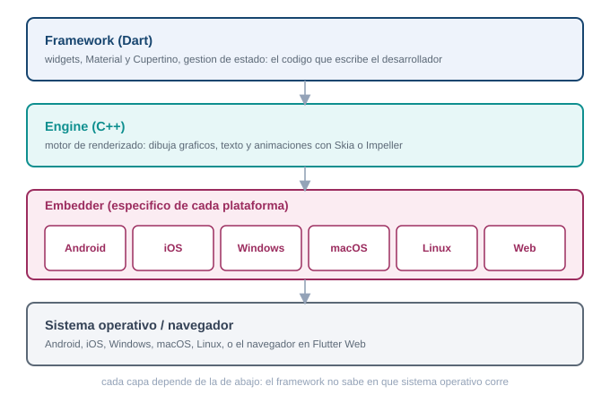
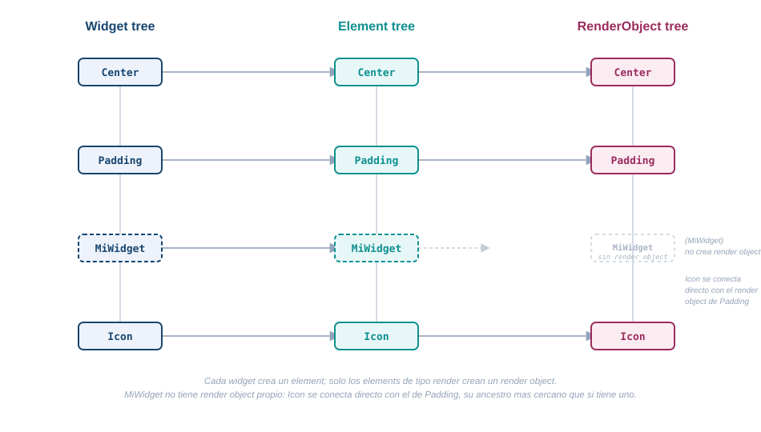
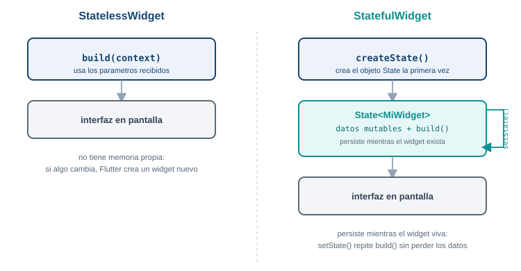
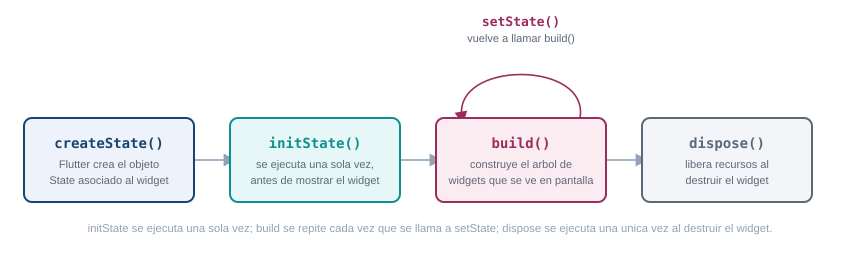
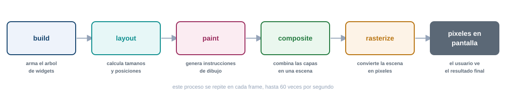
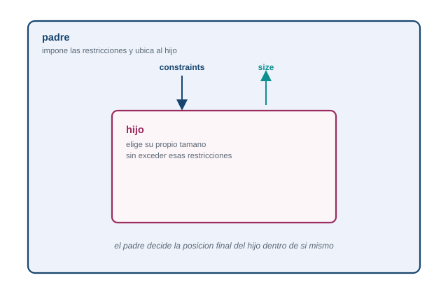
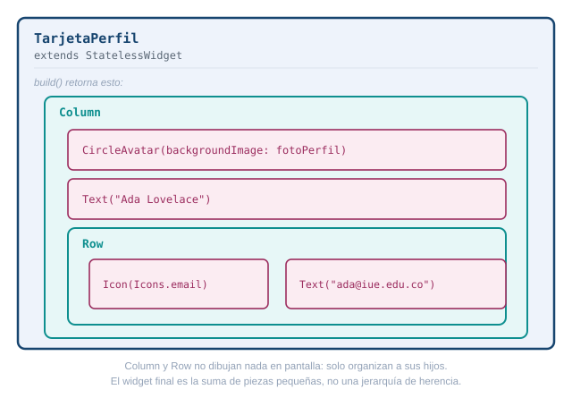

## Que problema resuelve Flutter

Antes de esta semana ya creaste un proyecto Flutter, lo corriste en un emulador y le diste estado
propio con `setState`. Funciono, pero probablemente lo hiciste sin preguntarte que pasaba detras de
cada linea. Esta guia responde esa pregunta: como esta construido Flutter por dentro, para que
dejes de escribir widgets a ciegas y empieces a entender por que se comportan como se comportan.

El problema que resuelve Flutter es concreto: una empresa que quiere una app en Android, en iOS,
tal vez tambien en web y en escritorio, necesita hoy equipos separados por plataforma, cada uno con
su propio lenguaje, su propio conjunto de bugs y su propio calendario de entregas. Flutter propone
una sola base de codigo en Dart que produce apps nativas para las seis plataformas que soporta.

Esa promesa suena simple, pero cumplirla no es trivial: si Flutter delegara el dibujo de la
interfaz en los controles nativos de cada sistema operativo, arrastraria las inconsistencias entre
plataformas que ese mismo objetivo busca evitar. La solucion que eligio el equipo de Flutter fue
mas radical: no reutilizar los widgets nativos de ningun sistema operativo, sino traer su propio
motor de dibujo y renderizar cada pixel por su cuenta. Entender por que esa decision funciona, y
que capas hacen falta para sostenerla, es el objetivo de esta guia. Ninguna parte de lo que sigue
es codigo para copiar: es el mapa conceptual que necesitas antes de seguir construyendo pantallas.

## Arquitectura en capas: framework, engine y embedder

Flutter se organiza en tres capas apiladas, cada una construida sobre la de abajo. De arriba hacia
abajo: el framework, el engine y el embedder.

::: {.diagrama}
{fig-alt="Tres capas de Flutter apiladas: el framework en Dart arriba, con sus subcapas foundation, rendering, widgets y Material o Cupertino; el engine en C++ en medio, con dart:ui, Impeller o Skia y los canales de plataforma; y el embedder especifico de cada sistema operativo abajo"}

Framework en Dart, engine en C++, embedder especifico de cada plataforma.
:::

### El framework, escrito en Dart

El framework es la capa que tocas todos los dias: es Dart puro, y es donde vive el codigo que
escribes en `lib/main.dart`. Por dentro se organiza en subcapas, cada una construida sobre la
anterior:

- **foundation.** Las clases y servicios base que usa todo lo demas.
- **rendering.** El arbol de objetos que calculan tamano, posicion y pintado (`RenderObject`), con
  el modelo de constraints que ves mas adelante en esta guia.
- **widgets.** Las descripciones inmutables y reactivas de la interfaz: la capa donde vive casi
  todo lo que escribes.
- **Material y Cupertino.** La capa de diseno visual: los widgets que imitan el estilo de Android
  (Material Design) o de iOS (Cupertino), construidos encima de todo lo anterior.

Junto a estas se ubican `animation`, `painting` y `gestures`, tres librerias de la capa
fundacional que dan soporte a animaciones, dibujo de bajo nivel y reconocimiento de gestos.

### El engine, escrito en C++

El engine es la capa intermedia, escrita en C++. Expone al framework una interfaz llamada
`dart:ui` y se encarga de todo lo que Dart por si solo no puede hacer: correr el runtime del
lenguaje, compilarlo, calcular el layout de texto, ofrecer primitivas graficas, manejar entrada y
salida de archivos y de red, y rasterizar cada frame para entregarlo a la GPU. El engine tambien
aloja los canales de plataforma (platform channels) y FFI, los mecanismos que usa Flutter para
comunicarse con codigo nativo cuando lo necesita, por ejemplo para leer un sensor del telefono.

El rasterizado lo hace un motor de graficos que vive dentro del engine. Durante varios anos ese
motor fue Skia, pero desde Flutter 3.27 Impeller es el motor por defecto en iOS (el unico
disponible, sin opcion de volver a Skia) y en Android con API 29 o superior (con Vulkan disponible;
si el dispositivo no lo soporta, cae a OpenGL). Desde Flutter 3.47 Impeller tambien es el motor por
defecto en macOS, Linux y Windows, aunque en escritorio todavia existe una bandera para volver a
Skia, una opcion que la documentacion oficial anuncia que va a desaparecer. La excepcion es Flutter
Web: en 2026 sigue usando Skia compilado a WebAssembly, sin fecha confirmada de migracion a
Impeller.

### El embedder, especifico de cada plataforma

El embedder es la capa mas baja, y es la unica que cambia por completo segun el sistema operativo.
En Android esta escrito en Java o Kotlin mas C++; en iOS y macOS, en Swift u Objective-C; en
Windows y Linux, en C++; en la web, se compila a JavaScript o WebAssembly. Su trabajo es alojar el
engine dentro del ciclo de vida nativo de cada plataforma: gestionar la ventana o la actividad,
recibir la entrada del usuario (toques, teclado, mouse), conectarse al bucle de eventos del sistema
operativo y entregarle a la GPU la superficie donde Flutter va a dibujar.

### Por que Flutter dibuja sus propios pixeles

La alternativa mas obvia a esta arquitectura seria que Flutter tradujera cada widget a un control
nativo del sistema operativo: un boton de Flutter se convertiria en un `UIButton` en iOS o en un
`Button` de Android. Esa es, de hecho, la estrategia de otros frameworks multiplataforma. Flutter
la descarta y en su lugar dibuja cada pixel por su cuenta, con su propio motor grafico, y la
documentacion oficial explica esta decision con tres argumentos:

- **Consistencia.** El mismo pixel se ve igual en todas las plataformas y en todas las versiones de
  sistema operativo, porque no depende de como cada fabricante implemente sus controles nativos.
- **Rendimiento.** No hay una capa de traduccion entre el widget de Flutter y un control nativo:
  el codigo Dart compilado corre directo y renderiza directo a la GPU.
- **Extensibilidad.** Cualquier desarrollador puede crear un widget completamente nuevo, con
  cualquier apariencia, sin las restricciones que impone un kit de controles nativos.

Esta decision es la raiz de todo lo que viene despues en esta guia: si Flutter dibuja sus propios
pixeles, necesita su propio pipeline completo (build, layout, paint, composite y rasterizado, que
ves mas adelante) y su propia forma de representar la interfaz antes de convertirla en pixeles: los
tres arboles de la siguiente seccion.

## Los tres arboles: widgets, elements y render objects

Cuando escribes una pantalla en Flutter, en apariencia estas describiendo un solo arbol de
widgets. Por debajo, Flutter mantiene tres arboles paralelos que colaboran: el arbol de widgets, el
arbol de elements y el arbol de render objects.

::: {.diagrama}
{fig-alt="Tres arboles paralelos de Flutter: el arbol de widgets, inmutable y recreado en cada build; el arbol de elements, mutable y persistente entre frames, que guarda el estado; y el arbol de render objects, mas pequeno, que calcula tamano posicion y pintado"}

El widget describe, el element persiste y guarda el estado, el render object calcula y pinta.
:::

Un **widget** es una descripcion inmutable de configuracion. "Inmutable" quiere decir que, una vez
creado, no cambia: si algo en la interfaz necesita verse distinto, Flutter no modifica el widget
existente, crea uno nuevo. Esto pasa constantemente, cada vez que se ejecuta `build()`, y por eso
los widgets estan disenados para ser baratos de crear y de destruir. La consecuencia directa de
la inmutabilidad es que un widget no puede recordar nada por si mismo: no guarda su posicion en la
jerarquia ni conserva ningun dato de un frame al siguiente.

Ahi entra el **element**. Un element es una instancia mutable que persiste entre frames, y funciona
como puente entre la configuracion (el widget) y la implementacion visual (el render object). Cada
element retiene la estructura logica del arbol, y si el widget correspondiente tiene estado, es el
element el que guarda el objeto `State` asociado. El `BuildContext` que recibe cada `build()` es,
en realidad, una referencia a ese element: por eso te sirve para ubicar donde esta un widget dentro
del arbol y para acceder a recursos que proveen los widgets ancestros.

El **render object** es el que hace el trabajo pesado: calcula tamano, posicion y pintado en
coordenadas visuales absolutas. No todo widget genera un render object, solo los que heredan de
`RenderObjectWidget`; muchos widgets son puramente de composicion y no tienen contraparte directa
en este arbol. Por eso el arbol de render objects es mas pequeno que el arbol de elements, no una
copia exacta de el.

### Por que no basta un solo arbol

Se podria pensar que tres arboles son una complicacion innecesaria: por que no colapsar todo en
una sola estructura. La documentacion oficial de Flutter da tres razones para no hacerlo.

Primero, rendimiento: cuando algo cambia en el layout, Flutter solo necesita recorrer el arbol de
render objects, que es mas pequeno gracias a la composicion. Segundo, separacion de
responsabilidades: el protocolo de los widgets y el protocolo de los render objects se especializan
cada uno en su tarea, lo que reduce la superficie de la API y el riesgo de errores. Tercero,
seguridad de tipos: el arbol de render puede garantizar en tiempo de ejecucion que sus hijos usan
el sistema de coordenadas correcto, mientras que los widgets de composicion pueden ser agnosticos a
ese detalle.

Hay ademas un motivo practico: los widgets manejan coordenadas logicas (dependientes de si el
idioma se lee de izquierda a derecha o al reves), mientras que los render objects trabajan siempre
en coordenadas visuales absolutas, izquierda y derecha fijas. Esa conversion ocurre una sola vez,
justo en el traspaso del arbol de widgets al arbol de render, y no se repite en cada layout o cada
pintado, que ocurren con mucha mas frecuencia que un build completo.

Cuando el estado cambia, por ejemplo con `setState`, Flutter no recorre todo el arbol comparando
cada nodo contra su version anterior. Marca como sucio (dirty) el element correspondiente, y en la
siguiente fase de build recorre solo los elements sucios, saltandose los que no cambiaron. La
reconciliacion tampoco es un diffing completo del arbol: para cada lista de hijos, Flutter compara
tipo en tiempo de ejecucion y `key` con un algoritmo lineal. Si el widget nuevo es identico por
referencia al anterior, el recorrido se corta ahi mismo. Si tipo y key coinciden, el element
existente se actualiza con la nueva configuracion y conserva su `State` y su render object, sin
recrearlos. Si no coinciden, el element viejo se descarta y se crea uno nuevo. Este mecanismo es
el que permite que un widget padre construya una instancia nueva de un widget hijo en cada build
sin que ese hijo pierda su estado interno: Flutter encuentra y reutiliza el `State` correcto por su
cuenta.

::: {.callout-tip}
## Reto 1. Por que el estado sobrevive

Un widget se reconstruye por completo en cada `build()`: la instancia anterior desaparece y se crea
una nueva. Aun asi, si ese widget tiene estado (por ejemplo, un contador con `setState`), ese
estado no se pierde entre reconstrucciones. Con lo que acabas de leer sobre los tres arboles,
explica por que el estado sobrevive aunque el widget se destruya y se vuelva a crear en cada build.
No escribas codigo: responde con el mecanismo, en un parrafo.
:::

::: {.callout-note collapse="true"}
## Solucion del Reto 1

El estado no vive en el widget, vive en el element. El widget es solo una descripcion inmutable que
se recrea en cada build, pero el element que lo representa persiste entre frames. Cuando Flutter
reconstruye el arbol, compara el widget nuevo con el anterior por tipo en tiempo de ejecucion y por
`key`: si coinciden, el element existente se actualiza con la configuracion nueva pero conserva el
mismo objeto `State` que ya tenia, con todos sus valores intactos. El widget muere y renace en cada
build; el element, y el `State` que guarda, sobreviven mientras el tipo y la key sigan coincidiendo.
:::

## Todo es un widget: composicion sobre herencia

La filosofia central de Flutter es que todo elemento de interfaz es un widget. No solo lo que ves
en pantalla (un texto, un boton, un icono): tambien el espaciado es un widget (`Padding`), la
alineacion es un widget (`Center`), la animacion es un widget (`AnimatedContainer`). Esto es una
decision de diseno deliberada: en vez de que un boton tenga una propiedad interna para su relleno,
envuelves ese boton con un widget `Padding` que le agrega ese comportamiento desde afuera.

Esta forma de trabajar se llama composicion, y se opone a la herencia. En un modelo por herencia,
para agregarle una capacidad a un componente extenderias su clase y sobrescribirias metodos. En un
modelo por composicion, envuelves el componente con otro widget mas especializado, sin tocar el
original. Flutter eligio composicion de forma consistente en toda su API: una interfaz compleja no
es una clase gigante con muchas propiedades, es un arbol de widgets pequenos, cada uno con una sola
responsabilidad, combinados unos dentro de otros.

::: {.diagrama}
{fig-alt="Ejemplo de composicion en Flutter: un boton con relleno y centrado se arma envolviendo el boton original con un widget Padding y ese resultado con un widget Center, en vez de agregar propiedades al boton"}

Cada widget agrega una sola capacidad, envolviendo al anterior.
:::

### StatelessWidget frente a StatefulWidget

Dentro de esta filosofia, todo widget cae en una de dos categorias.

Un `StatelessWidget` nunca cambia una vez construido. Su apariencia depende solo de los parametros
que recibio al crearse: si esos parametros no cambian, el widget se ve siempre igual. `Icon`,
`IconButton` y `Text` son ejemplos oficiales.

Un `StatefulWidget` es dinamico: puede cambiar su apariencia en respuesta a una interaccion del
usuario o a la llegada de nuevos datos. `Checkbox`, `Radio`, `Slider`, `InkWell`, `Form` y
`TextField` son ejemplos oficiales. La clave de su dinamismo es que el estado mutable no vive en el
widget mismo (que sigue siendo inmutable, como todos), sino en un objeto `State` separado, asociado
al element como viste en la seccion anterior. Esa separacion es la que permite que el widget siga
siendo una descripcion liviana mientras el estado persiste aparte.

::: {.diagrama}
{fig-alt="Comparacion entre StatelessWidget, que no guarda estado y se ve siempre igual mientras no cambien sus parametros, y StatefulWidget, cuyo estado mutable vive aparte en un objeto State asociado al element"}

El StatelessWidget no guarda nada; el StatefulWidget delega su estado a un objeto State aparte.
:::

La forma general de un `StatelessWidget` es minima:

```dart
class Saludo extends StatelessWidget {
  const Saludo({super.key});

  @override
  Widget build(BuildContext context) {
    return const Text("Hola");
  }
}
```

No hay mas que eso: una clase, un constructor y un metodo `build()`.

### build() y BuildContext

Todo widget, sea Stateless o Stateful, implementa un metodo `build()` que describe la parte de la
interfaz que le corresponde, devolviendo un arbol de widgets mas basicos. En un `StatelessWidget`,
`build()` vive en la propia clase del widget. En un `StatefulWidget`, `build()` vive dentro del
objeto `State`, no en la clase del widget: por eso `_MyHomePageState`, que ya viste en la Semana 02,
tiene su propio `build()` separado de `MyHomePage`.

`build()` recibe un `BuildContext` como parametro. Ya viste en la seccion anterior que el
`BuildContext` es, en el fondo, una referencia al element: le dice al widget donde esta ubicado
dentro del arbol, y por eso le permite acceder a informacion o recursos que proveen sus ancestros
(un `Theme`, un `Navigator`, un `MediaQuery`) sin que esos ancestros necesiten conocer a sus
descendientes. Es una via de comunicacion de arriba hacia abajo, no al reves.

## Ciclo de vida de un StatefulWidget

Ya viste como separar estado (`State`) de configuracion (`Widget`) resuelve el problema de que un
widget inmutable no puede cambiar por si mismo. Falta ver cuando ocurre cada paso de ese ciclo.

::: {.diagrama}
{fig-alt="Secuencia del ciclo de vida de un StatefulWidget: createState se llama una vez, luego initState una vez, luego build al menos una vez y cada vez que setState lo dispara, y por ultimo dispose una vez al retirar el widget del arbol"}

createState e initState corren una vez. build se repite con cada setState. dispose cierra el ciclo.
:::

A nivel conceptual, el ciclo de vida de un `StatefulWidget` sigue esta secuencia:

- **`createState()`.** El framework llama a este metodo para crear el objeto `State` asociado al
  widget. Ocurre una sola vez, cuando el widget entra al arbol por primera vez.
- **`initState()`.** Se llama una unica vez, justo despues de crear el `State`. Es el lugar para
  inicializar variables o preparar cualquier cosa que el widget necesite antes de mostrarse.
- **`build()`.** Produce la interfaz visible a partir del estado actual. Se ejecuta al menos una
  vez al principio, y se vuelve a ejecutar cada vez que el estado cambia.
- **`setState()`.** No es parte de la secuencia inicial, es el disparador que la reinicia
  parcialmente: cuando el codigo de la aplicacion llama `setState()` (tras un toque del usuario o
  la llegada de un dato nuevo), le avisa al framework que el estado cambio, y eso provoca que
  `build()` se ejecute otra vez con los valores actualizados. Esto puede repetirse cualquier
  cantidad de veces mientras el widget siga vivo.
- **`dispose()`.** Se llama una unica vez, cuando el widget se retira permanentemente del arbol.
  Es el lugar para liberar recursos, cancelar subscripciones o hacer cualquier limpieza pendiente
  antes de que el objeto `State` desaparezca.

La idea que conecta toda esta secuencia con lo que viste en la Semana 02 es que `setState()` no
cambia la pantalla por si mismo: solo marca el element como sucio, tal como viste en la seccion de
los tres arboles. El repintado real ocurre despues, en el pipeline de renderizado que ves a
continuacion.

## El pipeline de renderizado

Convertir un arbol de widgets en pixeles en pantalla no es un solo paso, son cinco fases
consecutivas: build, layout, paint, composite y rasterizado.

::: {.diagrama}
{fig-alt="Pipeline de renderizado de Flutter en cinco fases consecutivas: build, layout, paint, composite y rasterizado, desde el arbol de widgets hasta los pixeles entregados a la GPU"}

Cinco fases, una sola pasada por fase cuando es posible.
:::

En **build**, cada widget se traduce a un element persistente, y para los que generan render object
(los `RenderObjectWidget`) se crea o se actualiza el nodo correspondiente en el arbol de render. En
**layout**, Flutter recorre el arbol de render y calcula tamano y posicion de cada nodo, con el
modelo de constraints que ves en la siguiente seccion. En **paint**, cada render object ya
dimensionado dibuja su apariencia (color, texto, bordes) sobre un canvas. En **composite**, lo
pintado se organiza en layers y se arma una escena completa. En **rasterizado**, esa escena se
convierte en los pixeles concretos que la GPU entrega a la pantalla, con Impeller (o Skia en la
web) como motor.

El principio detras de este diseno es que cada fase tiene una responsabilidad acotada y recorre el
arbol una sola vez cuando es posible, en vez de acumular pasadas adicionales. Ese principio es
justo el que hace posible el modelo de constraints.

### El modelo de constraints

El layout en Flutter sigue una regla fija, resumida en una frase: las constraints bajan, los
tamanos suben, y el padre decide la posicion.

::: {.diagrama}
{fig-alt="Modelo de constraints en Flutter: el padre entrega constraints de ancho y alto minimo y maximo hacia abajo, el hijo decide su tamano dentro de esos limites y lo comunica hacia arriba, y el padre decide la posicion final del hijo"}

Las constraints bajan, los tamanos suben, el padre decide la posicion.
:::

Una constraint es un conjunto de cuatro numeros: ancho minimo, ancho maximo, alto minimo y alto
maximo. El proceso funciona asi: el padre le entrega esas constraints a cada hijo (pueden ser
distintas para cada uno); el hijo, respetando esos limites, decide su propio tamano y lo comunica
hacia arriba; el padre, ya con los tamanos de todos sus hijos, decide donde posicionar a cada uno.
Ningun widget puede tener el tamano que quiera libremente, solo el que le permite su padre, y
ningun widget decide por si mismo su propia posicion en pantalla.

Esta negociacion ocurre en una sola pasada, de arriba hacia abajo y luego de vuelta hacia arriba,
sin necesidad de recalcular ni de repetir el recorrido. Por eso el costo del layout crece de forma
lineal con el numero de nodos, algo que contrasta con modelos como el de CSS en la web, donde
distintos modos de layout (bloque, en linea, flex, grid) pueden requerir varias pasadas y
recalculos frente a un mismo cambio de contenido.

::: {.callout-tip}
## Reto 2. El ancho que no aparece

Un estudiante envuelve un `Container` con `width: 300` dentro de un `Row`, y el ancho que definio
nunca se respeta en pantalla: el `Container` termina mas angosto de lo que pidio. Con el modelo de
constraints que acabas de leer, explica por que puede pasar esto. No es un error de sintaxis ni un
bug de Flutter.
:::

::: {.callout-note collapse="true"}
## Solucion del Reto 2

Un widget nunca decide su propio tamano de forma absoluta, solo dentro de lo que le permiten las
constraints que recibio de su padre. Si el `Row` (o algun widget mas arriba en el arbol) le esta
pasando al `Container` una constraint de ancho maximo menor a 300, el `Container` no puede salirse
de ese limite por mas que su propiedad `width` diga 300: las constraints bajan y mandan. El
`width: 300` es una preferencia que el `Container` intenta cumplir, pero solo dentro del rango que
le impuso su padre. Para confirmar la causa exacta habria que revisar que constraints esta
entregando el widget padre, no el `Container` en si.
:::

Todo lo que has visto hasta aca (arboles paralelos, composicion sobre herencia, ciclo de vida,
pipeline de una sola pasada) converge en la misma idea: una interfaz de Flutter nunca es un widget
aislado, es una jerarquia de piezas pequenas que se comunican con reglas estrictas y predecibles en
cada direccion.

::: {.diagrama}
{fig-alt="Vista general de una interfaz de Flutter como jerarquia de piezas pequenas comunicadas con reglas estrictas y predecibles: composicion sobre herencia, ciclo de vida y pipeline de una sola pasada trabajando juntos"}

Una interfaz de Flutter nunca es un widget aislado, es una jerarquia de piezas pequenas.
:::

## Compilacion multiplataforma: JIT en desarrollo, AOT en produccion

Todo lo anterior explica como Flutter convierte widgets en pixeles dentro de un dispositivo. Falta
la ultima pieza: como el mismo codigo Dart llega a correr, con rendimiento cercano al nativo, en
Android, en iOS, en escritorio y en la web.

::: {.diagrama}
{fig-alt="Compilacion multiplataforma de Flutter: en desarrollo la Dart VM compila con JIT y permite recarga en caliente, en produccion el compilador AOT traduce a codigo nativo ARM o x64 antes de arrancar, y en la web dartdevc sirve para desarrollo mientras dart2js o dart2wasm compilan para produccion"}

JIT con recarga en caliente en desarrollo, AOT nativo en produccion, dart2js o dart2wasm en la web.
:::

En desarrollo, cuando corres `flutter run` en modo debug, Dart se compila con un compilador Just In
Time (JIT): la Dart VM traduce el codigo en tiempo de ejecucion. Esto permite recompilacion
incremental, y esa es la base tecnica de la recarga en caliente que ya usaste en la Semana 02:
Flutter inyecta el codigo nuevo en la app que sigue corriendo, sin reiniciarla. El modo debug
prioriza velocidad de iteracion sobre rendimiento: no esta optimizado para produccion.

En produccion, con `flutter build` o `flutter run --release`, Flutter cambia a Ahead Of Time (AOT):
el compilador traduce el codigo Dart directo a codigo maquina nativo (ARM o x64) antes de que la
app arranque, con eliminacion del codigo que no se usa (tree shaking). Ya no hay interprete
corriendo en tiempo real, solo instrucciones nativas listas para la CPU, y por eso la recarga en
caliente deja de estar disponible en modo release.

Flutter Web sigue una logica parecida pero con destinos distintos: en desarrollo usa `dartdevc`,
que tambien permite recarga en caliente dentro del navegador; en produccion compila a JavaScript
optimizado con `dart2js`, o de forma alternativa a WebAssembly con `dart2wasm`. El soporte de Wasm
es estable desde Flutter 3.24, pero en 2026 sigue siendo una opcion que hay que pedir de forma
explicita con la bandera `--wasm`, no el destino de compilacion por defecto; ademas, no todos los
navegadores lo soportan igual de bien: Chrome lo soporta de forma estable desde su version 119,
mientras que Safari en iOS todavia no.

Este modelo dual (mismo lenguaje, semantica casi identica en todos los modos) es lo que sostiene la
promesa con la que abrio esta guia: una sola base de codigo Dart, escrita una vez sobre el
framework que ya conoces, corre en las plataformas que Flutter soporta sin reescribirse, con
rendimiento cercano al nativo porque en ningun punto del camino hay un interprete de HTML y CSS
ajeno a la app, ni un puente que serialice mensajes hacia controles nativos: el codigo Dart
compilado dibuja directo, con el motor propio que viste al principio de esta guia.

::: {.callout-tip}
## Reto 3. Por que el hot reload desaparece en produccion

Un compañero de curso pregunta por que la recarga en caliente funciona perfecto durante el
desarrollo, pero no existe en la version final que se instala en un telefono. Con lo que acabas de
leer sobre JIT y AOT, explica la razon tecnica, sin usar la palabra "porque si".
:::

::: {.callout-note collapse="true"}
## Solucion del Reto 3

La recarga en caliente depende de que exista un interprete corriendo en el dispositivo mientras la
app esta viva: eso es exactamente lo que hace la Dart VM en modo JIT, y es lo que le permite
inyectar codigo nuevo sobre la app que ya esta corriendo, sin reiniciarla. En produccion, Flutter
compila con AOT: el codigo Dart ya se convirtio en instrucciones nativas antes de que la app
arrancara, no hay interprete corriendo, solo binario ejecutandose directo en la CPU. Sin
interprete, no hay donde inyectar codigo nuevo en caliente: cualquier cambio necesita una
compilacion completa y una nueva instalacion.
:::

## De la Semana 02 a lo que sigue

Todo lo que viste aca ya estaba presente, sin que lo notaras, en el `_MyHomePageState` que
construiste la semana pasada. El `StatefulWidget` con su `State` separado, el `setState()` que
marca el element como sucio, el `build()` que se vuelve a ejecutar y produce un arbol nuevo de
widgets: esa app minima con un contador ya recorria, en cada toque de pantalla, el ciclo completo
de esta guia, desde el widget hasta el pixel.

Lo que sigue en el curso construye sobre estos cimientos, no al lado de ellos. Cuando trabajes con
Material Design y con la libreria mas amplia de widgets de Flutter, cada `Scaffold`, cada
`Column`, cada `ListView` que uses es, otra vez, composicion sobre herencia: piezas pequenas
combinadas siguiendo las mismas reglas de constraints y del mismo pipeline que ya conoces. Entender
la arquitectura no fue un desvio antes de programar interfaces: es la base que te permite leer
cualquier widget nuevo con el que te encuentres el resto del semestre, y saber por que se comporta
como se comporta.

## Recursos

- Vision arquitectonica oficial de Flutter: <https://docs.flutter.dev/resources/architectural-overview>
- Inside Flutter, sobre los tres arboles y la reconciliacion: <https://docs.flutter.dev/resources/inside-flutter>
- Modelo de constraints en el layout: <https://docs.flutter.dev/ui/layout/constraints>
- Modos de compilacion (JIT y AOT): <https://docs.flutter.dev/testing/build-modes>
- Impeller, el motor de renderizado: <https://docs.flutter.dev/perf/impeller>

::: {.pie-doc}
Programación Móvil (IF2004). Institución Universitaria de Envigado. Facultad de Ingenierías.
Semestre 2026-02.

**Transparencia.** La redacción de esta guía contó con el apoyo de inteligencia artificial,
usando el modelo Claude Opus 5 de Anthropic. Todo el contenido fue revisado y validado.
:::
