## Sin control de versiones {.solo-diagrama}

{fig-alt="Cinco carpetas con nombres parecidos y tres preguntas que ninguna responde"}

## Lo que se pierde

- El historial vive en tu memoria, y tu memoria dura una semana.
- La copia buena es la que abriste de último.
- Volver a un estado anterior se convierte en adivinar.

. . .

Y esto pasa trabajando completamente solo, sin que nadie más toque el proyecto.

## Lo que hace falta

- Volver a cualquier estado anterior.
- Saber qué cambiaste y cuándo.
- Probar una idea sin romper lo que ya sirve.
- Comparar dos versiones tuyas sin perder ninguna de las dos.

. . .

[Eso hace Git.]{.grande}

## Dos cosas distintas con nombre parecido {.solo-diagrama}

{fig-alt="Git es un programa en tu computador y GitHub es un servicio en internet"}

## Dónde vive tu trabajo {.solo-diagrama}

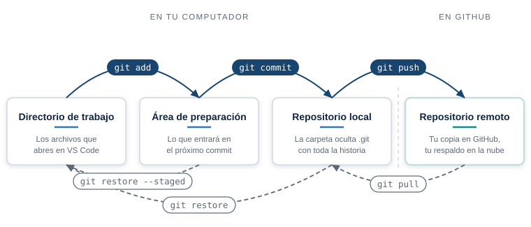{fig-alt="Las cuatro áreas de Git y los comandos que mueven el contenido entre ellas"}

## Qué hace cada uno {.solo-diagrama}

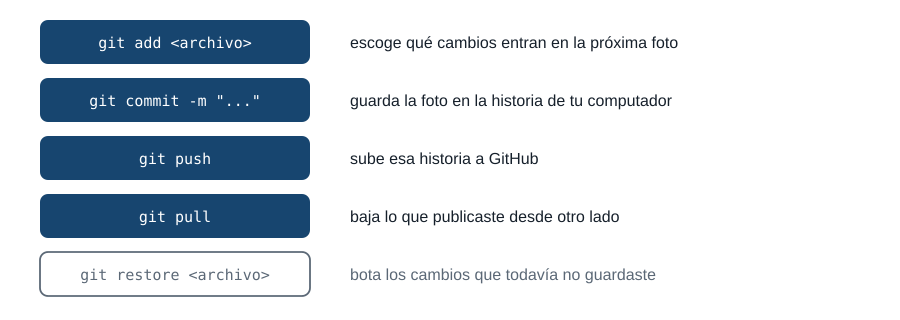{fig-alt="Los cinco comandos que mueven el trabajo entre las áreas de Git y para qué sirve cada uno"}

## Nada se mueve solo

```bash
git push    # sube tus commits a GitHub
git pull    # baja lo que subiste desde otro computador
```

Tu commit vive en tu disco hasta que lo subas.

Lo que hiciste en otro computador (el de tu casa, el del laboratorio) no aparece aquí hasta que lo bajes.

## Qué guarda un commit {.solo-diagrama}

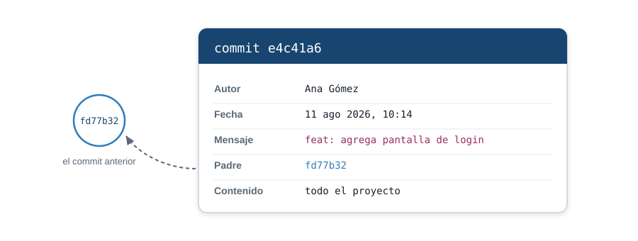{fig-alt="Un commit guarda autor, fecha, mensaje, el enlace al commit padre y una copia completa del proyecto"}

## La historia es una cadena {.solo-diagrama}

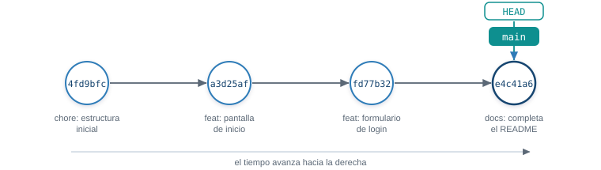{fig-alt="Cuatro commits en orden, del más antiguo al más reciente, con las etiquetas main y HEAD sobre el último"}

## El nombre de cada commit

::: {.hash}
[e4c41a6]{.hash-corto}f2d81b9c0a7e35d4188c6f0b2ad19e7c3
:::

Git calcula ese número a partir del contenido. Cambia una coma y cambia entero.

En la práctica escribes los primeros siete y Git entiende de cuál hablas.

## Cómo se escribe un mensaje {.solo-diagrama}

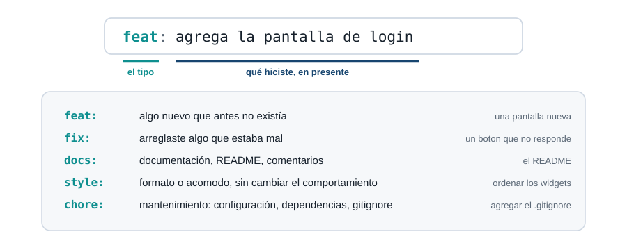{fig-alt="Anatomía de un mensaje de commit: el prefijo de tipo, dos puntos y la descripción, con el significado de feat, fix, docs, style y chore"}

## El mensaje lo lees dentro de un mes {.solo-diagrama}

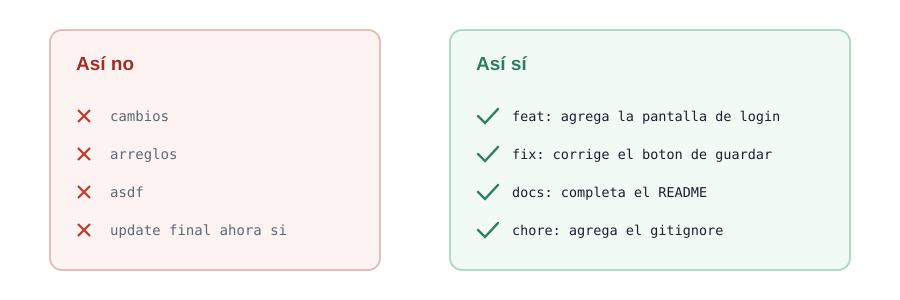{fig-alt="Comparación entre mensajes de commit vagos y mensajes que describen el cambio con un prefijo de tipo"}

## Una rama es un puntero {.solo-diagrama}

{fig-alt="La etiqueta main se mueve al commit nuevo sin copiar archivos"}

## Trabajar aparte y volver

{fig-alt="Una rama sale de main, avanza dos commits y vuelve en un commit de fusión"}

`git switch -c <rama>` crea la rama y te para en ella. `git merge <rama>` trae esos commits a
donde estás.

## Dos maneras de fusionar {.solo-diagrama}

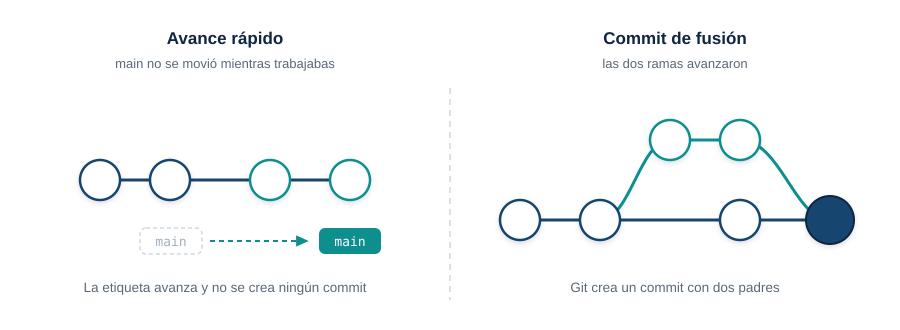{fig-alt="Avance rápido cuando main no se movió, y commit de fusión cuando las dos ramas avanzaron"}

## Cuando Git se detiene {.solo-diagrama}

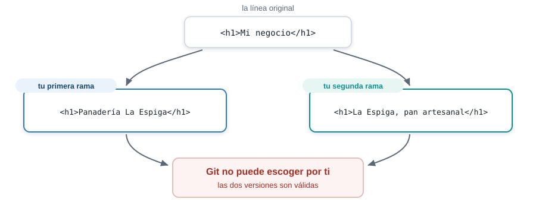{fig-alt="Tu primera rama y tu segunda rama cambian la misma línea de forma distinta y Git no puede escoger"}

## Así se ve un conflicto {.solo-diagrama}

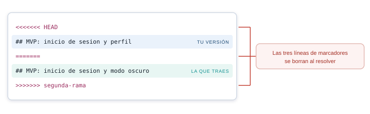{fig-alt="Anatomía de un conflicto: tu versión actual y la versión que traes de tu otra rama, con las tres líneas de marcadores"}

## Resolver toma un minuto

1. Abre el archivo y busca los marcadores.
2. Deja el texto que debe quedar.
3. Borra las tres líneas de marcadores y commitea.

. . .

```bash
git merge --abort
```

Ese comando te devuelve al punto de partida cuando el archivo queda irreconocible.

## El remoto {.solo-diagrama}

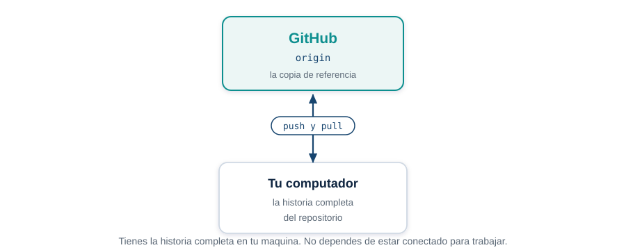{fig-alt="GitHub guarda la copia de referencia y tu computador guarda la historia completa del proyecto"}

## Qué es un Pull Request

Una **propuesta de cambio**. Dice: "tengo esto listo en mi rama, quiero meterlo en `main`".

- Vive en GitHub, no en tu computador. No existe ningún `git pull-request`.
- Muestra el cambio línea por línea, para que lo leas completo antes de que entre.
- Deja registro de qué propusiste y por qué.
- `main` no se toca hasta que pulsas el botón de fusión.

## El Pull Request {.solo-diagrama}

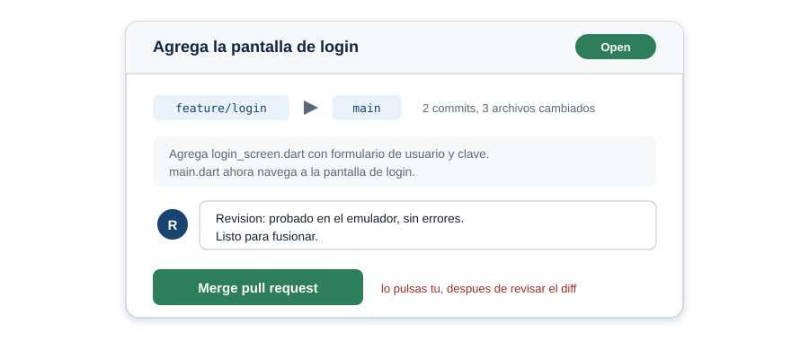{fig-alt="Un Pull Request muestra la rama, los commits, los archivos cambiados y el botón de fusión que pulsas tú mismo"}

## El ciclo completo

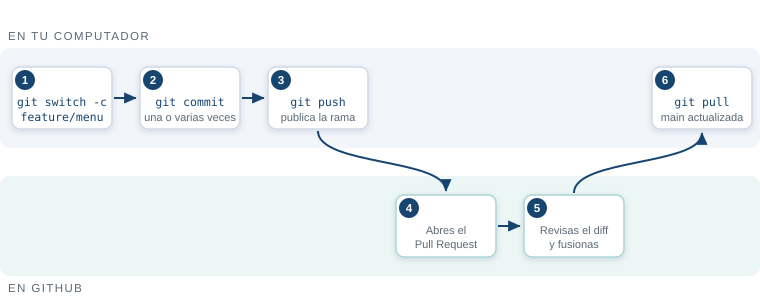{fig-alt="Flujo en dos carriles: creas la rama, commiteas y publicas; en GitHub abres el Pull Request, lo revisas y lo fusionas"}

`git push -u origin <rama>` publica la rama por primera vez. `git pull` deja tu `main` al día
después de la fusión.

## Lo que no se versiona {.solo-diagrama}

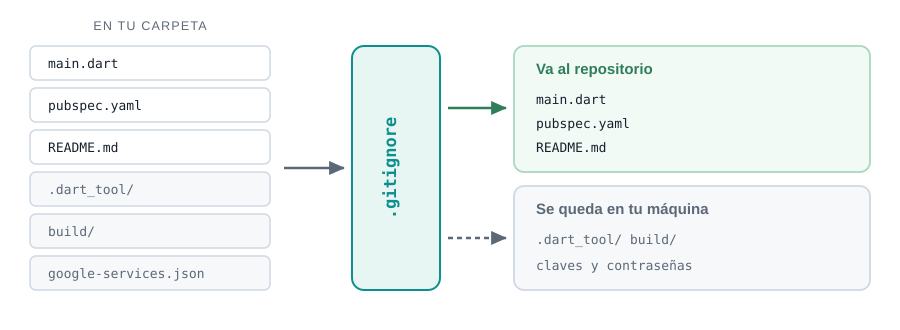{fig-alt="El gitignore deja pasar main.dart y pubspec.yaml, y retiene .dart_tool, build y los archivos con claves"}

## Una clave subida ya está quemada

::: {.aviso}
Borrarla un minuto después no sirve. El historial la conserva, y cualquiera con el enlace puede
leerla.
:::

Por eso un archivo con claves entra al `.gitignore` **antes** del primer commit.

## Tres reglas

::: {.regla}
**`main` siempre funciona.** Lo que todavía no sirve vive en una rama.
:::

::: {.regla}
**Una rama por cada cosa nueva.** Se abre, se revisa, se fusiona y se borra.
:::

::: {.regla}
**El mensaje explica el cambio**, no el archivo que tocaste.
:::

## Por qué definir el alcance ahora

- Desde hoy, casi todo lo que entregues en el semestre es un incremento del mismo proyecto.
- Sin alcance claro, cada semana empiezas de cero o cambias de idea a mitad de camino.
- La demo de la semana 17, en un dispositivo real, es este mismo proyecto, más grande.

. . .

Hoy no programas el proyecto. Hoy decides qué va a ser.

## Qué es un MVP

- MVP: producto mínimo viable. La versión más pequeña que ya sirve para algo real.
- No es "la mitad del proyecto". Es el proyecto completo, con menos funciones.
- Cada unidad del semestre le agrega una capa a ese MVP: navegación, datos, persistencia,
  Firebase.

. . .

Si tu MVP no cabe en las horas independientes de 17 semanas, el MVP está mal definido, no el
semestre.

## Las cinco partes de docs/alcance.md

- **Problema.** Qué resuelve tu app, en una frase.
- **Usuario objetivo.** Quién la usa y para qué.
- **Funcionalidades mínimas.** La lista concreta de lo que va a hacer el MVP.
- **Qué queda fuera de alcance.** Lo que decides no hacer este semestre.
- **Stack.** Flutter y los paquetes o servicios que ya sabes que vas a necesitar.

## Funcionalidades mínimas: el corazón del MVP

- Escribe verbos, no sustantivos: "el usuario registra un gasto", no "gastos".
- Cada funcionalidad mínima debe poder mostrarse en una demo de dos minutos.
- Si una funcionalidad depende de otra que todavía no existe, va después, no en el MVP.

. . .

Cuenta las funcionalidades que escribiste. Si pasan de cinco, revisa cuáles son de verdad
mínimas.

## Qué queda fuera de alcance

- Decir qué no vas a hacer es tan importante como decir que sí.
- Ejemplos típicos que sobran en un MVP: modo oscuro, varios idiomas, panel de administrador,
  red social propia.
- No es una lista de renuncias. Es lo que evita que te quedes sin tiempo en la semana 15.

## Decisión: hola_iue o un proyecto nuevo

- `hola_iue` ya tiene Flutter funcionando, `pubspec.yaml` configurado y tu primer
  `StatefulWidget`.
- Seguir con él evita repetir la instalación y el `flutter create`.
- Empezar de cero solo tiene sentido si tu idea de proyecto no cabe en la estructura actual.

. . .

Si dudas, sigue con `hola_iue`. Cambiar el nombre es más fácil que reconstruir el entorno.

## Qué va a pasar con este documento

- `docs/alcance.md` no se escribe una vez y se olvida.
- Cada semana con porcentaje evaluativo revisa si el entregable sigue dentro del alcance.
- Si el alcance cambia a mitad de semestre, se actualiza el documento y se explica por qué.
- La sustentación de la semana 17 se compara contra lo que escribiste hoy.

## Cierre: a escribir

- Los próximos minutos son para escribir, no para escuchar.
- Abre `docs/alcance.md` en tu proyecto y completa las cinco partes.
- Si terminas antes, revisa que cada funcionalidad mínima sea alcanzable con lo que ya sabes de
  Flutter.

. . .

[Escribe. Paso por las mesas si tienes dudas.]{.grande}

## Siguientes pasos

- Aplica el flujo completo en tu propio proyecto: ramas, commits con mensaje, fusión.
- Provoca un conflicto a propósito, entre dos ramas tuyas, y resuélvelo.
- Sube el historial ordenado a GitHub.

. . .

[Entrega el enlace de tu repositorio por el canal de actividades.]{.grande}
