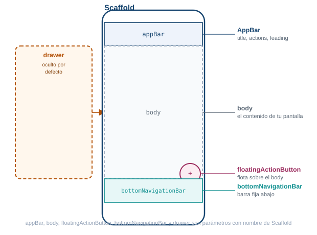
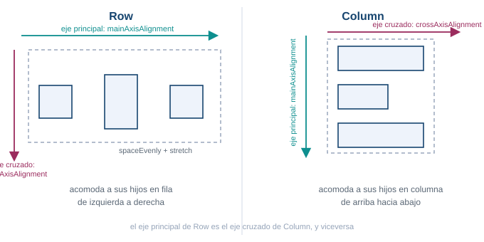
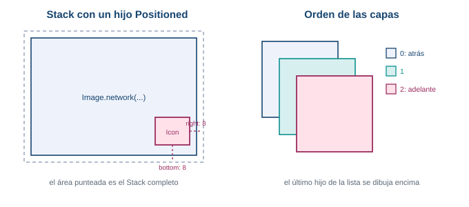
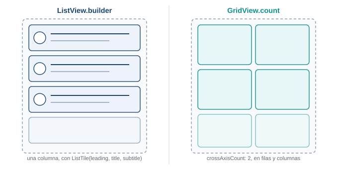
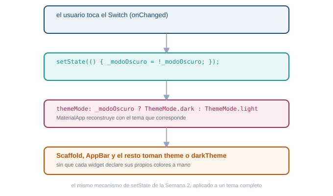

::: {.ficha}
|            |                                                        |
|------------|--------------------------------------------------------|
| Asignatura | Programación Móvil (IF2004)                             |
| Grupos     | 601 y 602 de Ingeniería Informática                     |
| Unidad     | Unidad 2. Interfaz, datos y persistencia                |
:::

## Lo que vas a lograr

Hasta ahora has visto Dart, la anatomía de un proyecto Flutter y una pantalla mínima con
`setState`. Esta semana entras de lleno al catálogo de widgets que vas a usar todos los días:
los que arman una pantalla, los que reciben interacción del usuario, los que organizan el
espacio y los que muestran listas y cuadrículas. También aprendes a dar a tu app un tema claro y
uno oscuro, y a alternar entre ellos.

Hoy no tocas el proyecto de tu equipo. Trabajas en un proyecto Flutter nuevo y vacío, solo para
jugar con widgets sin arriesgar nada. Al final de la semana llevas lo aprendido a las pantallas
reales de tu proyecto.

Al terminar la guía sabes:

1. Explicar para qué sirve cada parámetro de `Scaffold` y armar una pantalla completa con
   `AppBar`, cuerpo, botón flotante y barra de navegación inferior.
2. Dar estilo a un texto con `TextStyle` y reaccionar a toques con los cinco widgets de botón más
   comunes de Material.
3. Mostrar imágenes propias y de internet, y capturar texto del usuario con `TextField`.
4. Distribuir widgets en pantalla con el catálogo completo de layout de Flutter (`Container`,
   `Row`, `Column`, `Stack` y el resto), entendiendo la diferencia entre eje principal y eje
   cruzado, y cuándo superponer en vez de organizar en un eje.
5. Mostrar colecciones de datos con `ListView.builder` y `GridView.builder`.
6. Definir un tema claro y uno oscuro con `ThemeData` y alternar entre ellos con `setState`.

::: {.callout-note}
## Antes de empezar

Necesitas el entorno de Flutter funcionando desde la Semana 1, verificado con `flutter doctor`, y
el repositorio de tu equipo de la Semana 3 con `flutter run` corriendo sin errores. No lo vas a
tocar durante la sesión con acompañamiento, pero sí en tu trabajo independiente.

Esta guía usa Flutter 3.41.9 (canal stable) y Dart SDK 3.11.5, las mismas versiones verificadas
desde la Semana 2.
:::

## Parte teórica

### MaterialApp: la raíz de tu app

`MaterialApp` es el widget que envuelve toda tu aplicación cuando sigues el lenguaje de diseño
Material de Google. Configura la navegación, el tema y el texto que ve el sistema operativo en el
selector de apps recientes.

```dart
MaterialApp(
  title: 'Taller de widgets',
  theme: ThemeData(colorScheme: ColorScheme.fromSeed(seedColor: Colors.teal)),
  home: const PantallaPrincipal(),
)
```

| Atributo | Para qué sirve |
|---|---|
| `home` | El widget que se muestra primero al abrir la app |
| `title` | El nombre de la app que ve el sistema operativo, no un texto visible en pantalla |
| `theme` | El tema claro, un objeto `ThemeData` |
| `darkTheme` | El tema oscuro, otro `ThemeData` |
| `themeMode` | Cuál de los dos temas usar: `ThemeMode.light`, `ThemeMode.dark` o `ThemeMode.system` |
| `debugShowCheckedModeBanner` | Si es `false`, quita la cinta roja de "Debug" en la esquina |

`ColorScheme.fromSeed(seedColor: Colors.teal)` genera automáticamente toda una paleta de colores
coherente (primario, secundario, superficie, error) a partir de un solo color semilla. Es la
forma moderna de definir el esquema de color de Material 3, que Flutter usa por defecto desde
hace varias versiones.

### Scaffold: el esqueleto de una pantalla

`Scaffold` implementa la estructura visual básica de Material: una posición fija para la barra
superior, el cuerpo, el botón flotante, la barra inferior y el menú lateral. Casi toda pantalla de
tu app empieza con un `Scaffold`.

::: {.diagrama}
{fig-alt="Anatomía de un Scaffold: appBar arriba, body en el centro, floatingActionButton flotando sobre la esquina inferior derecha del body, bottomNavigationBar abajo, y un drawer oculto que se desliza desde el borde izquierdo"}

Cada región de la pantalla es un parámetro con nombre de `Scaffold`.
:::

```dart
Scaffold(
  appBar: AppBar(title: const Text('Taller de widgets')),
  body: const Center(child: Text('Hola, Flutter')),
  floatingActionButton: FloatingActionButton(
    onPressed: () {},
    child: const Icon(Icons.add),
  ),
  bottomNavigationBar: BottomNavigationBar(
    currentIndex: 0,
    onTap: (indice) {},
    items: const [
      BottomNavigationBarItem(icon: Icon(Icons.home), label: 'Inicio'),
      BottomNavigationBarItem(icon: Icon(Icons.settings), label: 'Ajustes'),
    ],
  ),
)
```

| Atributo | Para qué sirve |
|---|---|
| `appBar` | La barra superior, casi siempre un `AppBar` |
| `body` | El contenido principal de la pantalla |
| `floatingActionButton` | Un botón circular que flota sobre el cuerpo, para la acción más importante |
| `backgroundColor` | El color de fondo detrás del `body` |
| `bottomNavigationBar` | Una barra fija abajo, para cambiar entre secciones principales |
| `drawer` | Un menú lateral oculto que aparece deslizando desde el borde izquierdo |

Un `drawer` se abre deslizando el dedo desde el borde izquierdo de la pantalla, o tocando el
ícono de menú que `AppBar` agrega solo cuando el `Scaffold` tiene un `drawer` configurado.

### AppBar: la barra superior

```dart
AppBar(
  title: const Text('Taller de widgets'),
  backgroundColor: Colors.teal,
  foregroundColor: Colors.white,
  actions: [
    IconButton(onPressed: () {}, icon: const Icon(Icons.search)),
  ],
)
```

| Atributo | Para qué sirve |
|---|---|
| `title` | El widget que aparece como título, casi siempre un `Text` |
| `actions` | Una lista de widgets a la derecha, casi siempre `IconButton` |
| `leading` | El widget a la izquierda del título, por defecto la flecha de volver si hay una pantalla anterior |
| `backgroundColor` | El color de fondo de la barra |
| `foregroundColor` | El color del título, los íconos y el texto de la barra |

### Text y TextStyle: mostrar texto con estilo

`Text` muestra una cadena de texto. Todo su estilo visual vive en un objeto `TextStyle` aparte,
pasado al parámetro `style`.

```dart
const Text(
  'Precio especial',
  style: TextStyle(
    fontSize: 22,
    fontWeight: FontWeight.bold,
    fontStyle: FontStyle.italic,
    color: Colors.teal,
    decoration: TextDecoration.underline,
    letterSpacing: 1.2,
  ),
)
```

| Propiedad de `TextStyle` | Para qué sirve |
|---|---|
| `fontSize` | Tamaño de la letra, en puntos lógicos |
| `fontWeight` | Grosor: `FontWeight.normal`, `FontWeight.bold`, o un valor de `w100` a `w900` |
| `fontStyle` | `FontStyle.normal` o `FontStyle.italic` |
| `color` | Color del texto |
| `backgroundColor` | Color detrás del texto, como un resaltador |
| `decoration` | Línea sobre el texto: `underline`, `lineThrough`, `overline` o `none` |
| `letterSpacing` | Espacio extra entre letras |

Cuando el texto no cabe en el espacio disponible, dos propiedades de `Text` (no de `TextStyle`)
controlan qué pasa:

```dart
const Text(
  'Un texto muy largo que no cabe completo en una sola línea de la pantalla del teléfono',
  maxLines: 1,
  overflow: TextOverflow.ellipsis,
)
```

| Atributo de `Text` | Para qué sirve |
|---|---|
| `maxLines` | Cuántas líneas ocupa el texto como máximo |
| `overflow` | Qué hacer con lo que sobra: `TextOverflow.ellipsis` agrega puntos suspensivos, `clip` lo corta sin aviso, `fade` lo desvanece |
| `textAlign` | Alineación horizontal del texto dentro de su espacio: `left`, `center`, `right`, `justify` |

`maxLines` limita cuántas líneas ocupa el texto. `overflow: TextOverflow.ellipsis` corta lo que
sobra y agrega puntos suspensivos, en vez de desbordar la pantalla o lanzar una advertencia.

### Botones: cinco formas de reaccionar a un toque

Material define varios widgets de botón, cada uno con una jerarquía visual distinta: úsalos para
decirle al usuario cuál acción es la principal y cuáles son secundarias.

```dart
ElevatedButton(
  onPressed: () {
    print('Guardado');
  },
  style: ElevatedButton.styleFrom(backgroundColor: Colors.teal),
  child: const Text('Guardar'),
)

OutlinedButton(onPressed: () {}, child: const Text('Cancelar'))

TextButton(onPressed: () {}, child: const Text('Más tarde'))

IconButton(onPressed: () {}, icon: const Icon(Icons.favorite))

FloatingActionButton(onPressed: () {}, child: const Icon(Icons.add))
```

| Widget | Cuándo usarlo |
|---|---|
| `ElevatedButton` | La acción principal de la pantalla, con relieve |
| `OutlinedButton` | Una acción secundaria, con borde y sin relleno |
| `TextButton` | Una acción de menor peso visual, solo texto |
| `IconButton` | Una acción representada por un ícono, sin texto |
| `FloatingActionButton` | La acción más importante de toda la pantalla, flotando sobre el `body` |

| Atributo compartido | Para qué sirve |
|---|---|
| `onPressed` | La función que corre al tocar el botón. Si vale `null`, el botón aparece gris y no responde: es la forma estándar de deshabilitarlo |
| `onLongPress` | La función que corre al mantener presionado el botón |
| `child` | El contenido del botón. `IconButton` es la excepción: el suyo va en `icon`, no en `child` |
| `style` | Personaliza colores, forma y relleno, por ejemplo con `ElevatedButton.styleFrom(backgroundColor: ...)` |

Los cinco comparten `onPressed`, la función que corre al tocar el botón. Cuatro reciben su
contenido en `child`; `IconButton` es la excepción, porque su contenido va en `icon`, no en
`child`. Si `onPressed` vale `null`, el botón aparece gris y no responde al toque: es la forma
estándar de deshabilitarlo.

::: {.callout-tip}
## Reto: arma una tarjeta de perfil

Antes de seguir, arma una pantalla con `Scaffold`, un `AppBar` con tu nombre como título, y en el
`body` un `Text` con tu carrera en letra grande y negrita, seguido de dos botones: uno
`ElevatedButton` que imprima "Contactar" en la consola, y uno `OutlinedButton` que imprima
"Ver perfil".
:::

::: {.callout-note collapse="true"}
## Una solución posible

```dart
Scaffold(
  appBar: AppBar(title: const Text('Tu Nombre')),
  body: Padding(
    padding: const EdgeInsets.all(16),
    child: Column(
      crossAxisAlignment: CrossAxisAlignment.start,
      children: [
        const Text(
          'Ingeniería Informática',
          style: TextStyle(fontSize: 22, fontWeight: FontWeight.bold),
        ),
        const SizedBox(height: 16),
        ElevatedButton(
          onPressed: () => print('Contactar'),
          child: const Text('Contactar'),
        ),
        const SizedBox(height: 8),
        OutlinedButton(
          onPressed: () => print('Ver perfil'),
          child: const Text('Ver perfil'),
        ),
      ],
    ),
  ),
)
```
:::

### Image: mostrar imágenes

Flutter carga imágenes desde dos orígenes distintos, con dos constructores separados.

```dart
Image.network(
  'https://docs.flutter.dev/assets/images/dash/dash-fainting.gif',
  height: 150,
)

Image.asset(
  'assets/imagenes/logo.png',
  width: 100,
  fit: BoxFit.cover,
)
```

`Image.network` descarga la imagen de una dirección de internet cada vez que se muestra.
`Image.asset` carga un archivo empacado dentro de tu propia app: primero lo declaras en
`pubspec.yaml`, dentro de la clave `flutter`:

```yaml
flutter:
  assets:
    - assets/imagenes/
```

| Atributo | Para qué sirve |
|---|---|
| `width` / `height` | Tamaño al que se fuerza la imagen |
| `fit` | Cómo rellenar ese tamaño: `BoxFit.cover`, `BoxFit.contain`, `BoxFit.fill` |

### TextField: capturar texto del usuario

```dart
final controladorCorreo = TextEditingController();

TextField(
  controller: controladorCorreo,
  decoration: const InputDecoration(
    labelText: 'Correo',
    hintText: 'nombre@correo.com',
    prefixIcon: Icon(Icons.email),
    border: OutlineInputBorder(),
  ),
)
```

| Atributo | Para qué sirve |
|---|---|
| `controller` | Un `TextEditingController` que guarda y permite leer o cambiar el texto escrito |
| `decoration` | Un `InputDecoration` con la apariencia del campo |
| `decoration.labelText` | Etiqueta que flota arriba cuando el campo tiene texto o foco |
| `decoration.hintText` | Texto tenue que desaparece al escribir |
| `decoration.prefixIcon` | Un ícono a la izquierda del texto |
| `decoration.border` | El borde del campo, por ejemplo `OutlineInputBorder()` para un recuadro completo |

El `controller` es lo que te permite leer después lo que el usuario escribió, con
`controladorCorreo.text`, o limpiarlo con `controladorCorreo.clear()`.

### Widgets de layout: el catálogo completo

Flutter no tiene un solo widget para organizar pantallas: tiene una familia completa, cada uno
resolviendo un problema distinto. Se agrupan en tres ideas:

- **Envuelven a un solo hijo** para darle tamaño, espacio o posición: `Container`, `Padding`,
  `Center`, `Align`, `SizedBox`.
- **Organizan a varios hijos** en un eje o en una rejilla: `Row`, `Column`, `Wrap` (y más abajo
  `ListView`/`GridView`, que por manejar su propio desplazamiento tienen sección aparte).
- **Superponen capas o envuelven la pantalla completa**: `Stack` y `Positioned` apilan widgets uno
  sobre otro; `SingleChildScrollView` y `SafeArea` resuelven el desplazamiento y los bordes del
  dispositivo.

No vas a usar los diecisiete en el laboratorio de hoy, pero sí vas a encontrarlos todo el
semestre: conviene saber qué hace cada uno y cuándo alcanza.

#### Container, Padding y SizedBox: controlar el espacio de un solo hijo

Antes de organizar varios widgets juntos, necesitas controlar el espacio de uno solo.

```dart
Container(
  width: double.infinity,
  padding: const EdgeInsets.all(16),
  color: Colors.teal.shade50,
  child: const Text('Contenido con espacio alrededor'),
)

Padding(
  padding: const EdgeInsets.symmetric(horizontal: 16, vertical: 8),
  child: const Text('Con margen interno'),
)

const SizedBox(height: 24)
```

| Widget | Atributos principales | Para qué sirve |
|---|---|---|
| `Container` | `width`, `height`, `padding`, `margin`, `color`, `decoration`, `alignment`, `child` | Una caja con tamaño, color, borde y espacio interno, todo en un solo widget |
| `Padding` | `padding`, `child` | Agrega espacio interno alrededor de un solo hijo, sin color ni borde |
| `SizedBox` | `width`, `height`, `child` | Fuerza un ancho y alto exactos, o crea un espacio vacío entre dos widgets cuando no lleva `child` |

| Constructor de `EdgeInsets` | Para qué sirve |
|---|---|
| `EdgeInsets.all(16)` | El mismo espacio en los cuatro lados |
| `EdgeInsets.symmetric(horizontal:, vertical:)` | Espacio distinto entre lados opuestos |
| `EdgeInsets.only(top:, left:, ...)` | Espacio distinto en cada lado, uno por uno |

#### Center y Align: ubicar un hijo dentro del espacio disponible

```dart
Center(
  child: const Icon(Icons.check_circle, size: 48),
)

Align(
  alignment: Alignment.bottomRight,
  child: const Icon(Icons.info_outline),
)
```

| Widget | Atributos principales | Para qué sirve |
|---|---|---|
| `Center` | `child`, `widthFactor`, `heightFactor` | Centra a su hijo dentro del espacio disponible |
| `Align` | `alignment`, `child`, `widthFactor`, `heightFactor` | Ubica a su hijo en cualquier punto del espacio disponible, no solo el centro |

`Center` es en realidad `Align` con `alignment: Alignment.center`. `Alignment` trae valores listos
para usar: `Alignment.topLeft`, `Alignment.center`, `Alignment.bottomRight`, y el resto de las
ocho combinaciones.

#### Row y Column: los widgets que organizan todo

`Row` acomoda a sus hijos en una fila horizontal. `Column` los acomoda en una columna vertical.
Son, después de `Scaffold`, los widgets que más vas a escribir en Flutter.

::: {.diagrama}
{fig-alt="Row organiza en horizontal con el eje principal a lo largo y el eje cruzado hacia abajo. Column organiza en vertical con el eje principal hacia abajo y el eje cruzado a lo largo"}

El eje principal de uno es el eje cruzado del otro.
:::

Cada uno tiene dos ejes. El **eje principal** es la dirección en la que se reparten los hijos
(horizontal en `Row`, vertical en `Column`). El **eje cruzado** es la dirección perpendicular.

```dart
Row(
  mainAxisAlignment: MainAxisAlignment.spaceEvenly,
  crossAxisAlignment: CrossAxisAlignment.center,
  children: const [
    Icon(Icons.star),
    Text('Favorito'),
    Icon(Icons.star),
  ],
)

Column(
  mainAxisAlignment: MainAxisAlignment.center,
  crossAxisAlignment: CrossAxisAlignment.stretch,
  children: [
    const Text('Bienvenido'),
    ElevatedButton(onPressed: () {}, child: const Text('Continuar')),
  ],
)
```

| Atributo | Para qué sirve |
|---|---|
| `mainAxisAlignment` | Cómo repartir los hijos sobre el eje principal: `start`, `center`, `end`, `spaceBetween`, `spaceEvenly`, `spaceAround` |
| `crossAxisAlignment` | Cómo alinear los hijos sobre el eje cruzado: `start`, `center`, `end`, `stretch` |
| `mainAxisSize` | Si el widget ocupa todo el espacio disponible (`max`, el valor por defecto) o solo lo que necesitan sus hijos (`min`) |
| `children` | La lista ordenada de widgets hijos |

#### Expanded y Flexible: repartir el espacio sobrante

```dart
Row(
  children: [
    const Text('Nombre'),
    const SizedBox(width: 8),
    Expanded(child: TextField(controller: controladorCorreo)),
  ],
)

Row(
  children: [
    Flexible(child: Text('Texto que puede achicarse')),
    Container(width: 80, height: 24, color: Colors.teal.shade100),
  ],
)

Column(
  children: const [
    Text('Arriba'),
    Spacer(),
    Text('Abajo'),
  ],
)
```

| Widget | Atributos principales | Para qué sirve |
|---|---|---|
| `Expanded` | `flex`, `child` | Obliga a su hijo a ocupar todo el espacio sobrante sobre el eje principal de un `Row`/`Column` |
| `Flexible` | `flex`, `fit`, `child` | Permite que su hijo ocupe hasta cierto espacio, pero sin forzarlo si el contenido es más chico |
| `Spacer` | `flex` | Un espacio vacío y flexible entre widgets; equivale a un `Expanded` sin contenido |

`Expanded` es en realidad `Flexible` con `fit: FlexFit.tight`: la diferencia real es que
`Flexible` (con el `fit` por defecto, `FlexFit.loose`) deja que el hijo sea más chico que el
espacio asignado si su contenido no lo llena, mientras que `Expanded` siempre ocupa el espacio
completo. Los tres widgets solo funcionan como hijos directos de un `Row`, `Column` o `Flex`.

::: {.callout-tip}
## Reto: arreglando un overflow

El siguiente código lanza un error de desbordamiento en pantallas angostas, porque tres widgets de
ancho fijo no caben en una fila:

```dart
Row(
  children: [
    Text('Nombre completo del producto'),
    Icon(Icons.star),
    Text('4.8'),
  ],
)
```

Corrígelo para que el nombre del producto se recorte con puntos suspensivos en vez de desbordar,
sin tocar el ícono ni la calificación.
:::

::: {.callout-note collapse="true"}
## Una solución posible

```dart
Row(
  children: [
    Expanded(
      child: Text(
        'Nombre completo del producto',
        overflow: TextOverflow.ellipsis,
        maxLines: 1,
      ),
    ),
    const Icon(Icons.star),
    const Text('4.8'),
  ],
)
```

`Expanded` le da al `Text` un ancho definido en vez de "todo el infinito", y con ese ancho ya
definido `overflow: TextOverflow.ellipsis` tiene sobre qué recortar.
:::

#### Wrap: cuando una fila no alcanza

```dart
Wrap(
  spacing: 8,
  runSpacing: 8,
  children: const [
    Chip(label: Text('Dart')),
    Chip(label: Text('Flutter')),
    Chip(label: Text('Firebase')),
    Chip(label: Text('SQLite')),
    Chip(label: Text('Git')),
  ],
)
```

| Atributo | Para qué sirve |
|---|---|
| `direction` | Eje principal: `Axis.horizontal` (por defecto, como `Row`) o `Axis.vertical` (como `Column`) |
| `spacing` | Espacio entre elementos dentro de la misma línea |
| `runSpacing` | Espacio entre una línea y la siguiente |
| `alignment` | Cómo alinear los elementos dentro de cada línea |

`Wrap` se comporta como `Row` o `Column`, pero cuando sus hijos no caben en una sola línea, salta
a la siguiente en vez de desbordar. Úsalo para listas de etiquetas o filtros de longitud variable.

#### Stack y Positioned: superponer capas

`Stack` no reparte a sus hijos en un eje: los dibuja unos encima de otros, en el orden de la
lista `children` (el último queda arriba de todos). `Positioned` fija la distancia de un hijo
respecto a los bordes del `Stack` que lo contiene, y solo funciona directamente dentro de uno.

::: {.diagrama}
{fig-alt="Stack coloca a sus hijos en capas superpuestas, el primero de la lista queda atrás y el último queda adelante. Positioned fija la distancia de un hijo respecto a los bordes del Stack, por ejemplo right y bottom"}

El último hijo de la lista se dibuja encima de los anteriores.
:::

```dart
Stack(
  children: [
    Image.network(
      'https://docs.flutter.dev/assets/images/dash/dash-fainting.gif',
    ),
    Positioned(
      bottom: 8,
      right: 8,
      child: const Icon(Icons.favorite, color: Colors.red),
    ),
  ],
)
```

| Widget | Atributos principales | Para qué sirve |
|---|---|---|
| `Stack` | `children`, `alignment`, `fit` | Superpone widgets; `alignment` ubica a los hijos que no llevan `Positioned`; `fit` decide si el `Stack` sin restricciones toma el tamaño del hijo más grande (`StackFit.loose`, por defecto) o el del propio `Stack` (`StackFit.expand`) |
| `Positioned` | `top`, `bottom`, `left`, `right`, `width`, `height`, `child` | Fija la distancia de un hijo respecto a un borde del `Stack` |

#### SingleChildScrollView: desplazar contenido de tamaño fijo

```dart
SingleChildScrollView(
  padding: const EdgeInsets.all(16),
  child: Column(
    children: const [
      Text('Términos y condiciones'),
      // el resto de un texto largo que no cabe en una pantalla
    ],
  ),
)
```

| Atributo | Para qué sirve |
|---|---|
| `scrollDirection` | Eje del desplazamiento: `Axis.vertical` (por defecto) u `Axis.horizontal` |
| `child` | Un único widget, casi siempre una `Column`, con contenido de tamaño ya conocido |
| `padding` | Espacio interno alrededor de todo el contenido desplazable |

No metas una `ListView` o `GridView` larga dentro de un `SingleChildScrollView`: los dos manejan
su propio desplazamiento, y combinarlos produce el mismo error de altura sin límite que ves más
adelante en "Errores frecuentes".

#### SafeArea: evitar el notch y la cámara perforada

```dart
SafeArea(
  child: Container(
    color: Colors.black,
    child: Image.asset('assets/images/fondo.jpg', fit: BoxFit.cover),
  ),
)
```

| Atributo | Para qué sirve |
|---|---|
| `child` | El contenido que se protege |
| `top`, `bottom`, `left`, `right` | Si aplicar el margen de seguridad en ese lado; los cuatro son `true` por defecto |

`Scaffold` ya aplica `SafeArea` automáticamente en su `body`. Envuélvelo tú mismo solo cuando
dibujas contenido a pantalla completa por fuera de un `Scaffold`, por ejemplo una imagen de fondo
detrás de todo.

`ListView` y `GridView` también organizan varios hijos, pero por manejar su propio desplazamiento
tienen sección propia, justo debajo de esta.

### Listas: ListView y ListTile

`ListView` muestra una columna de widgets que se desliza cuando no caben todos en la pantalla.
`ListView.builder` construye cada elemento bajo demanda, a partir de una lista de datos: es la
forma correcta de mostrar listas largas sin crear todos los widgets de una vez.

```dart
final productos = ['Manzana', 'Pan', 'Leche', 'Café'];

ListView.builder(
  itemCount: productos.length,
  itemBuilder: (context, indice) {
    return ListTile(
      leading: const Icon(Icons.shopping_bag),
      title: Text(productos[indice]),
      subtitle: Text('Producto número ${indice + 1}'),
      trailing: const Icon(Icons.chevron_right),
      onTap: () {},
    );
  },
)
```

| Atributo | Para qué sirve |
|---|---|
| `itemCount` | Cuántos elementos tiene la lista |
| `itemBuilder` | Una función que recibe el índice y devuelve el widget de ese elemento |
| `ListTile.leading` | Widget a la izquierda, casi siempre un ícono o una imagen pequeña |
| `ListTile.title` | El texto principal de la fila |
| `ListTile.subtitle` | Un texto secundario debajo del título |
| `ListTile.trailing` | Widget a la derecha, casi siempre una flecha o un ícono de acción |
| `ListTile.onTap` | Función que corre al tocar la fila completa |

### Cuadrículas: GridView

`GridView` organiza a sus hijos en filas y columnas en vez de una sola columna. `GridView.count`
fija cuántas columnas quieres; `GridView.builder` construye cada elemento bajo demanda, igual que
`ListView.builder`, y es la opción correcta para cuadrículas largas.

::: {.diagrama}
{fig-alt="ListView.builder ordena sus elementos en una sola columna que se desliza verticalmente. GridView.count ordena los mismos elementos en una cuadrícula de columnas fijas"}

Misma idea de construir bajo demanda, distinta forma de acomodar.
:::

```dart
GridView.count(
  crossAxisCount: 2,
  mainAxisSpacing: 12,
  crossAxisSpacing: 12,
  children: List.generate(6, (indice) {
    return Container(
      color: Colors.teal.shade100,
      child: Center(child: Text('Item $indice')),
    );
  }),
)

GridView.builder(
  gridDelegate: const SliverGridDelegateWithFixedCrossAxisCount(
    crossAxisCount: 2,
    childAspectRatio: 1.2,
  ),
  itemCount: productos.length,
  itemBuilder: (context, indice) {
    return Card(child: Center(child: Text(productos[indice])));
  },
)
```

| Atributo | Para qué sirve |
|---|---|
| `crossAxisCount` | Cuántas columnas tiene la cuadrícula |
| `mainAxisSpacing` / `crossAxisSpacing` | Separación entre filas y entre columnas |
| `childAspectRatio` | Relación ancho entre alto de cada celda: mayor que 1 da celdas más anchas que altas |
| `gridDelegate` | En `GridView.builder`, el objeto que define la forma de la cuadrícula |

### Temas claro y oscuro

Un tema es un objeto `ThemeData` con los colores, tipografías y formas que usan todos los widgets
de Material sin que cada uno los declare por su cuenta. `MaterialApp` acepta dos: `theme` para el
modo claro y `darkTheme` para el modo oscuro. `themeMode` decide cuál se usa en cada momento.

En la Semana 2 usaste `setState` para cambiar una variable propia de una pantalla. Hoy aplicas
exactamente el mismo mecanismo a un nivel más alto: la variable que cambia decide el tema de toda
la app, no solo un texto en pantalla. Si quieres repasar el ciclo completo de `setState` y del
árbol de widgets por dentro, ese detalle está en el
[complemento de arquitectura de Flutter](../semana-02/arquitectura-flutter.qmd) de la Semana 2.

::: {.diagrama}
{fig-alt="Flujo del cambio de tema: el usuario toca el Switch, el código llama a setState y cambia una variable booleana, MaterialApp reconstruye leyendo themeMode, y Scaffold y AppBar toman los colores de theme o darkTheme"}

El mismo `setState` de siempre, ahora cambiando un tema completo.
:::

```dart
class MiApp extends StatefulWidget {
  const MiApp({super.key});

  @override
  State<MiApp> createState() => _MiAppState();
}

class _MiAppState extends State<MiApp> {
  bool _modoOscuro = false;

  @override
  Widget build(BuildContext context) {
    return MaterialApp(
      theme: ThemeData(
        colorScheme: ColorScheme.fromSeed(seedColor: Colors.teal),
      ),
      darkTheme: ThemeData(
        colorScheme: ColorScheme.fromSeed(
          seedColor: Colors.teal,
          brightness: Brightness.dark,
        ),
      ),
      themeMode: _modoOscuro ? ThemeMode.dark : ThemeMode.light,
      home: Scaffold(
        appBar: AppBar(title: const Text('Tema claro y oscuro')),
        body: Center(
          child: Switch(
            value: _modoOscuro,
            onChanged: (valor) {
              setState(() {
                _modoOscuro = valor;
              });
            },
          ),
        ),
      ),
    );
  }
}
```

Cualquier widget más abajo en el árbol lee el tema activo con `Theme.of(context)`, sin importar
si está en modo claro u oscuro:

```dart
Container(
  color: Theme.of(context).colorScheme.primaryContainer,
  child: Text(
    'Uso el color del tema actual',
    style: Theme.of(context).textTheme.titleMedium,
  ),
)
```

::: {.callout-tip}
## Reto: un botón de tema en vez de un Switch

Reescribe el ejemplo de arriba cambiando el `Switch` por un `IconButton`, que muestre
`Icons.dark_mode` cuando el tema es claro y `Icons.light_mode` cuando es oscuro, y alterne
`_modoOscuro` al tocarlo.
:::

::: {.callout-note collapse="true"}
## Una solución posible

```dart
IconButton(
  icon: Icon(_modoOscuro ? Icons.light_mode : Icons.dark_mode),
  onPressed: () {
    setState(() {
      _modoOscuro = !_modoOscuro;
    });
  },
)
```
:::

## Laboratorio

Sigue los pasos en orden, en el proyecto de práctica desechable de hoy. Guarda después de cada
cambio y observa la recarga en caliente.

### [1]{.paso} Crea el proyecto de práctica

```bash
flutter create taller_widgets
cd taller_widgets
flutter run
```

Confirma que la app de plantilla (el contador) corre en tu emulador o dispositivo antes de seguir.

### [2]{.paso} Limpia main.dart y arma el Scaffold base

Reemplaza el contenido de `lib/main.dart` con una app mínima:

```dart
import 'package:flutter/material.dart';

void main() {
  runApp(const TallerWidgetsApp());
}

class TallerWidgetsApp extends StatelessWidget {
  const TallerWidgetsApp({super.key});

  @override
  Widget build(BuildContext context) {
    return MaterialApp(
      title: 'Taller de widgets',
      theme: ThemeData(colorScheme: ColorScheme.fromSeed(seedColor: Colors.teal)),
      home: Scaffold(
        appBar: AppBar(title: const Text('Taller de widgets')),
        body: const Center(child: Text('Hola, Flutter')),
      ),
    );
  }
}
```

Con recarga en caliente, confirma que ves la barra superior con el título y el texto centrado.

### [3]{.paso} Agrega texto con estilo y botones

Cambia el `body` por una `Column` con un `Text` con estilo y tres botones distintos:

```dart
body: Padding(
  padding: const EdgeInsets.all(16),
  child: Column(
    crossAxisAlignment: CrossAxisAlignment.start,
    children: [
      const Text(
        'Catálogo de widgets',
        style: TextStyle(fontSize: 24, fontWeight: FontWeight.bold),
      ),
      const SizedBox(height: 16),
      ElevatedButton(onPressed: () {}, child: const Text('Elevado')),
      const SizedBox(height: 8),
      OutlinedButton(onPressed: () {}, child: const Text('Delineado')),
      const SizedBox(height: 8),
      TextButton(onPressed: () {}, child: const Text('De texto')),
    ],
  ),
),
```

### [4]{.paso} Agrega una imagen y un campo de texto

Declara la carpeta de assets en `pubspec.yaml` (respeta la indentación de dos espacios):

```yaml
flutter:
  uses-material-design: true
  assets:
    - assets/imagenes/
```

Agrega una imagen de internet y un `TextField` debajo de los botones del paso anterior:

```dart
const SizedBox(height: 24),
Image.network(
  'https://docs.flutter.dev/assets/images/dash/dash-fainting.gif',
  height: 120,
),
const SizedBox(height: 16),
TextField(
  decoration: const InputDecoration(
    labelText: 'Busca un producto',
    prefixIcon: Icon(Icons.search),
    border: OutlineInputBorder(),
  ),
),
```

### [5]{.paso} Organiza con Row, Expanded y Spacer

Agrega una fila con un ícono, un texto que puede desbordarse, y una calificación:

```dart
const SizedBox(height: 16),
Row(
  children: [
    const Icon(Icons.shopping_cart),
    const SizedBox(width: 8),
    Expanded(
      child: Text(
        'Nombre largo de un producto cualquiera del catálogo',
        overflow: TextOverflow.ellipsis,
        maxLines: 1,
      ),
    ),
    const Text('4.8'),
  ],
),
```

Prueba a quitar `Expanded` un momento y observa la franja amarilla y negra de desbordamiento en la
consola. Vuelve a ponerlo antes de seguir.

### [6]{.paso} Construye una lista con ListView.builder

Reemplaza todo el `body` por una lista de productos. Como ahora el contenido puede ser largo,
`ListView` reemplaza a `Column`:

```dart
final productos = ['Manzana', 'Pan', 'Leche', 'Café', 'Arroz', 'Huevos'];

// dentro de build():
body: ListView.builder(
  itemCount: productos.length,
  itemBuilder: (context, indice) {
    return ListTile(
      leading: const Icon(Icons.shopping_bag),
      title: Text(productos[indice]),
      subtitle: Text('Producto número ${indice + 1}'),
      trailing: const Icon(Icons.chevron_right),
      onTap: () {
        print('Tocaste ${productos[indice]}');
      },
    );
  },
),
```

### [7]{.paso} Convierte la lista en una cuadrícula

Cambia `ListView.builder` por `GridView.builder`, con la misma lista de `productos`:

```dart
body: GridView.builder(
  padding: const EdgeInsets.all(12),
  gridDelegate: const SliverGridDelegateWithFixedCrossAxisCount(
    crossAxisCount: 2,
    mainAxisSpacing: 12,
    crossAxisSpacing: 12,
    childAspectRatio: 1.3,
  ),
  itemCount: productos.length,
  itemBuilder: (context, indice) {
    return Card(
      child: Center(child: Text(productos[indice])),
    );
  },
),
```

### [8]{.paso} Agrega el tema oscuro con un interruptor

Convierte `TallerWidgetsApp` en un `StatefulWidget` y agrega `darkTheme`, `themeMode` y un
`Switch` en el `AppBar` para alternar entre los dos temas, siguiendo el ejemplo completo de la
sección de teoría. Verifica que, al tocar el interruptor, toda la pantalla (fondo, barra superior
y tarjetas) cambia de color, no solo el texto.

## Errores frecuentes

::: {.error-caso}
[Error 1]{.etiqueta}

### A RenderFlex overflowed by ... pixels

```text
A RenderFlex overflowed by 42 pixels on the right.
```

**Causa.** Dentro de un `Row`, la suma de los anchos de los hijos es mayor que el ancho
disponible. Es el error más común de toda la semana.

**Solución.** Envuelve el widget que puede crecer o recortarse (casi siempre un `Text`) en
`Expanded`, o dale un ancho fijo con `SizedBox` si no debe ocupar el espacio sobrante.
:::

::: {.error-caso}
[Error 2]{.etiqueta}

### Vertical viewport was given unbounded height

```text
Vertical viewport was given unbounded height.
```

**Causa.** Pusiste un `ListView` o `GridView` directamente dentro de una `Column`. La `Column` no
limita la altura de sus hijos, y una lista que se desliza necesita saber cuánto espacio tiene.

**Solución.** Envuelve la lista en `Expanded` si debe ocupar el espacio sobrante de la `Column`,
o dale una altura fija con `SizedBox(height: ...)` si debe ser más pequeña.

```dart
Column(
  children: [
    const Text('Productos'),
    Expanded(
      child: ListView.builder(
        itemCount: productos.length,
        itemBuilder: (context, indice) => ListTile(title: Text(productos[indice])),
      ),
    ),
  ],
)
```
:::

::: {.error-caso}
[Error 3]{.etiqueta}

### El contenido de la tarjeta se desborda en la cuadrícula

**Causa.** `childAspectRatio` describe la forma de la celda (ancho entre alto), no cuánto
contenido cabe adentro. Un valor muy alto crea celdas bajas donde un texto largo o un ícono
grande ya no caben, y Flutter avisa con una franja de desbordamiento dentro de la tarjeta.

**Solución.** Baja el `childAspectRatio` (celdas más altas) o recorta el contenido con
`overflow: TextOverflow.ellipsis` y `maxLines: 1` en los textos de cada celda.
:::

::: {.error-caso}
[Error 4]{.etiqueta}

### No Material widget found

```text
No Material widget found.
```

**Causa.** Usaste un widget de Material (`ElevatedButton`, `TextField`, un `Card`, o llamaste a
`Theme.of(context)`) por fuera del árbol de un `MaterialApp`, por ejemplo pasándolo directo a
`runApp()` sin envolverlo.

**Solución.** Verifica que `runApp()` reciba un `MaterialApp` (o un widget que a su vez lo
contenga), y que el widget que falla esté en algún punto por debajo de él en el árbol.
:::

## Tu entregable de la semana

::: {.callout-important}
## Pantallas principales del proyecto con ambos temas

**Con quién.** El mismo equipo de tres integrantes de la Semana 3, sobre el mismo repositorio.

**Qué entrega el equipo.** Las pantallas principales del proyecto (las que ya existan o las
primeras que definieron en `docs/alcance.md`) reconstruidas con los widgets de esta semana, y con
`theme` y `darkTheme` configurados en el `MaterialApp` del proyecto:

- Al menos una pantalla usa `Scaffold` con `AppBar`, y organiza su contenido con `Row` y/o
  `Column` sin desbordamientos.
- Al menos una lista o cuadrícula de datos del proyecto (productos, tareas, contactos, lo que
  aplique a la idea del equipo) construida con `ListView.builder` o `GridView.builder`.
- El `MaterialApp` del proyecto define `theme` y `darkTheme` con `ColorScheme.fromSeed`, y un
  control visible (`Switch` o `IconButton`) que alterna `themeMode` con `setState`.
- La app corre sin errores ni advertencias de desbordamiento en la consola, en ambos temas.

**Cómo entrega el equipo.** Los cambios quedan commiteados y publicados en el repositorio del
equipo, con al menos un commit por integrante.

**Cuándo.** Antes del inicio de la sesión de la Semana 5.
:::

## Lista de chequeo de la semana

::: {.checklist}
**Antes de entregar, revisa que tienes todo esto**

- [ ] El proyecto de práctica (`taller_widgets` o el nombre que usaste) corre sin errores
- [ ] Puedes explicar la diferencia entre `mainAxisAlignment` y `crossAxisAlignment`
- [ ] Ninguna pantalla del proyecto del equipo muestra la franja de desbordamiento en consola
- [ ] Al menos una lista o cuadrícula del proyecto usa `ListView.builder` o `GridView.builder`
- [ ] El `MaterialApp` del proyecto tiene `theme` y `darkTheme` con `ColorScheme.fromSeed`
- [ ] Un `Switch` o `IconButton` visible alterna `themeMode` con `setState`
- [ ] Verificaste el cambio de tema en al menos dos pantallas distintas del proyecto
- [ ] Los cambios están commiteados y subidos al repositorio del equipo
:::

## Recursos

- Catálogo de widgets de Material: [docs.flutter.dev/ui/widgets/material](https://docs.flutter.dev/ui/widgets/material)
- Sobre `Layout`, `Row` y `Column`: [docs.flutter.dev/ui/layout](https://docs.flutter.dev/ui/layout)
- Sobre listas y cuadrículas: [docs.flutter.dev/cookbook/lists](https://docs.flutter.dev/cookbook/lists)
- Sobre temas de Material 3: [docs.flutter.dev/cookbook/design/themes](https://docs.flutter.dev/cookbook/design/themes)
- Complemento de la Semana 2, para repasar el ciclo de `setState` y el árbol de widgets:
  [arquitectura de Flutter](../semana-02/arquitectura-flutter.qmd)
- Repositorio de ejemplo usado como referencia para esta guía:
  [Flutter-Expert, carpeta basic_flutter](https://github.com/ArisGuimera/Flutter-Expert/tree/master/basic_flutter)

::: {.pie-doc}
Programación Móvil (IF2004). Institución Universitaria de Envigado. Facultad de Ingenierías.
Semestre 2026-02.

**Transparencia.** La redacción de esta guía contó con el apoyo de inteligencia artificial,
usando el modelo Claude Opus 5 de Anthropic. Todo el contenido fue revisado y validado.
:::
