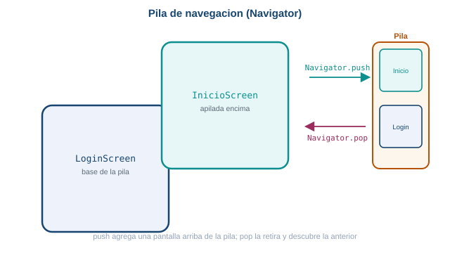
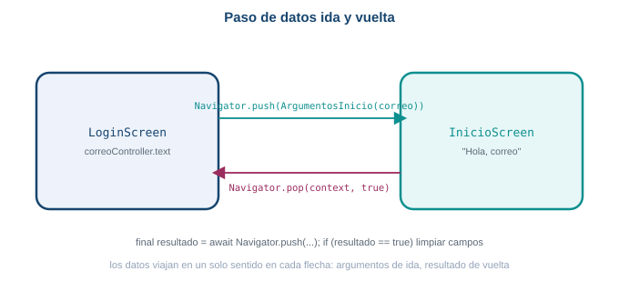
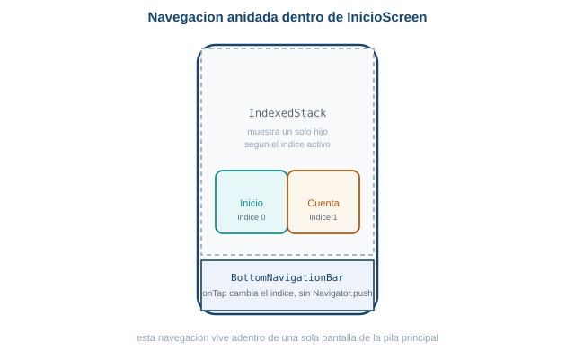

::: {.ficha}
|            |                                                        |
|------------|--------------------------------------------------------|
| Asignatura | Programación Móvil (IF2004)                             |
| Grupos     | 601 y 602 de Ingeniería Informática                     |
| Unidad     | Unidad 2. Interfaz, datos y persistencia                |
:::

## Lo que vas a lograr

Hasta ahora cada pantalla que armaste vivía sola: `Scaffold`, widgets, un tema. Esta semana
conectas pantallas entre sí. Vas a construir un proyecto de práctica nuevo, `taller_login`, con una
pantalla de login y una pantalla de inicio, y vas a moverte entre ellas pasando información en los
dos sentidos.

Al terminar la guía sabes:

1. Navegar de una pantalla a otra con `Navigator.push` y entender la pila de navegación.
2. Registrar rutas con nombre en `MaterialApp` y navegar con `Navigator.pushNamed`.
3. Pasar datos de una pantalla a otra con una clase de argumentos tipada.
4. Recibir de vuelta un resultado con `Navigator.pop` y `await Navigator.push`.
5. Construir una navegación anidada mínima con `BottomNavigationBar` e `IndexedStack`.

::: {.callout-note}
## Antes de empezar

Necesitas el entorno de Flutter funcionando desde la Semana 1, y ya conoces `Scaffold`, `Column`,
`Row`, `TextField` y botones de la Semana 4: esta guía no los reexplica, solo los usa.

Esta guía usa Flutter 3.41.9 (canal stable) y Dart SDK 3.11.5, las mismas versiones verificadas
desde la Semana 2.
:::

## Parte 1. La pantalla de login

Vas a construir un proyecto de práctica desechable, igual que `taller_widgets` de la Semana 4,
nunca el proyecto real de tu equipo.

### [1]{.paso} Crea el proyecto

```bash
flutter create taller_login
cd taller_login
flutter run
```

Confirma que la app de plantilla corre antes de seguir.

### [2]{.paso} Construye el login

Reemplaza `lib/main.dart` con una pantalla de login. La cabecera usa un color de fondo en vez de
depender de una imagen de red: si tu salón tiene conexión estable, más abajo se documenta la
alternativa con `Image.network`.

```dart
import 'package:flutter/material.dart';

void main() {
  runApp(const TallerLoginApp());
}

class TallerLoginApp extends StatelessWidget {
  const TallerLoginApp({super.key});

  @override
  Widget build(BuildContext context) {
    return MaterialApp(
      title: 'Taller de login',
      theme: ThemeData(colorScheme: ColorScheme.fromSeed(seedColor: Colors.green)),
      debugShowCheckedModeBanner: false,
      home: const LoginScreen(),
    );
  }
}

class LoginScreen extends StatefulWidget {
  const LoginScreen({super.key});

  @override
  State<LoginScreen> createState() => _LoginScreenState();
}

class _LoginScreenState extends State<LoginScreen> {
  final _correoController = TextEditingController();
  final _claveController = TextEditingController();
  bool _mostrarClave = false;

  @override
  Widget build(BuildContext context) {
    return Scaffold(
      body: SafeArea(
        child: SingleChildScrollView(
          child: Column(
            crossAxisAlignment: CrossAxisAlignment.start,
            children: [
              Container(
                width: double.infinity,
                height: 200,
                decoration: BoxDecoration(color: Colors.green.shade200),
                child: const Center(
                  child: Icon(Icons.storefront, size: 64, color: Colors.white),
                ),
              ),
              Padding(
                padding: const EdgeInsets.all(24),
                child: Column(
                  crossAxisAlignment: CrossAxisAlignment.start,
                  children: [
                    const Text(
                      'Bienvenido de vuelta',
                      style: TextStyle(fontSize: 26, fontWeight: FontWeight.bold),
                    ),
                    const SizedBox(height: 8),
                    const Text(
                      'Inicia sesión para ver tus pedidos y tu carrito guardado.',
                      style: TextStyle(color: Colors.black54),
                    ),
                    const SizedBox(height: 24),
                    const Text('Correo electrónico'),
                    const SizedBox(height: 8),
                    TextField(
                      controller: _correoController,
                      decoration: const InputDecoration(
                        hintText: 'nombre@correo.com',
                        prefixIcon: Icon(Icons.email_outlined),
                        border: OutlineInputBorder(),
                      ),
                    ),
                    const SizedBox(height: 16),
                    const Text('Contraseña'),
                    const SizedBox(height: 8),
                    TextField(
                      controller: _claveController,
                      obscureText: !_mostrarClave,
                      decoration: InputDecoration(
                        prefixIcon: const Icon(Icons.lock_outline),
                        border: const OutlineInputBorder(),
                        suffixIcon: IconButton(
                          icon: Icon(_mostrarClave
                              ? Icons.visibility_off_outlined
                              : Icons.visibility_outlined),
                          onPressed: () {
                            setState(() {
                              _mostrarClave = !_mostrarClave;
                            });
                          },
                        ),
                      ),
                    ),
                    Align(
                      alignment: Alignment.centerRight,
                      child: TextButton(
                        onPressed: () {},
                        child: const Text('¿Olvidaste tu contraseña?'),
                      ),
                    ),
                    const SizedBox(height: 8),
                    SizedBox(
                      width: double.infinity,
                      child: ElevatedButton(
                        onPressed: () {},
                        style: ElevatedButton.styleFrom(padding: const EdgeInsets.all(16)),
                        child: const Text('Iniciar sesión'),
                      ),
                    ),
                    const SizedBox(height: 16),
                    Row(
                      children: const [
                        Expanded(child: Divider()),
                        Padding(
                          padding: EdgeInsets.symmetric(horizontal: 8),
                          child: Text('o continúa con'),
                        ),
                        Expanded(child: Divider()),
                      ],
                    ),
                    const SizedBox(height: 16),
                    SizedBox(
                      width: double.infinity,
                      child: OutlinedButton.icon(
                        onPressed: () {},
                        icon: const Icon(Icons.g_mobiledata, size: 28),
                        label: const Text('Continuar con Google'),
                      ),
                    ),
                    const SizedBox(height: 16),
                    Center(
                      child: TextButton(
                        onPressed: () {},
                        child: const Text('¿No tienes cuenta? Regístrate'),
                      ),
                    ),
                  ],
                ),
              ),
            ],
          ),
        ),
      ),
    );
  }
}
```

| Pieza nueva | Para qué sirve |
|---|---|
| `obscureText: !_mostrarClave` | Oculta el texto de la contraseña mientras `_mostrarClave` es `false` |
| `suffixIcon` con `IconButton` | Alterna `_mostrarClave` con `setState`, el mismo mecanismo de la Semana 4 |
| `SingleChildScrollView` | Evita que el teclado tape los campos al enfocarlos en pantallas pequeñas |

`Scaffold`, `Column`, `TextField` y los botones ya los conoces de la Semana 4: aquí solo se
combinan para armar una pantalla completa. Lo nuevo es el `IconButton` que alterna un booleano
propio de la pantalla para mostrar u ocultar la contraseña, exactamente el mismo `setState` que
usaste para el tema claro y oscuro.

::: {.callout-tip}
## Con conexión a internet: Image.network

Si prefieres una imagen real en vez del `Container` de color, reemplaza la cabecera por:

```dart
Image.network(
  'https://images.unsplash.com/photo-1592841200221-a6898f307baa?w=800',
  width: double.infinity,
  height: 200,
  fit: BoxFit.cover,
)
```

Es una fotografía de un mercado campesino alojada en Unsplash, un servicio de imágenes libres
estable. Documenta en tu propio proyecto qué URL usaste, porque una imagen de red puede dejar de
existir con el tiempo.
:::

## Parte 2. Pila de navegación

`Navigator` administra las pantallas de tu app como una pila: la última pantalla que entra es la
primera que sale. `Navigator.push` agrega una pantalla nueva arriba de la pila; `Navigator.pop` la
retira y descubre la anterior.

::: {.diagrama}
{fig-alt="Pila de navegacion: LoginScreen queda en la base de la pila, Navigator.push apila InicioScreen encima, Navigator.pop la retira y vuelve a mostrar LoginScreen"}

`push` apila, `pop` desapila.
:::

Crea `InicioScreen`, una versión simplificada de la pantalla de inicio: saludo, un buscador visual
y una lista corta de tarjetas de productor con datos fijos.

```dart
class InicioScreen extends StatelessWidget {
  const InicioScreen({super.key});

  @override
  Widget build(BuildContext context) {
    final productores = [
      {'nombre': 'Finca La Esperanza', 'ubicacion': 'Vereda El Retiro, 3.2 km'},
      {'nombre': 'Huerta Doña Rosa', 'ubicacion': 'La Ceja, 5.1 km'},
      {'nombre': 'Granja Los Alpes', 'ubicacion': 'Guarne, 6.0 km'},
    ];

    return Scaffold(
      appBar: AppBar(title: const Text('Mercado campesino')),
      body: Padding(
        padding: const EdgeInsets.all(16),
        child: Column(
          crossAxisAlignment: CrossAxisAlignment.start,
          children: [
            const Text('Hola', style: TextStyle(color: Colors.black54)),
            const Text(
              'Mercado campesino cerca de ti',
              style: TextStyle(fontSize: 20, fontWeight: FontWeight.bold),
            ),
            const SizedBox(height: 16),
            const TextField(
              decoration: InputDecoration(
                hintText: 'Buscar productor o producto',
                prefixIcon: Icon(Icons.search),
                border: OutlineInputBorder(),
              ),
            ),
            const SizedBox(height: 16),
            const Text('Productores cercanos', style: TextStyle(fontWeight: FontWeight.bold)),
            const SizedBox(height: 8),
            Expanded(
              child: ListView.builder(
                itemCount: productores.length,
                itemBuilder: (context, indice) {
                  final productor = productores[indice];
                  return Card(
                    child: ListTile(
                      leading: const Icon(Icons.storefront_outlined),
                      title: Text(productor['nombre']!),
                      subtitle: Text(productor['ubicacion']!),
                      trailing: const Icon(Icons.chevron_right),
                    ),
                  );
                },
              ),
            ),
          ],
        ),
      ),
    );
  }
}
```

Ahora conecta el botón "Iniciar sesión" del login con `Navigator.push`:

```dart
SizedBox(
  width: double.infinity,
  child: ElevatedButton(
    onPressed: () {
      Navigator.push(
        context,
        MaterialPageRoute(builder: (context) => const InicioScreen()),
      );
    },
    child: const Text('Iniciar sesión'),
  ),
),
```

`MaterialPageRoute` es el tipo de ruta con la transición estándar de Android e iOS. `builder`
recibe el `context` y devuelve el widget de la pantalla nueva.

::: {.callout-tip}
## Reto: agrega un botón de volver

`Navigator.push` ya deja una flecha de volver automática en el `AppBar` de `InicioScreen`, porque
`Scaffold` la agrega sola cuando hay una pantalla anterior en la pila. Confirma que funciona, y
agrega además un botón de texto en el `body` de `InicioScreen` que haga lo mismo explícitamente con
`Navigator.pop(context)`.
:::

::: {.callout-note collapse="true"}
## Una solución posible

```dart
TextButton(
  onPressed: () => Navigator.pop(context),
  child: const Text('Volver al login'),
)
```

Colócalo debajo de la lista de productores, dentro de la misma `Column`.
:::

## Parte 3. Rutas con nombre

Con `Navigator.push` y `MaterialPageRoute` alcanza para una app pequeña, pero a medida que crecen
las pantallas conviene darles un nombre único y centralizar el mapa de rutas en `MaterialApp`.

```dart
MaterialApp(
  title: 'Taller de login',
  theme: ThemeData(colorScheme: ColorScheme.fromSeed(seedColor: Colors.green)),
  debugShowCheckedModeBanner: false,
  initialRoute: '/',
  routes: {
    '/': (context) => const LoginScreen(),
    '/inicio': (context) => const InicioScreen(),
  },
)
```

| Atributo de `MaterialApp` | Para qué sirve |
|---|---|
| `initialRoute` | El nombre de la ruta que se muestra al abrir la app |
| `routes` | Un mapa de nombre de ruta a una función que construye el widget de esa pantalla |

Y el botón de login cambia de `Navigator.push` a `Navigator.pushNamed`:

```dart
onPressed: () {
  Navigator.pushNamed(context, '/inicio');
},
```

`pushNamed` busca el nombre en el mapa `routes` de `MaterialApp` y construye esa pantalla. La
ventaja aparece cuando una misma ruta se navega desde varios lugares de la app: cambias el widget
que arma la pantalla en un solo sitio (`routes`), no en cada botón que navega hacia ella.

::: {.callout-tip}
## Reto: agrega una tercera ruta

Crea una pantalla `RegistroScreen` mínima (un `Scaffold` con un `AppBar` que diga "Crear cuenta" y
un texto en el `body`), regístrala en `routes` con el nombre `/registro`, y conecta el enlace
"¿No tienes cuenta? Regístrate" del login con `Navigator.pushNamed(context, '/registro')`.
:::

::: {.callout-note collapse="true"}
## Una solución posible

```dart
class RegistroScreen extends StatelessWidget {
  const RegistroScreen({super.key});

  @override
  Widget build(BuildContext context) {
    return Scaffold(
      appBar: AppBar(title: const Text('Crear cuenta')),
      body: const Center(child: Text('Formulario de registro, próximamente')),
    );
  }
}
```

En `routes`, agrega `'/registro': (context) => const RegistroScreen(),` y cambia el `onPressed`
del enlace de registro por `Navigator.pushNamed(context, '/registro')`.
:::

## Parte 4. Paso de datos entre pantallas

`InicioScreen` hoy no sabe quién inició sesión. Vas a pasarle el correo escrito en el login como
argumento, con una clase propia en vez de un valor suelto: así el tipo de dato queda claro y el
editor te avisa si te falta algún campo.

::: {.diagrama}
{fig-alt="Paso de datos ida y vuelta: LoginScreen envia el correo como argumento al hacer Navigator.push hacia InicioScreen, e InicioScreen devuelve un resultado con Navigator.pop que LoginScreen recibe con await"}

Los argumentos viajan de ida en el `push`; el resultado viaja de vuelta en el `pop`.
:::

```dart
class ArgumentosInicio {
  final String correo;

  const ArgumentosInicio({required this.correo});
}
```

`InicioScreen` deja de ser `StatelessWidget` sin estado propio y recibe los argumentos en su
constructor:

```dart
class InicioScreen extends StatelessWidget {
  final ArgumentosInicio argumentos;

  const InicioScreen({super.key, required this.argumentos});

  @override
  Widget build(BuildContext context) {
    return Scaffold(
      appBar: AppBar(title: const Text('Mercado campesino')),
      body: Padding(
        padding: const EdgeInsets.all(16),
        child: Column(
          crossAxisAlignment: CrossAxisAlignment.start,
          children: [
            Text('Hola, ${argumentos.correo}', style: const TextStyle(color: Colors.black54)),
            // el resto de la pantalla sigue igual
          ],
        ),
      ),
    );
  }
}
```

Como ahora `InicioScreen` recibe un parámetro requerido, ya no puedes registrarla en `routes` con
una función sin argumentos. Con rutas con nombre necesitas leer los argumentos dentro del
`builder`, usando `ModalRoute.of(context)!.settings.arguments`:

```dart
routes: {
  '/': (context) => const LoginScreen(),
  '/inicio': (context) {
    final argumentos = ModalRoute.of(context)!.settings.arguments as ArgumentosInicio;
    return InicioScreen(argumentos: argumentos);
  },
},
```

Y al navegar, envías el objeto de argumentos en `arguments`:

```dart
onPressed: () {
  Navigator.pushNamed(
    context,
    '/inicio',
    arguments: ArgumentosInicio(correo: _correoController.text),
  );
},
```

::: {.callout-tip}
## Reto: valida antes de navegar

Antes de navegar, agrega una condición: si `_correoController.text` está vacío, no navegues y en
su lugar muestra un `SnackBar` con el mensaje "Escribe tu correo antes de continuar". La Semana 6
reemplaza esta condición manual por un `Form` con validación completa.
:::

::: {.callout-note collapse="true"}
## Una solución posible

```dart
onPressed: () {
  if (_correoController.text.isEmpty) {
    ScaffoldMessenger.of(context).showSnackBar(
      const SnackBar(content: Text('Escribe tu correo antes de continuar')),
    );
    return;
  }
  Navigator.pushNamed(
    context,
    '/inicio',
    arguments: ArgumentosInicio(correo: _correoController.text),
  );
},
```
:::

## Parte 5. Retorno de resultado

Ahora la vuelta: un botón "Cerrar sesión" en `InicioScreen` que regresa al login y le avisa que
debe limpiar los campos del formulario.

Agrega el botón al final del `body` de `InicioScreen`:

```dart
TextButton.icon(
  onPressed: () {
    Navigator.pop(context, true);
  },
  icon: const Icon(Icons.logout),
  label: const Text('Cerrar sesión'),
),
```

`Navigator.pop(context, true)` cierra `InicioScreen` y devuelve `true` como resultado a quien la
abrió. En `LoginScreen`, cambia `Navigator.pushNamed` por una llamada que espera ese resultado con
`await`:

```dart
onPressed: () async {
  if (_correoController.text.isEmpty) {
    ScaffoldMessenger.of(context).showSnackBar(
      const SnackBar(content: Text('Escribe tu correo antes de continuar')),
    );
    return;
  }
  final resultado = await Navigator.pushNamed(
    context,
    '/inicio',
    arguments: ArgumentosInicio(correo: _correoController.text),
  );
  if (resultado == true) {
    _correoController.clear();
    _claveController.clear();
  }
},
```

El botón que navega ahora es `async`, porque `await` solo funciona dentro de una función marcada
así. Mientras `InicioScreen` está en pantalla, la ejecución de este método queda pausada en el
`await`; cuando el usuario toca "Cerrar sesión" y `InicioScreen` hace `pop`, la ejecución continúa
justo después del `await`, con `resultado` ya en `true`.

::: {.callout-tip}
## Reto: un resultado con más información

Cambia el resultado de `true` por un valor que también indique la hora de cierre de sesión, por
ejemplo una cadena. Ajusta el login para mostrar esa hora en un `SnackBar` en vez de solo limpiar
los campos.
:::

::: {.callout-note collapse="true"}
## Una solución posible

```dart
Navigator.pop(context, 'Sesión cerrada a las ${TimeOfDay.now().format(context)}');
```

En el login:

```dart
final resultado = await Navigator.pushNamed(context, '/inicio', arguments: ...);
if (resultado != null) {
  _correoController.clear();
  _claveController.clear();
  ScaffoldMessenger.of(context).showSnackBar(
    SnackBar(content: Text(resultado as String)),
  );
}
```
:::

## Parte 6. Navegación anidada

Todo lo anterior es la pila principal del `Navigator`: una pantalla arriba de otra. Pero dentro de
una misma pantalla también puedes tener secciones que cambian sin apilar nada nuevo. Agrega dos
pestañas mínimas a `InicioScreen`, Inicio y Cuenta, con `BottomNavigationBar` e `IndexedStack`.

::: {.diagrama}
{fig-alt="Navegacion anidada dentro de InicioScreen: un IndexedStack muestra la pestana Inicio o la pestana Cuenta segun el indice seleccionado en el BottomNavigationBar, sin apilar una pantalla nueva en el Navigator principal"}

Cambiar de pestaña no apila una pantalla nueva: solo cambia qué hijo muestra el `IndexedStack`.
:::

`InicioScreen` deja de ser `StatelessWidget` porque ahora necesita recordar qué pestaña está
activa:

```dart
class InicioScreen extends StatefulWidget {
  final ArgumentosInicio argumentos;

  const InicioScreen({super.key, required this.argumentos});

  @override
  State<InicioScreen> createState() => _InicioScreenState();
}

class _InicioScreenState extends State<InicioScreen> {
  int _indiceActual = 0;

  @override
  Widget build(BuildContext context) {
    final pantallas = [
      _ContenidoInicio(correo: widget.argumentos.correo),
      const _ContenidoCuenta(),
    ];

    return Scaffold(
      appBar: AppBar(title: const Text('Mercado campesino')),
      body: IndexedStack(index: _indiceActual, children: pantallas),
      bottomNavigationBar: BottomNavigationBar(
        currentIndex: _indiceActual,
        onTap: (indice) {
          setState(() {
            _indiceActual = indice;
          });
        },
        items: const [
          BottomNavigationBarItem(icon: Icon(Icons.home), label: 'Inicio'),
          BottomNavigationBarItem(icon: Icon(Icons.person), label: 'Cuenta'),
        ],
      ),
    );
  }
}

class _ContenidoInicio extends StatelessWidget {
  final String correo;

  const _ContenidoInicio({required this.correo});

  @override
  Widget build(BuildContext context) {
    final productores = [
      {'nombre': 'Finca La Esperanza', 'ubicacion': 'Vereda El Retiro, 3.2 km'},
      {'nombre': 'Huerta Doña Rosa', 'ubicacion': 'La Ceja, 5.1 km'},
      {'nombre': 'Granja Los Alpes', 'ubicacion': 'Guarne, 6.0 km'},
    ];

    return Padding(
      padding: const EdgeInsets.all(16),
      child: Column(
        crossAxisAlignment: CrossAxisAlignment.start,
        children: [
          Text('Hola, $correo', style: const TextStyle(color: Colors.black54)),
          const SizedBox(height: 8),
          const TextField(
            decoration: InputDecoration(
              hintText: 'Buscar productor o producto',
              prefixIcon: Icon(Icons.search),
              border: OutlineInputBorder(),
            ),
          ),
          const SizedBox(height: 16),
          Expanded(
            child: ListView.builder(
              itemCount: productores.length,
              itemBuilder: (context, indice) {
                final productor = productores[indice];
                return Card(
                  child: ListTile(
                    leading: const Icon(Icons.storefront_outlined),
                    title: Text(productor['nombre']!),
                    subtitle: Text(productor['ubicacion']!),
                  ),
                );
              },
            ),
          ),
          TextButton.icon(
            onPressed: () => Navigator.pop(context, true),
            icon: const Icon(Icons.logout),
            label: const Text('Cerrar sesión'),
          ),
        ],
      ),
    );
  }
}

class _ContenidoCuenta extends StatelessWidget {
  const _ContenidoCuenta();

  @override
  Widget build(BuildContext context) {
    return const Center(child: Text('Pantalla de cuenta, próximamente'));
  }
}
```

| Pieza nueva | Para qué sirve |
|---|---|
| `IndexedStack` | Superpone a todos sus hijos como `Stack`, pero muestra solo el que tiene el índice de `index` y mantiene el estado de los demás en memoria |
| `BottomNavigationBar.currentIndex` | Cuál ítem se ve seleccionado |
| `BottomNavigationBar.onTap` | Recibe el índice tocado; aquí solo cambia una variable con `setState`, sin `Navigator.push` |

`IndexedStack` en vez de mostrar directamente `pantallas[_indiceActual]` conserva en memoria el
estado de las pestañas que no se ven: si la pestaña Cuenta tuviera un formulario a medio llenar, no
se perdería al volver a la pestaña Inicio.

::: {.callout-tip}
## Reto: una tercera pestaña

Agrega una pestaña "Pedidos" a la barra inferior, con un `_ContenidoPedidos` de marcador de
posición (igual que `_ContenidoCuenta`). Ajusta `pantallas`, los `BottomNavigationBarItem` y
confirma que `IndexedStack` conserve el estado de las tres pestañas al cambiar entre ellas.
:::

::: {.callout-note collapse="true"}
## Una solución posible

Agrega un tercer elemento a `pantallas` y a `items` del `BottomNavigationBar`, en el mismo orden:

```dart
final pantallas = [
  _ContenidoInicio(correo: widget.argumentos.correo),
  const _ContenidoPedidos(),
  const _ContenidoCuenta(),
];
```

```dart
items: const [
  BottomNavigationBarItem(icon: Icon(Icons.home_outlined), label: 'Inicio'),
  BottomNavigationBarItem(icon: Icon(Icons.receipt_long_outlined), label: 'Pedidos'),
  BottomNavigationBarItem(icon: Icon(Icons.person_outline), label: 'Cuenta'),
],
```

```dart
class _ContenidoPedidos extends StatelessWidget {
  const _ContenidoPedidos();

  @override
  Widget build(BuildContext context) {
    return const Center(child: Text('Pantalla de pedidos, próximamente'));
  }
}
```

El orden de `pantallas` debe coincidir exactamente con el orden de los `BottomNavigationBarItem`:
si se invierte uno de los dos, `currentIndex` selecciona la pestaña equivocada.
:::

## Errores frecuentes

::: {.error-caso}
[Error 1]{.etiqueta}

### Pantalla en blanco al navegar con pushNamed

**Causa.** El nombre de la ruta en `Navigator.pushNamed(context, '/inicio')` no coincide
exactamente con la clave registrada en `routes` de `MaterialApp` (por ejemplo `/Inicio` con
mayúscula, o falta la barra inicial).

**Solución.** Copia el nombre exacto entre `routes` y cada llamada a `pushNamed`. Si el nombre no
existe, Flutter no lanza una excepción visible: muestra una pantalla en blanco con el mensaje
"Could not find a generator for route" solo en la consola de depuración.
:::

::: {.error-caso}
[Error 2]{.etiqueta}

### Navigator operation requested with a context that does not include a Navigator

```text
Navigator operation requested with a context that does not include a Navigator.
```

**Causa.** Llamaste a `Navigator.push` o `Navigator.pop` con el `context` de un widget que está por
encima de `MaterialApp` en el árbol, casi siempre dentro del mismo `build` que crea el
`MaterialApp`.

**Solución.** Usa el `context` que llega al `build` de un widget que ya está por debajo de
`MaterialApp` en el árbol, por ejemplo el de `LoginScreen` o `InicioScreen`, nunca el de
`TallerLoginApp`.
:::

::: {.error-caso}
[Error 3]{.etiqueta}

### Perder datos al usar pushReplacement en vez de push

**Causa.** `Navigator.pushReplacement` reemplaza la pantalla actual en la pila en vez de apilar una
nueva. Si usas `pushReplacement` desde el login hacia el inicio, la pantalla de login desaparece
de la pila: al llegar a `InicioScreen` ya no hay a dónde volver, y un `Navigator.pop` posterior
saca a la app entera en vez de regresar al login.

**Solución.** Usa `Navigator.push` (o `pushNamed`) mientras necesites poder volver a la pantalla
anterior con `pop`. Reserva `pushReplacement` para casos donde en verdad no quieres que el usuario
regrese, como una pantalla de bienvenida que no debe volver a verse.
:::

## Tu entregable de la semana

::: {.callout-important}
## Pantallas básicas de tu proyecto, maquetadas sin navegación real

**Con quién.** El mismo equipo de tres integrantes, sobre el mismo repositorio.

**Qué entrega el equipo.** Al menos dos pantallas básicas de su propio diseño (por ejemplo
login/bienvenida e inicio), aplicando los widgets de la Semana 4 (`Scaffold`, `Column`, `Row`,
listas o cuadrículas si aplican al proyecto). Son pantallas estáticas: todavía no llevan
`Navigator` ni paso de datos, eso se conecta en la Semana 6.

**Cómo entrega el equipo.** Los cambios quedan commiteados y publicados en el repositorio del
equipo, con al menos un commit por integrante.

**Cuándo.** Antes del inicio de la sesión de la Semana 6.
:::

## Lista de chequeo de la semana

::: {.checklist}
**Antes de entregar, revisa que tienes todo esto**

- [ ] `taller_login` corre sin errores, con login e inicio navegables
- [ ] Puedes explicar la diferencia entre `Navigator.push` y `Navigator.pushNamed`
- [ ] El correo escrito en el login aparece en el saludo de la pantalla de inicio
- [ ] El botón "Cerrar sesión" limpia los campos del login al volver
- [ ] La pantalla de inicio tiene una barra inferior con dos pestañas funcionando con `IndexedStack`
- [ ] Al menos dos pantallas del proyecto de tu equipo están maquetadas con los widgets de la Semana 4
- [ ] Los cambios están commiteados y subidos al repositorio del equipo

:::

## Recursos

- Navegación y rutas: [docs.flutter.dev/ui/navigation](https://docs.flutter.dev/ui/navigation)
- `Navigator`: [api.flutter.dev/flutter/widgets/Navigator-class.html](https://api.flutter.dev/flutter/widgets/Navigator-class.html)
- Pasar datos entre pantallas: [docs.flutter.dev/cookbook/navigation/passing-data](https://docs.flutter.dev/cookbook/navigation/passing-data)
- Devolver datos desde una pantalla: [docs.flutter.dev/cookbook/navigation/returning-data](https://docs.flutter.dev/cookbook/navigation/returning-data)

::: {.pie-doc}
Programación Móvil (IF2004). Institución Universitaria de Envigado. Facultad de Ingenierías.
Semestre 2026-02.

**Transparencia.** La redacción de esta guía contó con el apoyo de inteligencia artificial,
usando el modelo Claude Opus 5 de Anthropic. Todo el contenido fue revisado y validado.
:::
