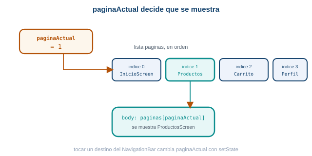
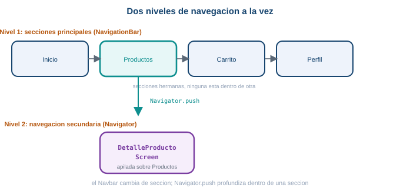
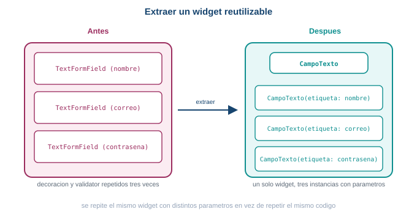

::: {.ficha}
|            |                                                        |
|------------|--------------------------------------------------------|
| Asignatura | Programación Móvil (IF2004)                             |
| Grupos     | 601 y 602 de Ingeniería Informática                     |
| Unidad     | Unidad 2. Interfaz, datos y persistencia                |
:::

## Lo que vas a lograr

En la Semana 5 aprendiste a navegar entre pantallas con `Navigator.push` y `Navigator.pop`, primero
en MiniMarket y después en `taller_login`. Esta semana arranca convirtiendo MiniMarket en una app
con varias secciones principales (Inicio, Productos, Carrito, Perfil) manejadas con una barra de
navegación inferior. Después vuelves a `taller_login` para cerrar dos cosas pendientes de ese
formulario: que valide de verdad lo que el usuario escribe, y que deje de repetir el mismo código de
campo tres veces.

Al terminar la guía sabes:

1. Distinguir navegación entre secciones principales (barra inferior) de navegación hacia un
   detalle (`Navigator.push`).
2. Construir una barra de navegación inferior con `NavigationBar` y un índice de sección.
3. Combinar `NavigationBar` y `Navigator.push` en la misma app, cada uno en su propio nivel.
4. Envolver un formulario en `Form` y validar sus campos con `GlobalKey<FormState>`.
5. Escribir funciones `validator` para correo y contraseña, y bloquear la navegación si el
   formulario no es válido.
6. Extraer un widget reutilizable a partir de código duplicado, exponiendo los parámetros
   necesarios.
7. Decidir cuándo conviene extraer un widget y cuándo no vale la pena todavía.

::: {.callout-note}
## Antes de empezar

Necesitas MiniMarket de la Semana 5 funcionando (listado de productos y detalle con
`Navigator.push`) y `taller_login` con login, inicio, rutas con nombre, paso de datos y navegación
anidada. Todo lo de esta guía continúa esos dos proyectos.

Esta guía usa Flutter 3.41.9 (canal stable) y Dart SDK 3.11.5, las mismas versiones verificadas
desde la Semana 2.
:::

## Parte 1. Dos tipos de navegación

Hasta ahora, toda la navegación de MiniMarket fue de un tipo: de `ProductosScreen` hacia
`DetalleProductoScreen`, con `Navigator.push`. Tiene sentido usar `push` ahí porque el detalle está
conceptualmente "dentro" de productos: se profundiza en un producto concreto.

Pero una app real casi siempre tiene también secciones principales que no están una dentro de la
otra. MiniMarket va a crecer con cuatro: Inicio, Productos, Carrito y Perfil. Ninguna de esas
secciones está dentro de otra, son secciones hermanas. Para eso una barra de navegación inferior
tiene más sentido que apilar pantallas con `Navigator.push`.

## Parte 2. NavigationBar y un índice de sección

Flutter tiene un componente moderno para esto, `NavigationBar` (Material 3). Evita mezclarlo con
`BottomNavigationBar`, que es el componente anterior: en esta guía usas solo `NavigationBar`.

La idea central es una variable que indica qué sección está activa en este momento:

```dart
int paginaActual = 0; // 0 = Inicio, 1 = Productos, 2 = Carrito, 3 = Perfil
```

Como esta variable cambia con la interacción del usuario y eso afecta lo que se ve en pantalla, la
pantalla que la contiene debe ser un `StatefulWidget`, el mismo mecanismo que ya conoces de
`setState`.

## Parte 3. Pantallas nuevas, mínimas

Necesitas una pantalla por sección. `ProductosScreen` ya existe, tal cual la dejaste en la Semana 5:
se reutiliza sin cambios. Las otras tres son, por ahora, marcadores de posición simples:

```dart
class InicioScreen extends StatelessWidget {
  const InicioScreen({super.key});

  @override
  Widget build(BuildContext context) {
    return const Center(
      child: Text('Inicio', style: TextStyle(fontSize: 24)),
    );
  }
}

class CarritoScreen extends StatelessWidget {
  const CarritoScreen({super.key});

  @override
  Widget build(BuildContext context) {
    return const Center(
      child: Text('Carrito', style: TextStyle(fontSize: 24)),
    );
  }
}

class PerfilScreen extends StatelessWidget {
  const PerfilScreen({super.key});

  @override
  Widget build(BuildContext context) {
    return const Center(
      child: Text('Perfil', style: TextStyle(fontSize: 24)),
    );
  }
}
```

Las mejoras a `InicioScreen` y `PerfilScreen` llegan en la Parte 7.

## Parte 4. PrincipalScreen: un StatefulWidget con paginaActual

`PrincipalScreen` es la pantalla contenedora, la que Flutter muestra como `home` de la app. Guarda
`paginaActual` y una lista `paginas` con una pantalla por índice, en el mismo orden que vas a usar
en la barra:

```dart
class PrincipalScreen extends StatefulWidget {
  const PrincipalScreen({super.key});

  @override
  State<PrincipalScreen> createState() => _PrincipalScreenState();
}

class _PrincipalScreenState extends State<PrincipalScreen> {
  int paginaActual = 0;

  final paginas = [
    const InicioScreen(),
    const ProductosScreen(),
    const CarritoScreen(),
    const PerfilScreen(),
  ];

  @override
  Widget build(BuildContext context) {
    return Scaffold(
      appBar: AppBar(title: const Text('MiniMarket')),
      body: paginas[paginaActual],
    );
  }
}
```

::: {.diagrama}
{fig-alt="Mapeo de indice a pagina: paginaActual vale 1, la lista paginas tiene a InicioScreen en el indice 0, ProductosScreen en el indice 1, CarritoScreen en el indice 2 y PerfilScreen en el indice 3, y el body del Scaffold muestra paginas en el indice actual, que es ProductosScreen"}

El body del Scaffold muestra siempre paginas en la posicion paginaActual.
:::

Nota que **todavía no usas `IndexedStack`**: `body: paginas[paginaActual]` alcanza y es
conceptualmente transparente, muestra directamente la pantalla del índice actual. `IndexedStack`
resuelve un problema distinto (que el estado de una sección se pierda al salir de ella), y ya lo
usaste en la Semana 5 con `taller_login` (Parte 14, `BottomNavigationBar` + `IndexedStack`) para las
pestañas Inicio y Cuenta dentro de una sola pantalla. Aquí no hace falta todavía: cada sección de
MiniMarket es una pantalla completa, sin estado propio que conservar al cambiar de sección.

## Parte 5. Construir el NavigationBar

Agrega la barra en `bottomNavigationBar` del `Scaffold`:

```dart
bottomNavigationBar: NavigationBar(
  selectedIndex: paginaActual,
  destinations: const [
    NavigationDestination(icon: Icon(Icons.home_outlined), selectedIcon: Icon(Icons.home), label: 'Inicio'),
    NavigationDestination(icon: Icon(Icons.shopping_bag_outlined), selectedIcon: Icon(Icons.shopping_bag), label: 'Productos'),
    NavigationDestination(icon: Icon(Icons.shopping_cart_outlined), selectedIcon: Icon(Icons.shopping_cart), label: 'Carrito'),
    NavigationDestination(icon: Icon(Icons.person_outline), selectedIcon: Icon(Icons.person), label: 'Perfil'),
  ],
)
```

Con esto la barra ya se ve, con "Productos" marcado porque `selectedIndex: paginaActual` vale 0 por
ahora, pero tocar un destino todavía no hace nada: falta conectar el toque con un cambio de estado.
Agrega `onDestinationSelected`:

```dart
bottomNavigationBar: NavigationBar(
  selectedIndex: paginaActual,
  onDestinationSelected: (index) {
    setState(() {
      paginaActual = index;
    });
  },
  destinations: const [
    NavigationDestination(icon: Icon(Icons.home_outlined), selectedIcon: Icon(Icons.home), label: 'Inicio'),
    NavigationDestination(icon: Icon(Icons.shopping_bag_outlined), selectedIcon: Icon(Icons.shopping_bag), label: 'Productos'),
    NavigationDestination(icon: Icon(Icons.shopping_cart_outlined), selectedIcon: Icon(Icons.shopping_cart), label: 'Carrito'),
    NavigationDestination(icon: Icon(Icons.person_outline), selectedIcon: Icon(Icons.person), label: 'Perfil'),
  ],
),
```

El flujo completo, de principio a fin: el usuario toca "Productos", `onDestinationSelected` recibe
`index = 1`, llama a `setState`, `paginaActual` pasa a valer `1`, Flutter reconstruye el `build`, y
`body: paginas[paginaActual]` ahora apunta a `paginas[1]`, que es `ProductosScreen`.

| Parámetro de NavigationBar | Para qué sirve |
|---|---|
| `selectedIndex` | Cuál destino se ve marcado como activo |
| `destinations` | La lista de íconos y etiquetas, en el mismo orden que `paginas` |
| `onDestinationSelected` | Recibe el índice tocado; aquí solo actualiza `paginaActual` con `setState` |

::: {.callout-important}
## El orden importa

El orden de `destinations` en el `NavigationBar` debe coincidir exactamente con el orden de
`paginas` en `_PrincipalScreenState`. Si Productos es el índice 1 en una lista y el índice 2 en la
otra, tocar "Productos" en la barra muestra Carrito.
:::

## Parte 6. Navbar y Navigator conviviendo

Este es el concepto más importante de esta parte de la guía. Mientras el usuario está en la sección
Productos (navegación principal, nivel 1) y toca un producto de la lista, se abre el detalle con
`Navigator.push` (navegación secundaria, nivel 2, apilada encima de Productos). Son dos sistemas de
navegación distintos, funcionando a la vez, cada uno resolviendo un problema diferente.

::: {.diagrama}
{fig-alt="Dos niveles de navegacion conviviendo: una fila horizontal con las secciones principales Inicio, Productos, Carrito y Perfil manejadas por NavigationBar, y desde la seccion Productos una rama hacia abajo con Navigator.push hacia Detalle producto, que es navegacion secundaria"}

El Navbar cambia de seccion; Navigator.push profundiza dentro de una seccion.
:::

No necesitas cambiar nada en `ProductosScreen` para que esto funcione: el `onTap` que ya escribiste
en la Semana 5 sigue funcionando exactamente igual dentro de `PrincipalScreen`, porque
`Navigator.push` siempre apila sobre la pantalla actual, sin importar si esa pantalla llegó ahí por
un `NavigationBar` o por otro `push`.

## Parte 7. Mejorar Inicio y Perfil

Con el patrón funcionando, dale algo de contenido real a `InicioScreen` y `PerfilScreen`, sin
lógica funcional todavía:

```dart
class InicioScreen extends StatelessWidget {
  const InicioScreen({super.key});

  @override
  Widget build(BuildContext context) {
    return ListView(
      padding: const EdgeInsets.all(16),
      children: [
        const Text('Bienvenido', style: TextStyle(fontSize: 24, fontWeight: FontWeight.bold)),
        const SizedBox(height: 4),
        const Text('Encuentra tus productos favoritos', style: TextStyle(color: Colors.black54)),
        const SizedBox(height: 16),
        Card(
          child: ListTile(
            leading: const Icon(Icons.local_offer_outlined),
            title: const Text('Ofertas'),
          ),
        ),
        Card(
          child: ListTile(
            leading: const Icon(Icons.shopping_cart_outlined),
            title: const Text('Mi carrito'),
          ),
        ),
      ],
    );
  }
}
```

```dart
class PerfilScreen extends StatelessWidget {
  const PerfilScreen({super.key});

  @override
  Widget build(BuildContext context) {
    return ListView(
      padding: const EdgeInsets.all(16),
      children: [
        const CircleAvatar(radius: 40, child: Icon(Icons.person, size: 40)),
        const SizedBox(height: 12),
        const Center(
          child: Text('Nombre del cliente', style: TextStyle(fontSize: 18, fontWeight: FontWeight.bold)),
        ),
        const SizedBox(height: 16),
        const ListTile(leading: Icon(Icons.email_outlined), title: Text('correo@ejemplo.com')),
        const ListTile(leading: Icon(Icons.phone_outlined), title: Text('300 000 0000')),
      ],
    );
  }
}
```

::: {.callout-tip}
## Reto: agrega el carrito a la app

`CarritoScreen` sigue siendo un marcador de posición. Dale un contenido mínimo parecido a
`InicioScreen`: un título "Tu carrito" y una lista vacía con un texto "Todavía no agregaste
productos". No hace falta lógica real de compras todavía.
:::

Con `NavigationBar` y `Navigator.push` conviviendo, la navegación principal de tu app ya está
completa. Una app real casi siempre convive también con formularios que hay que validar: ahora
vuelves a `taller_login` para aplicar eso sobre el ejemplo de login que ya conoces.

## Parte 8. Validación con Form

Hasta la Semana 5, la única validación del login era un `if` manual que revisaba si el correo
estaba vacío. `Form` reemplaza ese mecanismo por uno declarado junto a cada campo, que además
muestra el mensaje de error debajo del campo que falló.

Envuelve el contenido del login en un `Form`, con una `GlobalKey<FormState>` que te permite invocar
la validación desde el botón:

```dart
class _LoginScreenState extends State<LoginScreen> {
  final _formKey = GlobalKey<FormState>();
  final _correoController = TextEditingController();
  final _claveController = TextEditingController();
  bool _mostrarClave = false;

  @override
  Widget build(BuildContext context) {
    return Scaffold(
      body: SafeArea(
        child: SingleChildScrollView(
          child: Form(
            key: _formKey,
            child: Column(
              // el resto de la Column sigue igual, con los TextField
              // reemplazados por TextFormField en el siguiente paso
            ),
          ),
        ),
      ),
    );
  }
}
```

| Pieza nueva | Para qué sirve |
|---|---|
| `GlobalKey<FormState>` | Una llave que identifica a este `Form` para poder llamar a sus métodos desde fuera del `build`, como `validate()` |
| `Form.key` | Conecta la llave con este `Form` específico |
| `Form.child` | El árbol de widgets del formulario, casi siempre una `Column` con los campos |

Reemplaza cada `TextField` por un `TextFormField`, que agrega el parámetro `validator`:

```dart
TextFormField(
  controller: _correoController,
  decoration: const InputDecoration(
    hintText: 'nombre@correo.com',
    prefixIcon: Icon(Icons.email_outlined),
    border: OutlineInputBorder(),
  ),
  validator: (valor) {
    if (valor == null || valor.isEmpty) {
      return 'Escribe tu correo';
    }
    if (!valor.contains('@') || !valor.contains('.')) {
      return 'El correo no tiene un formato válido';
    }
    return null;
  },
)
```

```dart
TextFormField(
  controller: _claveController,
  obscureText: !_mostrarClave,
  decoration: InputDecoration(
    prefixIcon: const Icon(Icons.lock_outline),
    border: const OutlineInputBorder(),
    suffixIcon: IconButton(
      icon: Icon(_mostrarClave ? Icons.visibility_off_outlined : Icons.visibility_outlined),
      onPressed: () {
        setState(() {
          _mostrarClave = !_mostrarClave;
        });
      },
    ),
  ),
  validator: (valor) {
    if (valor == null || valor.isEmpty) {
      return 'Escribe tu contraseña';
    }
    if (valor.length < 6) {
      return 'La contraseña necesita al menos 6 caracteres';
    }
    return null;
  },
)
```

| Pieza de `validator` | Para qué sirve |
|---|---|
| El parámetro `valor` | El texto actual del campo, `String?` porque puede llegar `null` |
| El valor de retorno `null` | Significa "sin error": el campo es válido |
| El valor de retorno `String` | El mensaje de error que se muestra debajo del campo |

Por último, la validación real ocurre al tocar "Iniciar sesión", antes de navegar:

```dart
onPressed: () async {
  if (!_formKey.currentState!.validate()) {
    return;
  }
  final resultado = await Navigator.pushNamed(
    context,
    '/inicio',
    arguments: ArgumentosInicio(correo: _correoController.text),
  );
  if (resultado == true) {
    _correoController.clear();
    _claveController.clear();
  }
},
```

`_formKey.currentState!.validate()` corre el `validator` de cada `TextFormField` del formulario, y
devuelve `true` solo si todos pasan. Si alguno falla, Flutter ya se encarga de mostrar el mensaje
de error debajo del campo correspondiente: no necesitas leerlos ni mostrarlos tú.

::: {.callout-tip}
## Reto: valida que las contraseñas coincidan

Agrega un segundo campo "Confirmar contraseña" al formulario, con su propio `TextFormField`, y haz
que su `validator` devuelva un error si su texto no coincide con el de `_claveController.text`.
:::

::: {.callout-note collapse="true"}
## Una solución posible

```dart
final _confirmarClaveController = TextEditingController();

TextFormField(
  controller: _confirmarClaveController,
  obscureText: true,
  decoration: const InputDecoration(
    labelText: 'Confirmar contraseña',
    border: OutlineInputBorder(),
  ),
  validator: (valor) {
    if (valor != _claveController.text) {
      return 'Las contraseñas no coinciden';
    }
    return null;
  },
)
```
:::

## Parte 9. Extraer un widget reutilizable: CampoTexto

Los tres `TextFormField` del formulario (correo, contraseña, confirmar contraseña) se parecen
mucho entre sí: cada uno repite `decoration`, `border` y la estructura general. Antes de extraer
nada, mira el tamaño de esa repetición.

::: {.diagrama}
{fig-alt="Antes y despues de extraer un widget reutilizable: antes, tres TextFormField casi identicos repetidos dentro del mismo build; despues, un solo widget CampoTexto reutilizado tres veces con parametros distintos"}

Se repite el widget con parámetros distintos, no el código completo.
:::

Extrae un widget `CampoTexto` que reciba lo que cambia entre los tres campos: la etiqueta, el
ícono, si es de contraseña, el `controller` y el `validator`.

```dart
class CampoTexto extends StatefulWidget {
  final String etiqueta;
  final IconData icono;
  final TextEditingController controller;
  final String? Function(String?)? validator;
  final bool esClave;

  const CampoTexto({
    super.key,
    required this.etiqueta,
    required this.icono,
    required this.controller,
    this.validator,
    this.esClave = false,
  });

  @override
  State<CampoTexto> createState() => _CampoTextoState();
}

class _CampoTextoState extends State<CampoTexto> {
  bool _mostrarTexto = false;

  @override
  Widget build(BuildContext context) {
    return TextFormField(
      controller: widget.controller,
      obscureText: widget.esClave && !_mostrarTexto,
      validator: widget.validator,
      decoration: InputDecoration(
        hintText: widget.etiqueta,
        prefixIcon: Icon(widget.icono),
        border: const OutlineInputBorder(),
        suffixIcon: widget.esClave
            ? IconButton(
                icon: Icon(_mostrarTexto
                    ? Icons.visibility_off_outlined
                    : Icons.visibility_outlined),
                onPressed: () {
                  setState(() {
                    _mostrarTexto = !_mostrarTexto;
                  });
                },
              )
            : null,
      ),
    );
  }
}
```

| Parámetro de `CampoTexto` | Para qué sirve |
|---|---|
| `etiqueta` | El texto de ayuda dentro del campo |
| `icono` | El ícono a la izquierda |
| `controller` | El `TextEditingController` que cada instancia del campo necesita, distinto para correo y para contraseña |
| `validator` | Se reenvía directo al `TextFormField` interno, cada instancia trae el suyo |
| `esClave` | Si es `true`, oculta el texto y agrega el ícono de mostrar/ocultar con su propio estado interno |

Nota que `CampoTexto` es `StatefulWidget`, aunque quien lo usa no vea ese estado desde afuera: el
booleano `_mostrarTexto` es un detalle interno del widget, y cada instancia (correo, contraseña)
mantiene el suyo propio sin interferir con las demás.

Con `CampoTexto` extraído, el formulario del login queda así:

```dart
CampoTexto(
  etiqueta: 'nombre@correo.com',
  icono: Icons.email_outlined,
  controller: _correoController,
  validator: (valor) {
    if (valor == null || valor.isEmpty) return 'Escribe tu correo';
    if (!valor.contains('@') || !valor.contains('.')) {
      return 'El correo no tiene un formato válido';
    }
    return null;
  },
),
const SizedBox(height: 16),
CampoTexto(
  etiqueta: 'Contraseña',
  icono: Icons.lock_outline,
  controller: _claveController,
  esClave: true,
  validator: (valor) {
    if (valor == null || valor.isEmpty) return 'Escribe tu contraseña';
    if (valor.length < 6) return 'La contraseña necesita al menos 6 caracteres';
    return null;
  },
),
```

Cada instancia recibe sus propios parámetros: el widget es el mismo, los datos cambian.

## Parte 10. Extraer un widget reutilizable: TarjetaProductor

En `_ContenidoInicio` de la Semana 05, el `itemBuilder` del `ListView.builder` construye un `Card`
con un `ListTile` en cada vuelta. Es el mismo problema que el formulario: la estructura se repite,
solo cambian los datos de `productor['nombre']` y `productor['ubicacion']`.

```dart
itemBuilder: (context, indice) {
  final productor = productores[indice];
  return Card(
    child: ListTile(
      leading: const Icon(Icons.storefront_outlined),
      title: Text(productor['nombre']!),
      subtitle: Text(productor['ubicacion']!),
    ),
  );
},
```

Extrae ese `Card` a un widget propio:

```dart
class TarjetaProductor extends StatelessWidget {
  final String nombre;
  final String ubicacion;

  const TarjetaProductor({
    super.key,
    required this.nombre,
    required this.ubicacion,
  });

  @override
  Widget build(BuildContext context) {
    return Card(
      child: ListTile(
        leading: const Icon(Icons.storefront_outlined),
        title: Text(nombre),
        subtitle: Text(ubicacion),
        trailing: const Icon(Icons.chevron_right),
      ),
    );
  }
}
```

El `ListView.builder` y la lista `productores` de la Semana 05 no cambian de forma: solo el
`itemBuilder` pasa a construir el widget nuevo en vez del `Card` completo:

```dart
Expanded(
  child: ListView.builder(
    itemCount: productores.length,
    itemBuilder: (context, indice) {
      final productor = productores[indice];
      return TarjetaProductor(
        nombre: productor['nombre']!,
        ubicacion: productor['ubicacion']!,
      );
    },
  ),
),
```

La variable `productores` sigue siendo la misma lista de mapas de la Semana 05: no se toca, no se
borra, solo cambia lo que el `itemBuilder` construye con cada elemento.

`TarjetaProductor` es `StatelessWidget`, a diferencia de `CampoTexto`: no necesita recordar nada
propio entre reconstrucciones, solo mostrar los datos que recibe.

::: {.callout-tip}
## Reto: extrae un tercer widget

Extrae un widget `EtiquetaCategoria` a partir de los `Chip` de categorías (Todos, Verduras, Frutas,
Lácteos) que aparecen en el diseño de referencia de la pantalla de inicio. Debe recibir el texto y
un color de fondo, y usarse al menos tres veces con datos distintos en una fila con `Wrap` (visto
en la Semana 4).
:::

::: {.callout-note collapse="true"}
## Una solución posible

```dart
class EtiquetaCategoria extends StatelessWidget {
  final String texto;
  final Color color;

  const EtiquetaCategoria({super.key, required this.texto, required this.color});

  @override
  Widget build(BuildContext context) {
    return Chip(
      label: Text(texto),
      backgroundColor: color,
    );
  }
}
```

```dart
Wrap(
  spacing: 8,
  children: const [
    EtiquetaCategoria(texto: 'Todos', color: Colors.green),
    EtiquetaCategoria(texto: 'Verduras', color: Colors.lightGreen),
    EtiquetaCategoria(texto: 'Frutas', color: Colors.orangeAccent),
    EtiquetaCategoria(texto: 'Lácteos', color: Colors.lightBlue),
  ],
)
```
:::

## Cuándo extraer un widget

No toda repetición justifica un widget nuevo. Dos señales prácticas te dicen cuándo sí conviene:

- **Se repite dos veces o más.** Un `Card` que aparece una sola vez en toda la app no necesita su
  propio widget: el costo de mantener un archivo adicional no se paga con un solo uso.
- **Mezcla demasiadas responsabilidades en un solo `build`.** Aunque no se repita, un `build` de
  200 líneas que arma la cabecera, el formulario y la lista de una pantalla completa se vuelve
  difícil de leer y de modificar. Extraer partes de ese `build` en widgets con nombre, aunque cada
  uno se use una sola vez, hace que el código cuente lo que hace cada bloque sin tener que leerlo
  entero.

Lo contrario también aplica: extraer un widget para dos líneas de código que nunca van a cambiar
por separado agrega una capa de indirección que no ayuda a nadie. La pregunta que responde si vale
la pena no es "¿puedo extraerlo?", sino "¿alguien va a necesitar reutilizar o entender esto por
separado del resto?".

::: {.callout-tip}
## Reto: refactoriza con criterio

Revisa el `build` completo de `InicioScreen` después de los cambios de esta guía. Identifica si
queda algún bloque que se beneficiaría de convertirse en un widget con nombre, aunque no se repita,
solo porque mezcla demasiadas responsabilidades. Justifica tu respuesta en una frase.
:::

## Errores frecuentes

::: {.error-caso}
[Error 1]{.etiqueta}

### El validator nunca se ejecuta

**Causa.** El `TextFormField` con el `validator` no está dentro del árbol de un `Form`, o el
`Form` que sí lo envuelve usa una `GlobalKey<FormState>` distinta de la que llama a `validate()`.

**Solución.** Confirma que todos los campos del formulario están dentro del mismo `Form`, y que el
botón llama a `_formKey.currentState!.validate()` usando exactamente la misma llave que el `Form`
declara en su parámetro `key`.
:::

::: {.error-caso}
[Error 2]{.etiqueta}

### Duplicate GlobalKey detected in widget tree

```text
Duplicate GlobalKey detected in widget tree.
```

**Causa.** Se creó una `GlobalKey<FormState>` nueva en cada reconstrucción del `build` (por ejemplo
como variable local dentro de `build` en vez de como campo de la clase `State`), o la misma llave
se usó en dos `Form` distintos.

**Solución.** Declara la `GlobalKey<FormState>` como campo de la clase `State`, inicializada una
sola vez con `final _formKey = GlobalKey<FormState>();`, nunca dentro del método `build`.
:::

::: {.error-caso}
[Error 3]{.etiqueta}

### El widget extraído no recibe los parámetros que necesita

**Causa.** Al extraer `CampoTexto` o `TarjetaProductor`, se olvidó exponer como parámetro algo que
una instancia necesita distinto de las demás, por ejemplo el `validator` o el ícono, y el widget
quedó con ese valor fijo adentro.

**Solución.** Antes de dar por terminada la extracción, revisa las instancias que vas a reemplazar
una por una y confirma qué cambia entre ellas. Todo lo que cambie entre instancias necesita ser un
parámetro del widget nuevo, aunque solo una instancia lo use distinto de las demás.
:::

## Tu entregable de la semana

::: {.callout-important}
## Seguimiento 02: navegación conectada, formulario validado y dos componentes reutilizables (10%)

**Con quién.** El mismo equipo de tres integrantes, sobre el mismo repositorio.

**Qué entrega el equipo**, sobre las pantallas maquetadas en la Semana 5:

- Navegación real conectada entre esas pantallas, con paso de datos entre al menos dos de ellas.
- El formulario principal del proyecto envuelto en `Form`, con `validator` en cada campo y
  bloqueo de la navegación si el formulario no es válido.
- Dos componentes reutilizables propios, extraídos de las pantallas del proyecto, cada uno usado
  al menos dos veces con datos distintos.

**Cómo entrega el equipo.** Enlace del repositorio compartido en el canal de actividades de Teams,
con al menos 4 commits propios por integrante y al menos una fusión revisada por otro integrante
(nadie fusiona su propio Pull Request).

**Cuándo.** Antes del inicio de la sesión de la Semana 7.

Detalle completo, rúbrica de 100 puntos y procedimiento de verificación en
`Movil/Semana-06/evaluacion/` (material del docente, no publicado en este sitio).
:::

## Lista de chequeo de la semana

::: {.checklist}
**Antes de entregar, revisa que tienes todo esto**

- [ ] MiniMarket tiene un `NavigationBar` con cuatro secciones y `Navigator.push` funcionando dentro de Productos
- [ ] El formulario principal de `taller_login` está envuelto en `Form` con `GlobalKey<FormState>`
- [ ] Cada campo tiene su `validator` y muestra un mensaje de error claro
- [ ] La navegación se bloquea si el formulario no es válido
- [ ] `CampoTexto` y `TarjetaProductor` existen como widgets propios, usados varias veces
- [ ] Puedes explicar en una frase cuándo conviene extraer un widget y cuándo no
- [ ] Las pantallas maquetadas en la Semana 5 en el proyecto de tu equipo ya navegan entre sí con datos reales
- [ ] El formulario principal del proyecto de tu equipo está validado con `Form`
- [ ] El proyecto de tu equipo tiene dos componentes reutilizables propios
- [ ] Los cambios están commiteados y subidos al repositorio del equipo, con la fusión revisada por otro integrante

:::

## Recursos

- Construir un formulario con validación: [docs.flutter.dev/cookbook/forms/validation](https://docs.flutter.dev/cookbook/forms/validation)
- `Form` y `FormState`: [api.flutter.dev/flutter/widgets/Form-class.html](https://api.flutter.dev/flutter/widgets/Form-class.html)
- Componer widgets propios: [docs.flutter.dev/ui/widgets-intro#composition](https://docs.flutter.dev/ui/widgets-intro)

::: {.pie-doc}
Programación Móvil (IF2004). Institución Universitaria de Envigado. Facultad de Ingenierías.
Semestre 2026-02.

**Transparencia.** La redacción de esta guía contó con el apoyo de inteligencia artificial,
usando el modelo Claude Opus 5 de Anthropic. Todo el contenido fue revisado y validado.
:::
