::: {.ficha}
|            |                                                        |
|------------|--------------------------------------------------------|
| Asignatura | Programación Móvil (IF2004)                             |
| Grupos     | 601 y 602 de Ingeniería Informática                     |
| Unidad     | Unidad 2. Interfaz, datos y persistencia                |
:::

::: {.acceso}
::: {.acceso-item}
Presentación interactiva de la sesión

[Abrir la presentación interactiva](presentacion-interactiva.html){.btn-doc target="_blank"}
:::
:::

## Lo que vas a lograr

Hasta la semana pasada, las pantallas de tu app mostraban datos escritos en el código. El catálogo de
Mercado Campesino Digital tiene que decir qué productos van bien con el clima de hoy, y el clima no
vive en tu app: vive en un servidor de internet. Esta semana aprendes a preguntarle a ese servidor,
a leer su respuesta y a mostrar en pantalla qué está pasando mientras esperas, cuando no llega nada
y cuando algo falla.

Esta guía va despacio y en pasos pequeños. Cada paso agrega una sola idea y funciona antes de pasar al
siguiente. Como la mitad de la semana depende de `StatefulWidget` y `setState`, una parte completa
(la Parte 3) los explica desde cero antes de usarlos.

Al terminar la guía puedes:

1. Explicar qué es una petición, una respuesta, una URL y un código de estado, y por qué una petición
   tarda.
2. Leer un texto JSON, convertirlo con `jsonDecode` y construir un objeto con `Producto.fromJson`.
3. Explicar qué es el estado de una pantalla, por qué un `StatelessWidget` no puede cambiarlo y qué
   hace `setState`.
4. Describir el ciclo de vida mínimo de un `State` (`initState`, `build`, `dispose`) y para qué sirve
   `mounted`.
5. Escribir funciones `async` con `await` y manejar errores con `try` y `catch`.
6. Hacer una petición `GET` con el paquete `http` y leer `statusCode` y `body`.
7. Mostrar los cuatro estados de una pantalla (cargando, listo, vacío y error) con un `enum`.
8. Poner un tiempo de espera, distinguir `TimeoutException` de `SocketException` y ofrecer un botón
   "Reintentar".
9. Armar la pantalla del catálogo de Mercado Campesino con el clima real de Envigado.

::: {.callout-note}
Los recuadros **Para memorizar** reúnen lo poco que conviene saber de memoria. Los recuadros **Para
razonar** reúnen lo que se deduce del mecanismo. Antes de abrir cada respuesta oculta, escribe tu
predicción.
:::

::: {.callout-note}
## Antes de empezar

Necesitas:

- Las semanas 5 y 6 vistas: navegación entre pantallas y formularios. Continúas con `taller_login`
  en la Parte 8, y antes practicas en un proyecto aparte.
- El entorno de Flutter funcionando desde la Semana 1, con un emulador de Android o un celular
  conectado, y conexión a internet.
- Flutter 3.41.9 (canal stable) y Dart SDK 3.11.5, las mismas versiones de las semanas anteriores.
  El paquete `http` se fija en la versión **1.6.0**, la que resolvió `flutter pub add http` al
  verificar esta guía.

**Dos proyectos.** En las Partes 3 a 7 practicas en un proyecto desechable. Créalo ahora:

```bash
flutter create practica_s07
cd practica_s07
flutter pub add http
```

En esas partes, cada ejemplo trae un `main.dart` completo: lo pegas encima del anterior. En la Parte 8
trabajas en `taller_login`, el proyecto de la Semana 5, y ahí sí agregas el catálogo paso a paso.

**De dónde vienen los datos.** El clima es real: viene de Open-Meteo (open-meteo.com), un servicio
gratuito que no pide llave. El catálogo de productos no tiene API todavía: el proyecto aún no tiene
servidor propio. Por eso la lista de productos es un texto JSON escrito dentro de la app, en una
función que espera dos segundos antes de devolverlo. Es un **servidor de mentira**, y la guía lo
dice cada vez que aparece.

**El modelo de datos.** La especificación del proyecto (`alcance.md`) no define los campos de un
producto. Esta guía define el mínimo: un `Producto` con `id`, `nombre`, `precio` y `disponible`.

**En qué ejecutar.** Todo el código de esta guía se ejecutó en un emulador de Android. Una parte usa
`dart:io`, que no existe en el navegador, así que no pruebes este código en Chrome.
:::

## Parte 1. Qué pasa cuando tu app habla con internet

### El problema real

El catálogo de Mercado Campesino Digital debe sugerir productos de temporada, y esa sugerencia
depende del clima de hoy en Envigado. Tu app no tiene ningún termómetro. Lo que sí puede hacer es
preguntarle a un servidor que sí sabe. Antes de escribir código, hay que entender qué significa
"preguntarle a un servidor".

**Predice primero.** Pulsas un botón que pide el clima a un servidor, y el servidor tarda 3 segundos
en contestar. Si no programas nada especial, ¿qué ve la persona durante esos 3 segundos?

::: {.callout-warning collapse="true"}
## Comprueba tu predicción

No ve nada distinto: la pantalla queda igual que antes. La persona no sabe si el toque funcionó, si la
app se rompió o si debe pulsar otra vez. Resolver ese silencio es el tema de toda la semana: mostrar
"cargando" mientras esperas, y también qué pasa cuando no llega nada o llega un error.
:::

### Modelo mental: pedir un tinto en la tienda

Piensa en una tienda de barrio. Tú llegas y pides un tinto. El tendero lo prepara y te lo entrega. Tú
no sabes cómo lo hace, solo sabes cómo pedirlo.

En internet pasa lo mismo, con otros nombres:

| En la tienda | En internet | Qué significa |
|---|---|---|
| Tú | **Cliente** | Quien pide. Aquí, tu app Flutter. |
| El tendero | **Servidor** | Quien responde. Aquí, el computador de Open-Meteo. |
| "Un tinto, por favor" | **Petición** (request) | El mensaje que envía el cliente. |
| El tinto, o "no hay" | **Respuesta** (response) | Lo que devuelve el servidor. |
| La carta de lo que se puede pedir | **API** | La lista de cosas que el servidor deja pedir y cómo pedirlas. |

Una **API REST** es una API a la que le pides con direcciones web y que responde con texto en un
formato conocido, casi siempre JSON (Parte 2). Esta semana usas una sola.

::: {.diagrama}
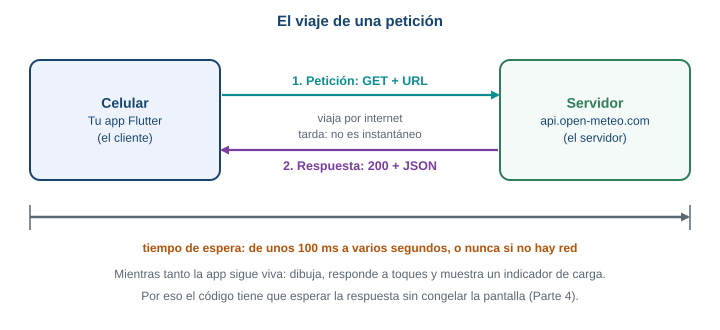{fig-alt="El celular envía una petición por internet al servidor y espera; el servidor devuelve una respuesta con un código de estado y un cuerpo JSON. Mientras espera, la app sigue dibujando"}

El viaje completo. La petición sale del celular, cruza internet, llega al servidor, y la respuesta
hace el camino de vuelta.
:::

### Por qué una petición tarda

Una petición cruza la red del celular, pasa por varios
equipos, llega a un servidor que puede estar ocupado, y la respuesta hace el mismo viaje de vuelta.
Puede tardar 100 milisegundos o varios segundos. Y puede no volver nunca: si el celular pierde la
señal a mitad de camino, nadie avisa. Por eso en el código de esta semana hay tres ideas que van
juntas: **esperar** la respuesta sin congelar la app, **mostrar** al usuario que se está esperando, y
**no esperar para siempre**.

### La URL: la dirección de lo que pides

Una petición necesita saber a quién y qué se pide. Eso lo dice la **URL**. Esta es la que usarás:

```text
https://api.open-meteo.com/v1/forecast?latitude=6.17&longitude=-75.58&current=temperature_2m,precipitation,weather_code
```

::: {.diagrama}
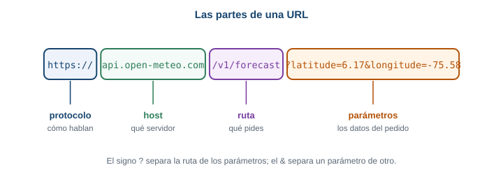{fig-alt="Anatomía de una URL: protocolo https, host api.open-meteo.com, ruta /v1/forecast y parámetros después del signo de interrogación"}

Las partes de una URL. Cada parte responde una pregunta distinta.
:::

| Parte | En el ejemplo | Para qué sirve |
|---|---|---|
| Protocolo | `https://` | Cómo hablan cliente y servidor. `https` cifra la conversación; `http` no. |
| Host | `api.open-meteo.com` | A qué servidor le pides. |
| Ruta | `/v1/forecast` | Qué recurso del servidor pides: aquí, el pronóstico. |
| Parámetros | `?latitude=6.17&longitude=-75.58&current=...` | Los detalles de tu pedido: dónde (Envigado) y qué datos (temperatura, lluvia y código del clima). |

El método más común para pedir datos se llama **GET**: significa "dame esto, no cambies nada". Es el
único método que usa esta guía.

### Los códigos de estado

Toda respuesta trae un **código de estado**: un número de tres cifras que resume cómo salió la
petición, antes de mirar los datos.

::: {.diagrama}
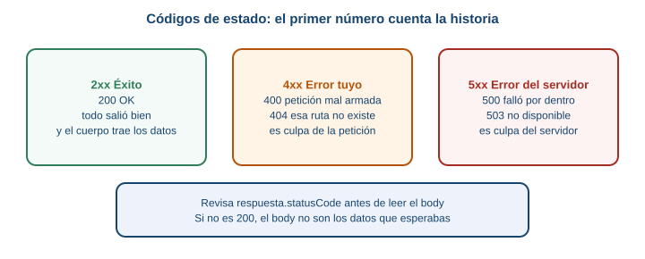{fig-alt="Códigos de estado HTTP: la familia 2xx significa todo bien, la 4xx significa que la petición tiene un problema, la 5xx significa que el servidor falló"}

La primera cifra cuenta la historia: 2 salió bien, 4 la petición tiene un problema, 5 el servidor
falló.
:::

Un `200` significa que todo salió bien. Un `404` significa que lo que pediste no existe. Un `500`
significa que el servidor falló por dentro.

### Haz esto ahora

No necesitas código para ver una respuesta real. Copia la URL de arriba y pégala en el navegador de tu
computador. Verás algo parecido a esto (los valores cambian con el clima, esta es la respuesta que
dio el servicio el 2 de octubre de 2026):

```json
{
  "latitude": 6.1511426,
  "longitude": -75.563934,
  "generationtime_ms": 4.514455795288086,
  "utc_offset_seconds": 0,
  "timezone": "GMT",
  "timezone_abbreviation": "GMT",
  "elevation": 1567.0,
  "current_units": {
    "time": "iso8601",
    "interval": 900,
    "temperature_2m": "°C",
    "precipitation": "mm",
    "weather_code": "wmo code"
  },
  "current": {
    "time": "2026-10-02T22:00",
    "interval": 900,
    "temperature_2m": 22.3,
    "precipitation": 0.0,
    "weather_code": 3
  }
}
```

El navegador muestra el texto en una sola línea; aquí está repartido en líneas para que se lea mejor.
Lo que te interesa está dentro de `current`: la temperatura en grados (`temperature_2m`), la lluvia en
milímetros (`precipitation`) y un código numérico del clima (`weather_code`), que esta semana no
usas. La hora viene en GMT, y Colombia está 5 horas atrás. El servicio actualiza `current` cada
15 minutos (`interval: 900` son 900 segundos).

Fíjate en que `latitude` no es exactamente 6.17: el servicio responde con el punto de su malla más
cercano al que pediste.

### Qué pasa si... la petición está mal

Cambia en la URL `latitude=6.17` por `latitude=999`. El servidor responde con código `400` y un texto
que explica el motivo:

```json
{"error":true,"reason":"Latitude must be in range of -90 to 90°. Given: 999.0."}
```

Cambia ahora la ruta `/v1/forecast` por `/v1/forecasto`. El código es `404`:

```json
{"error":true,"reason":"Not Found"}
```

Dos errores distintos, con el mismo formato de respuesta. Tu app tiene que mirar el código de estado
antes de creer que lo que llegó son los datos.

::: {.callout-important}
## Para memorizar

- **Cliente** pide, **servidor** responde. La petición y la respuesta viajan por internet.
- Una URL tiene protocolo, host, ruta y parámetros.
- El código `200` significa que salió bien. Los `4xx` son problema de la petición; los `5xx`, del servidor.
- Una petición puede tardar mucho, o no volver.
:::

::: {.callout-note}
## Para razonar, no para memorizar

Si el servidor responde `404`, ¿llegó una respuesta? Sí: la petición viajó, el servidor la entendió y
contestó "eso no existe". La conexión funcionó. Un fallo de conexión es distinto: ahí no llega ninguna
respuesta, ni siquiera un `404`. Esa diferencia vuelve en la Parte 7.
:::

::: {.callout-tip}
## Para pensar

Si cambias `latitude=6.17` por `latitude=40.4` (Madrid), la respuesta es otra. ¿Qué parte de la URL
dice "de dónde quiero el clima"? ¿Y qué pasaría con tu catálogo si el servidor devolviera siempre el
clima de Madrid?
:::

## Parte 2. JSON desde cero

### El problema real

La respuesta del clima llega como un texto largo. Tu pantalla necesita un número, la temperatura, y
otro número, la lluvia. Hay que pasar de texto a datos que Dart entienda. Ese formato de texto se llama
**JSON**.

**Predice primero.** `respuesta.body` contiene el texto que devolvió el servidor. ¿De qué tipo es en
Dart: `Map` o `String`?

::: {.callout-warning collapse="true"}
## Comprueba tu predicción

Es un `String`. Aunque se parezca a un mapa con llaves y dos puntos, Dart solo ve letras. No puedes
escribir `respuesta.body['current']`: primero hay que **decodificarlo**, es decir, leer el texto y
construir con él un `Map`.
:::

### Qué es JSON

JSON es un formato para escribir datos como texto, con unas pocas reglas:

- Un **objeto** va entre llaves `{ }` y tiene pares `"clave": valor`.
- Una **lista** va entre corchetes `[ ]` y tiene valores separados por comas.
- Un **valor** es un texto entre comillas dobles, un número, `true`, `false` o `null` (que significa
  "sin valor").

Dart tiene un equivalente para cada pieza:

| En JSON | En Dart |
|---|---|
| Objeto `{ ... }` | `Map<String, dynamic>` |
| Lista `[ ... ]` | `List<dynamic>` |
| Texto `"hola"` | `String` |
| Número `5500` o `22.3` | `int` o `double` |
| `true` o `false` | `bool` |
| `null` | `null` |

`dynamic` quiere decir "puede ser cualquier tipo": Dart no sabe de antemano qué hay en cada clave.

### Convertir el texto en un Map: `jsonDecode`

La función `jsonDecode` viene en `dart:convert`. Lee un texto JSON y devuelve el `Map` o la `List` que
representa.

```dart
import 'dart:convert';

void main() {
  const texto = '{"id": 4, "nombre": "Panela", "precio": 5500, "disponible": true}';

  final datos = jsonDecode(texto);
  print(datos['nombre']);   // Panela
  print(datos['precio']);   // 5500
}
```

Un `Map` se consulta con corchetes y la clave entre comillas: `datos['nombre']`. Si quieres
probarlo, pega el ejemplo en un archivo `bin/prueba.dart` de tu proyecto y ejecuta
`dart run bin/prueba.dart`.

### De Map a objeto: `Producto.fromJson`

Trabajar con `datos['nombre']` funciona, pero tiene un problema: si escribes `datos['nonbre']` con una
letra mal, Dart no se queja. Devuelve `null` y el error aparece más tarde, lejos del lugar donde lo
cometiste. Un **objeto** de una clase propia lo resuelve: sus campos tienen nombre y tipo, y el editor
te avisa si te equivocas.

::: {.diagrama}
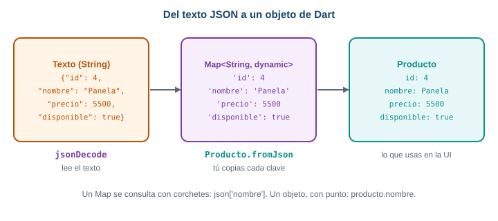{fig-alt="De texto JSON a objeto Dart: jsonDecode convierte el texto en un Map, y Producto.fromJson convierte el Map en un objeto Producto"}

Tres formas del mismo dato. `jsonDecode` hace el primer paso; `Producto.fromJson` lo escribes tú.
:::

Crea el archivo `lib/modelo.dart` en `practica_s07`. Es el único archivo extra que usará la guía.

```dart
class Producto {
  final int id;
  final String nombre;
  final int precio;
  final bool disponible;

  Producto({
    required this.id,
    required this.nombre,
    required this.precio,
    required this.disponible,
  });

  factory Producto.fromJson(Map<String, dynamic> json) {
    return Producto(
      id: json['id'],
      nombre: json['nombre'],
      precio: json['precio'],
      disponible: json['disponible'] ?? true,
    );
  }
}
```

Línea por línea:

- `final int id;` declara un campo que se asigna una vez y no cambia (`final`). Los cuatro campos son
  los datos mínimos de un producto.
- El constructor `Producto({ required this.id, ... })` crea el objeto. `required` obliga a pasar el
  valor.
- `factory Producto.fromJson(...)` es un constructor especial: un `factory` construye el objeto a
  partir de otra cosa, aquí un `Map`.
- `json['id']` devuelve un `dynamic`; Dart lo acepta como `int` porque ese campo es `int`, y comprueba
  el tipo cuando el programa corre.
- `json['disponible'] ?? true` se lee "usa `json['disponible']`, pero si es `null`, usa `true`".

### Valores que faltan o son null

Un servidor real a veces omite un campo. Qué hace tu código en ese caso es una decisión tuya. En
`Producto`, `disponible` tiene una respuesta razonable (si no dice nada, el producto está disponible),
y por eso lleva `?? true`. En cambio, un producto sin `precio` no tiene una respuesta razonable, y
conviene que el error aparezca de inmediato. Si el JSON no trae `precio`, el programa falla con:

```text
type 'Null' is not a subtype of type 'int'
```

Se lee así: "esperaba un `int` y llegó `null`". El mensaje dice qué tipo faltó, y por el contexto sabes
en qué campo.

Otro cuidado: los números. El servicio puede devolver `22.3` o `22`, y en JSON los dos son números,
pero en Dart `22` es un `int` y `22.3` es un `double`. Para no depender de eso, convierte con `num`
(el tipo del que heredan `int` y `double`):

```dart
class Clima {
  final double temperatura;
  final double lluvia;

  Clima({required this.temperatura, required this.lluvia});

  factory Clima.fromJson(Map<String, dynamic> json) {
    final actual = json['current'];
    return Clima(
      temperatura: (actual['temperature_2m'] as num).toDouble(),
      lluvia: (actual['precipitation'] as num).toDouble(),
    );
  }
}
```

Agrega `Clima` debajo de `Producto` en el mismo archivo. `actual` es el objeto `current` de la
respuesta. `as num` le dice a Dart "trátalo como número" y `.toDouble()` lo vuelve `double`.

### Compruébalo con una prueba

Para saber que el parseo funciona sin abrir el emulador, escribe `test/modelo_test.dart`:

```dart
import 'dart:convert';

import 'package:flutter_test/flutter_test.dart';
import 'package:practica_s07/modelo.dart';

void main() {
  test('Producto.fromJson lee los cuatro campos', () {
    final p = Producto.fromJson(
      jsonDecode('{"id":1,"nombre":"Panela","precio":5500,"disponible":false}'),
    );
    expect(p.nombre, 'Panela');
    expect(p.precio, 5500);
    expect(p.disponible, false);
  });

  test('si falta disponible, vale true', () {
    final p = Producto.fromJson(
      jsonDecode('{"id":1,"nombre":"Panela","precio":5500}'),
    );
    expect(p.disponible, true);
  });

  test('Clima.fromJson acepta enteros y decimales', () {
    final c = Clima.fromJson(
      jsonDecode('{"current":{"temperature_2m":20,"precipitation":0.0}}'),
    );
    expect(c.temperatura, 20.0);
  });
}
```

Ejecútala con `flutter test`. Las tres pasan. El nombre `practica_s07` en el `import` es el nombre de
tu proyecto; si lo llamaste distinto, cámbialo.

### Qué pasa si... llega una lista, o llega algo que no es JSON

Si el servidor responde con una **lista** y tú escribes `jsonDecode(texto) as Map`, Dart falla con:

```text
type 'List<dynamic>' is not a subtype of type 'Map<dynamic, dynamic>' in type cast
```

Y si el servidor responde con una página HTML en vez de JSON (pasa cuando una dirección está mal),
`jsonDecode` falla con una `FormatException`:

```text
FormatException: Unexpected character (at character 1)
<html>Not found</html>
^
```

El `^` marca dónde se atragantó el lector: en el primer carácter, porque un JSON no empieza con `<`.

::: {.callout-important}
## Para memorizar

- `jsonDecode(texto)` convierte un texto JSON en un `Map` o una `List`.
- `Producto.fromJson(mapa)` convierte un `Map` en un objeto propio.
- `json['clave'] ?? valor` pone un valor por defecto si falta la clave.
- Los números de JSON se leen como `num` y luego se pasan a `int` o `double`.
:::

::: {.callout-note}
## Para razonar, no para memorizar

¿Por qué `precio` no tiene `?? 0`? Porque un precio inventado sería peor que un error: el catálogo
mostraría "gratis" por una falla del servidor. Cuando decides si un campo lleva un valor por defecto,
pregúntate si el valor por defecto es una respuesta honesta o una forma de esconder el problema.
:::

## Parte 3. StatefulWidget desde cero

Esta parte es la base de las siguientes cuatro. En semanas anteriores usaste `StatefulWidget` y
`setState` siguiendo un modelo, y es normal que haya quedado la duda de por qué existen. Aquí se
explican desde cero, con un ejemplo mínimo. Tómate el tiempo: todo lo que sigue depende de esto.

### El problema real

La pantalla del catálogo pasa por varias caras: primero dice "cargando", cuando llegan los datos
muestra la lista, y si algo falla muestra un mensaje. La pantalla **cambia después de haber nacido**, y
nadie la reconstruye desde afuera. Necesitas un mecanismo para que una pantalla tenga datos que cambian
y se muestren al cambiar.

**Predice primero.** Un `StatelessWidget` declara `int cuenta = 0;` dentro de su `build`, muestra
`Text('Llevas $cuenta')` y tiene un botón que hace `cuenta = cuenta + 1`. Pulsas el botón 3 veces.
¿Qué lees en pantalla?

::: {.callout-warning collapse="true"}
## Comprueba tu predicción

Lees `Llevas 0`, siempre. Hay dos razones y las dos importan:

1. Nadie le pidió a Flutter que dibuje de nuevo. Cambiar una variable no repinta la pantalla.
2. Aunque `build` corriera otra vez, volvería a ejecutar `int cuenta = 0;` y el contador arrancaría de
   cero en cada construcción.

La Parte 3 resuelve las dos.
:::

### Qué es el "estado"

El **estado** es un dato que cambia mientras la pantalla está viva y que la pantalla debe reflejar. Dos
preguntas te ayudan a reconocerlo:

1. ¿Este dato puede cambiar mientras la persona usa la pantalla?
2. Si cambia, ¿la pantalla tiene que verse distinta?

Si las dos respuestas son sí, es estado. Ejemplos:

| Dato | ¿Es estado? | Por qué |
|---|---|---|
| El contador `cuenta` | Sí | Sube con cada toque y se ve en pantalla. |
| Si la lista está cargando o lista | Sí | Cambia cuando llega la respuesta y la pantalla cambia. |
| El título "Catálogo de temporada" | No | Nunca cambia. |
| El nombre de un producto que ya se mostró | No | Una vez dibujado, no cambia solo. |

### Una analogía: el menú impreso y la pizarra

En un restaurante hay dos formas de mostrar el menú del día.

- Un **menú impreso**. Si el tomate sube de precio, hay que imprimir otro menú. El menú viejo no se
  corrige solo.
- Una **pizarra**. Borras el precio y escribes el nuevo. La pizarra es la misma; lo escrito cambió.

::: {.diagrama}
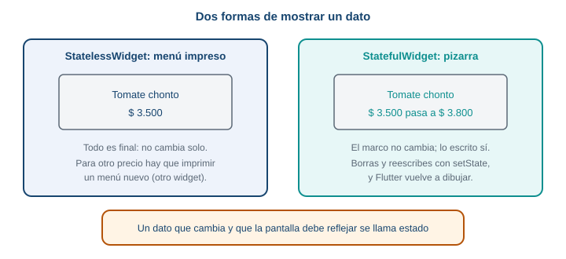{fig-alt="StatelessWidget es como un menú impreso: para cambiar un precio hay que imprimir otro. StatefulWidget es como una pizarra: se borra y se reescribe lo escrito sin cambiar la pizarra"}

Un `StatelessWidget` es el menú impreso. Un `StatefulWidget` es la pizarra.
:::

Un **`StatelessWidget`** es el menú impreso: describe lo que se ve a partir de los datos que recibió, y
si esos datos cambian, hay que construir un widget nuevo. Un **`StatefulWidget`** es la pizarra: tiene
un lugar donde guardar datos que cambian, y una forma de decir "borré y reescribí, vuelve a dibujar".

### Rompe esto: un contador con StatelessWidget

Pega esto en `lib/main.dart` de `practica_s07` y ejecuta la app:

```dart
import 'package:flutter/material.dart';

void main() => runApp(const MaterialApp(home: ContadorRoto()));

class ContadorRoto extends StatelessWidget {
  const ContadorRoto({super.key});

  @override
  Widget build(BuildContext context) {
    int cuenta = 0;
    return Scaffold(
      appBar: AppBar(title: const Text('Contador')),
      body: Center(
        child: Text('Llevas $cuenta', style: const TextStyle(fontSize: 32)),
      ),
      floatingActionButton: FloatingActionButton(
        onPressed: () {
          cuenta = cuenta + 1;
          debugPrint('cuenta vale $cuenta');
        },
        child: const Icon(Icons.add),
      ),
    );
  }
}
```

`debugPrint` escribe un mensaje en la consola de depuración (la pestaña Debug Console de VS Code, o la
terminal donde corre `flutter run`). Pulsa el botón varias veces. En la consola ves que `cuenta vale 1`,
luego `2`, luego `3`: la variable sí cambia. En pantalla sigue diciendo `Llevas 0`. El dato cambió y
la pantalla no se enteró, porque nada le dijo a Flutter que dibujara de nuevo.

### Por qué un StatelessWidget no puede cambiar solo

Un `StatelessWidget` solo tiene un método útil, `build`, que recibe el contexto y devuelve lo que se
ve. Sus campos son `final`: no se reasignan. No tiene ningún mecanismo para pedirle a Flutter "corre
`build` otra vez". Y si Flutter corre `build` por otra razón, todo lo que esté declarado dentro se
vuelve a crear desde cero. Un dato que cambia no puede vivir ahí.

### Las dos clases de un StatefulWidget

La solución es partir el widget en dos clases, cada una con un trabajo:

::: {.diagrama}
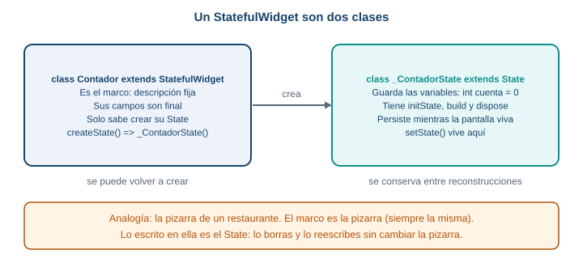{fig-alt="Un StatefulWidget son dos clases: el StatefulWidget, que es el marco fijo, y su State, donde viven las variables que cambian y el método build"}

Las dos clases. El marco se puede volver a crear; el `State` se conserva mientras la pantalla viva.
:::

- La clase **`StatefulWidget`** es el marco de la pizarra. Es fija: sus campos son `final`. Lo único
  importante que hace es crear su `State`.
- La clase **`State`** es lo escrito en la pizarra. Guarda las variables que cambian y tiene el método
  `build`. Flutter la conserva viva mientras la pantalla exista.

¿Por qué dos? Porque Flutter vuelve a crear los widgets con mucha frecuencia: son baratos y se
descartan. Si el contador viviera en el widget, se perdería cada vez que Flutter lo recrea. Al ponerlo
en el `State`, que Flutter conserva, el dato sobrevive.

Este es el mismo contador, ahora con las dos clases:

```dart
import 'package:flutter/material.dart';

void main() => runApp(const MaterialApp(home: Contador()));

class Contador extends StatefulWidget {
  const Contador({super.key});

  @override
  State<Contador> createState() => _ContadorState();
}

class _ContadorState extends State<Contador> {
  int cuenta = 0;

  @override
  Widget build(BuildContext context) {
    return Scaffold(
      appBar: AppBar(title: const Text('Contador')),
      body: Center(
        child: Text('Llevas $cuenta', style: const TextStyle(fontSize: 32)),
      ),
      floatingActionButton: FloatingActionButton(
        onPressed: () {
          setState(() {
            cuenta = cuenta + 1;
          });
        },
        child: const Icon(Icons.add),
      ),
    );
  }
}
```

Línea por línea:

- `class Contador extends StatefulWidget` es el marco. No tiene variables que cambien.
- `State<Contador> createState() => _ContadorState();` le dice a Flutter qué `State` le corresponde.
  Flutter lo llama una vez, cuando la pantalla nace.
- `class _ContadorState extends State<Contador>` es la clase donde viven los datos. El guion bajo
  `_` al comienzo del nombre lo hace privado de este archivo; es una convención de Dart que verás en
  todos los `State`.
- `int cuenta = 0;` es el estado. Está **fuera** de `build`, así que no se reinicia cada vez que `build`
  corre.
- `build` vive en el `State`. Es el mismo `build` de siempre.
- `setState(() { cuenta = cuenta + 1; })` cambia el dato y avisa a Flutter. Se explica a continuación.

### Qué hace `setState`

`setState` recibe una función. Hace tres cosas, en este orden:

1. Ejecuta esa función, que es donde cambias la variable.
2. Marca la pantalla como desactualizada: "lo que se ve ya no coincide con los datos".
3. Pide a Flutter que ejecute `build` otra vez.

`setState` no dibuja nada. Quien dibuja es `build`; `setState` solo pide que corra de nuevo.

::: {.diagrama}
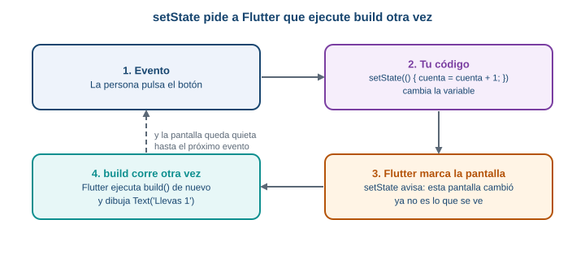{fig-alt="Ciclo de setState: el usuario toca el botón, onPressed cambia la variable dentro de setState, Flutter marca la pantalla para reconstruir, build se ejecuta de nuevo y la pantalla muestra el valor nuevo"}

El ciclo completo. Cada toque recorre las cuatro cajas y la pantalla queda quieta hasta el siguiente
evento.
:::

Con el contador funcionando, pulsa el botón: `Llevas 1`, `Llevas 2`, `Llevas 3`. Cada toque cambió la
variable, `setState` pidió reconstruir, `build` corrió con el valor nuevo.

**Recuerda:** cambias el dato dentro de `setState` y Flutter vuelve a correr `build`.

### Rompe esto otra vez: olvida `setState`

Quita `setState` y deja solo la línea que cambia la variable:

```dart
onPressed: () {
  cuenta = cuenta + 1;
  debugPrint('cuenta vale $cuenta');
},
```

Pulsa el botón. La consola dice `cuenta vale 1`, `2`, `3`. En pantalla sigue `Llevas 0`. Es el mismo
síntoma del `StatelessWidget`, y tiene la misma causa: la variable cambió y nadie pidió reconstruir.
Es el error más común con `setState`. Cuando una pantalla "no se actualiza" y la variable sí cambió
(lo puedes comprobar con `debugPrint`), lo primero que se revisa es si el cambio está dentro de
`setState`.

### El ciclo de vida mínimo

Un `State` nace, vive y muere. Flutter llama a tres métodos en esos momentos:

::: {.diagrama}
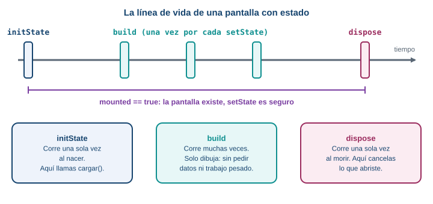{fig-alt="Línea de vida de un State: initState corre una vez al nacer, build corre cada vez que hay un cambio, y dispose corre una vez al morir. mounted es verdadero entre initState y dispose"}

La línea de vida. `initState` y `dispose` corren una vez; `build` corre muchas veces.
:::

| Método | Cuándo corre | Para qué lo usas |
|---|---|---|
| `initState` | Una vez, cuando el `State` nace | Arrancar cosas una sola vez. En esta guía: llamar a `cargar()` para pedir datos. |
| `build` | La primera vez y después de cada `setState` | Solo dibujar. Nada de pedir datos aquí. |
| `dispose` | Una vez, cuando el `State` muere | Soltar lo que abriste (más adelante en el curso: controladores, suscripciones). |

Se ve mejor ejecutándolo. Reemplaza `main.dart` con este archivo, que agrega una pantalla de inicio
con un botón para abrir el contador:

```dart
import 'package:flutter/material.dart';

void main() => runApp(const MaterialApp(home: Inicio()));

class Inicio extends StatelessWidget {
  const Inicio({super.key});

  @override
  Widget build(BuildContext context) {
    return Scaffold(
      appBar: AppBar(title: const Text('Inicio')),
      body: Center(
        child: ElevatedButton(
          onPressed: () {
            Navigator.push(
              context,
              MaterialPageRoute(builder: (context) => const Contador()),
            );
          },
          child: const Text('Abrir el contador'),
        ),
      ),
    );
  }
}

class Contador extends StatefulWidget {
  const Contador({super.key});

  @override
  State<Contador> createState() => _ContadorState();
}

class _ContadorState extends State<Contador> {
  int cuenta = 0;

  @override
  void initState() {
    super.initState();
    debugPrint('initState: la pantalla nació');
  }

  @override
  void dispose() {
    debugPrint('dispose: la pantalla murió');
    super.dispose();
  }

  @override
  Widget build(BuildContext context) {
    debugPrint('build: dibujando con cuenta = $cuenta');
    return Scaffold(
      appBar: AppBar(title: const Text('Contador')),
      body: Center(
        child: Text('Llevas $cuenta', style: const TextStyle(fontSize: 32)),
      ),
      floatingActionButton: FloatingActionButton(
        onPressed: () {
          setState(() {
            cuenta = cuenta + 1;
          });
        },
        child: const Icon(Icons.add),
      ),
    );
  }
}
```

Abre el contador, pulsa el botón de más dos veces y vuelve con la flecha de atrás. La consola muestra:

```text
initState: la pantalla nació
build: dibujando con cuenta = 0
build: dibujando con cuenta = 1
build: dibujando con cuenta = 2
dispose: la pantalla murió
```

`initState` corrió una vez, `build` corrió tres veces (una al nacer y una por cada `setState`) y
`dispose` corrió al volver atrás. Dos detalles: `super.initState()` va **primero** en `initState`, y
`super.dispose()` va **al final** de `dispose`. Así lo exige Flutter.

Por eso el trabajo de pedir datos no va en `build`. Como `build` corre en cada `setState`, un pedido
dentro de `build` se repetiría con cada cambio, y cada respuesta dispararía otro `setState`: un bucle.
Los pedidos van en `initState`, que corre una sola vez.

### `mounted`: ¿la pantalla sigue viva?

Hay un caso delicado. Pides datos con `await` (Parte 4) y mientras esperas, la persona sale de la
pantalla. Cuando la respuesta llega, tu código quiere llamar a `setState` en un `State` que ya murió.
Es como enviar la comida a una mesa que ya se fue del restaurante.

`mounted` es una propiedad del `State` que vale `true` entre `initState` y `dispose`, y `false` después.
Se revisa después de cada `await`, antes de tocar `setState`.

Para verlo, usa este archivo. Es la misma estructura de dos pantallas, con una pantalla `Lento` que
espera 3 segundos antes de llamar a `setState`, **sin** revisar `mounted`:

```dart
import 'package:flutter/material.dart';

void main() => runApp(const MaterialApp(home: Inicio()));

class Inicio extends StatelessWidget {
  const Inicio({super.key});

  @override
  Widget build(BuildContext context) {
    return Scaffold(
      appBar: AppBar(title: const Text('Inicio')),
      body: Center(
        child: ElevatedButton(
          onPressed: () {
            Navigator.push(
              context,
              MaterialPageRoute(builder: (context) => const Lento()),
            );
          },
          child: const Text('Abrir la pantalla lenta'),
        ),
      ),
    );
  }
}

class Lento extends StatefulWidget {
  const Lento({super.key});

  @override
  State<Lento> createState() => _LentoState();
}

class _LentoState extends State<Lento> {
  String mensaje = 'Pulsa el botón y sal enseguida';

  Future<void> esperar() async {
    await Future.delayed(const Duration(seconds: 3));
    // if (!mounted) return;
    setState(() {
      mensaje = 'Ya pasaron 3 segundos';
    });
  }

  @override
  Widget build(BuildContext context) {
    return Scaffold(
      appBar: AppBar(title: const Text('Pantalla lenta')),
      body: Center(child: Text(mensaje)),
      floatingActionButton: FloatingActionButton(
        onPressed: esperar,
        child: const Icon(Icons.timer),
      ),
    );
  }
}
```

(`Future.delayed` y `await` se explican en la Parte 4; por ahora léelo como "espera 3 segundos".)
Abre la pantalla lenta, pulsa el botón del reloj y vuelve atrás **antes** de que pasen los 3 segundos.
Cuando se cumplen, la consola muestra un error que empieza así:

```text
setState() called after dispose(): _LentoState#20759(lifecycle state: defunct, not mounted)
This error happens if you call setState() on a State object for a widget that no longer appears in
the widget tree (e.g., whose parent widget no longer includes the widget in its build). This error
can occur when code calls setState() from a timer or an animation callback.
```

El número después de `_LentoState#` cambia en cada ejecución. El mensaje dice lo que pasó:
`lifecycle state: defunct, not mounted` significa "este State ya murió". La solución es la línea que
está comentada. Quita las dos barras:

```dart
if (!mounted) return;
```

Se lee "si la pantalla ya no está montada, termina aquí". Con esa línea, la respuesta que llega tarde
se descarta en silencio. En el resto de la guía, **después de cada `await` y antes de cada
`setState` va un `if (!mounted) return;`**.

**Recuerda:** después de un `await`, revisa `mounted` antes de llamar a `setState`.

### Cuándo no hace falta un StatefulWidget

Si una pantalla no tiene datos que cambien, es un `StatelessWidget`. No conviertas todo en
`StatefulWidget` "por si acaso": un `StatefulWidget` es más código y más cosas que pueden salir mal.
La regla: nace como `StatelessWidget`, y pasa a `StatefulWidget` cuando aparece un dato que cambia y
que la pantalla debe reflejar.

::: {.callout-important}
## Para memorizar

- **Estado** es un dato que cambia y que la pantalla debe reflejar.
- Un `StatefulWidget` son dos clases: el widget (marco fijo) y su `State` (donde viven las variables).
- `setState(() { ... })` cambia el dato y pide a Flutter que corra `build` otra vez.
- `initState` corre una vez al nacer, `build` corre en cada cambio, `dispose` corre una vez al morir.
- Después de un `await`, `if (!mounted) return;` antes de `setState`.
:::

::: {.callout-note}
## Para razonar, no para memorizar

Si el contador está en el `State` y no en el widget, ¿qué pasaría si estuviera en el widget? Los
campos del widget son `final` (no se reasignan). Y aunque no lo fueran, Flutter recrea los widgets con
frecuencia, y el dato se perdería en cada recreación. El `State` existe porque algo tiene que
sobrevivir a esas recreaciones: es un lugar estable para guardar lo que cambia.
:::

::: {.callout-tip}
## Para pensar

En el ejemplo de la línea de vida, `build` corrió tres veces. Si dentro de `build` hubiera una línea que
pidiera datos a un servidor, ¿cuántas peticiones saldrían en ese recorrido? ¿Y cuántas habría si el
pedido estuviera en `initState`?
:::

## Parte 4. Asincronía mínima en Dart

### El problema real

Pedir datos a un servidor tarda (Parte 1). Si tu código se quedara quieto esperando, la app entera se
congelaría: nada se dibujaría, ningún toque respondería. Dart resuelve esto con un tipo de función que
puede esperar sin bloquear nada.

**Predice primero.** Tu función `pedir()` espera 2 segundos antes de continuar. Durante esos 2
segundos, ¿puedes seguir tocando y desplazando la pantalla?

::: {.callout-warning collapse="true"}
## Comprueba tu predicción

Sí. `await` detiene a la función `pedir()` en esa línea, pero no a la app: Flutter sigue dibujando y
atendiendo toques. Es el mismo mecanismo que permite mostrar el indicador de carga mientras llega la
respuesta.
:::

### Modelo mental: el número de pedido

Pides un almuerzo en un restaurante. Te dan un número de pedido y te sientas. No te quedas parado en el
mostrador: sigues en tu mesa, hablas, miras el celular. Cuando tu número está listo, vas por la comida.

- El número de pedido es un **`Future`**: la promesa de un valor que llegará más adelante.
- Quedarte en tu mesa es **`await`**: esperar ese valor sin bloquear lo demás.
- Marcar la función como **`async`** es avisarle a Dart que adentro habrá esperas.

::: {.diagrama}
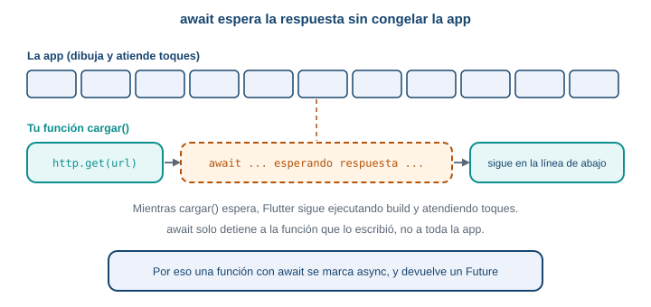{fig-alt="Con await el código espera la respuesta, pero la app sigue dibujando. Cuando llega la respuesta, el código continúa en la línea siguiente"}

`await` solo detiene a la función que lo escribió, no a toda la app.
:::

### Tu primera función async

Reemplaza `main.dart`:

```dart
import 'package:flutter/material.dart';

void main() => runApp(const MaterialApp(home: PruebaAsync()));

Future<String> pedirSaludo() async {
  await Future.delayed(const Duration(seconds: 2));
  return 'Hola desde el servidor';
}

class PruebaAsync extends StatefulWidget {
  const PruebaAsync({super.key});

  @override
  State<PruebaAsync> createState() => _PruebaAsyncState();
}

class _PruebaAsyncState extends State<PruebaAsync> {
  String mensaje = 'Pulsa el botón';

  Future<void> pedir() async {
    setState(() {
      mensaje = 'Esperando...';
    });
    final saludo = await pedirSaludo();
    if (!mounted) return;
    setState(() {
      mensaje = saludo;
    });
  }

  @override
  Widget build(BuildContext context) {
    return Scaffold(
      appBar: AppBar(title: const Text('Async')),
      body: Center(child: Text(mensaje, style: const TextStyle(fontSize: 22))),
      floatingActionButton: FloatingActionButton(
        onPressed: pedir,
        child: const Icon(Icons.cloud_download),
      ),
    );
  }
}
```

Línea por línea:

- `Future<String> pedirSaludo() async` es una función que **promete** un `String`. Por eso el tipo de
  retorno es `Future<String>` y no `String`.
- `await Future.delayed(const Duration(seconds: 2))` espera 2 segundos. `Future.delayed` es una forma
  de simular un servidor lento; sirve para practicar sin internet. Se usa de nuevo en la Parte 6 para
  el servidor de mentira.
- `return 'Hola desde el servidor'` entrega el valor prometido. La función es `async`, así que lo que
  se devuelve queda envuelto en el `Future`.
- `Future<void> pedir() async` es un método del `State`. `void` dentro del `Future` significa "no
  devuelve ningún valor".
- `final saludo = await pedirSaludo();` espera el valor y lo guarda en `saludo`, ya como `String`.
  Sin `await`, `saludo` sería un `Future<String>`.
- `onPressed: pedir` pasa la función sin paréntesis. Con paréntesis (`pedir()`) la ejecutarías al
  construir el botón, no al tocarlo.

Pulsa el botón: aparece `Esperando...`, y 2 segundos después, `Hola desde el servidor`. Durante la
espera puedes seguir tocando la pantalla.

**Recuerda:** después de un `await`, `if (!mounted) return;` antes de `setState`.

### Por qué `build` no puede ser async

Podrías pensar: "si pedir datos es asíncrono, hago `build` asíncrono". No se puede, y el editor lo dice:

```dart
@override
Widget build(BuildContext context) async {   // no compila
  return const Text('x');
}
```

```text
Functions marked 'async' must have a return type which is a supertype of 'Future'.
```

`build` tiene que devolver un `Widget` ahora mismo, porque Flutter lo necesita para dibujar. Una
función `async` devuelve un `Future<Widget>`, y Flutter no sabe qué hacer con eso. La solución es el
patrón que ya usaste: `build` solo dibuja a partir del estado actual, y el trabajo asíncrono vive en
otro método (`pedir`, y más adelante `cargar`) que se llama desde `initState` o desde un botón y que
termina en un `setState`.

### Qué pasa si... olvidas el `await`

```dart
final respuesta = http.get(Uri.parse('https://api.open-meteo.com/v1/forecast'));
print(respuesta.statusCode);
```

El analizador marca:

```text
The getter 'statusCode' isn't defined for the type 'Future<Response>'.
```

`respuesta` es un `Future<Response>`: el número de pedido, no la comida. Falta el `await`.

### `try` y `catch`: cuando la espera termina mal

Una función asíncrona puede terminar con un error en vez de un valor: el servidor no contesta, no hay
red. Si no lo manejas, el error queda sin atender y, en una pantalla, la app se queda esperando. `try` y
`catch` lo atrapan.

Cambia `pedirSaludo` para que falle, y `pedir` para que lo maneje:

```dart
Future<String> pedirSaludo() async {
  await Future.delayed(const Duration(seconds: 2));
  throw Exception('Servidor caído');
}
```

```dart
Future<void> pedir() async {
  setState(() {
    mensaje = 'Esperando...';
  });
  try {
    final saludo = await pedirSaludo();
    if (!mounted) return;
    setState(() {
      mensaje = saludo;
    });
  } catch (e) {
    if (!mounted) return;
    setState(() {
      mensaje = 'Falló: $e';
    });
  }
}
```

`throw Exception('...')` lanza un error a propósito. Dentro del `try`, si algo lanza un error, Dart salta
al `catch` y la variable `e` trae el error. Al pulsar el botón, a los 2 segundos aparece
`Falló: Exception: Servidor caído`. En la Parte 7 vas a atrapar tipos de error concretos con `on`.

::: {.callout-note}
Existe otra forma de mostrar datos que llegan tarde: `FutureBuilder`, un widget que escucha un `Future`
y reconstruye cuando termina. Esta guía no lo usa. Con `StatefulWidget` y `setState` ves cada paso, y
eso es lo que importa por ahora.
:::

::: {.callout-important}
## Para memorizar

- Una función que espera se marca `async` y devuelve un `Future<...>`.
- `await` espera el valor sin congelar la app, y solo dentro de funciones `async`.
- `build` no puede ser `async`: el trabajo asíncrono va en otro método.
- `try { ... } catch (e) { ... }` atrapa los errores de lo que esperas.
:::

::: {.callout-note}
## Para razonar, no para memorizar

Si `await` detiene la función, ¿cómo es posible que la app siga viva? Porque `await` no se queda
girando en un ciclo: le dice a Dart "sigue con otras cosas y vuelve aquí cuando el valor llegue". La
función queda en pausa; el resto de la app, no.
:::

## Parte 5. Tu primera petición con `http`

### El problema real

Ya sabes esperar. Falta la petición de verdad: pedirle a Open-Meteo el clima de Envigado y ver qué
responde.

**Predice primero.** Sin conexión a internet y sin `try`/`catch`, pulsas el botón que lanza la
petición. ¿Qué ves en pantalla?

::: {.callout-warning collapse="true"}
## Comprueba tu predicción

Nada cambia. La petición falla antes del `setState`, así que el texto de la pantalla queda como
estaba, y en la consola aparece un error sin atender (`Unhandled Exception`) con el texto de la
excepción. Es el mismo silencio de la Parte 1, ahora causado por un fallo. En la Parte 7 se arregla.
:::

### El paquete `http`

Dart no trae una forma cómoda de hacer peticiones web. Un **paquete** es código ya escrito que agregas
a tu proyecto. Para pedir datos usarás `http`, el paquete oficial del equipo de Dart. Ya lo agregaste
con `flutter pub add http`; eso modificó `pubspec.yaml`:

```yaml
dependencies:
  flutter:
    sdk: flutter
  http: ^1.6.0
```

`^1.6.0` significa "la versión 1.6.0 o una posterior compatible". Si el comando no fue a ningún lado,
ejecútalo de nuevo o escribe la línea a mano y corre `flutter pub get`. Para usar el paquete, lo
importas con un nombre corto:

```dart
import 'package:http/http.dart' as http;
```

`as http` permite escribir `http.get(...)` y deja claro de dónde viene cada función.

### La petición, línea por línea

Reemplaza `main.dart`:

```dart
import 'package:flutter/material.dart';
import 'package:http/http.dart' as http;

void main() => runApp(const MaterialApp(home: PruebaHttp()));

class PruebaHttp extends StatefulWidget {
  const PruebaHttp({super.key});

  @override
  State<PruebaHttp> createState() => _PruebaHttpState();
}

class _PruebaHttpState extends State<PruebaHttp> {
  String texto = 'Pulsa el botón';

  Future<void> pedir() async {
    final url = Uri.parse(
      'https://api.open-meteo.com/v1/forecast'
      '?latitude=6.17&longitude=-75.58'
      '&current=temperature_2m,precipitation,weather_code',
    );
    final respuesta = await http.get(url);
    debugPrint('código: ${respuesta.statusCode}');
    debugPrint('cuerpo: ${respuesta.body}');
    if (!mounted) return;
    setState(() {
      texto = 'Código ${respuesta.statusCode}\n${respuesta.body.length} caracteres';
    });
  }

  @override
  Widget build(BuildContext context) {
    return Scaffold(
      appBar: AppBar(title: const Text('Primera petición')),
      body: Center(child: Text(texto, style: const TextStyle(fontSize: 22))),
      floatingActionButton: FloatingActionButton(
        onPressed: pedir,
        child: const Icon(Icons.cloud_download),
      ),
    );
  }
}
```

- `Uri.parse('...')` convierte el texto de la URL en un objeto `Uri`. `http.get` no acepta un
  `String`: pide un `Uri`.
- Las tres cadenas seguidas dentro de `Uri.parse(...)` se pegan en una sola. Es solo una forma de
  partir una URL larga en líneas.
- `await http.get(url)` envía la petición `GET` y espera la respuesta. El resultado es un objeto
  `Response`.
- `respuesta.statusCode` es el código de estado (Parte 1), un `int`.
- `respuesta.body` es el cuerpo de la respuesta, un `String` con el texto JSON.
- `if (!mounted) return;` va después del `await`, por lo que ya sabes (Parte 3).

Ejecuta, pulsa el botón y mira la consola. Con conexión, el código es `200`, el cuerpo es el JSON de la
Parte 1 y la pantalla dice `Código 200` y cerca de 411 caracteres (el número exacto cambia un poco con
los decimales de cada medición).

### El permiso de internet en Android

Android no deja que una app use la red sin pedirlo. El permiso se llama `INTERNET` y se declara en un
archivo del proyecto: `android/app/src/main/AndroidManifest.xml`. Ábrelo y agrega la línea
`uses-permission` como primer hijo de `<manifest>`, antes de `<application>`:

```xml
<manifest xmlns:android="http://schemas.android.com/apk/res/android">
    <uses-permission android:name="android.permission.INTERNET"/>
    <application
        android:label="practica_s07"
```

Una sorpresa: la plantilla de `flutter create` ya incluye el permiso, pero **solo** en los manifiestos
de depuración y de perfil (`android/app/src/debug/AndroidManifest.xml` y `.../profile/...`), no en el
principal. Por eso tus pruebas en el emulador funcionan sin que lo hayas escrito, y la app instalada
desde un APK de producción, que usa el manifiesto principal, falla sin avisar durante el desarrollo.
Agrégalo al principal desde el primer día.

Para ver qué pasa sin el permiso, se probó esta guía quitándolo de todos los manifiestos. La petición
a una dirección que sí existe falla así:

```text
ClientException with SocketException: Failed host lookup: 'api.open-meteo.com'
(OS Error: No address associated with hostname, errno = 7), uri=https://api.open-meteo.com/...
```

El mensaje parece un problema de DNS, no de permisos. Si ves un `Failed host lookup` con internet
funcionando, revisa el manifiesto. Después de editar el manifiesto, detén la app y vuelve a ejecutarla:
un hot reload no recarga los archivos de Android.

### `http://` frente a `https://`, y `localhost` frente a `10.0.2.2`

Dos detalles de direcciones que confunden con frecuencia.

**`https` frente a `http`.** `https` cifra la conversación; `http` va en texto plano, y cualquiera en
la misma red puede leerla. Usa siempre `https` con servidores públicos, como Open-Meteo. En la
prueba de esta guía, con Flutter 3.41.9 en un emulador con Android 16, una petición a un servidor local
con `http://` funcionó en modo debug. No cuentes con eso: Android y iOS bloquean el tráfico sin cifrar
por defecto en sus librerías propias, y no se probó un APK de producción. La regla práctica: `https`
siempre, y `http` solo para un servidor tuyo, local, mientras desarrollas.

**`localhost` frente a `10.0.2.2`.** Si algún día programas un servidor en tu computador y lo llamas
desde la app, la dirección `localhost` no sirve en el emulador. Dentro del emulador, `localhost` es el
propio emulador, que no tiene ningún servidor. Para llegar a tu computador el emulador de Android usa
la dirección especial `10.0.2.2`.

::: {.diagrama}
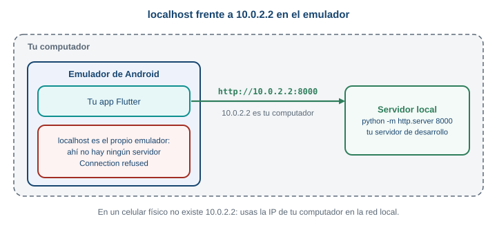{fig-alt="En el emulador de Android, localhost es el propio emulador, no tu computador. Para llegar al computador se usa 10.0.2.2"}

Desde el emulador, `10.0.2.2` es tu computador. `localhost` es el propio emulador.
:::

Prueba opcional, si tienes Python. En una carpeta con cualquier archivo, ejecuta
`python -m http.server 8000`, y pide `http://10.0.2.2:8000/` desde la app: responde `200`. Con
`http://localhost:8000/`, falla con:

```text
ClientException with SocketException: Connection refused (OS Error: Connection refused, errno = 111),
address = localhost, port = 33518, uri=http://localhost:8000/
```

`Connection refused` significa que alguien contestó "aquí no hay nada escuchando", y ese alguien es
el propio emulador. En un celular físico no existe `10.0.2.2`: usas la dirección IP de tu computador en
la red local. En esta guía no necesitas nada de esto, porque el clima viene de un servidor público.

### Qué pasa si... la URL está mal

Con la URL de `forecasto` (Parte 1), la petición **no lanza ningún error**: `await http.get(url)`
termina bien y devuelve un `Response` con `statusCode` `404`. Una petición que llega a un servidor
que responde "no existe" es una petición exitosa desde el punto de vista del paquete. Por eso hay que
mirar `statusCode` y no suponer que si no hubo excepción, todo salió bien. Lo mismo ocurre con un `400`
y un `500`. Sin conexión, en cambio, sí hay excepción, porque ninguna respuesta llegó.

Un detalle de la primera vez: en un emulador recién iniciado, la primera petición puede tardar
bastante más que las siguientes. Durante la verificación de esta guía, una primera petición a un
servidor local tardó más de 8 segundos y la siguiente respondió al instante. Tenlo presente en la Parte 7,
cuando pongas un límite de espera.

::: {.callout-important}
## Para memorizar

- `flutter pub add http` agrega el paquete; se importa con `import 'package:http/http.dart' as http;`.
- `http.get(Uri.parse(url))` devuelve un `Future<Response>`; con `await` obtienes la `Response`.
- `respuesta.statusCode` es el código; `respuesta.body` es el texto.
- Un `404` o un `500` no lanzan error: hay que revisar `statusCode`.
- Android necesita el permiso `INTERNET` en el manifiesto principal.
:::

::: {.callout-note}
## Para razonar, no para memorizar

¿Por qué `http.get` no lanza una excepción con un `404`? Porque ese `404` es una respuesta legítima del
servidor: la conexión funcionó, el servidor entendió la petición y contestó. Las excepciones se
reservan para cuando no hay respuesta. Esta distinción decide dónde pones cada comprobación: las
excepciones se atrapan con `catch`, y los códigos de estado se revisan con un `if`.
:::

::: {.callout-tip}
## Para pensar

Si tu app envía la ubicación de una persona en la URL (`?latitude=...&longitude=...`) y la URL usara
`http://` en vez de `https://`, ¿quién podría leer esa ubicación mientras viaja?
:::

## Parte 6. Los cuatro estados de la pantalla

### El problema real

Ya puedes pedir datos y esperar. Falta decidir qué ve la persona en cada momento. Una pantalla que
pide datos pasa por cuatro situaciones distintas, y cada una necesita su propio aspecto.

**Predice primero.** El servidor responde con código `200` y con una lista vacía: `[]`. ¿Es un error?
¿Qué debería ver la persona?

::: {.callout-warning collapse="true"}
## Comprueba tu predicción

La petición salió bien y el servidor contestó que no hay nada, así que no hay ningún error. Si la
pantalla se queda en blanco, la persona piensa que la app se rompió. Debe ver un aviso claro: "No hay productos". La
especificación del proyecto lo pide: si el productor no tiene productos disponibles esta semana, la
aplicación muestra un aviso en vez de una lista vacía.
:::

### Modelo mental: un semáforo

Un semáforo está en una luz a la vez: roja, amarilla o verde, nunca dos. Una pantalla que pide datos
se comporta igual: está en **un estado** a la vez, y lo que muestra depende de cuál sea.

| Estado | Qué significa | Qué muestra |
|---|---|---|
| `cargando` | Pedimos datos y no han llegado | Un indicador de carga |
| `listo` | Llegaron datos | La lista |
| `vacio` | Llegó la respuesta, pero sin datos | Un aviso: "no hay nada" |
| `error` | Algo falló | Un mensaje claro y un botón para reintentar |

::: {.diagrama}
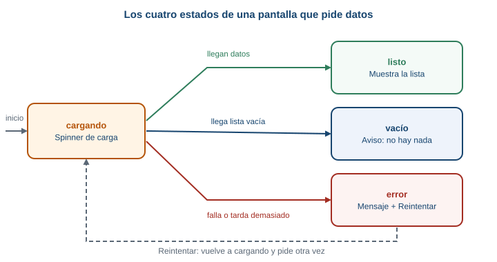{fig-alt="Máquina de cuatro estados de la pantalla: empieza en cargando; si llegan datos pasa a listo, si llega una lista vacía pasa a vacío, si falla pasa a error; desde error, el botón Reintentar vuelve a cargando"}

La pantalla empieza en `cargando` y, según cómo responda el servidor, termina en uno de los otros
tres. Desde `error`, el botón "Reintentar" vuelve a `cargando`.
:::

### Una variable con cuatro valores: `enum`

Hay que guardar en qué estado está la pantalla. Una variable que solo pueda valer una de cuatro
opciones es lo que Dart llama un **`enum`**: una lista cerrada de nombres.

```dart
enum Estado { cargando, listo, vacio, error }
```

Después declaras la variable del estado, que es la que cambia con `setState`:

```dart
Estado estado = Estado.cargando;
```

¿Por qué no cuatro variables `bool` (`cargando`, `hayError`...)? Porque cuatro `bool` permiten
combinaciones imposibles, como estar cargando y con error a la vez. Con un `enum`, solo existe una luz
del semáforo encendida.

### El código completo del ejemplo

Reemplaza `main.dart`. Necesita `lib/modelo.dart` de la Parte 2 (con `Producto`):

```dart
import 'dart:convert';

import 'package:flutter/material.dart';

import 'modelo.dart';

void main() => runApp(const MaterialApp(home: ProductosScreen()));

enum Estado { cargando, listo, vacio, error }

const productosJson = '''
[
  {"id": 1, "nombre": "Tomate chonto", "precio": 3500, "disponible": true},
  {"id": 2, "nombre": "Papa criolla", "precio": 4200, "disponible": true},
  {"id": 3, "nombre": "Aguacate hass", "precio": 6800, "disponible": true},
  {"id": 4, "nombre": "Panela", "precio": 5500, "disponible": true},
  {"id": 5, "nombre": "Mora", "precio": 7000, "disponible": false}
]
''';

// Servidor de mentira: espera 2 segundos y devuelve el JSON de arriba.
Future<List<Producto>> pedirProductos() async {
  await Future.delayed(const Duration(seconds: 2));
  final lista = jsonDecode(productosJson) as List;
  return lista.map((e) => Producto.fromJson(e)).toList();
}

class ProductosScreen extends StatefulWidget {
  const ProductosScreen({super.key});

  @override
  State<ProductosScreen> createState() => _ProductosScreenState();
}

class _ProductosScreenState extends State<ProductosScreen> {
  Estado estado = Estado.cargando;
  List<Producto> productos = [];

  @override
  void initState() {
    super.initState();
    cargar();
  }

  Future<void> cargar() async {
    try {
      final lista = await pedirProductos();
      if (!mounted) return;
      setState(() {
        productos = lista;
        estado = lista.isEmpty ? Estado.vacio : Estado.listo;
      });
    } catch (e) {
      if (!mounted) return;
      setState(() {
        estado = Estado.error;
      });
    }
  }

  Widget cuerpo() {
    if (estado == Estado.cargando) {
      return const Center(child: CircularProgressIndicator());
    }
    if (estado == Estado.error) {
      return const Center(child: Text('Algo salió mal'));
    }
    if (estado == Estado.vacio) {
      return const Center(child: Text('No hay productos'));
    }
    return ListView(
      children: [
        for (final p in productos)
          ListTile(title: Text(p.nombre), subtitle: Text('\$ ${p.precio}')),
      ],
    );
  }

  @override
  Widget build(BuildContext context) {
    return Scaffold(
      appBar: AppBar(title: const Text('Productos')),
      body: cuerpo(),
    );
  }
}
```

Es más largo que los anteriores, pero cada parte ya la conoces. Las piezas nuevas:

- `const productosJson = '''...''';` es un texto de varias líneas, con tres comillas simples. Contiene
  la lista de productos en JSON: el **servidor de mentira**. En un proyecto real, ese texto llegaría
  de internet.
- `pedirProductos()` espera 2 segundos y decodifica el JSON. `jsonDecode(...) as List` le dice a Dart
  que el resultado es una lista. `lista.map((e) => Producto.fromJson(e)).toList()` recorre la lista y,
  por cada elemento `e` (un `Map`), construye un `Producto`. `map` transforma cada elemento; `toList()`
  junta el resultado en una lista.
- `initState` llama a `cargar()` una sola vez, cuando la pantalla nace (Parte 3).
- `cargar()` pide los datos y, según el resultado, cambia `estado` dentro de `setState`.
  `lista.isEmpty ? Estado.vacio : Estado.listo` se lee "si la lista está vacía, `vacio`; si no,
  `listo`". Se llama operador condicional: `pregunta ? siSí : siNo`.
- `cuerpo()` es un método que devuelve un widget distinto según el estado. `build` solo llama a
  `cuerpo()`. Cada `if` termina con `return`, así que solo uno se ejecuta.
- `for (final p in productos) ListTile(...)` dentro de la lista construye un `ListTile` por producto.

Ejecuta. Durante 2 segundos ves el indicador de carga; después, los cinco productos (todavía sin
filtrar: `Mora` aparece, aunque no está disponible).

### Qué pasa si... provocas cada estado

Para ver los otros tres estados, cambia el servidor de mentira.

**Vacío.** Cambia el texto del JSON por una lista vacía:

```dart
const productosJson = '[]';
```

**Error.** Haz que la función falle:

```dart
Future<List<Producto>> pedirProductos() async {
  await Future.delayed(const Duration(seconds: 2));
  throw Exception('Servidor caído');
}
```

Después de cada cambio, usa **hot restart** (el botón de reinicio en VS Code, o `R` mayúscula en la
terminal), no hot reload. El hot reload conserva el `State` de la pantalla y no vuelve a llamar a
`initState`, así que `cargar()` no correría de nuevo y no verías el cambio. Este detalle sale de lo
que aprendiste en la Parte 3: `initState` corre una sola vez al nacer.

**Recuerda:** el estado dice qué cara tiene la pantalla; `setState` es lo que la cambia.

::: {.callout-important}
## Para memorizar

- Una pantalla con datos tiene cuatro estados: `cargando`, `listo`, `vacio` y `error`.
- Se guardan en un `enum` y una variable `estado`.
- `cargar()` cambia el estado dentro de `setState`; `build` (por medio de `cuerpo()`) dibuja según el
  estado.
- Una lista vacía llega al estado `vacio`; el estado `error` queda para los fallos.
:::

::: {.callout-note}
## Para razonar, no para memorizar

¿Por qué `vacio` y `error` son estados distintos? Piensa en lo que necesita la persona. Si no hay
productos, no hay nada que hacer: volver después. Si hubo un error, reintentar tiene sentido. Mezclar
los dos obliga a mostrar un mensaje que sirve mal para los dos casos.
:::

::: {.callout-tip}
## Para pensar

Cuando el estado es `cargando`, ¿qué debería pasar si la persona gira el celular o sale de la pantalla
y vuelve? Revisa tu respuesta con lo que aprendiste de `initState` y `dispose`.
:::

## Parte 7. Tiempo de espera y reintento

### El problema real

Hasta ahora, la petición esperaba lo que hiciera falta. Una red lenta o una conexión que se cae a
mitad de camino dejaría la app en el estado `cargando` indefinidamente: un círculo girando que nunca
termina. El paquete `http` no trae un límite de espera propio, así que ese límite lo pones tú.

**Predice primero.** Pones un límite de 5 segundos a una petición, y el servidor responde a los 7. Tu
código deja de esperar a los 5 segundos. ¿La petición se cancela en el servidor?

::: {.callout-warning collapse="true"}
## Comprueba tu predicción

No necesariamente. El límite hace que **tu código** deje de esperar y reciba un error. Según la
documentación de `Future.timeout`, la operación original puede seguir hasta terminar. Para una
consulta `GET` que solo lee datos, eso no causa ningún problema. Importa más cuando la petición
cambia algo en el servidor, y de eso se ocupará una semana posterior.
:::

### El límite de espera: `timeout`

`Future.timeout` se agrega al final de la espera:

```dart
final respuesta = await http.get(url).timeout(const Duration(seconds: 5));
```

Se lee "espera la respuesta, pero no más de 5 segundos". Si pasa ese tiempo sin respuesta, el `Future`
termina con un error de tipo **`TimeoutException`**, que se ve así:

```text
TimeoutException after 0:00:05.000000: Future not completed
```

### Dos fallos distintos, dos mensajes distintos

Hay dos formas comunes de que una petición falle sin respuesta, y la persona merece enterarse de la
diferencia:

| Qué pasó | Excepción | Mensaje para la persona |
|---|---|---|
| Pasó el tiempo límite sin respuesta | `TimeoutException` | "La respuesta tardó demasiado." |
| No hay conexión (modo avión, sin señal, dirección que no existe) | `SocketException` | "No hay conexión a internet." |

`TimeoutException` viene de `dart:async` y `SocketException` de `dart:io`. Las dos se importan al
comienzo del archivo:

```dart
import 'dart:async';
import 'dart:io';
```

(`dart:io` no existe en el navegador web: por eso esta guía se ejecuta en Android.)

Cuando no hay respuesta por un problema de red, el mensaje de la excepción depende del sistema
operativo, pero empieza igual. Dos ejemplos reales: en un emulador de Android sin el permiso de
internet (Parte 5), y en Windows con un nombre de servidor que no existe:

```text
ClientException with SocketException: Failed host lookup: 'api.open-meteo.com'
(OS Error: No address associated with hostname, errno = 7), uri=https://api.open-meteo.com/...
```

```text
ClientException with SocketException: Failed host lookup: 'api.open-meteo-no-existe.com'
(OS Error: Host desconocido, errno = 11001), uri=https://api.open-meteo-no-existe.com/v1/forecast
```

La palabra `ClientException with` es el paquete `http` envolviendo el error de red. Esa envoltura se
comporta como una `SocketException`, así que `on SocketException` la atrapa (se comprobó con la
versión 1.6.0). El texto entre paréntesis lo pone el sistema operativo y no es para mostrarlo.

### `catch` con tipos: `on`

Para reaccionar distinto según el error, `catch` se acompaña con `on`:

```dart
try {
  // ...
} on TimeoutException {
  // pasó el límite
} on SocketException {
  // no hay conexión
} catch (e) {
  // cualquier otro error
}
```

Dart revisa las ramas **en orden** y entra a la primera que coincide. Por eso el `catch (e)` general va
al final: si fuera primero, atraparía todo y las dos específicas nunca correrían.

Y algo importante sobre mensajes. El texto de una excepción es para ti, no para la persona.
`Exception: El servidor respondió 404` o `Failed host lookup` no le dicen nada a quien solo quería ver
sus productos. La regla: al usuario le muestras una frase clara; la excepción técnica va a la consola
con `debugPrint`.

### El reintento: un botón y nada más

Cuando algo falla, lo más útil es dar una salida: un botón **"Reintentar"** que vuelve a pedir. La
forma más simple es que el botón llame al mismo `cargar()` de siempre. Para que la persona vea que
algo ocurre, `cargar()` empieza poniendo el estado en `cargando`:

```dart
Future<void> cargar() async {
  setState(() {
    estado = Estado.cargando;
  });
  // ... pedir y manejar errores
}
```

```dart
FilledButton(onPressed: cargar, child: const Text('Reintentar'))
```

Fíjate en `onPressed: cargar`, sin paréntesis: pasas la función, no la ejecutas (como en la Parte 4).

Existen reintentos más sofisticados, como repetir solos varias veces esperando cada vez más tiempo
(*backoff exponencial*). Esta guía no los usa: un toque, un nuevo intento.

### El código completo del ejemplo

Reemplaza `main.dart`. Pide el clima real de Envigado, con límite de 5 segundos. Necesita `lib/modelo.dart`
(con `Clima`):

```dart
import 'dart:async';
import 'dart:convert';
import 'dart:io';

import 'package:flutter/material.dart';
import 'package:http/http.dart' as http;

import 'modelo.dart';

void main() => runApp(const MaterialApp(home: ClimaScreen()));

enum Estado { cargando, listo, error }

Future<Clima> pedirClima() async {
  final url = Uri.parse(
    'https://api.open-meteo.com/v1/forecast'
    '?latitude=6.17&longitude=-75.58'
    '&current=temperature_2m,precipitation,weather_code',
  );
  final respuesta = await http.get(url).timeout(const Duration(seconds: 5));
  if (respuesta.statusCode != 200) {
    throw Exception('El servidor respondió ${respuesta.statusCode}');
  }
  return Clima.fromJson(jsonDecode(respuesta.body));
}

class ClimaScreen extends StatefulWidget {
  const ClimaScreen({super.key});

  @override
  State<ClimaScreen> createState() => _ClimaScreenState();
}

class _ClimaScreenState extends State<ClimaScreen> {
  Estado estado = Estado.cargando;
  String textoClima = '';
  String mensaje = '';

  @override
  void initState() {
    super.initState();
    cargar();
  }

  Future<void> cargar() async {
    setState(() {
      estado = Estado.cargando;
    });
    try {
      final resultado = await pedirClima();
      if (!mounted) return;
      setState(() {
        textoClima = '${resultado.temperatura} °C, lluvia ${resultado.lluvia} mm';
        estado = Estado.listo;
      });
    } on TimeoutException {
      if (!mounted) return;
      setState(() {
        mensaje = 'La respuesta tardó demasiado.';
        estado = Estado.error;
      });
    } on SocketException {
      if (!mounted) return;
      setState(() {
        mensaje = 'No hay conexión a internet.';
        estado = Estado.error;
      });
    } catch (e) {
      debugPrint('Error inesperado: $e');
      if (!mounted) return;
      setState(() {
        mensaje = 'Algo salió mal. Intenta de nuevo.';
        estado = Estado.error;
      });
    }
  }

  Widget cuerpo() {
    if (estado == Estado.cargando) {
      return const Center(child: CircularProgressIndicator());
    }
    if (estado == Estado.error) {
      return Center(
        child: Column(
          mainAxisSize: MainAxisSize.min,
          children: [
            Text(mensaje),
            const SizedBox(height: 12),
            FilledButton(onPressed: cargar, child: const Text('Reintentar')),
          ],
        ),
      );
    }
    return Center(
      child: Text(textoClima, style: const TextStyle(fontSize: 24)),
    );
  }

  @override
  Widget build(BuildContext context) {
    return Scaffold(
      appBar: AppBar(title: const Text('Clima de Envigado')),
      body: cuerpo(),
    );
  }
}
```

Lo nuevo respecto a la Parte 6:

- `pedirClima()` ahora hace la petición real, con `.timeout(...)`, y **revisa el código de estado**:
  si no es `200`, lanza una `Exception`. Así un `404` o un `500` llegan al `catch` como cualquier otro
  fallo (Parte 5).
- `Clima.fromJson(jsonDecode(respuesta.body))` convierte el texto en el objeto `Clima` (Parte 2).
- `cargar()` tiene un `try` con tres ramas de error. Cada una pone un mensaje distinto y el estado en
  `error`. La rama general registra el error técnico con `debugPrint`.
- El estado `error` muestra el mensaje y el botón "Reintentar".

### Probar los fallos

1. **Con conexión.** Ves el indicador y, en menos de un segundo o dos, algo como `22.3 °C, lluvia
   0.0 mm`. Los valores dependen del clima del momento.
2. **Sin conexión.** Activa el modo avión del emulador (en la barra de ajustes rápidos, o con
   `adb shell cmd connectivity airplane-mode enable`), cierra la app y ábrela de nuevo. Aparece
   `No hay conexión a internet.` con el botón "Reintentar". Se comprobó así en un emulador de Android.
3. **Reintentar.** Desactiva el modo avión y pulsa "Reintentar". Si acabas de volver de modo avión,
   el primer intento puede dar `La respuesta tardó demasiado.`: la red del emulador tarda unos
   segundos en volver. Espera un poco y pulsa de nuevo. Eso pasó durante la verificación, y es un buen
   ejemplo de por qué existe el botón.
4. **Forzar un tiempo de espera.** Cambia `Duration(seconds: 5)` por `Duration(milliseconds: 1)` y
   reinicia: casi ninguna petición responde en un milisegundo, así que ves `La respuesta tardó
   demasiado.`
5. **Un 404.** Cambia `/v1/forecast` por `/v1/forecasto` en la URL. Ves `Algo salió mal. Intenta de
   nuevo.` y, en la consola, `Error inesperado: Exception: El servidor respondió 404`.

Cuando termines, vuelve el límite a 5 segundos y la ruta a `/v1/forecast`.

::: {.diagrama}
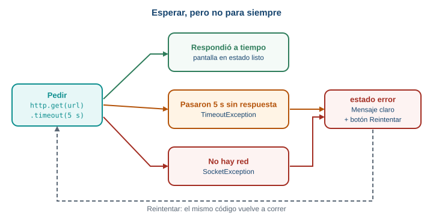{fig-alt="Tiempo de espera y reintento: la petición espera como máximo 5 segundos; si responde a tiempo muestra los datos, si tarda lanza TimeoutException y si no hay red lanza SocketException; en ambos errores aparece el botón Reintentar, que repite la petición"}

El camino de una petición con límite de espera: tres salidas posibles, y el botón "Reintentar" que
vuelve al principio.
:::

### Qué falla y cómo se ve cada cosa

Hay cuatro maneras de que una petición no termine bien, y cada una se ve distinta en el código:

::: {.diagrama}
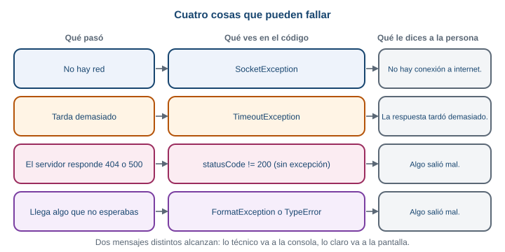{fig-alt="Cuatro cosas que pueden fallar al pedir datos y cómo se ve cada una en el código: sin red lanza SocketException, demasiado tiempo lanza TimeoutException, un código distinto de 200 no lanza excepción, y un JSON inesperado lanza FormatException o TypeError"}

Un servidor que responde `404` o `500` no lanza excepción por sí solo: la guía lo convierte en una con
una comprobación de `statusCode`. Un JSON inesperado lanza `FormatException` o `TypeError`.
:::

**Recuerda:** el estado dice qué cara tiene la pantalla; `setState` es lo que la cambia.

::: {.callout-important}
## Para memorizar

- `http.get(url).timeout(const Duration(seconds: 5))` pone un límite de espera.
- Sin respuesta a tiempo: `TimeoutException`. Sin conexión: `SocketException`.
- Con `try`, las ramas `on Tipo` van de la más específica a la más general, y `catch (e)` al final.
- Si `statusCode != 200`, lanza una excepción propia para llevarlo al `catch`.
- El botón "Reintentar" llama otra vez a `cargar()`, que empieza poniendo `cargando`.
:::

::: {.callout-note}
## Para razonar, no para memorizar

¿Por qué el mensaje técnico va a la consola y no a la pantalla? Quien usa la app no puede hacer nada
con `errno = 7`. Pero tú sí: es la pista para depurar. Dos destinatarios, dos mensajes. La pantalla
dice qué pasó y qué puede hacer la persona; la consola dice por qué, para quien programa.
:::

## Parte 8. El catálogo con clima

Es el momento de juntar todo en `taller_login`, el proyecto de la Semana 5. Vas a agregar una pantalla
`CatalogoScreen` que muestra los productos que van bien con el clima de Envigado, con sus cuatro
estados. Al terminar, el flujo completo es este:

::: {.diagrama}
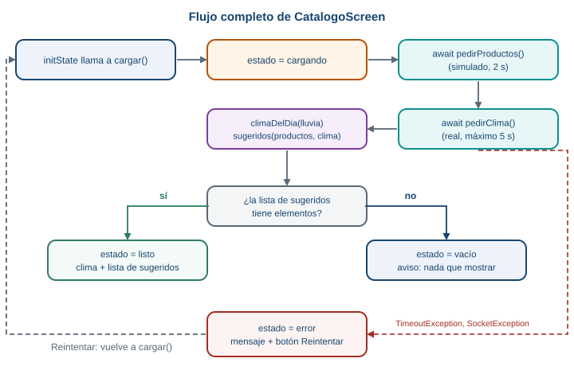{fig-alt="Flujo completo de la pantalla del catálogo: initState llama a cargar, cargar pone el estado cargando, pide los productos y el clima, calcula el clima del día y los productos sugeridos, y termina en listo o vacío; si algo falla, termina en error y el botón Reintentar vuelve a llamar a cargar"}

El flujo de `CatalogoScreen`. Cada caja la construyes en un paso de esta parte.
:::

### La regla de temporada

El proyecto real sabe qué está en temporada porque lo calcula el servidor. Tu catálogo no tiene ese
servidor, así que usa una regla muy simple y fija, escrita en el código:

::: {.diagrama}
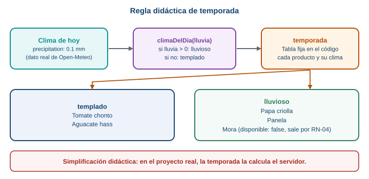{fig-alt="Regla de temporada didáctica: si la lluvia es mayor que cero el clima es lluvioso, si no es templado. Una tabla fija dice qué productos van con cada clima, y los productos no disponibles se retiran"}

Una regla didáctica de dos pasos: del dato de lluvia sale un tipo de clima, y una tabla dice qué va
con cada tipo.
:::

::: {.callout-warning}
Esta regla es una **simplificación didáctica**. Una tabla de cinco productos y un umbral de lluvia no
dicen de verdad qué está en temporada. En el proyecto real, la temporada la calcula el servidor. Aquí
sirve para practicar el flujo de datos, no para saber de agricultura.
:::

Además aplica una regla de negocio del proyecto: **RN-04**, un producto no disponible se retira del
catálogo visible.

### [1]{.paso} Dependencia, modelo y permiso

En la carpeta de `taller_login`:

```bash
flutter pub add http
```

Crea `lib/modelo.dart` con las dos clases de la Parte 2, `Producto` y `Clima`. Después agrega, debajo
de ellas, la tabla de temporada y las dos funciones de la regla:

```dart
// Simplificación didáctica: en el proyecto real, la temporada la
// calcularía el servidor. Aquí es una tabla fija.
const temporada = {
  'Tomate chonto': 'templado',
  'Aguacate hass': 'templado',
  'Papa criolla': 'lluvioso',
  'Panela': 'lluvioso',
  'Mora': 'lluvioso',
};

String climaDelDia(double lluvia) {
  return lluvia > 0 ? 'lluvioso' : 'templado';
}

List<Producto> sugeridos(List<Producto> productos, String clima) {
  return productos
      .where((p) => p.disponible && temporada[p.nombre] == clima)
      .toList();
}
```

- `temporada` es un `Map` de nombre de producto a clima ideal.
- `climaDelDia(lluvia)` devuelve `'lluvioso'` si llovió algo (`lluvia > 0`) y `'templado'` si no.
- `sugeridos(...)` se queda con los productos que están disponibles (RN-04) **y** cuyo clima ideal
  coincide con el de hoy. `where` filtra una lista; `toList()` junta el resultado.

Agrega también el permiso `INTERNET` al manifiesto principal, como en la Parte 5
(`android/app/src/main/AndroidManifest.xml`).

Para comprobar la regla sin abrir el emulador, escribe `test/modelo_test.dart`:

```dart
import 'package:flutter_test/flutter_test.dart';
import 'package:taller_login/modelo.dart';

void main() {
  test('climaDelDia', () {
    expect(climaDelDia(0.0), 'templado');
    expect(climaDelDia(1.2), 'lluvioso');
  });

  test('sugeridos respeta clima y disponibilidad (RN-04)', () {
    final todos = [
      Producto(id: 1, nombre: 'Tomate chonto', precio: 3500, disponible: true),
      Producto(id: 2, nombre: 'Papa criolla', precio: 4200, disponible: true),
      Producto(id: 5, nombre: 'Mora', precio: 7000, disponible: false),
    ];
    expect(sugeridos(todos, 'templado').map((p) => p.nombre), ['Tomate chonto']);
    expect(sugeridos(todos, 'lluvioso').map((p) => p.nombre), ['Papa criolla']);
    expect(sugeridos([], 'templado'), isEmpty);
  });
}
```

Ejecuta `flutter test`: pasan. `Mora` no se sugiere con lluvia porque no está disponible.

### [2]{.paso} La pantalla y la ruta

En `lib/main.dart`, agrega los imports que usará la pantalla, arriba del archivo:

```dart
import 'dart:async';
import 'dart:convert';
import 'dart:io';

import 'package:flutter/material.dart';
import 'package:http/http.dart' as http;

import 'modelo.dart';
```

Agrega la ruta `/catalogo` (como en la Semana 5, Parte 11). Si tu `MaterialApp` todavía usa `home:`,
cámbialo por `initialRoute` y `routes`:

```dart
initialRoute: '/',
routes: {
  '/': (context) => const LoginScreen(),
  '/catalogo': (context) => const CatalogoScreen(),
},
```

Y haz que el botón "Iniciar sesión" del login navegue a la pantalla nueva:

```dart
onPressed: () {
  Navigator.pushNamed(context, '/catalogo');
},
```

Al final de `main.dart`, agrega el esqueleto de la pantalla. Es un `StatefulWidget` con su `State`, como
el contador de la Parte 3, todavía sin datos:

```dart
class CatalogoScreen extends StatefulWidget {
  const CatalogoScreen({super.key});

  @override
  State<CatalogoScreen> createState() => _CatalogoScreenState();
}

class _CatalogoScreenState extends State<CatalogoScreen> {
  @override
  Widget build(BuildContext context) {
    return Scaffold(
      appBar: AppBar(title: const Text('Catálogo de temporada')),
      body: const Center(child: Text('Aquí irá el catálogo')),
    );
  }
}
```

Ejecuta y pulsa "Iniciar sesión": ves la pantalla con el texto provisional. Los imports quedarán sin
usar (el analizador los marca como advertencia) hasta los pasos siguientes.

### [3]{.paso} Los cuatro estados, todavía sin datos reales

Agrega el `enum` encima de la clase, y dentro del `State` las variables del estado y el método
`cuerpo()`. Por ahora los valores son de ejemplo, escritos a mano:

```dart
enum Estado { cargando, listo, vacio, error }
```

Dentro de `_CatalogoScreenState`, antes de `build`:

```dart
  Estado estado = Estado.cargando;
  String mensajeError = 'Algo salió mal.';
  String resumenClima = 'Hoy en Envigado: 22.3 °C';
  String tipoClima = 'templado';
  List<Producto> recomendados = [
    Producto(id: 1, nombre: 'Tomate chonto', precio: 3500, disponible: true),
  ];

  Widget cuerpo() {
    if (estado == Estado.cargando) {
      return const Center(
        child: Column(
          mainAxisSize: MainAxisSize.min,
          children: [
            CircularProgressIndicator(),
            SizedBox(height: 16),
            Text('Consultando el clima y el catálogo...'),
          ],
        ),
      );
    }
    if (estado == Estado.error) {
      return Center(
        child: Column(
          mainAxisSize: MainAxisSize.min,
          children: [
            const Icon(Icons.cloud_off, size: 64),
            const SizedBox(height: 12),
            Text(mensajeError),
            const SizedBox(height: 12),
            FilledButton(onPressed: () {}, child: const Text('Reintentar')),
          ],
        ),
      );
    }
    if (estado == Estado.vacio) {
      return Center(
        child: Column(
          mainAxisSize: MainAxisSize.min,
          children: [
            const Icon(Icons.inbox_outlined, size: 64),
            const SizedBox(height: 12),
            Text('Con clima $tipoClima no hay productos disponibles hoy.'),
          ],
        ),
      );
    }
    return Column(
      children: [
        Card(
          margin: const EdgeInsets.all(16),
          child: ListTile(
            leading: const Icon(Icons.wb_sunny_outlined),
            title: Text(resumenClima),
            subtitle: Text('Clima $tipoClima: esto va bien hoy'),
          ),
        ),
        Expanded(
          child: ListView(
            children: [
              for (final p in recomendados)
                ListTile(
                  title: Text(p.nombre),
                  subtitle: Text('\$ ${p.precio} COP'),
                ),
            ],
          ),
        ),
      ],
    );
  }
```

Y cambia el cuerpo del `Scaffold` de `build` para que llame a `cuerpo()`:

```dart
  @override
  Widget build(BuildContext context) {
    return Scaffold(
      appBar: AppBar(title: const Text('Catálogo de temporada')),
      body: cuerpo(),
    );
  }
```

Ejecuta. Ves el estado `cargando`, porque es el valor inicial de `estado`. Para ver los otros tres,
cambia `Estado.cargando` en `Estado estado = Estado.cargando;` por `Estado.listo`, `Estado.vacio` y
`Estado.error`, y haz hot restart cada vez. Así verificas que cada cara de la pantalla se ve bien
antes de conectar datos. Cuando termines, deja `Estado.cargando`.

### [4]{.paso} Los productos: el servidor de mentira

Agrega, encima de la clase `CatalogoScreen`, el JSON de productos y la función que lo "pide" (es la
misma de la Parte 6):

```dart
const productosJson = '''
[
  {"id": 1, "nombre": "Tomate chonto", "precio": 3500, "disponible": true},
  {"id": 2, "nombre": "Papa criolla", "precio": 4200, "disponible": true},
  {"id": 3, "nombre": "Aguacate hass", "precio": 6800, "disponible": true},
  {"id": 4, "nombre": "Panela", "precio": 5500, "disponible": true},
  {"id": 5, "nombre": "Mora", "precio": 7000, "disponible": false}
]
''';

// Servidor de mentira: espera 2 segundos y devuelve el JSON de arriba.
Future<List<Producto>> pedirProductos() async {
  await Future.delayed(const Duration(seconds: 2));
  final lista = jsonDecode(productosJson) as List;
  return lista.map((e) => Producto.fromJson(e)).toList();
}
```

En el `State`, vacía los valores de ejemplo y agrega `initState` y `cargar()`:

```dart
  Estado estado = Estado.cargando;
  String mensajeError = 'Algo salió mal.';
  String resumenClima = 'Clima pendiente';
  String tipoClima = 'pendiente';
  List<Producto> recomendados = [];

  @override
  void initState() {
    super.initState();
    cargar();
  }

  Future<void> cargar() async {
    setState(() {
      estado = Estado.cargando;
    });
    final productos = await pedirProductos();
    if (!mounted) return;
    setState(() {
      recomendados = productos;
      estado = productos.isEmpty ? Estado.vacio : Estado.listo;
    });
  }
```

Ejecuta. Después de 2 segundos, aparecen los cinco productos, incluida la `Mora` no disponible, y la
tarjeta dice `Clima pendiente`. Todavía no hay clima ni filtro.

**Recuerda:** el pedido va en `initState`, la respuesta pasa por `setState`, y `build` solo dibuja.

### [5]{.paso} El clima real

Agrega la función que pide el clima, debajo de `pedirProductos`. Es la de la Parte 7:

```dart
// Petición real a Open-Meteo, con un máximo de 5 segundos de espera.
Future<Clima> pedirClima() async {
  final url = Uri.parse(
    'https://api.open-meteo.com/v1/forecast'
    '?latitude=6.17&longitude=-75.58'
    '&current=temperature_2m,precipitation,weather_code',
  );
  final respuesta = await http.get(url).timeout(const Duration(seconds: 5));
  if (respuesta.statusCode != 200) {
    throw Exception('El servidor respondió ${respuesta.statusCode}');
  }
  return Clima.fromJson(jsonDecode(respuesta.body));
}
```

Y cambia `cargar()` para que pida también el clima y arme el resumen:

```dart
  Future<void> cargar() async {
    setState(() {
      estado = Estado.cargando;
    });
    final productos = await pedirProductos();
    final clima = await pedirClima();
    if (!mounted) return;
    setState(() {
      resumenClima =
          'Hoy en Envigado: ${clima.temperatura} °C, lluvia ${clima.lluvia} mm';
      recomendados = productos;
      estado = productos.isEmpty ? Estado.vacio : Estado.listo;
    });
  }
```

Ejecuta. Esperas unos segundos (dos del servidor de mentira y lo que tarde la red) y la tarjeta
muestra el clima real de Envigado, por ejemplo `Hoy en Envigado: 21.7 °C, lluvia 0.1 mm`. Sin conexión,
la pantalla se quedaría en `cargando` para siempre, porque todavía no hay `catch`: lo arreglas en el
paso 7.

### [6]{.paso} La regla de temporada

Ahora usa el clima para decidir qué mostrar. Cambia el bloque de `setState` de `cargar()`:

```dart
    if (!mounted) return;
    final tipo = climaDelDia(clima.lluvia);
    final lista = sugeridos(productos, tipo);
    setState(() {
      tipoClima = tipo;
      resumenClima =
          'Hoy en Envigado: ${clima.temperatura} °C, lluvia ${clima.lluvia} mm';
      recomendados = lista;
      estado = lista.isEmpty ? Estado.vacio : Estado.listo;
    });
```

Los cálculos (`tipo` y `lista`) van **antes** de `setState`, y dentro del `setState` solo se asignan
las variables. Ejecuta. La tarjeta dice ahora `Clima lluvioso: esto va bien hoy` o
`Clima templado: ...`, y la lista muestra solo los productos que van con ese clima y están disponibles.
En la verificación de esta guía (2 de octubre de 2026, a las 22:28 UTC) llovía 0.1 mm: clima
lluvioso, y se mostraron `Papa criolla` y `Panela`. `Mora` también va con lluvia, pero no está
disponible (RN-04), así que no aparece. Con tu clima de hoy, el resultado puede ser otro.

Si la lista de sugeridos queda vacía, el estado pasa a `vacio`, y se ve el aviso `Con clima lluvioso no
hay productos disponibles hoy.`

### [7]{.paso} Errores, tiempo de espera y reintento

Es el paso que evita el círculo infinito. Envuelve las dos esperas de `cargar()` en un `try`, atrapa los
dos errores de red y agrega un método que cambia a `error`:

```dart
  Future<void> cargar() async {
    setState(() {
      estado = Estado.cargando;
    });
    try {
      final productos = await pedirProductos();
      final clima = await pedirClima();
      if (!mounted) return;
      final tipo = climaDelDia(clima.lluvia);
      final lista = sugeridos(productos, tipo);
      setState(() {
        tipoClima = tipo;
        resumenClima =
            'Hoy en Envigado: ${clima.temperatura} °C, lluvia ${clima.lluvia} mm';
        recomendados = lista;
        estado = lista.isEmpty ? Estado.vacio : Estado.listo;
      });
    } on TimeoutException {
      mostrarError('La respuesta tardó demasiado.');
    } on SocketException {
      mostrarError('No hay conexión a internet.');
    } catch (e) {
      debugPrint('Error inesperado: $e');
      mostrarError('Algo salió mal. Intenta de nuevo.');
    }
  }

  void mostrarError(String mensaje) {
    if (!mounted) return;
    setState(() {
      mensajeError = mensaje;
      estado = Estado.error;
    });
  }
```

Y conecta el botón "Reintentar", que en el paso 3 no hacía nada:

```dart
FilledButton(onPressed: cargar, child: const Text('Reintentar')),
```

`mostrarError` revisa `mounted` por sí mismo, así que las tres ramas del `catch` no repiten esa
comprobación. Cada rama cae en `error` con un mensaje distinto, y "Reintentar" llama a `cargar()`, que
empieza poniendo `cargando`.

### [8]{.paso} Probar los cuatro estados

Comprueba cada estado con una acción concreta:

| Estado | Cómo provocarlo | Qué ves |
|---|---|---|
| `cargando` | Abre la pantalla | El indicador y `Consultando el clima y el catálogo...` |
| `listo` | Con conexión, espera | La tarjeta del clima y la lista de sugeridos |
| `vacio` | Cambia `productosJson` por `'[]'` y haz hot restart | El ícono de bandeja y el aviso con el clima |
| `error` por red | Activa el modo avión y abre la pantalla | `No hay conexión a internet.` y "Reintentar" |
| `error` por tiempo | Cambia `seconds: 5` por `milliseconds: 1` en `pedirClima` | `La respuesta tardó demasiado.` |
| `error` por código | Cambia `/v1/forecast` por `/v1/forecasto` | `Algo salió mal. Intenta de nuevo.` |

Estos cuatro estados se comprobaron en un emulador de Android: `cargando`, `listo`, `vacio` (con el
JSON vacío), y `error` con modo avión, con tiempo agotado tras volver del modo avión, y con la ruta
`/v1/forecasto` (que registró `Exception: El servidor respondió 404` en la consola). Cuando
termines, deshaz los cambios de prueba.

### El código completo del catálogo

Para comparar con el tuyo, así queda el final de `main.dart`, desde el `enum` hasta el final del
archivo. Todo lo anterior (login, `TallerLoginApp`) queda igual, salvo los imports y la ruta del paso 2.

```dart
enum Estado { cargando, listo, vacio, error }

const productosJson = '''
[
  {"id": 1, "nombre": "Tomate chonto", "precio": 3500, "disponible": true},
  {"id": 2, "nombre": "Papa criolla", "precio": 4200, "disponible": true},
  {"id": 3, "nombre": "Aguacate hass", "precio": 6800, "disponible": true},
  {"id": 4, "nombre": "Panela", "precio": 5500, "disponible": true},
  {"id": 5, "nombre": "Mora", "precio": 7000, "disponible": false}
]
''';

// Servidor de mentira: espera 2 segundos y devuelve el JSON de arriba.
Future<List<Producto>> pedirProductos() async {
  await Future.delayed(const Duration(seconds: 2));
  final lista = jsonDecode(productosJson) as List;
  return lista.map((e) => Producto.fromJson(e)).toList();
}

// Petición real a Open-Meteo, con un máximo de 5 segundos de espera.
Future<Clima> pedirClima() async {
  final url = Uri.parse(
    'https://api.open-meteo.com/v1/forecast'
    '?latitude=6.17&longitude=-75.58'
    '&current=temperature_2m,precipitation,weather_code',
  );
  final respuesta = await http.get(url).timeout(const Duration(seconds: 5));
  if (respuesta.statusCode != 200) {
    throw Exception('El servidor respondió ${respuesta.statusCode}');
  }
  return Clima.fromJson(jsonDecode(respuesta.body));
}

class CatalogoScreen extends StatefulWidget {
  const CatalogoScreen({super.key});

  @override
  State<CatalogoScreen> createState() => _CatalogoScreenState();
}

class _CatalogoScreenState extends State<CatalogoScreen> {
  Estado estado = Estado.cargando;
  String mensajeError = '';
  String resumenClima = '';
  String tipoClima = '';
  List<Producto> recomendados = [];

  @override
  void initState() {
    super.initState();
    cargar();
  }

  Future<void> cargar() async {
    setState(() {
      estado = Estado.cargando;
    });
    try {
      final productos = await pedirProductos();
      final clima = await pedirClima();
      if (!mounted) return;
      final tipo = climaDelDia(clima.lluvia);
      final lista = sugeridos(productos, tipo);
      setState(() {
        tipoClima = tipo;
        resumenClima =
            'Hoy en Envigado: ${clima.temperatura} °C, lluvia ${clima.lluvia} mm';
        recomendados = lista;
        estado = lista.isEmpty ? Estado.vacio : Estado.listo;
      });
    } on TimeoutException {
      mostrarError('La respuesta tardó demasiado.');
    } on SocketException {
      mostrarError('No hay conexión a internet.');
    } catch (e) {
      debugPrint('Error inesperado: $e');
      mostrarError('Algo salió mal. Intenta de nuevo.');
    }
  }

  void mostrarError(String mensaje) {
    if (!mounted) return;
    setState(() {
      mensajeError = mensaje;
      estado = Estado.error;
    });
  }

  Widget cuerpo() {
    if (estado == Estado.cargando) {
      return const Center(
        child: Column(
          mainAxisSize: MainAxisSize.min,
          children: [
            CircularProgressIndicator(),
            SizedBox(height: 16),
            Text('Consultando el clima y el catálogo...'),
          ],
        ),
      );
    }
    if (estado == Estado.error) {
      return Center(
        child: Column(
          mainAxisSize: MainAxisSize.min,
          children: [
            const Icon(Icons.cloud_off, size: 64),
            const SizedBox(height: 12),
            Text(mensajeError),
            const SizedBox(height: 12),
            FilledButton(onPressed: cargar, child: const Text('Reintentar')),
          ],
        ),
      );
    }
    if (estado == Estado.vacio) {
      return Center(
        child: Column(
          mainAxisSize: MainAxisSize.min,
          children: [
            const Icon(Icons.inbox_outlined, size: 64),
            const SizedBox(height: 12),
            Text('Con clima $tipoClima no hay productos disponibles hoy.'),
          ],
        ),
      );
    }
    return Column(
      children: [
        Card(
          margin: const EdgeInsets.all(16),
          child: ListTile(
            leading: const Icon(Icons.wb_sunny_outlined),
            title: Text(resumenClima),
            subtitle: Text('Clima $tipoClima: esto va bien hoy'),
          ),
        ),
        Expanded(
          child: ListView(
            children: [
              for (final p in recomendados)
                ListTile(
                  title: Text(p.nombre),
                  subtitle: Text('\$ ${p.precio} COP'),
                ),
            ],
          ),
        ),
      ],
    );
  }

  @override
  Widget build(BuildContext context) {
    return Scaffold(
      appBar: AppBar(title: const Text('Catálogo de temporada')),
      body: cuerpo(),
    );
  }
}
```

### Lo que queda fuera de esta guía

Para mantener el catálogo simple, hay cosas que existen y esta guía no usa:

- `FutureBuilder`, un widget que reconstruye cuando termina un `Future`.
- Reintentos automáticos con espera creciente (*backoff exponencial*).
- Paquetes que generan el código de `fromJson` por ti.
- Guardar el último catálogo para verlo sin conexión (RN-06): es el tema de la Semana 8.

## Errores frecuentes

::: {.error-caso}
[Error 1]{.etiqueta}

### setState() called after dispose()

```text
setState() called after dispose(): _LentoState#20759(lifecycle state: defunct, not mounted)
```

**Causa.** Una función `async` llamó a `setState` después de que la pantalla se cerró. El número
después de `#` cambia en cada ejecución.

**Solución.** Después de cada `await` y antes de `setState`, escribe `if (!mounted) return;`.
:::

::: {.error-caso}
[Error 2]{.etiqueta}

### La pantalla no cambia aunque la variable sí

**Causa.** La variable cambió fuera de `setState`, o la pantalla es un `StatelessWidget`. No hay
mensaje de error: la consola, con un `debugPrint`, muestra que el valor sí cambió.

**Solución.** Cambia la variable dentro de `setState(() { ... })`, en un `State` de un
`StatefulWidget`. Es la Parte 3.
:::

::: {.error-caso}
[Error 3]{.etiqueta}

### Functions marked 'async' must have a return type...

```text
Functions marked 'async' must have a return type which is a supertype of 'Future'.
```

**Causa.** Marcaste `build` como `async`. `build` tiene que devolver un `Widget` de inmediato.

**Solución.** Quita `async` de `build`. Pon el trabajo asíncrono en otro método (`cargar`) y llámalo
desde `initState`.
:::

::: {.error-caso}
[Error 4]{.etiqueta}

### The getter 'statusCode' isn't defined for the type `Future<Response>`

```text
The getter 'statusCode' isn't defined for the type 'Future<Response>'.
```

**Causa.** Falta el `await` delante de `http.get(...)`. Lo que tienes es el `Future`, no la respuesta.

**Solución.** Escribe `final respuesta = await http.get(url);` dentro de una función `async`.
:::

::: {.error-caso}
[Error 5]{.etiqueta}

### The argument type 'String' can't be assigned to the parameter type 'Uri'

```text
The argument type 'String' can't be assigned to the parameter type 'Uri'.
```

**Causa.** Pasaste el texto de la URL directamente a `http.get`.

**Solución.** Envuélvelo: `http.get(Uri.parse('https://...'))`.
:::

::: {.error-caso}
[Error 6]{.etiqueta}

### Failed host lookup, con internet funcionando

```text
ClientException with SocketException: Failed host lookup: 'api.open-meteo.com'
(OS Error: No address associated with hostname, errno = 7), uri=https://api.open-meteo.com/...
```

**Causa.** Dos posibles. Sin conexión real (modo avión, sin señal), o, aunque haya internet, falta el
permiso `INTERNET` en el manifiesto principal de Android.

**Solución.** Confirma que el celular tiene conexión. Si la tiene, agrega
`<uses-permission android:name="android.permission.INTERNET"/>` a
`android/app/src/main/AndroidManifest.xml`, y detén la app y vuelve a ejecutarla (no basta un hot
reload).
:::

::: {.error-caso}
[Error 7]{.etiqueta}

### Connection refused con localhost

```text
ClientException with SocketException: Connection refused (OS Error: Connection refused, errno = 111),
address = localhost, port = 33518, uri=http://localhost:8000/
```

**Causa.** En el emulador de Android, `localhost` es el propio emulador, no tu computador. El número
de `port` cambia en cada intento.

**Solución.** Para llegar al servidor de tu computador desde el emulador, usa `10.0.2.2`:
`http://10.0.2.2:8000/`.
:::

::: {.error-caso}
[Error 8]{.etiqueta}

### FormatException: Unexpected character

```text
FormatException: Unexpected character (at character 1)
<html>Not found</html>
^
```

**Causa.** `jsonDecode` recibió algo que no es JSON, por ejemplo una página HTML de error. Pasa cuando
la dirección está mal y el servidor responde con una página en vez de datos. El `^` marca el primer
carácter inesperado.

**Solución.** Revisa `statusCode` antes de decodificar, e imprime `respuesta.body` con `debugPrint` para
ver qué llegó de verdad.
:::

::: {.error-caso}
[Error 9]{.etiqueta}

### type 'Null' is not a subtype of type 'int'

```text
type 'Null' is not a subtype of type 'int'
```

**Causa.** Un campo que `fromJson` espera como `int` no vino en el JSON, o vino como `null`.

**Solución.** Compara las claves de tu `fromJson` con las del JSON real (un `debugPrint` del `body`
ayuda). Si el campo puede faltar de verdad, declara el campo como opcional o dale un valor por defecto
con `??`, como `disponible` en `Producto`.
:::

::: {.error-caso}
[Error 10]{.etiqueta}

### El círculo de carga nunca termina

**Causa.** La petición falló y no hay `try`/`catch`, o algún `catch` no cambia el estado a `error`. No
hay mensaje de error en pantalla; en la consola puede haber un `Unhandled Exception`.

**Solución.** Envuelve las esperas en `try`, y asegúrate de que todas las ramas del `catch` terminen
llamando a `setState` con el estado `error`. Agrega también un límite de espera (`timeout`).
:::

## Retos

::: {.callout-tip}
## Reto 1. Restar y reiniciar

Parte del contador de la Parte 3. Agrega dos botones: "Restar", que baja el contador en uno, y
"Reiniciar", que lo deja en cero. Los dos deben cambiar la pantalla.
:::

::: {.callout-note collapse="true"}
## Solución del Reto 1

```dart
class _ContadorState extends State<Contador> {
  int cuenta = 0;

  @override
  Widget build(BuildContext context) {
    return Scaffold(
      appBar: AppBar(title: const Text('Contador')),
      body: Center(
        child: Column(
          mainAxisSize: MainAxisSize.min,
          children: [
            Text('Llevas $cuenta', style: const TextStyle(fontSize: 32)),
            const SizedBox(height: 16),
            Row(
              mainAxisSize: MainAxisSize.min,
              children: [
                ElevatedButton(
                  onPressed: () {
                    setState(() {
                      cuenta = cuenta - 1;
                    });
                  },
                  child: const Text('Restar'),
                ),
                const SizedBox(width: 12),
                ElevatedButton(
                  onPressed: () {
                    setState(() {
                      cuenta = 0;
                    });
                  },
                  child: const Text('Reiniciar'),
                ),
              ],
            ),
          ],
        ),
      ),
    );
  }
}
```

Cada botón cambia la variable **dentro de `setState`**. Si quitas el `setState` de uno de los dos, ese
botón cambia el valor pero la pantalla no se entera.
:::

::: {.callout-tip}
## Reto 2. Un campo que puede faltar

Agrega a `Producto` un campo opcional `categoria` (`String?`): algunos productos del JSON la traen y
otros no. Escribe una función que devuelva la categoría, o `'Sin categoría'` si falta.
:::

::: {.callout-note collapse="true"}
## Solución del Reto 2

```dart
class Producto {
  final int id;
  final String nombre;
  final int precio;
  final bool disponible;
  final String? categoria;

  Producto({
    required this.id,
    required this.nombre,
    required this.precio,
    required this.disponible,
    this.categoria,
  });

  factory Producto.fromJson(Map<String, dynamic> json) {
    return Producto(
      id: json['id'],
      nombre: json['nombre'],
      precio: json['precio'],
      disponible: json['disponible'] ?? true,
      categoria: json['categoria'],
    );
  }
}

String etiqueta(Producto p) {
  return p.categoria ?? 'Sin categoría';
}
```

`String?` (con el signo de interrogación) significa "un `String` o `null`". El campo no es `required`,
y `json['categoria']` puede devolver `null` sin que falle. El `??` pone el texto por defecto al
mostrarlo. A diferencia de `precio`, aquí un valor ausente es normal y no esconde ningún problema.
:::

::: {.callout-tip}
## Reto 3. Provoca los tres fallos

Con el ejemplo de la Parte 7, provoca a propósito un fallo de red, un fallo de tiempo y un `404`. Para
cada uno, anota qué mensaje ve la persona y qué se imprime en la consola.
:::

::: {.callout-note collapse="true"}
## Solución del Reto 3

| Fallo | Cómo provocarlo | Pantalla | Consola |
|---|---|---|---|
| Red | Modo avión, y abrir la pantalla | `No hay conexión a internet.` | Nada (la rama `SocketException` no imprime) |
| Tiempo | `Duration(milliseconds: 1)` en `.timeout` | `La respuesta tardó demasiado.` | Nada (la rama `TimeoutException` no imprime) |
| `404` | Cambiar la ruta a `/v1/forecasto` | `Algo salió mal. Intenta de nuevo.` | `Error inesperado: Exception: El servidor respondió 404` |

Los dos primeros tienen una rama propia con un mensaje específico. El `404` llega a la rama general
porque `pedirClima` lo convierte en una `Exception` genérica. Si quisieras un mensaje distinto para
los códigos de estado, tendrías que lanzar un tipo de excepción propio. Esta guía lo deja fuera a
propósito.
:::

::: {.callout-tip}
## Reto 4. Un botón de actualizar

Agrega al `AppBar` de `CatalogoScreen` un botón con el ícono de actualizar que vuelva a cargar el
catálogo.
:::

::: {.callout-note collapse="true"}
## Solución del Reto 4

```dart
appBar: AppBar(
  title: const Text('Catálogo de temporada'),
  actions: [
    IconButton(
      icon: const Icon(Icons.refresh),
      onPressed: cargar,
    ),
  ],
),
```

`actions` es la lista de botones a la derecha del título. `onPressed: cargar` pasa la función sin
paréntesis, igual que en "Reintentar". Como `cargar()` empieza poniendo `Estado.cargando`, la pantalla
vuelve al indicador de carga y repite todo el recorrido.
:::

## Lo que debes poder explicar

Esta semana no tiene actividad ni entregable. La lista es solo para que compruebes tu comprensión.

::: {.checklist}
- [ ] Qué hace un cliente y qué hace un servidor, y por qué una petición puede tardar o no volver.
- [ ] Las partes de una URL y qué significa un código de estado `200`, `404` y `500`.
- [ ] La diferencia entre un texto JSON, un `Map` y un objeto como `Producto`, y qué hace `fromJson`.
- [ ] Qué es el estado de una pantalla, y por qué un `StatelessWidget` no puede cambiarlo.
- [ ] Por qué un `StatefulWidget` son dos clases, y cuál guarda las variables.
- [ ] Qué hace `setState` y qué pasa si se cambia la variable sin él.
- [ ] Cuándo corren `initState`, `build` y `dispose`, y por qué un pedido no va en `build`.
- [ ] Qué es `mounted` y por qué se revisa después de un `await`.
- [ ] Qué hacen `Future`, `async` y `await`, y por qué `build` no puede ser `async`.
- [ ] Cuáles son los cuatro estados de una pantalla con datos y qué muestra cada uno.
- [ ] La diferencia entre `TimeoutException` y `SocketException`, y por qué un `404` no lanza error.
- [ ] Qué hace el botón "Reintentar" y por qué `cargar()` empieza poniendo `cargando`.
:::

## Autoevaluación formativa

Ocho preguntas para comprobar si el mecanismo quedó claro. No tienen nota: sirven para ti. Responde
primero por escrito, y después abre la respuesta.

**1. Un `StatelessWidget` tiene `int cuenta = 0;` dentro de `build` y un botón que hace `cuenta = cuenta + 1`. Pulsas 5 veces. ¿Qué lees en pantalla y por qué?**

::: {.callout-note collapse="true"}
## Ver la respuesta

Lees `0`. Nadie le pidió a Flutter que dibuje de nuevo, así que la pantalla no se entera de que la
variable cambió. Y aunque `build` corriera otra vez, volvería a ejecutar `int cuenta = 0;` y el
contador arrancaría de cero. El dato que cambia tiene que vivir en el `State` y cambiarse dentro de
`setState`.
:::

**2. ¿Qué tres cosas hace `setState`, en orden?**

::: {.callout-note collapse="true"}
## Ver la respuesta

Ejecuta la función que le pasas (donde cambias la variable), marca la pantalla como desactualizada y
pide a Flutter que ejecute `build` otra vez. `setState` no dibuja nada: dibuja `build`.
:::

**3. Pones una petición dentro de `build`. ¿Qué problema aparece?**

::: {.callout-note collapse="true"}
## Ver la respuesta

`build` corre cada vez que hay un `setState`. La petición se repite en cada reconstrucción, y cada
respuesta llama a `setState`, que provoca otra reconstrucción y otra petición: un bucle. Los pedidos
van en `initState`, que corre una sola vez.
:::

**4. Una respuesta llega cuando la persona ya salió de la pantalla. ¿Qué error ocurre y cómo se evita?**

::: {.callout-note collapse="true"}
## Ver la respuesta

`setState()` llamado después de `dispose()`, con `lifecycle state: defunct, not mounted`. Se evita
con `if (!mounted) return;` después del `await` y antes del `setState`.
:::

**5. ¿Por qué `build` no puede ser `async`?**

::: {.callout-note collapse="true"}
## Ver la respuesta

Porque `build` tiene que devolver un `Widget` de inmediato, y una función `async` devuelve un
`Future`. Flutter necesita el widget ahora para dibujar. El trabajo asíncrono va en otro método que
termina con un `setState`.
:::

**6. El servidor responde `200` con la lista `[]`. ¿En qué estado queda la pantalla y por qué no es `error`?**

::: {.callout-note collapse="true"}
## Ver la respuesta

En `vacio`. La petición salió bien y el servidor contestó que no hay nada. Un `error` es cuando algo
falla. Separarlos permite mostrar un aviso distinto: en `vacio` no hay nada que reintentar; en
`error` sí.
:::

**7. `http.get` devuelve `404`. ¿Lanza una excepción? ¿Y cuando no hay conexión?**

::: {.callout-note collapse="true"}
## Ver la respuesta

Con un `404` no lanza ninguna excepción: la petición llegó y el servidor respondió. Hay que revisar
`respuesta.statusCode` con un `if`. Sin conexión sí lanza una excepción (`SocketException`), porque
ninguna respuesta llegó.
:::

**8. En un `try` pones primero `catch (e)` y después `on TimeoutException`. ¿Qué pasa?**

::: {.callout-note collapse="true"}
## Ver la respuesta

Dart revisa las ramas en orden y entra a la primera que coincide. El `catch (e)` general atrapa
cualquier error, así que la rama `on TimeoutException` nunca corre. Las ramas específicas van primero
y la general al final.
:::

## Recursos

- Traer datos de internet, Flutter: [docs.flutter.dev/cookbook/networking/fetch-data](https://docs.flutter.dev/cookbook/networking/fetch-data)
- Estado efímero y estado de la app, Flutter: [docs.flutter.dev/data-and-backend/state-mgmt/ephemeral-vs-app](https://docs.flutter.dev/data-and-backend/state-mgmt/ephemeral-vs-app)
- `StatefulWidget`, API de Flutter: [api.flutter.dev/flutter/widgets/StatefulWidget-class.html](https://api.flutter.dev/flutter/widgets/StatefulWidget-class.html)
- `State.setState`, API de Flutter: [api.flutter.dev/flutter/widgets/State/setState.html](https://api.flutter.dev/flutter/widgets/State/setState.html)
- `State.mounted`, API de Flutter: [api.flutter.dev/flutter/widgets/State/mounted.html](https://api.flutter.dev/flutter/widgets/State/mounted.html)
- Programación asíncrona en Dart: [dart.dev/libraries/async/async-await](https://dart.dev/libraries/async/async-await)
- Práctica guiada de async y await, Dart: [dart.dev/codelabs/async-await](https://dart.dev/codelabs/async-await)
- `Future.timeout`, API de Dart: [api.dart.dev/dart-async/Future/timeout.html](https://api.dart.dev/dart-async/Future/timeout.html)
- Manejo de errores en Dart: [dart.dev/language/error-handling](https://dart.dev/language/error-handling)
- Serialización de JSON, Flutter: [docs.flutter.dev/data-and-backend/serialization/json](https://docs.flutter.dev/data-and-backend/serialization/json)
- El paquete `http`: [pub.dev/packages/http](https://pub.dev/packages/http)
- API de pronóstico, Open-Meteo: [open-meteo.com/en/docs](https://open-meteo.com/en/docs)
- Códigos de estado HTTP, MDN: [developer.mozilla.org](https://developer.mozilla.org/en-US/docs/Web/HTTP/Reference/Status)
- Redes en el emulador de Android (`10.0.2.2`): [developer.android.com/studio/run/emulator-networking](https://developer.android.com/studio/run/emulator-networking)

::: {.pie-doc}
Programación Móvil (IF2004). Institución Universitaria de Envigado. Facultad de Ingenierías.
Semestre 2026-02.

**Transparencia.** La redacción de esta guía contó con el apoyo de inteligencia artificial, usando
el modelo Claude Sonnet 5.5 de Anthropic. Todo el contenido fue revisado y validado.
:::
