::: {.ficha}
|            |                                                        |
|------------|--------------------------------------------------------|
| Asignatura | Programación Móvil (IF2004)                             |
| Grupos     | 601 y 602 de Ingeniería Informática                     |
| Unidad     | Unidad 2. Interfaz, datos y persistencia                |
:::

::: {.acceso}
::: {.acceso-item}
Presentación interactiva de la sesión

[Abrir la presentación interactiva](presentacion-interactiva.html){.btn-doc target="_blank"}
:::
:::

## Lo que vas a lograr

En la Semana 7 tu app le pidió el catálogo a un servidor. Funciona mientras haya internet. Si el
comprador abre la app en el bus, sin señal, la pantalla queda vacía o muestra un error, aunque hace
cinco minutos tenía el catálogo completo. La especificación del proyecto lo pide al revés: sin
conexión, el comprador debe poder **consultar** el último catálogo que descargó, aunque no pueda
confirmar un pedido (regla RN-06).

Para eso la app necesita **guardar datos en el celular** y encontrarlos la próxima vez que se abra.
Esta semana aprendes tres lugares donde guardarlos, cada uno para un tipo de dato distinto:
preferencias para un ajuste sencillo, SQLite para el catálogo y almacenamiento seguro para un secreto.

La guía va despacio. Cada paso agrega una sola idea y funciona antes de pasar al siguiente. Como casi
todo lo de esta semana ocurre dentro de un `State` (abrir la base en `initState` y pintar el resultado
con `setState`), la Parte 2 repasa `StatefulWidget` completo antes de usarlo.

Al terminar la guía puedes:

1. Decidir en qué lugar guardar un dato (variable, preferencias, SQLite, almacenamiento seguro o
   servidor) y decir qué sobrevive al cerrar la app.
2. Explicar qué es el estado, qué hace `setState`, qué corre una sola vez en `initState`, qué hace
   `dispose` y para qué sirve `mounted` después de un `await`.
3. Guardar y leer un ajuste con `shared_preferences`.
4. Explicar qué es una tabla, una fila, una columna y una clave primaria, y escribir las cuatro
   sentencias `INSERT`, `SELECT`, `UPDATE` y `DELETE`.
5. Abrir una base con `sqflite`, crear una tabla, e insertar, leer y borrar filas, convirtiendo
   `Producto` a `Map` y de vuelta.
6. Guardar, leer y borrar un dato sensible con `flutter_secure_storage`, y explicar por qué no va en
   preferencias.
7. Armar la pantalla de catálogo que pide a la red, guarda lo recibido en SQLite y, sin red, muestra
   lo último guardado con un aviso y la confirmación bloqueada.
8. Leer los mensajes de error más comunes de esta semana y saber dónde mirar.

::: {.callout-note}
Los recuadros **Para memorizar** reúnen lo poco que conviene saber de memoria. Los recuadros **Para
razonar** reúnen lo que se deduce del mecanismo. Antes de abrir cada respuesta oculta, escribe tu
predicción.
:::

::: {.callout-note}
## Antes de empezar

Necesitas:

- La Semana 7 vista: peticiones con `http`, `async`/`await` y los estados de una pantalla.
- Flutter 3.41.9 (canal stable) y Dart SDK 3.11.5, las mismas versiones de las semanas anteriores.
- Un **emulador de Android** o un celular conectado. `sqflite` y `flutter_secure_storage` funcionan
  en Android e iOS. No los pruebes en Chrome: allí la base de datos no abre. El código de esta guía
  pasa `flutter analyze` sin errores, y las operaciones de preferencias, SQLite y almacenamiento seguro
  y el catálogo de la Parte 7 se ejecutaron en un emulador de Android (Pixel 9a).

**Versiones de los paquetes.** Estas son las que resolvió `flutter pub add` con Flutter 3.41.9 al
verificar esta guía:

| Paquete | Versión | Para qué |
|---|---|---|
| `sqflite` | 2.4.2+1 | La base de datos SQLite |
| `shared_preferences` | 2.5.5 | Preferencias (un ajuste sencillo) |
| `flutter_secure_storage` | 11.2.0 | Almacenamiento seguro |
| `path` | 1.9.1 | Armar la ruta del archivo de la base |
| `http` | 1.6.0 | La petición de red, como en la Semana 7 |

`sqflite` tiene publicada una versión más reciente (2.4.4) que exige un Dart más nuevo que el del
curso. Si pegas el bloque de abajo en tu `pubspec.yaml` y ejecutas `flutter pub get`, te quedas con la
versión verificada.

**Un proyecto aparte.** Crea uno para esta semana:

```bash
flutter create practica_s08
cd practica_s08
flutter pub add sqflite shared_preferences flutter_secure_storage path http
```

Después de ese comando, el bloque `dependencies` de tu `pubspec.yaml` queda así:

```yaml
dependencies:
  flutter:
    sdk: flutter
  flutter_secure_storage: ^11.2.0
  http: ^1.6.0
  path: ^1.9.1
  shared_preferences: ^2.5.5
  sqflite: ^2.4.2+1
```

En las Partes 2 a 6 cada ejemplo trae un `main.dart` completo: lo pegas encima del anterior. En la
Parte 7 el catálogo usa `main.dart` y un archivo de ayuda, `base_datos.dart`.

**Permiso de internet.** Las versiones de depuración (`flutter run`) ya pueden usar internet. Para
una versión de lanzamiento (`flutter build apk --release`), agrega esta línea en
`android/app/src/main/AndroidManifest.xml`, justo antes de la etiqueta `<application`:

```xml
<uses-permission android:name="android.permission.INTERNET"/>
```

**De dónde vienen los datos.** El catálogo de Mercado Campesino todavía no tiene servidor propio. Para
que esta guía funcione sola, la Parte 7 pide los productos a un servicio de práctica gratuito y
público, `dummyjson.com`, que devuelve productos de supermercado con su precio y su inventario. Los
nombres están en inglés y los precios en dólares; el código los convierte a pesos con una
multiplicación para tener precios enteros. Es un servicio de práctica, no el del proyecto.

**El modelo de datos.** La especificación (`alcance.md`) no define los campos de un producto. Esta
guía usa el mismo mínimo de la Semana 7: un `Producto` con `id`, `nombre`, `precio` y `disponible`.
:::

## Parte 1. Dónde viven los datos de una app

### El problema real

La pantalla de catálogo de la Semana 7 guarda la lista de productos en una variable del `State`.
Funciona mientras la app está abierta. Cuando el comprador cierra la app y la abre de nuevo, la lista
empieza vacía y hay que pedirla otra vez a internet. Antes de elegir una herramienta hay que saber qué
lugares existen y cuánto dura un dato en cada uno.

**Predice primero.** Tu app tiene una lista de 27 productos en una variable de un `State`. El
comprador cierra la app deslizándola desde las apps recientes y la vuelve a abrir. ¿Qué pasa con la
lista?

::: {.callout-warning collapse="true"}
## Comprueba tu predicción

La lista desaparece. Una variable vive en la **memoria RAM** del proceso de tu app. Cuando el sistema
cierra el proceso, la memoria se libera y todo lo que había ahí se pierde. Al abrir la app otra vez,
Flutter arranca de cero y `State` vuelve a ejecutar sus valores iniciales.
:::

### Modelo mental: seis lugares, seis duraciones

Un dato puede vivir en seis lugares. Los cinco primeros están dentro del celular; el último está en un
servidor.

::: {.diagrama}
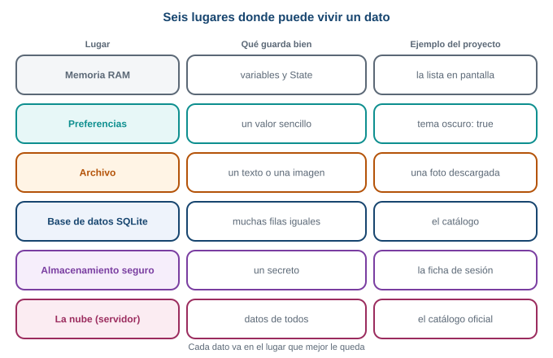{fig-alt="Seis lugares donde puede vivir un dato: memoria RAM, preferencias, archivo, base de datos SQLite, almacenamiento seguro y la nube, con el tipo de dato que guarda bien cada uno y un ejemplo del proyecto"}

Cada lugar guarda bien un tipo de dato distinto.
:::

- **Memoria RAM.** Las variables de tu código. Es rápida y se pierde al cerrar la app.
- **Preferencias.** Pares de clave y valor para ajustes pequeños: tema oscuro, municipio elegido.
- **Archivo.** Un texto o una imagen guardados tal cual en la carpeta de la app.
- **Base de datos SQLite.** Muchas filas con la misma forma, que se pueden filtrar y ordenar: el
  catálogo.
- **Almacenamiento seguro.** Un secreto, como una ficha de sesión. El sistema lo cifra.
- **La nube.** Un servidor propio o de terceros. Lo ven todos los dispositivos, pero necesita internet.

Esta semana usas tres: preferencias, SQLite y almacenamiento seguro. Los archivos existen y se usan
sobre todo para imágenes y documentos; no los necesitas hoy.

::: {.diagrama}
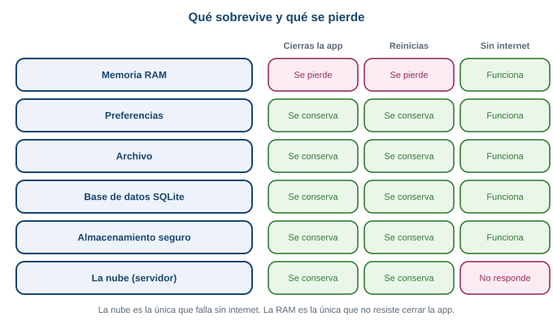{fig-alt="Tabla de qué se conserva al cerrar la app, al reiniciar el celular y sin internet, para cada lugar de almacenamiento: solo la memoria RAM se pierde al cerrar, y solo la nube deja de responder sin internet"}

Qué sobrevive. Solo la memoria RAM se pierde al cerrar la app. Solo la nube falla sin internet.
:::

### Cómo elegir

Una sola pregunta por vez, de arriba hacia abajo, te lleva al lugar correcto:

::: {.diagrama}
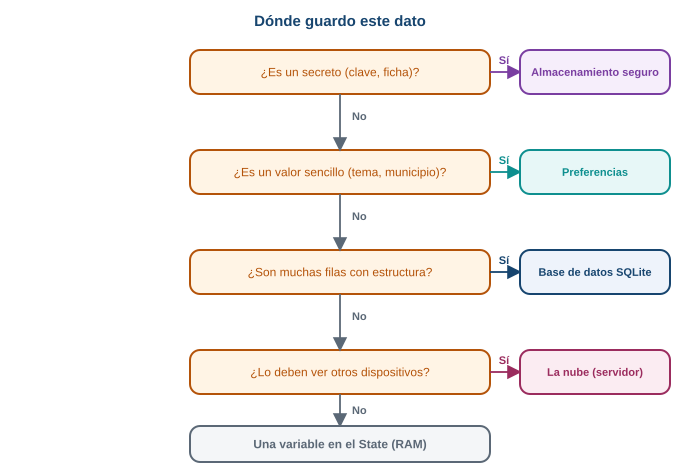{fig-alt="Árbol de decisión: si es un secreto va al almacenamiento seguro; si es un valor sencillo, a preferencias; si son muchas filas con estructura, a SQLite; si lo deben ver otros dispositivos, a la nube; si no, es una variable del State"}

El árbol de decisión. Empieza por la pregunta de arriba.
:::

Aplicado al proyecto:

| Dato | Lugar | Por qué |
|---|---|---|
| La lista que se está viendo ahora | Variable del `State` | Solo importa mientras la pantalla está abierta |
| Si el comprador prefiere el tema oscuro | Preferencias | Un solo valor sencillo |
| El último catálogo descargado | SQLite | Muchas filas iguales: id, nombre, precio, disponible |
| La ficha de sesión del comprador | Almacenamiento seguro | Es un secreto |

### Dónde queda cada cosa en el celular

Cada app tiene una carpeta privada que las demás apps no pueden leer. Ahí quedan las preferencias y
la base de datos. La llave con la que se cifran los secretos la guarda el propio sistema, aparte.

::: {.diagrama}
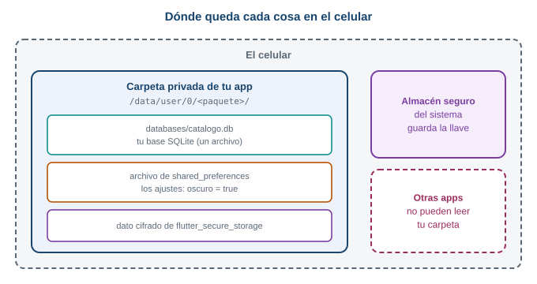{fig-alt="Dentro del celular cada app tiene una carpeta privada con su archivo de base de datos, su archivo de preferencias y su dato cifrado; el almacén seguro del sistema guarda la llave de cifrado aparte y otras apps no pueden leer la carpeta"}

La carpeta privada de tu app.
:::

::: {.callout-important}
## Para memorizar

- Una variable vive solo mientras la app corre. Para que un dato sobreviva, hay que guardarlo.
- Preferencias: un ajuste sencillo. SQLite: muchas filas. Almacenamiento seguro: un secreto.
- Cada app tiene una carpeta privada; las otras apps no la leen.
:::

::: {.callout-note}
## Para razonar, no para memorizar

Ante un dato nuevo no busques "cuál herramienta usar". Pregunta qué tan largo es, si es un secreto y
cuánto debe durar. Con esas tres respuestas el árbol te lleva al lugar.
:::

::: {.callout-tip}
## Para pensar

La lista de productos que ves en pantalla vive en una variable, y el catálogo que guardas vive en
SQLite. ¿Por qué conviene tener los dos y no solo uno? Piensa qué es más rápido de leer y qué
sobrevive a cerrar la app. En la Parte 7 verás cómo trabajan juntos.
:::

## Parte 2. StatefulWidget, repasado completo

En esta semana todo pasa dentro de un `State`: abrir la base de datos, leer los datos y dibujarlos. Si
`StatefulWidget` todavía te queda confuso, no sigas: esta parte lo explica entero, con un ejemplo
mínimo. En la Semana 7 lo viste con otro ejemplo (Parte 3 de esa guía); aquí lo repasas desde cero con
la misma analogía.

### El problema real

La pantalla del catálogo pasa por varias caras: "cargando", la lista, y un aviso si no hay red. La
pantalla **cambia después de haber nacido**, y nadie la reconstruye desde afuera. Necesitas datos que
cambian y una forma de decirle a Flutter que los vuelva a mostrar.

**Predice primero.** Un `StatelessWidget` declara `int cantidad = 0;` como campo, muestra
`Text('$cantidad')` y tiene un botón que hace `cantidad = cantidad + 1`. ¿Compila? Si compilara y
pulsaras el botón tres veces, ¿qué verías?

::: {.callout-warning collapse="true"}
## Comprueba tu predicción

No compila. Un `StatelessWidget` es inmutable: Flutter exige que todos sus campos sean `final`. El
analizador de Dart lo dice así:

```text
warning - This class (or a class that this class inherits from) is marked as '@immutable',
but one or more of its instance fields aren't final: PantallaContador.cantidad
error - Can't define a const constructor for a class with non-final fields
```

Y si movieras la variable dentro de `build`, la pantalla se quedaría en `0` siempre: nadie le pidió a
Flutter que dibuje de nuevo, y cada ejecución de `build` volvería a crear la variable en `0`.
:::

### Qué es el estado

El **estado** es un dato que cambia mientras la pantalla está viva y que la pantalla debe reflejar. Dos
preguntas lo identifican:

1. ¿Este dato puede cambiar mientras la persona usa la pantalla?
2. Si cambia, ¿la pantalla tiene que verse distinta?

Si las dos respuestas son sí, es estado. En el catálogo: la lista de productos y si está cargando son
estado. El título "Catálogo" no lo es, porque nunca cambia.

### Una analogía: el menú impreso y la pizarra

En un restaurante hay dos formas de mostrar el menú del día.

- Un **menú impreso**. Si el tomate sube de precio, hay que imprimir otro menú. El viejo no se corrige
  solo.
- Una **pizarra**. Borras el precio y escribes el nuevo. La pizarra es la misma; lo escrito cambió.

Un `StatelessWidget` es el menú impreso: describe lo que se ve a partir de los datos que recibió, y si
cambian, se construye otro. Un `StatefulWidget` es la pizarra: tiene un lugar donde guardar datos que
cambian y una forma de avisar "reescribí, vuelve a dibujar".

### Las dos clases

Un `StatefulWidget` se escribe con **dos clases**, cada una con un trabajo.

::: {.diagrama}
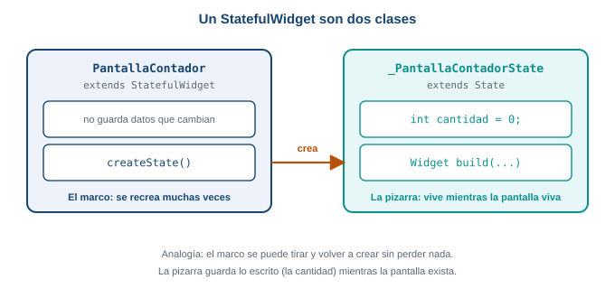{fig-alt="Un StatefulWidget son dos clases: el widget, que es el marco de la pizarra y no cambia, y el State, que es lo escrito en la pizarra y donde viven los datos que cambian"}

Las dos clases. El marco se puede volver a crear; el `State` se conserva mientras la pantalla viva.
:::

- La clase **`StatefulWidget`** es el marco de la pizarra. Es fija y casi no hace nada: solo crea su
  `State`.
- La clase **`State`** es lo escrito en la pizarra. Guarda las variables que cambian y tiene el método
  `build`. Flutter la conserva viva mientras la pantalla exista.

¿Por qué dos? Flutter vuelve a crear los widgets muchas veces porque son baratos. Si el dato viviera en
el widget, se perdería en cada recreación. En el `State`, que Flutter conserva, sobrevive.

Pega esto en `lib/main.dart` de `practica_s08` y ejecuta:

```dart
import 'package:flutter/material.dart';

void main() => runApp(const MaterialApp(home: PantallaContador()));

class PantallaContador extends StatefulWidget {
  const PantallaContador({super.key});

  @override
  State<PantallaContador> createState() => _PantallaContadorState();
}

class _PantallaContadorState extends State<PantallaContador> {
  int cantidad = 0;

  @override
  Widget build(BuildContext context) {
    debugPrint('build con cantidad = $cantidad');
    return Scaffold(
      appBar: AppBar(title: const Text('Cantidad de tomates')),
      body: Center(
        child: Text('$cantidad', style: const TextStyle(fontSize: 48)),
      ),
      floatingActionButton: FloatingActionButton(
        onPressed: () {
          setState(() {
            cantidad = cantidad + 1;
          });
        },
        child: const Icon(Icons.add),
      ),
    );
  }
}
```

Línea por línea:

- `class PantallaContador extends StatefulWidget` es el marco. No tiene variables que cambien.
- `createState() => _PantallaContadorState()` le dice a Flutter qué `State` le corresponde. Flutter lo
  llama una vez, cuando la pantalla nace.
- `class _PantallaContadorState extends State<PantallaContador>` es donde viven los datos. El guion bajo
  del comienzo hace la clase privada de este archivo; es la convención de Dart para todo `State`.
- `int cantidad = 0;` es el estado. Está **fuera** de `build`, así que no se reinicia cuando `build`
  corre de nuevo.
- `debugPrint(...)` escribe en la consola cada vez que `build` corre. Te servirá para ver que `build`
  se repite.
- `setState(() { cantidad = cantidad + 1; })` cambia el dato y avisa a Flutter.

### Qué hace `setState`

`setState` recibe una función y hace tres cosas, en este orden:

1. Ejecuta esa función, que es donde cambias la variable.
2. Marca la pantalla como desactualizada.
3. Pide a Flutter que ejecute `build` otra vez.

`setState` no dibuja nada. Quien dibuja es `build`; `setState` solo pide que vuelva a correr.

::: {.diagrama}
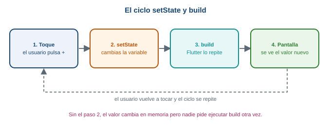{fig-alt="Ciclo de setState: el usuario toca, setState cambia la variable, Flutter vuelve a ejecutar build y la pantalla muestra el valor nuevo"}

El ciclo completo. Cada toque recorre las cuatro cajas.
:::

Pulsa el botón dos veces. En la consola aparece `build con cantidad = 0` al arrancar, y después
`build con cantidad = 1` y `build con cantidad = 2`. Cada toque produjo una ejecución nueva de
`build`.

### Rompe esto: olvida `setState`

Cambia el `onPressed` para que quede sin `setState`:

```dart
onPressed: () {
  cantidad = cantidad + 1;
  debugPrint('cantidad vale $cantidad');
},
```

Pulsa el botón. La consola dice `cantidad vale 1`, `2`, `3`, pero en pantalla sigue el `0` y no aparece
ningún `build con cantidad = ...` nuevo. La variable cambió y nadie pidió a Flutter que corriera
`build`. Cuando una pantalla "no se actualiza", lo primero que se revisa es si el cambio está dentro de
`setState`.

### El ciclo de vida mínimo

Un `State` nace, vive y muere. Flutter llama a tres métodos en esos momentos:

::: {.diagrama}
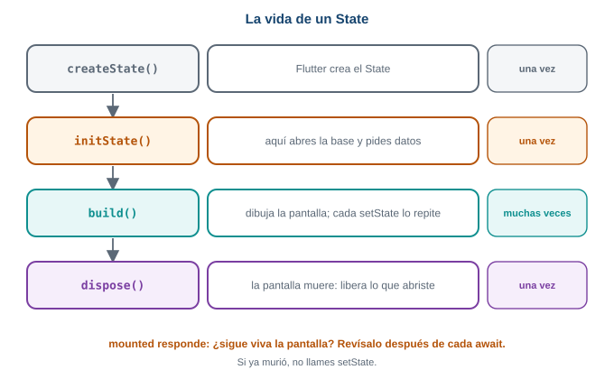{fig-alt="Ciclo de vida de un State: createState e initState corren una vez, build corre muchas veces y dispose corre una vez al final"}

La vida de un `State`. `initState` y `dispose` corren una vez; `build` corre muchas veces.
:::

| Método | Cuándo corre | Para qué lo usas |
|---|---|---|
| `initState` | Una vez, cuando el `State` nace | Arrancar cosas una sola vez. Esta semana: abrir la base y pedir datos |
| `build` | La primera vez y después de cada `setState` | Solo dibujar |
| `dispose` | Una vez, cuando la pantalla muere | Liberar lo que abriste (controladores, temporizadores) |

Dos reglas:

- En `initState` empieza con `super.initState();`, y en `dispose` termina con `super.dispose();`.
- `build` solo dibuja. No abres bases ni pides datos ahí, porque `build` corre muchas veces.

### `initState` y `mounted`, con un ejemplo

Esta pantalla simula una carga lenta: espera tres segundos y cambia el mensaje. Pega esto en
`lib/main.dart`:

```dart
import 'package:flutter/material.dart';

void main() => runApp(const MaterialApp(home: PantallaInicio()));

class PantallaInicio extends StatelessWidget {
  const PantallaInicio({super.key});

  @override
  Widget build(BuildContext context) {
    return Scaffold(
      appBar: AppBar(title: const Text('Inicio')),
      body: Center(
        child: FilledButton(
          onPressed: () {
            Navigator.push(
              context,
              MaterialPageRoute(builder: (context) => const PantallaCarga()),
            );
          },
          child: const Text('Abrir catálogo'),
        ),
      ),
    );
  }
}

class PantallaCarga extends StatefulWidget {
  const PantallaCarga({super.key});

  @override
  State<PantallaCarga> createState() => _PantallaCargaState();
}

class _PantallaCargaState extends State<PantallaCarga> {
  String mensaje = 'Cargando...';

  @override
  void initState() {
    super.initState();
    debugPrint('initState: nace la pantalla');
    cargar();
  }

  Future<void> cargar() async {
    await Future.delayed(const Duration(seconds: 3));
    setState(() {
      mensaje = 'Catálogo listo';
    });
  }

  @override
  void dispose() {
    debugPrint('dispose: muere la pantalla');
    super.dispose();
  }

  @override
  Widget build(BuildContext context) {
    return Scaffold(
      appBar: AppBar(title: const Text('Catálogo')),
      body: Center(child: Text(mensaje, style: const TextStyle(fontSize: 24))),
    );
  }
}
```

Lo importante está en `initState`: llama a `cargar()` **una sola vez** y sigue sin esperarla. `cargar`
es `async`: espera tres segundos con `await` y después cambia el mensaje con `setState`. Mientras
tanto, `build` ya dibujó "Cargando...".

Pulsa "Abrir catálogo" y espera: en la consola ves `initState: nace la pantalla` y a los tres segundos
el mensaje cambia a "Catálogo listo".

**Rompe esto.** Pulsa "Abrir catálogo" y, antes de que pasen tres segundos, vuelve atrás con el gesto
de retroceso. La pantalla murió (`dispose: muere la pantalla`), pero `cargar` sigue esperando. Cuando
termina, llama a `setState` sobre una pantalla que ya no existe:

```text
setState() called after dispose(): _PantallaCargaState#f0ecb(lifecycle state: defunct, not mounted)
This error happens if you call setState() on a State object for a widget that no longer appears in
the widget tree (e.g., whose parent widget no longer includes the widget in its build).
```

El número después de `#` cambia en cada ejecución. La solución es una propiedad del `State`,
**`mounted`**, que vale `true` mientras la pantalla está viva. Se revisa **después de cada `await`**,
antes de llamar a `setState`:

```dart
Future<void> cargar() async {
  await Future.delayed(const Duration(seconds: 3));
  if (!mounted) return;
  setState(() {
    mensaje = 'Catálogo listo';
  });
}
```

Léelo como: "si la pantalla ya murió, no hagas nada". Repite la prueba: ahora puedes volver atrás
antes de los tres segundos y no aparece ningún error.

::: {.callout-note}
Con `await`, el código se detiene en esa línea y el resto de la función espera, pero la pantalla sigue
funcionando. Por eso, cuando la función continúa, el mundo pudo haber cambiado: es el motivo de revisar
`mounted`.
:::

### Lo que haremos esta semana con esto

La carga del catálogo guardado sigue el mismo patrón, solo que en lugar de `Future.delayed` espera a la
base de datos:

::: {.diagrama}
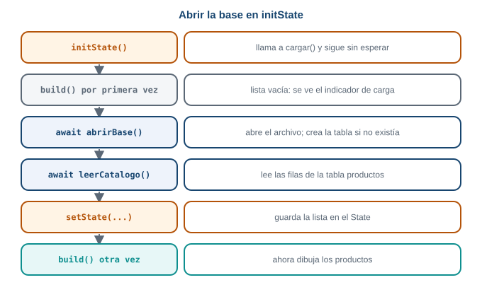{fig-alt="Línea de tiempo de la pantalla: initState llama a cargar, build dibuja la lista vacía, cargar espera con await a que se abra la base y lea las filas, setState guarda la lista y build dibuja los productos"}

Abrir la base en `initState` y pintar con `setState`. Es el mismo patrón de la carga de tres segundos.
:::

::: {.callout-important}
## Para memorizar

- Estado: un dato que cambia y que la pantalla debe mostrar.
- Dos clases: el `StatefulWidget` crea el `State`; el `State` guarda los datos y tiene `build`.
- Cambia el dato **dentro de** `setState`. `setState` pide que `build` corra de nuevo.
- `initState` corre una vez; `dispose` corre al morir.
- Después de un `await`: `if (!mounted) return;` antes de `setState`.
:::

::: {.callout-note}
## Para razonar, no para memorizar

¿Por qué `build` no puede abrir la base de datos? Porque `build` corre cada vez que hay un cambio, y
abrir la base en cada cambio sería lento y repetido. Lo que debe pasar una sola vez va en `initState`;
lo que se repite va en `build`. Con esa regla de "una vez o muchas veces" decides dónde va cada cosa.
:::

::: {.callout-tip}
## Para pensar

En `cargar`, `setState` queda después de un `await`. Si en lugar de volver atrás el usuario girara el
celular y Flutter reconstruyera la pantalla, ¿se perdería `mensaje`? Piensa en qué clase vive y por qué
Flutter la conserva.
:::

## Parte 3. Preferencias: guardar un ajuste sencillo

### El problema real

El comprador activa el tema oscuro. Cierra la app, la abre al día siguiente y el tema vuelve a ser
claro. Tiene que activarlo de nuevo cada vez. Un ajuste tan pequeño como "tema oscuro: sí o no" debe
sobrevivir al cierre de la app, y para eso existen las **preferencias**.

**Predice primero.** Tu app guarda `oscuro = true` en una variable del `State` y la muestra con un
`Switch`. El comprador activa el interruptor, cierra la app y la abre otra vez. ¿Cómo aparece el
interruptor?

::: {.callout-warning collapse="true"}
## Comprueba tu predicción

Apagado. La variable vivía en la memoria RAM y se perdió al cerrar la app (Parte 1). Hay que guardar el
valor en un lugar que sobreviva, y leerlo cuando la app arranca.
:::

### Modelo mental: un cuaderno de pares clave y valor

Las preferencias son un archivo pequeño de **pares clave y valor**. La clave es un nombre que tú
escoges (`'oscuro'`) y el valor es el dato (`true`). Guardar es escribir un par; leer es preguntar por
la clave.

::: {.diagrama}
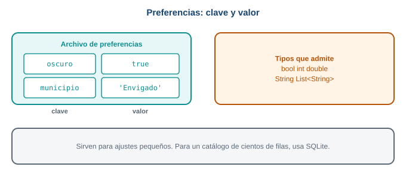{fig-alt="Las preferencias son pares de clave y valor: la clave oscuro guarda un booleano; solo admiten bool, int, double, String y lista de String, y son para datos pequeños"}

Un archivo de preferencias. Cada fila es una clave y su valor.
:::

Tienen límites que debes conocer. Según la documentación de Flutter, solo admiten tipos primitivos
(`int`, `double`, `bool`, `String` y `List<String>`), no están hechas para guardar grandes cantidades de
datos y no garantizan que lo escrito sobreviva en todos los casos. Por eso sirven para ajustes, y no
para un catálogo.

### Paso 1. El tema oscuro sin guardar

Primero la versión que **no** sobrevive. Pega esto en `lib/main.dart`:

```dart
import 'package:flutter/material.dart';

void main() => runApp(const MiApp());

class MiApp extends StatefulWidget {
  const MiApp({super.key});

  @override
  State<MiApp> createState() => _MiAppState();
}

class _MiAppState extends State<MiApp> {
  bool oscuro = false;

  @override
  Widget build(BuildContext context) {
    return MaterialApp(
      theme: ThemeData.light(),
      darkTheme: ThemeData.dark(),
      themeMode: oscuro ? ThemeMode.dark : ThemeMode.light,
      home: Scaffold(
        appBar: AppBar(title: const Text('Preferencias')),
        body: Center(
          child: SwitchListTile(
            title: const Text('Tema oscuro'),
            value: oscuro,
            onChanged: (valor) {
              setState(() {
                oscuro = valor;
              });
            },
          ),
        ),
      ),
    );
  }
}
```

La variable `oscuro` es estado: cambia con el interruptor y la pantalla debe verse distinta. Por eso
vive en un `State` y se cambia dentro de `setState`, como en la Parte 2. Enciéndelo y se ve oscuro.
Ciérrala y ábrela: vuelve a claro.

### Paso 2. Guardar con `SharedPreferencesAsync`

Importa el paquete y crea el objeto que guarda y lee:

```dart
import 'package:shared_preferences/shared_preferences.dart';

final prefs = SharedPreferencesAsync();
```

Para guardar el valor:

```dart
await prefs.setBool('oscuro', true);
```

Para leerlo:

```dart
final guardado = await prefs.getBool('oscuro');
```

Hay tres cosas nuevas en esas dos líneas:

- `setBool` guarda un `bool` bajo la clave `'oscuro'`. Hay uno por tipo: `setInt`, `setDouble`,
  `setString`, `setStringList`.
- **Las dos son asíncronas.** Escribir y leer del disco toma tiempo, así que devuelven un `Future` y se
  usan con `await`, dentro de una función `async`.
- `getBool` devuelve `bool?`, con un signo de interrogación. Si nunca guardaste esa clave, devuelve
  `null`. La primera vez que se abre la app no hay nada guardado.

::: {.callout-note}
La documentación de `shared_preferences` recomienda para código nuevo las clases `SharedPreferencesAsync`
y `SharedPreferencesWithCache`. Existe también la clase clásica, `SharedPreferences`, con
`SharedPreferences.getInstance()`, que verás en tutoriales antiguos: la documentación avisa que se
deprecará más adelante. En esta guía usas solo `SharedPreferencesAsync`, la más simple.
:::

### Paso 3. Leer al arrancar, en `initState`

Hay que leer el valor guardado al nacer la pantalla. Eso ocurre una sola vez, así que va en
`initState`. Como leer es asíncrono, `initState` llama a una función `async` aparte, igual que en la
Parte 2:

```dart
class _MiAppState extends State<MiApp> {
  final prefs = SharedPreferencesAsync();
  bool oscuro = false;

  @override
  void initState() {
    super.initState();
    cargarTema();
  }

  Future<void> cargarTema() async {
    final guardado = await prefs.getBool('oscuro') ?? false;
    if (!mounted) return;
    setState(() {
      oscuro = guardado;
    });
  }
```

Línea por línea:

- `await prefs.getBool('oscuro') ?? false` lee el valor y, si es `null` (primera vez), usa `false`.
- `if (!mounted) return;` es la revisión de la Parte 2, después del `await`.
- `setState` guarda el valor leído en `oscuro` y pide dibujar de nuevo.

Mientras se lee, `build` ya dibujó con `oscuro = false`; cuando llega el valor, `setState` repinta.

### Paso 4. Guardar al cambiar

Cuando el comprador mueve el interruptor, guardas el valor nuevo además de cambiar la variable:

```dart
  Future<void> cambiarTema(bool valor) async {
    setState(() {
      oscuro = valor;
    });
    await prefs.setBool('oscuro', valor);
  }
```

Primero se cambia la pantalla, y después se escribe en el disco. El `Switch` llama a esta función con
`onChanged: cambiarTema`.

Este es el archivo completo:

```dart
import 'package:flutter/material.dart';
import 'package:shared_preferences/shared_preferences.dart';

void main() => runApp(const MiApp());

class MiApp extends StatefulWidget {
  const MiApp({super.key});

  @override
  State<MiApp> createState() => _MiAppState();
}

class _MiAppState extends State<MiApp> {
  final prefs = SharedPreferencesAsync();
  bool oscuro = false;

  @override
  void initState() {
    super.initState();
    cargarTema();
  }

  Future<void> cargarTema() async {
    final guardado = await prefs.getBool('oscuro') ?? false;
    if (!mounted) return;
    setState(() {
      oscuro = guardado;
    });
  }

  Future<void> cambiarTema(bool valor) async {
    setState(() {
      oscuro = valor;
    });
    await prefs.setBool('oscuro', valor);
  }

  @override
  Widget build(BuildContext context) {
    return MaterialApp(
      theme: ThemeData.light(),
      darkTheme: ThemeData.dark(),
      themeMode: oscuro ? ThemeMode.dark : ThemeMode.light,
      home: Scaffold(
        appBar: AppBar(title: const Text('Preferencias')),
        body: Center(
          child: SwitchListTile(
            title: const Text('Tema oscuro'),
            value: oscuro,
            onChanged: cambiarTema,
          ),
        ),
      ),
    );
  }
}
```

Pruébalo: enciende el interruptor, cierra la app deslizándola desde las apps recientes y ábrela de
nuevo. El tema oscuro sigue activo, porque `initState` leyó `true` del archivo de preferencias.

### Qué pasa si...

- **Nunca guardaste esa clave.** `getBool` devuelve `null`, y por eso el `?? false`. Sin ese valor por
  defecto, `oscuro` sería `bool?` y el `Switch` no acepta `null`.
- **Olvidas el `await` al leer.** `prefs.getBool('oscuro')` devuelve un `Future<bool?>`, no un `bool`.
  Si lo asignas a una variable `bool`, Dart no compila. El `await` es lo que convierte el `Future` en
  el valor.
- **Guardas con una clave y lees con otra** (`'oscuro'` y `'Oscuro'`). Las claves distinguen
  mayúsculas: lees `null` y parece que no se guardó nada. Define el texto de la clave una sola vez.

::: {.callout-important}
## Para memorizar

- Preferencias: pares clave y valor, para ajustes pequeños.
- `SharedPreferencesAsync`: `setBool`/`getBool`, `setString`/`getString`, `setInt`/`getInt`. Todas con
  `await`.
- Leer devuelve `null` si la clave no existe: usa `?? valorPorDefecto`.
- Se lee en `initState` y se guarda al cambiar el valor.
:::

::: {.callout-note}
## Para razonar, no para memorizar

¿Por qué leer y guardar son asíncronos? Porque tocan el disco, que es mucho más lento que la memoria.
Si fueran instantáneos, la pantalla se congelaría mientras espera. Un `Future` deja que la app siga
funcionando y avise cuando termina. Es la misma idea de la petición de red de la Semana 7.
:::

::: {.callout-tip}
## Reto 1. Guarda el municipio

Agrega un `TextField` y un botón "Guardar" que guarden el municipio del comprador (por ejemplo,
`'Envigado'`) con la clave `'municipio'`. Al abrir la app, el campo debe mostrar el municipio guardado.
Pista: necesitas un `TextEditingController`, y recuerda hacerle `dispose`.
:::

::: {.callout-note collapse="true"}
## Solución del Reto 1

```dart
import 'package:flutter/material.dart';
import 'package:shared_preferences/shared_preferences.dart';

void main() => runApp(const MaterialApp(home: PantallaMunicipio()));

class PantallaMunicipio extends StatefulWidget {
  const PantallaMunicipio({super.key});

  @override
  State<PantallaMunicipio> createState() => _PantallaMunicipioState();
}

class _PantallaMunicipioState extends State<PantallaMunicipio> {
  final prefs = SharedPreferencesAsync();
  final controlador = TextEditingController();

  @override
  void initState() {
    super.initState();
    cargar();
  }

  Future<void> cargar() async {
    final guardado = await prefs.getString('municipio') ?? '';
    if (!mounted) return;
    controlador.text = guardado;
  }

  Future<void> guardar() async {
    await prefs.setString('municipio', controlador.text);
  }

  @override
  void dispose() {
    controlador.dispose();
    super.dispose();
  }

  @override
  Widget build(BuildContext context) {
    return Scaffold(
      appBar: AppBar(title: const Text('Municipio')),
      body: Padding(
        padding: const EdgeInsets.all(16),
        child: Column(
          children: [
            TextField(controller: controlador),
            const SizedBox(height: 16),
            FilledButton(onPressed: guardar, child: const Text('Guardar')),
          ],
        ),
      ),
    );
  }
}
```

Aquí no hace falta `setState` al cargar: asignar `controlador.text` ya actualiza el campo, porque el
`TextField` escucha a su controlador. Y `dispose` libera el controlador cuando la pantalla muere, que es
el uso típico de `dispose`.
:::

### Conexión con el proyecto

En el catálogo de la Parte 7, el tema oscuro del comprador usa exactamente este código: un `MiApp`
con `initState`, `cargarTema` y `cambiarTema`. El catálogo, en cambio, no va en preferencias: son
muchas filas, y para eso sirve SQLite.

## Parte 4. SQLite sin miedo

### El problema real

El catálogo tiene 27 productos, cada uno con id, nombre, precio y si está disponible. Si lo guardas en
preferencias, tendrías que inventar una clave por cada dato (`'nombre_1'`, `'precio_1'`, `'nombre_2'`...)
y no podrías pedir "solo los disponibles". Una **base de datos** resuelve las dos cosas: guarda filas
con la misma forma y permite preguntarles cosas.

**Predice primero.** Tienes una hoja de cálculo con productos: una fila por producto y una columna por
dato (id, nombre, precio, disponible). ¿Qué parte de una base de datos relacional se parece a la hoja,
qué a una fila y qué a una columna?

::: {.callout-warning collapse="true"}
## Comprueba tu predicción

La hoja entera es una **tabla**. Cada fila de la hoja es una **fila** de la tabla (un producto) y cada
columna es una **columna** (un dato que todos los productos tienen). Una tabla de SQLite es, casi
literalmente, una hoja de cálculo con reglas.
:::

### Modelo mental: una tabla con reglas

**SQLite** es una base de datos que vive dentro de un solo archivo en el celular. No hay servidor ni
instalación: tu app lee y escribe ese archivo. Es **relacional**: los datos se organizan en tablas.

::: {.diagrama}
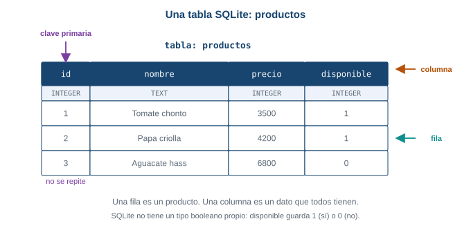{fig-alt="Partes de una tabla SQLite: la tabla productos tiene cuatro columnas, cada producto es una fila y la columna id es la clave primaria"}

La tabla `productos`. Cada columna tiene un nombre y un tipo.
:::

- La **tabla** (`productos`) agrupa filas de la misma forma.
- Una **columna** es un dato que todas las filas tienen: `id`, `nombre`, `precio`, `disponible`. Cada
  una tiene un tipo: `INTEGER` (número entero), `TEXT` (texto), `REAL` (número con decimales).
- Una **fila** es un producto completo.
- La **clave primaria** (`id`) identifica cada fila y no se puede repetir. Dos productos no pueden
  tener el mismo `id`.

SQLite no tiene un tipo booleano propio. Un `bool` de Dart se guarda como número: `1` para `true`, `0`
para `false`. Lo harás en la Parte 5.

### SQL: el idioma de las preguntas

Para hablar con la base se usa **SQL**, un lenguaje con pocas palabras. Cuatro sentencias cubren casi
todo, una por cada operación sobre los datos:

::: {.diagrama}
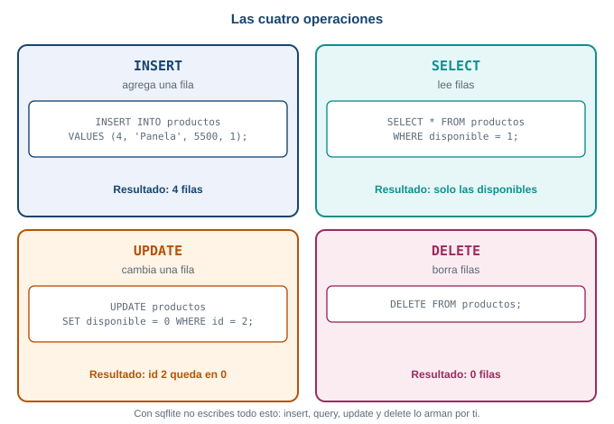{fig-alt="Las cuatro operaciones de SQL sobre la tabla productos: INSERT agrega una fila, SELECT lee, UPDATE cambia y DELETE borra"}

Las cuatro operaciones. Por convención, las palabras de SQL se escriben en mayúsculas.
:::

| Operación | Sentencia | Qué hace |
|---|---|---|
| Crear la tabla | `CREATE TABLE productos(id INTEGER PRIMARY KEY, nombre TEXT, precio INTEGER, disponible INTEGER)` | Define las columnas, una sola vez |
| Agregar | `INSERT INTO productos VALUES (4, 'Panela', 5500, 1)` | Agrega una fila |
| Leer | `SELECT * FROM productos WHERE disponible = 1` | Devuelve las filas que cumplen la condición |
| Cambiar | `UPDATE productos SET disponible = 0 WHERE id = 2` | Cambia una columna de las filas que cumplen |
| Borrar | `DELETE FROM productos` | Borra filas |

El `*` significa "todas las columnas". `WHERE` filtra: sin él, la sentencia afecta **todas** las filas.

### Haz esto ahora

Sin escribir código, imagina esta tabla:

| id | nombre | precio | disponible |
|---|---|---|---|
| 1 | Tomate chonto | 3500 | 1 |
| 2 | Papa criolla | 4200 | 1 |
| 3 | Aguacate hass | 6800 | 0 |

Responde en papel qué devuelve o cómo queda la tabla con cada sentencia, en este orden:

1. `SELECT nombre, precio FROM productos WHERE disponible = 1`
2. `UPDATE productos SET disponible = 0 WHERE id = 2`, y después la sentencia 1 otra vez
3. `DELETE FROM productos`

::: {.callout-note collapse="true"}
## Resultado

1. Dos filas: `Tomate chonto, 3500` y `Papa criolla, 4200`. El aguacate no sale porque su `disponible` es
   0. Con `SELECT nombre, precio` pides solo esas dos columnas.
2. El `UPDATE` cambia la fila con `id = 2`: la papa queda con `disponible = 0`. La sentencia 1 ahora
   devuelve una sola fila: `Tomate chonto, 3500`.
3. La tabla queda con cero filas. La tabla sigue existiendo, vacía.

Estos resultados se comprobaron ejecutando exactamente esas sentencias en SQLite.
:::

### Qué pasa si...

- **Olvidas el `WHERE` en un `UPDATE` o un `DELETE`.** Afecta todas las filas. Es el error más caro de
  SQL: antes de ejecutar una de esas sentencias, revisa que tenga su `WHERE`.
- **Insertas dos filas con el mismo `id`.** La clave primaria no se puede repetir y SQLite rechaza la
  segunda. Lo verás con su mensaje real en la Parte 5.
- **Escribes mal una palabra de SQL** (`SELEC`). SQLite responde con un error de sintaxis que señala
  la palabra: lo verás en la sección de errores.

::: {.callout-note}
SQLite hace mucho más, pero esta semana no lo necesitas: **transacciones** (varias operaciones que
ocurren todas o ninguna), **lotes** (`batch`, muchas operaciones juntas), **índices** (acelerar
búsquedas en tablas grandes) y **migraciones** (cambiar la forma de la tabla en una versión nueva de la
app). Existen, y las usarás cuando una tabla crezca. Para un catálogo de 27 filas, no hacen falta.
:::

::: {.callout-important}
## Para memorizar

- Tabla, fila, columna y clave primaria (`id`, no se repite).
- Las cuatro sentencias: `INSERT` agrega, `SELECT` lee, `UPDATE` cambia, `DELETE` borra.
- `WHERE` filtra. Sin `WHERE`, `UPDATE` y `DELETE` afectan todas las filas.
- `bool` se guarda como `1` o `0`.
:::

::: {.callout-note}
## Para razonar, no para memorizar

¿Por qué usar una base y no preferencias para el catálogo? Mira lo que pides: "las filas con
`disponible = 1`". Una base entiende esa pregunta porque sabe qué es una fila y una columna. Un archivo
de pares clave y valor no sabe qué es "disponible"; tendrías que leerlo todo y filtrar a mano. La
estructura es lo que hace útil a la base.
:::

::: {.callout-tip}
## Para pensar

El `id` de cada producto es la clave primaria. En el servicio de práctica, cada producto trae su propio
`id`. ¿Qué pasaría si dos productos de distintos productores llegaran con el mismo `id`? Piensa si el
`id` solo alcanza para identificar un producto cuando el catálogo reúne varios productores.
:::

## Parte 5. `sqflite` paso a paso

### El problema real

Ya sabes qué es una tabla y qué hacen las cuatro sentencias. Falta que tu app Flutter las use.
`sqflite` es el paquete que abre el archivo SQLite en Android e iOS y te deja ejecutar SQL. Vas a
escribir un archivo de ayuda, `base_datos.dart`, con cinco piezas pequeñas: el modelo, abrir la base,
borrar, guardar y leer.

**Predice primero.** Guardas tres productos en la tabla: dos con `disponible` en `true` y uno en
`false`. Después lees con la condición `disponible = 1`. ¿Cuántas filas llegan a tu pantalla?

::: {.callout-warning collapse="true"}
## Comprueba tu predicción

Dos. La tercera fila sí quedó guardada en la tabla, pero la condición `disponible = 1` la deja fuera de
la lectura. Es la regla RN-04 del proyecto: un producto que deja de estar disponible no se muestra.
:::

### Paso 1. El modelo `Producto`

Crea `lib/base_datos.dart`. Empieza por la clase que representa una fila: es el `Producto` de la
Semana 7, con los mismos cuatro campos.

```dart
class Producto {
  final int id;
  final String nombre;
  final int precio;
  final bool disponible;

  const Producto({
    required this.id,
    required this.nombre,
    required this.precio,
    required this.disponible,
  });
}
```

::: {.callout-note}
Si en la Semana 7 tu `Producto` está en `lib/modelo.dart`, déjalo ahí o muévelo aquí; lo importante es
que exista una sola clase `Producto`. En esta guía el archivo de ayuda lo contiene para mantener todo
en dos archivos.
:::

### Paso 2. Abrir la base y crear la tabla

Agrega los `import` arriba del archivo, y debajo de la clase, la función que abre la base:

```dart
import 'package:path/path.dart';
import 'package:sqflite/sqflite.dart';

Database? _base;

Future<Database> abrirBase() async {
  _base ??= await openDatabase(
    join(await getDatabasesPath(), 'catalogo.db'),
    version: 1,
    onCreate: (db, version) {
      return db.execute(
        'CREATE TABLE productos('
        'id INTEGER PRIMARY KEY, '
        'nombre TEXT, '
        'precio INTEGER, '
        'disponible INTEGER)',
      );
    },
  );
  return _base!;
}
```

Línea por línea:

- `getDatabasesPath()` devuelve la carpeta donde Android guarda las bases de datos de tu app. Es
  asíncrona, por eso lleva `await`.
- `join(carpeta, 'catalogo.db')` es del paquete `path`: une la carpeta y el nombre del archivo con el
  separador correcto del sistema. El resultado es una ruta como
  `/data/user/0/<paquete>/databases/catalogo.db`, que se vio al ejecutar la guía.
- `openDatabase(ruta, ...)` abre el archivo. Si no existe, lo crea.
- `version: 1` es el número de versión de la forma de la base. Por ahora, siempre `1`.
- `onCreate` corre **una sola vez**: cuando el archivo se crea por primera vez. Ahí se ejecuta
  `CREATE TABLE`, con las mismas cuatro columnas del modelo. El texto grande se escribió en cuatro
  partes pegadas para que se lea mejor.
- `Database? _base;` y `_base ??= await openDatabase(...)` guardan la base ya abierta. `??=` se lee
  "si `_base` es `null`, asígnale esto". Así la primera llamada abre el archivo y las siguientes
  reutilizan la misma conexión.

::: {.callout-important}
`onCreate` solo corre cuando el archivo **no existe**. Si ejecutas la app, y después le cambias el
`CREATE TABLE` (agregas una columna, o cambias un nombre), el archivo viejo ya existe y `onCreate` no
vuelve a correr. Tu cambio no se aplica. En esta semana la solución es borrar el archivo viejo
desinstalando la app del emulador. La forma de cambiar una tabla con datos (las migraciones con
`onUpgrade`) existe, pero queda fuera de esta guía.
:::

### Paso 3. De `Producto` a `Map` y de vuelta

`sqflite` no guarda objetos `Producto`. Recibe y devuelve **mapas**: un `Map<String, Object?>` donde
cada clave es el nombre de una columna. Hay que convertir en los dos sentidos. Agrega dentro de la clase
`Producto`, después del constructor:

```dart
  Map<String, Object?> toMap() {
    return {
      'id': id,
      'nombre': nombre,
      'precio': precio,
      'disponible': disponible ? 1 : 0,
    };
  }

  factory Producto.fromMap(Map<String, Object?> mapa) {
    return Producto(
      id: mapa['id'] as int,
      nombre: mapa['nombre'] as String,
      precio: mapa['precio'] as int,
      disponible: mapa['disponible'] == 1,
    );
  }
```

::: {.diagrama}
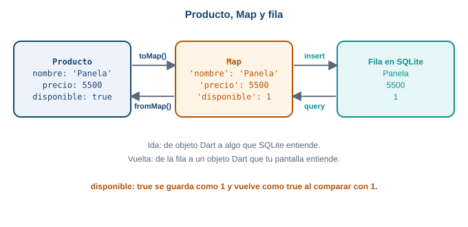{fig-alt="Conversión de Producto a Map con toMap y a fila de SQLite al guardar, y de la fila a Map y a Producto con fromMap al leer"}

Ida y vuelta. `toMap` prepara el objeto para guardarlo; `fromMap` reconstruye el objeto al leer.
:::

- `toMap` arma el mapa con una clave por columna. `disponible ? 1 : 0` convierte el `bool` en el
  número que SQLite entiende.
- `fromMap` hace lo contrario. Los `as int` y `as String` le dicen a Dart el tipo de cada dato, porque
  el mapa los devuelve como `Object?`. `mapa['disponible'] == 1` convierte el número de vuelta a `bool`.
- `factory` es un constructor que crea el objeto a partir de otra cosa, aquí un mapa. Es la misma
  idea de `Producto.fromJson` de la Semana 7.

### Paso 4. Borrar, guardar y leer

Tres funciones al final del archivo, una por operación. Cada una empieza pidiendo la base con
`abrirBase()`:

```dart
Future<void> borrarCatalogo() async {
  final db = await abrirBase();
  await db.delete('productos');
}

Future<void> guardarCatalogo(List<Producto> productos) async {
  final db = await abrirBase();
  await borrarCatalogo();
  for (final producto in productos) {
    await db.insert('productos', producto.toMap());
  }
}

Future<List<Producto>> leerCatalogo() async {
  final db = await abrirBase();
  final filas = await db.query(
    'productos',
    where: 'disponible = ?',
    whereArgs: [1],
  );
  return [for (final fila in filas) Producto.fromMap(fila)];
}
```

- `db.delete('productos')` es `DELETE FROM productos`: borra todas las filas.
- `db.insert('productos', producto.toMap())` es un `INSERT`: agrega una fila con los valores del mapa.
- `guardarCatalogo` primero borra lo viejo y luego inserta lo nuevo, para que el catálogo guardado
  siempre sea una copia limpia del último recibido. Así no quedan filas repetidas ni choques con la
  clave primaria.
- `db.query('productos', where: ..., whereArgs: ...)` es un `SELECT` con `WHERE`. El signo `?` es un
  hueco, y `whereArgs` trae el valor que va en él. Nunca armes el `WHERE` pegando texto
  (`'disponible = $x'`): la documentación de Flutter lo desaconseja por seguridad.
- `query` devuelve una `List<Map<String, Object?>>`, una lista de filas. `[for (...) ...]` las convierte
  en una lista de `Producto`.
- Cada una de estas funciones es `async` y se llama con `await`, porque tocar la base toma tiempo.

### Paso 5. Una pantalla para comprobarlo

Pega esto en `lib/main.dart`. Es una pantalla mínima: dos botones y un texto con las filas leídas.

```dart
import 'package:flutter/material.dart';

import 'base_datos.dart';

void main() => runApp(const MaterialApp(home: PruebaBase()));

class PruebaBase extends StatefulWidget {
  const PruebaBase({super.key});

  @override
  State<PruebaBase> createState() => _PruebaBaseState();
}

class _PruebaBaseState extends State<PruebaBase> {
  List<Producto> productos = [];

  @override
  void initState() {
    super.initState();
    leer();
  }

  Future<void> leer() async {
    final lista = await leerCatalogo();
    if (!mounted) return;
    setState(() {
      productos = lista;
    });
  }

  Future<void> guardar() async {
    await guardarCatalogo(const [
      Producto(id: 1, nombre: 'Tomate chonto', precio: 3500, disponible: true),
      Producto(id: 2, nombre: 'Papa criolla', precio: 4200, disponible: true),
      Producto(id: 3, nombre: 'Aguacate hass', precio: 6800, disponible: false),
    ]);
    await leer();
  }

  Future<void> borrar() async {
    await borrarCatalogo();
    await leer();
  }

  @override
  Widget build(BuildContext context) {
    return Scaffold(
      appBar: AppBar(title: const Text('Prueba de SQLite')),
      body: Column(
        children: [
          Row(
            mainAxisAlignment: MainAxisAlignment.spaceEvenly,
            children: [
              FilledButton(onPressed: guardar, child: const Text('Guardar')),
              FilledButton(onPressed: borrar, child: const Text('Borrar todo')),
            ],
          ),
          Text('Filas leídas: ${productos.length}'),
          for (final p in productos) Text('${p.id}  ${p.nombre}  \$${p.precio}'),
        ],
      ),
    );
  }
}
```

Fíjate en el patrón de la Parte 2: `initState` llama a `leer()` una sola vez; `leer` espera la base con
`await`, revisa `mounted` y pinta con `setState`. Para dibujar la lista se usa un `for` dentro de la
lista `children`.

Ejecuta la app en el emulador y haz esta secuencia:

1. Abre la app. Dice `Filas leídas: 0`: la tabla se creó vacía.
2. Pulsa **Guardar**. Aparecen dos filas (la 1 y la 2). La 3 está guardada, pero `disponible` es
   `false` y la lectura la deja fuera.
3. **Cierra la app** deslizándola y ábrela otra vez. Siguen las dos filas: leíste de un archivo, y los
   datos sobrevivieron. Aquí está la diferencia con una variable.
4. Pulsa **Borrar todo**. Vuelve `Filas leídas: 0`.

### Qué pasa si...

- **Insertas dos veces el mismo `id`.** Si quitas la línea `await borrarCatalogo();` de
  `guardarCatalogo` y pulsas "Guardar" dos veces, la segunda inserción del `id` 1 la rechaza la clave
  primaria:

  ```text
  DatabaseException(UNIQUE constraint failed: productos.id (code 1555 SQLITE_CONSTRAINT_PRIMARYKEY))
  sql 'INSERT INTO productos (id, nombre, precio, disponible) VALUES (?, ?, ?, ?)' args [1, x, 1, 1]
  ```

  Por eso `guardarCatalogo` borra primero.
- **Consultas una tabla que no existe.** Mira la sección de errores: el mensaje es `no such table`.
- **Cierras la base y la sigues usando.** Mira también la sección de errores.

::: {.callout-important}
## Para memorizar

- `openDatabase(ruta, version: 1, onCreate: ...)`. `onCreate` corre solo cuando el archivo es nuevo.
- La ruta: `join(await getDatabasesPath(), 'catalogo.db')`.
- `insert`, `query`, `delete` (y `update`) reciben el nombre de la tabla. Todas con `await`.
- Para `sqflite`, `bool` no existe: se guarda `1` o `0`.
- `where` con `?` y `whereArgs`, nunca con texto pegado.
:::

::: {.callout-note}
## Para razonar, no para memorizar

Piensa en tres capas: tu pantalla habla con `Producto`; `toMap` y `fromMap` traducen; `sqflite` habla
con SQLite. Si algo sale mal, pregunta en qué capa: ¿la pantalla no se repinta (falta `setState`)?, ¿el
objeto no se convierte bien (revisa `toMap`/`fromMap`)? o ¿la base se queja (lee el mensaje de
`DatabaseException`)? Cada capa tiene su tipo de síntoma.
:::

::: {.callout-tip}
## Para pensar

`guardarCatalogo` borra todo y vuelve a insertar. Si la app se cierra justo entre el `delete` y el
último `insert`, ¿qué queda en la tabla? Existe una herramienta, las **transacciones**, que hace que
varias operaciones ocurran todas o ninguna. Piensa por qué importaría aquí.
:::

## Parte 6. Almacenamiento seguro

### El problema real

En la Semana 10 el comprador va a iniciar sesión, y la app recibirá una **ficha de sesión**: un texto
largo que demuestra quién es. Si la app la pierde, el comprador tiene que iniciar sesión cada vez. Pero
esa ficha es un secreto: quien la tenga puede hacerse pasar por el comprador. ¿Dónde se guarda?

Esta semana no hay inicio de sesión real. Simulas la ficha con un texto cualquiera, para aprender el
mecanismo.

**Predice primero.** Guardas la ficha de sesión en preferencias, con `setString('ficha', ...)`. Funciona:
sobrevive al cerrar la app. ¿Por qué aun así es una mala idea?

::: {.callout-warning collapse="true"}
## Comprueba tu predicción

Porque las preferencias guardan los valores como texto normal en un archivo de la carpeta de la app. Si
alguien consigue leer ese archivo (por ejemplo, desde una copia de seguridad del celular o un
dispositivo con permisos de administrador), ve la ficha tal cual. Las preferencias están hechas para
ajustes, no para secretos.
:::

### Modelo mental: la caja fuerte del sistema

El almacenamiento seguro funciona como una caja fuerte con dos partes:

- El dato se guarda **cifrado**: transformado en un texto que no se puede leer sin la llave.
- La **llave** no la guarda tu app. La guarda el sistema operativo en un lugar protegido.

::: {.diagrama}
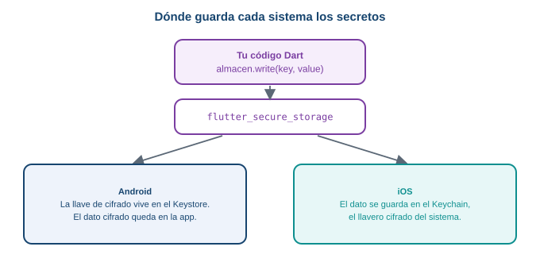{fig-alt="Con flutter_secure_storage, en Android el dato se cifra con una llave guardada en el Keystore y en iOS se guarda en el Keychain; tu código es el mismo en ambos"}

Tu código es el mismo en los dos sistemas. Cada sistema usa su propia caja fuerte.
:::

El paquete `flutter_secure_storage` esconde esa diferencia. Tú escribes y lees con tres métodos. En
Android, el sistema guarda la llave de cifrado en el **Keystore** y el dato cifrado queda en la carpeta
privada de la app. En iOS, el dato se guarda en el **Keychain**, el llavero cifrado del sistema. No
necesitas conocer los detalles del cifrado para usarlo.

::: {.callout-note}
Según la documentación del paquete, en Android necesita la versión mínima 23 (Android 6.0), y
`encryptedSharedPreferences` ya no se recomienda. No necesitas pasar ninguna opción: el constructor
`FlutterSecureStorage()` sin argumentos usa la configuración actual.
:::

### Guardar, leer y borrar

```dart
const almacen = FlutterSecureStorage();

await almacen.write(key: 'ficha_sesion', value: 'ficha-demo-12345');   // guardar
final ficha = await almacen.read(key: 'ficha_sesion');                 // leer
await almacen.delete(key: 'ficha_sesion');                            // borrar
```

- Los tres métodos son asíncronos: llevan `await`.
- `write` y `read` usan **parámetros con nombre** (`key:` y `value:`).
- `read` devuelve `String?`: si la clave no existe, devuelve `null`.
- Solo guarda texto (`String`). Si necesitas guardar otra cosa, la conviertes a texto.

### La pantalla de prueba

Pega esto en `lib/main.dart`. Es una pantalla con la ficha, un botón para "iniciar sesión" (guarda la
ficha simulada) y otro para "cerrar sesión" (la borra):

```dart
import 'package:flutter/material.dart';
import 'package:flutter_secure_storage/flutter_secure_storage.dart';

void main() => runApp(const MaterialApp(home: SesionPantalla()));

class SesionPantalla extends StatefulWidget {
  const SesionPantalla({super.key});

  @override
  State<SesionPantalla> createState() => _SesionPantallaState();
}

class _SesionPantallaState extends State<SesionPantalla> {
  final almacen = const FlutterSecureStorage();
  String? ficha;

  @override
  void initState() {
    super.initState();
    leer();
  }

  Future<void> leer() async {
    final valor = await almacen.read(key: 'ficha_sesion');
    if (!mounted) return;
    setState(() {
      ficha = valor;
    });
  }

  Future<void> iniciarSesion() async {
    await almacen.write(key: 'ficha_sesion', value: 'ficha-demo-12345');
    await leer();
  }

  Future<void> cerrarSesion() async {
    await almacen.delete(key: 'ficha_sesion');
    await leer();
  }

  @override
  Widget build(BuildContext context) {
    return Scaffold(
      appBar: AppBar(title: const Text('Ficha de sesión')),
      body: Column(
        children: [
          Text(ficha == null ? 'Sin sesión' : 'Ficha guardada: $ficha'),
          FilledButton(
            onPressed: iniciarSesion,
            child: const Text('Iniciar sesión'),
          ),
          FilledButton(
            onPressed: cerrarSesion,
            child: const Text('Cerrar sesión'),
          ),
        ],
      ),
    );
  }
}
```

Es el mismo patrón de siempre: `initState` llama a `leer`, que espera con `await`, revisa `mounted` y
pinta con `setState`. `ficha` es `String?` porque puede no existir. Observa cómo el `Text` decide con
`ficha == null`.

Pruébalo en el emulador: pulsa "Iniciar sesión", cierra la app y ábrela. La pantalla dice
`Ficha guardada: ficha-demo-12345`, porque `initState` leyó el valor del almacenamiento seguro. Pulsa
"Cerrar sesión" y vuelve a `Sin sesión`.

### Qué va dónde

| Dato | Lugar |
|---|---|
| Tema oscuro, municipio | Preferencias |
| Catálogo de productos | SQLite |
| Ficha de sesión, contraseña, llave de una API | Almacenamiento seguro |

::: {.callout-note}
Aunque las **contraseñas** también son secretos, el proyecto no las guarda: las gestiona Firebase
Authentication (Semana 10), y la especificación dice que la app nunca las almacena ni las procesa. Lo
que sí guardarás es la ficha que Firebase devuelve.
:::

### Qué pasa si...

- **Corres esto en Chrome.** El paquete está pensado para Android e iOS. Pruébalo en el emulador.
- **Desinstalas y reinstalas la app en Android.** Los datos de la app se borran con la desinstalación.
  Según la documentación del paquete, Android guarda copias de seguridad en Google Drive y eso puede
  provocar una excepción `java.security.InvalidKeyException`; la documentación recomienda desactivar la
  copia automática en el manifiesto. No se reprodujo en esta guía.
- **Lees una clave que no existe.** Obtienes `null`, igual que con las preferencias.

::: {.callout-important}
## Para memorizar

- Secretos (fichas, llaves, contraseñas) van en almacenamiento seguro, no en preferencias.
- `write(key:, value:)`, `read(key:)` y `delete(key:)`, todas con `await`. `read` devuelve `String?`.
- El dato se guarda cifrado; la llave la guarda el sistema (Keystore en Android, Keychain en iOS).
:::

::: {.callout-note}
## Para razonar, no para memorizar

¿Por qué no basta con cifrar el dato y guardarlo en preferencias? Porque la llave tendría que estar en
algún lugar, y si está junto al dato, quien lea uno lee el otro. El sistema operativo guarda la llave
**aparte**, en un lugar al que solo tu app tiene acceso. Esa separación es lo que protege el secreto.
:::

::: {.callout-tip}
## Para pensar

La ficha de sesión caduca. Cuando caduque, la app debería borrarla. ¿En qué momento la borrarías: al
cerrar sesión, cuando el servidor responda "ficha vencida", o en los dos? Decide qué evento provoca el
`delete`.
:::

## Parte 7. El catálogo que funciona sin conexión {#taller}

Es el momento de juntar todo. Vas a construir, en ocho pasos pequeños, la pantalla de catálogo de
Mercado Campesino con esta regla del proyecto:

> **Primero la red.** Si la red responde, guardas lo recibido en SQLite. **Si no hay red**, muestras lo
> último guardado, avisas "Sin conexión, mostrando el último catálogo" y bloqueas la confirmación del
> pedido (RN-06).

**Cómo decide la app que no hay red.** No usas ningún paquete de conectividad. La app intenta la
petición y, si falla (una excepción), concluye que no hay red. Es lo más simple y lo más fiable: lo que
importa es si **esta petición** funcionó, no si el celular dice estar conectado.

::: {.diagrama}
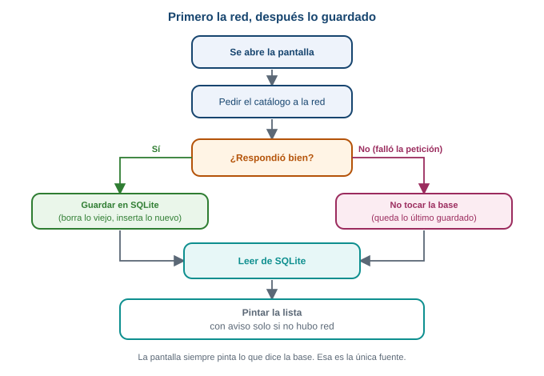{fig-alt="Flujo red primero y caché después: se pide a la red; si responde se guarda en SQLite; en ambos casos se lee de SQLite y se pinta, con aviso si no hubo red"}

El flujo. La pantalla siempre pinta lo que dice la base, con o sin red.
:::

Observa un detalle de diseño: **la pantalla siempre pinta lo leído de SQLite**, nunca lo que llegó
directo de la red. La red solo sirve para actualizar la base. Así hay una única fuente de verdad, y el
código para mostrar el catálogo es el mismo con o sin conexión.

**Predice primero.** Abres la app con red: ves el catálogo. Activas el modo avión, cierras la app y la
abres otra vez. ¿Qué ves?

::: {.callout-warning collapse="true"}
## Comprueba tu predicción

El mismo catálogo, con un aviso amarillo arriba y el botón de confirmar bloqueado. La petición falló,
pero en la base quedó lo que se guardó la última vez que hubo red, y la pantalla lo muestra. Al final
de esta parte lo comprobarás tú.
:::

::: {.callout-note}
Trabaja en `practica_s08`, escribe el código en vez de pegarlo y ejecuta en el emulador después de cada
paso. Necesitas `lib/base_datos.dart` de la Parte 5, y en este taller `lib/main.dart` se reemplaza por
el código de cada paso.
:::

### [1]{.paso} El modelo: leer el JSON del servicio

El servicio de práctica devuelve el catálogo así (recortado a tres productos):

```json
{
  "products": [
    { "id": 16, "title": "Apple", "price": 1.99, "stock": 8 },
    { "id": 17, "title": "Beef Steak", "price": 12.99, "stock": 86 },
    { "id": 18, "title": "Cat Food", "price": 8.99, "stock": 46 }
  ]
}
```

Los nombres de los campos no coinciden con los de tu tabla (`title` frente a `nombre`), y el inventario
(`stock`) es un número, no un `bool`. Agrega a `Producto`, en `base_datos.dart`, un constructor que lea
ese formato, justo debajo del constructor normal:

```dart
  factory Producto.fromJson(Map<String, dynamic> json) {
    return Producto(
      id: json['id'] as int,
      nombre: json['title'] as String,
      precio: ((json['price'] as num) * 4000).round(),
      disponible: (json['stock'] as int) > 0,
    );
  }
```

- `title` pasa a `nombre`.
- `price` viene en dólares, con decimales (`num`). Multiplicarlo por 4000 y redondear da un precio
  entero aproximado en pesos. Es una conversión de práctica.
- `disponible` se deduce del inventario: hay producto si `stock` es mayor que cero.

### [2]{.paso} Pedir el catálogo a la red

Reemplaza `lib/main.dart` por un archivo nuevo que empiece con esta función. Es la petición de la
Semana 7, ahora con un tiempo máximo de espera:

```dart
import 'dart:convert';

import 'package:flutter/material.dart';
import 'package:http/http.dart' as http;

import 'base_datos.dart';

Future<List<Producto>> pedirCatalogo() async {
  final url = Uri.parse(
    'https://dummyjson.com/products/category/groceries?select=title,price,stock',
  );
  final respuesta = await http.get(url).timeout(const Duration(seconds: 8));
  if (respuesta.statusCode != 200) {
    throw Exception('El servidor respondió ${respuesta.statusCode}');
  }
  final datos = jsonDecode(respuesta.body) as Map<String, dynamic>;
  final lista = datos['products'] as List<dynamic>;
  return [
    for (final item in lista) Producto.fromJson(item as Map<String, dynamic>),
  ];
}
```

- `.timeout(...)` hace que la petición falle si pasan 8 segundos sin respuesta. Sin esto, una red
  lenta dejaría la pantalla cargando mucho tiempo.
- Si el servidor responde con un código distinto de 200, la función lanza una excepción. Así, un
  servidor caído y una red caída terminan igual: una excepción.
- `jsonDecode` convierte el texto en un `Map`; después se recorre la lista y cada elemento pasa por
  `Producto.fromJson`.

### [3]{.paso} La pantalla con sus estados, solo con la red

Pon esto debajo de `pedirCatalogo`. Primero la pantalla, **sin base de datos todavía**:

```dart
enum Estado { cargando, listo, sinConexion, vacio }

void main() {
  runApp(const MaterialApp(home: CatalogoPantalla()));
}

class CatalogoPantalla extends StatefulWidget {
  const CatalogoPantalla({super.key});

  @override
  State<CatalogoPantalla> createState() => _CatalogoPantallaState();
}

class _CatalogoPantallaState extends State<CatalogoPantalla> {
  Estado estado = Estado.cargando;
  List<Producto> productos = [];

  @override
  void initState() {
    super.initState();
    cargar();
  }

  Future<void> cargar() async {
    setState(() {
      estado = Estado.cargando;
    });

    List<Producto> recibidos = [];
    try {
      recibidos = await pedirCatalogo();
    } catch (e) {
      debugPrint('Sin red: $e');
    }

    if (!mounted) return;
    setState(() {
      productos = recibidos;
      estado = recibidos.isEmpty ? Estado.vacio : Estado.listo;
    });
  }

  @override
  Widget build(BuildContext context) {
    return Scaffold(
      appBar: AppBar(title: const Text('Catálogo')),
      body: cuerpo(),
    );
  }

  Widget cuerpo() {
    if (estado == Estado.cargando) {
      return const Center(child: CircularProgressIndicator());
    }
    if (estado == Estado.vacio) {
      return const Center(
        child: Text('No hay catálogo. Conéctate para descargarlo.'),
      );
    }
    return ListView.builder(
      itemCount: productos.length,
      itemBuilder: (context, indice) {
        final producto = productos[indice];
        return ListTile(
          title: Text(producto.nombre),
          trailing: Text('\$ ${producto.precio}'),
        );
      },
    );
  }
}
```

Es el patrón de la Parte 2: `initState` llama a `cargar` una vez; `cargar` espera con `await`, revisa
`mounted` y pinta con `setState`.

El `enum Estado` nombra las cuatro caras de la pantalla. Si en la Semana 7 usaste otro `enum`
(`cargando`, `listo`, `vacio`, `error`), conserva el tuyo: aquí `sinConexion` reemplaza a `error`,
porque sin red aún hay algo que mostrar.

::: {.diagrama}
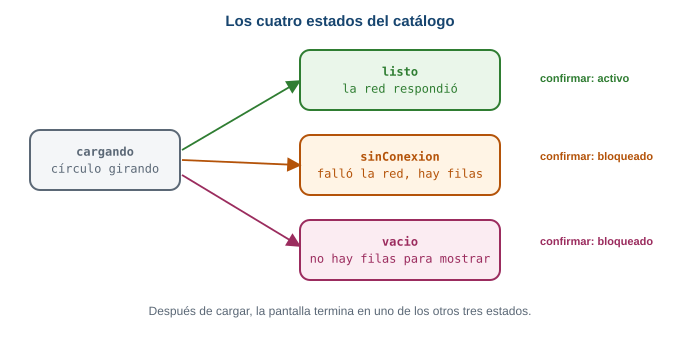{fig-alt="Los cuatro estados de la pantalla de catálogo: cargando, listo cuando la red respondió, sinConexion cuando falló la red pero hay filas guardadas, y vacio cuando no hay nada que mostrar"}

Los cuatro estados. En este paso solo se usan `cargando`, `listo` y `vacio`.
:::

Ejecuta: ves un círculo girando y después la lista de productos. Si activas el modo avión y vuelves a
arrancar la app, ves el mensaje "No hay catálogo". Es el problema del que partimos: sin red, nada.

### [4]{.paso} Guardar lo recibido y pintar desde SQLite

Ahora la base. Importa `base_datos.dart` (ya lo tienes) y cambia **solo `cargar`**. Después de recibir,
guardas; y en lugar de pintar lo recibido, lees lo guardado y pintas eso:

```dart
  Future<void> cargar() async {
    setState(() {
      estado = Estado.cargando;
    });

    List<Producto>? recibidos;
    try {
      recibidos = await pedirCatalogo();
    } catch (e) {
      debugPrint('Sin red: $e');
    }
    if (recibidos != null) {
      await guardarCatalogo(recibidos);
    }

    final guardados = await leerCatalogo();
    if (!mounted) return;
    setState(() {
      productos = guardados;
      estado = guardados.isEmpty ? Estado.vacio : Estado.listo;
    });
  }
```

Los cambios, uno por uno:

- `List<Producto>? recibidos;` ahora puede ser `null`: si la petición falla, queda `null`. Así
  distingues "la red falló" de "la red respondió con cero productos".
- `if (recibidos != null) { await guardarCatalogo(recibidos); }` guarda solo si hubo respuesta.
- `final guardados = await leerCatalogo();` lee de SQLite **siempre**.
- La pantalla pinta `guardados`. Los productos no disponibles (`stock` cero) no llegan, porque
  `leerCatalogo` filtra con `disponible = 1` (RN-04).

Ejecuta con red: ves la lista otra vez, pero ahora pasó por la base. Para estar seguro, revisa tu
consola: no debe aparecer ningún `Sin red`.

### [5]{.paso} Sin red: queda lo último guardado

El código del paso 4 ya muestra lo guardado cuando la red falla: `recibidos` queda en `null`, no se
guarda nada, y `leerCatalogo` devuelve lo de la última vez. Falta distinguir ese caso en el estado.
Cambia la parte final de `cargar`:

```dart
    setState(() {
      productos = guardados;
      if (guardados.isEmpty) {
        estado = Estado.vacio;
      } else if (recibidos == null) {
        estado = Estado.sinConexion;
      } else {
        estado = Estado.listo;
      }
    });
```

Léelo en orden: si no hay nada guardado, `vacio`. Si hay algo guardado pero la petición falló
(`recibidos == null`), `sinConexion`. Si no, `listo`. Son tres preguntas, y el orden importa: el caso
"vacío" se revisa primero porque no hay nada que avisar si no hay nada que mostrar.

### [6]{.paso} El aviso y la confirmación bloqueada (RN-06)

Dos cambios en la pantalla. Primero el aviso arriba de la lista, solo cuando el estado es
`sinConexion`. Reemplaza el final de `cuerpo()` (la lista) por una columna:

```dart
    return Column(
      children: [
        if (estado == Estado.sinConexion)
          Container(
            width: double.infinity,
            color: Colors.amber,
            padding: const EdgeInsets.all(12),
            child: const Text(
              'Sin conexión, mostrando el último catálogo',
              style: TextStyle(color: Colors.black),
            ),
          ),
        Expanded(
          child: ListView.builder(
            itemCount: productos.length,
            itemBuilder: (context, indice) {
              final producto = productos[indice];
              return ListTile(
                title: Text(producto.nombre),
                trailing: Text('\$ ${producto.precio}'),
              );
            },
          ),
        ),
      ],
    );
```

- `if (estado == Estado.sinConexion) Container(...)` dentro de una lista agrega ese elemento solo si la
  condición se cumple.
- `Expanded` le da a la lista el espacio que sobra debajo del aviso.

Segundo, el botón de confirmar. Agrégalo al `Scaffold`, y la función `confirmar` encima de `build`:

```dart
  void confirmar() {
    ScaffoldMessenger.of(context).showSnackBar(
      const SnackBar(content: Text('Pedido confirmado (simulado)')),
    );
  }
```

```dart
      bottomNavigationBar: Padding(
        padding: const EdgeInsets.all(16),
        child: FilledButton(
          onPressed: estado == Estado.listo ? confirmar : null,
          child: const Text('Confirmar pedido'),
        ),
      ),
```

La línea clave es `onPressed: estado == Estado.listo ? confirmar : null`. Un botón con
`onPressed: null` aparece gris y no responde. Así, solo con el catálogo recién recibido
(`Estado.listo`) se puede confirmar; con `sinConexion`, `vacio` o `cargando`, el botón está bloqueado.
Eso es RN-06: sin conexión se consulta, pero no se confirma.

::: {.diagrama}
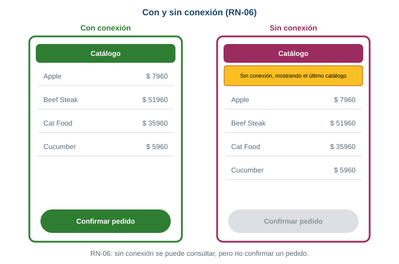{fig-alt="Dos pantallas lado a lado: con conexión el botón Confirmar pedido está activo; sin conexión aparece un aviso amarillo y el botón queda bloqueado, según la regla RN-06"}

Lo que cambia entre las dos pantallas: el aviso y el botón. La lista es la misma.
:::

### [7]{.paso} El tema oscuro

Agrega el tema oscuro de la Parte 3. Importa también `package:shared_preferences/shared_preferences.dart`. La pantalla de catálogo no cambia de lugar; lo que cambia es quién
la envuelve. Crea `MiApp`, que guarda el tema con preferencias, y que le pasa a `CatalogoPantalla` el
valor y la función para cambiarlo:

```dart
class MiApp extends StatefulWidget {
  const MiApp({super.key});

  @override
  State<MiApp> createState() => _MiAppState();
}

class _MiAppState extends State<MiApp> {
  final prefs = SharedPreferencesAsync();
  bool oscuro = false;

  @override
  void initState() {
    super.initState();
    cargarTema();
  }

  Future<void> cargarTema() async {
    final guardado = await prefs.getBool('oscuro') ?? false;
    if (!mounted) return;
    setState(() {
      oscuro = guardado;
    });
  }

  Future<void> cambiarTema(bool valor) async {
    setState(() {
      oscuro = valor;
    });
    await prefs.setBool('oscuro', valor);
  }

  @override
  Widget build(BuildContext context) {
    return MaterialApp(
      title: 'Mercado Campesino',
      debugShowCheckedModeBanner: false,
      theme: ThemeData(colorScheme: ColorScheme.fromSeed(seedColor: Colors.green)),
      darkTheme: ThemeData(
        colorScheme: ColorScheme.fromSeed(
          seedColor: Colors.green,
          brightness: Brightness.dark,
        ),
      ),
      themeMode: oscuro ? ThemeMode.dark : ThemeMode.light,
      home: CatalogoPantalla(oscuro: oscuro, alCambiarTema: cambiarTema),
    );
  }
}
```

Y `CatalogoPantalla` recibe esos dos datos por su constructor, como los datos que pasabas entre
pantallas en la Semana 5:

```dart
class CatalogoPantalla extends StatefulWidget {
  final bool oscuro;
  final void Function(bool) alCambiarTema;

  const CatalogoPantalla({
    super.key,
    required this.oscuro,
    required this.alCambiarTema,
  });
```

Dentro del `State`, se leen con `widget.oscuro` y `widget.alCambiarTema`. El `main` ahora arranca
`MiApp`: `runApp(const MiApp());`. En la barra, dos botones: uno para recargar y otro para el tema.
Los verás en el archivo completo.

### [8]{.paso} Comprobar con y sin conexión

Con el archivo completo (más abajo) ejecutándose en el emulador, haz esta secuencia:

1. **Con red.** Abre la app. Ves el catálogo, sin aviso, y el botón "Confirmar pedido" activo.
   Púlsalo: aparece "Pedido confirmado (simulado)".
2. **Activa el modo avión** desde los ajustes rápidos del emulador (desliza desde arriba). No cierres
   la app. Pulsa el botón de recargar de la barra: la petición falla, y aparecen el aviso amarillo, el
   mismo catálogo y el botón de confirmar gris.
3. **Cierra la app por completo** (deslízala desde las apps recientes) y ábrela otra vez, todavía en
   modo avión. Ves el catálogo guardado con el aviso amarillo. Los datos sobrevivieron al cierre y a la
   falta de red.
4. **Desactiva el modo avión** y pulsa recargar: desaparece el aviso y el botón vuelve a estar activo.
5. **Cambia el tema** con el botón de la barra, cierra la app y ábrela: el tema se conserva.

Si tu app no hace algo de esto, revisa en qué paso cambió tu código respecto al archivo completo.

::: {.callout-note}
Estos pasos se ejecutaron en un emulador de Android (Pixel 9a). Con red apareció el catálogo y el botón
activo. Se activó el modo avión, se cerró la app por completo y se abrió de nuevo: apareció el último
catálogo guardado, con el aviso "Sin conexión, mostrando el último catálogo" y el botón de confirmar
bloqueado. El tema oscuro también se conservó al cerrar y abrir.
:::

### El código completo

**`lib/base_datos.dart`**

```dart
import 'package:path/path.dart';
import 'package:sqflite/sqflite.dart';

class Producto {
  final int id;
  final String nombre;
  final int precio;
  final bool disponible;

  const Producto({
    required this.id,
    required this.nombre,
    required this.precio,
    required this.disponible,
  });

  // De la respuesta de la red (JSON) a Producto.
  factory Producto.fromJson(Map<String, dynamic> json) {
    return Producto(
      id: json['id'] as int,
      nombre: json['title'] as String,
      precio: ((json['price'] as num) * 4000).round(),
      disponible: (json['stock'] as int) > 0,
    );
  }

  // De Producto a Map, para guardarlo en SQLite.
  Map<String, Object?> toMap() {
    return {
      'id': id,
      'nombre': nombre,
      'precio': precio,
      'disponible': disponible ? 1 : 0,
    };
  }

  // De una fila de SQLite (Map) de vuelta a Producto.
  factory Producto.fromMap(Map<String, Object?> mapa) {
    return Producto(
      id: mapa['id'] as int,
      nombre: mapa['nombre'] as String,
      precio: mapa['precio'] as int,
      disponible: mapa['disponible'] == 1,
    );
  }
}

Database? _base;

Future<Database> abrirBase() async {
  _base ??= await openDatabase(
    join(await getDatabasesPath(), 'catalogo.db'),
    version: 1,
    onCreate: (db, version) {
      return db.execute(
        'CREATE TABLE productos('
        'id INTEGER PRIMARY KEY, '
        'nombre TEXT, '
        'precio INTEGER, '
        'disponible INTEGER)',
      );
    },
  );
  return _base!;
}

Future<void> borrarCatalogo() async {
  final db = await abrirBase();
  await db.delete('productos');
}

Future<void> guardarCatalogo(List<Producto> productos) async {
  final db = await abrirBase();
  await borrarCatalogo();
  for (final producto in productos) {
    await db.insert('productos', producto.toMap());
  }
}

Future<List<Producto>> leerCatalogo() async {
  final db = await abrirBase();
  final filas = await db.query(
    'productos',
    where: 'disponible = ?',
    whereArgs: [1],
  );
  return [for (final fila in filas) Producto.fromMap(fila)];
}
```

**`lib/main.dart`**

```dart
import 'dart:convert';

import 'package:flutter/material.dart';
import 'package:http/http.dart' as http;
import 'package:shared_preferences/shared_preferences.dart';

import 'base_datos.dart';

enum Estado { cargando, listo, sinConexion, vacio }

void main() {
  runApp(const MiApp());
}

class MiApp extends StatefulWidget {
  const MiApp({super.key});

  @override
  State<MiApp> createState() => _MiAppState();
}

class _MiAppState extends State<MiApp> {
  final prefs = SharedPreferencesAsync();
  bool oscuro = false;

  @override
  void initState() {
    super.initState();
    cargarTema();
  }

  Future<void> cargarTema() async {
    final guardado = await prefs.getBool('oscuro') ?? false;
    if (!mounted) return;
    setState(() {
      oscuro = guardado;
    });
  }

  Future<void> cambiarTema(bool valor) async {
    setState(() {
      oscuro = valor;
    });
    await prefs.setBool('oscuro', valor);
  }

  @override
  Widget build(BuildContext context) {
    return MaterialApp(
      title: 'Mercado Campesino',
      debugShowCheckedModeBanner: false,
      theme: ThemeData(colorScheme: ColorScheme.fromSeed(seedColor: Colors.green)),
      darkTheme: ThemeData(
        colorScheme: ColorScheme.fromSeed(
          seedColor: Colors.green,
          brightness: Brightness.dark,
        ),
      ),
      themeMode: oscuro ? ThemeMode.dark : ThemeMode.light,
      home: CatalogoPantalla(oscuro: oscuro, alCambiarTema: cambiarTema),
    );
  }
}

Future<List<Producto>> pedirCatalogo() async {
  final url = Uri.parse(
    'https://dummyjson.com/products/category/groceries?select=title,price,stock',
  );
  final respuesta = await http.get(url).timeout(const Duration(seconds: 8));
  if (respuesta.statusCode != 200) {
    throw Exception('El servidor respondió ${respuesta.statusCode}');
  }
  final datos = jsonDecode(respuesta.body) as Map<String, dynamic>;
  final lista = datos['products'] as List<dynamic>;
  return [
    for (final item in lista) Producto.fromJson(item as Map<String, dynamic>),
  ];
}

class CatalogoPantalla extends StatefulWidget {
  final bool oscuro;
  final void Function(bool) alCambiarTema;

  const CatalogoPantalla({
    super.key,
    required this.oscuro,
    required this.alCambiarTema,
  });

  @override
  State<CatalogoPantalla> createState() => _CatalogoPantallaState();
}

class _CatalogoPantallaState extends State<CatalogoPantalla> {
  Estado estado = Estado.cargando;
  List<Producto> productos = [];

  @override
  void initState() {
    super.initState();
    cargar();
  }

  Future<void> cargar() async {
    setState(() {
      estado = Estado.cargando;
    });

    List<Producto>? recibidos;
    try {
      recibidos = await pedirCatalogo();
    } catch (e) {
      debugPrint('Sin red: $e');
    }
    if (recibidos != null) {
      await guardarCatalogo(recibidos);
    }

    final guardados = await leerCatalogo();
    if (!mounted) return;
    setState(() {
      productos = guardados;
      if (guardados.isEmpty) {
        estado = Estado.vacio;
      } else if (recibidos == null) {
        estado = Estado.sinConexion;
      } else {
        estado = Estado.listo;
      }
    });
  }

  void confirmar() {
    ScaffoldMessenger.of(context).showSnackBar(
      const SnackBar(content: Text('Pedido confirmado (simulado)')),
    );
  }

  @override
  Widget build(BuildContext context) {
    return Scaffold(
      appBar: AppBar(
        title: const Text('Catálogo'),
        actions: [
          IconButton(icon: const Icon(Icons.refresh), onPressed: cargar),
          IconButton(
            icon: Icon(widget.oscuro ? Icons.light_mode : Icons.dark_mode),
            onPressed: () => widget.alCambiarTema(!widget.oscuro),
          ),
        ],
      ),
      body: cuerpo(),
      bottomNavigationBar: Padding(
        padding: const EdgeInsets.all(16),
        child: FilledButton(
          onPressed: estado == Estado.listo ? confirmar : null,
          child: const Text('Confirmar pedido'),
        ),
      ),
    );
  }

  Widget cuerpo() {
    if (estado == Estado.cargando) {
      return const Center(child: CircularProgressIndicator());
    }
    if (estado == Estado.vacio) {
      return const Center(
        child: Text('No hay catálogo. Conéctate para descargarlo.'),
      );
    }
    return Column(
      children: [
        if (estado == Estado.sinConexion)
          Container(
            width: double.infinity,
            color: Colors.amber,
            padding: const EdgeInsets.all(12),
            child: const Text(
              'Sin conexión, mostrando el último catálogo',
              style: TextStyle(color: Colors.black),
            ),
          ),
        Expanded(
          child: ListView.builder(
            itemCount: productos.length,
            itemBuilder: (context, indice) {
              final producto = productos[indice];
              return ListTile(
                title: Text(producto.nombre),
                trailing: Text('\$ ${producto.precio}'),
              );
            },
          ),
        ),
      ],
    );
  }
}
```

### Qué pasa si...

- **Quitas el `try`/`catch` de `pedirCatalogo`.** Sin red, la petición lanza una excepción que nadie
  atrapa, `cargar` se interrumpe y la pantalla se queda en "cargando" para siempre. El `catch` es lo
  que convierte "no hay red" en un caso normal.
- **Pintas `recibidos` en lugar de lo leído de la base.** Con red funciona igual, pero sin red no hay
  nada que pintar. Pintar siempre lo leído de la base hace que los dos caminos usen el mismo código.
- **Olvidas `guardarCatalogo` antes de leer.** La base queda vacía y, sin red, el estado es `vacio`,
  porque nunca se guardó nada.
- **Quitas `if (!mounted) return;`.** Si el usuario sale de la pantalla antes de que termine la
  petición, `setState` falla con el error de la Parte 2.

::: {.callout-important}
## Para memorizar

- Primero la red; si responde, guardas en SQLite; **siempre** lees de SQLite para pintar.
- "No hay red" significa que la petición falló: `try`/`catch` alrededor de `pedirCatalogo`.
- `onPressed: condición ? función : null` bloquea un botón: es RN-06.
- Las cuatro caras de la pantalla: `cargando`, `listo`, `sinConexion` y `vacio`.
:::

::: {.callout-note}
## Para razonar, no para memorizar

Si pudieras pintar `recibidos` directamente cuando hay red, ¿por qué no hacerlo? Porque tendrías dos
caminos para mostrar datos (uno de la red y otro de la base), dos formas de equivocarte y dos cosas que
probar. Pasar todo por la base deja un solo camino. Cuando varias fuentes alimentan la misma pantalla,
conviene que una sola sea la que la pinta.
:::

::: {.callout-tip}
## Para pensar

El botón "Confirmar pedido" se bloquea sin conexión, pero ¿qué pasa si el comprador abre la pantalla con
red, y la señal se pierde mientras mira? El estado seguiría siendo `listo` y el botón, activo. ¿Qué haría
falta para que el botón se bloqueara en ese momento? Piensa en qué evento detectaría el fallo: quizá la
propia petición de confirmar.
:::

## Errores frecuentes

Los mensajes de esta sección son los que produjeron el código y los comandos de esta guía al
ejecutarlos, no los de un manual. Léelos completos: casi siempre dicen dónde mirar.

### no such table

```text
DatabaseException(no such table: clientes (code 1 SQLITE_ERROR): , while compiling: SELECT * FROM clientes)
sql 'SELECT * FROM clientes' args []
```

Consultaste una tabla que no existe. Las dos causas más comunes:

1. **El nombre está mal escrito** (`cliente` frente a `clientes`, `producto` frente a `productos`).
   Compara el nombre del mensaje con el de tu `CREATE TABLE`.
2. **Cambiaste el `CREATE TABLE` después de ejecutar la app.** El archivo de la base ya existía,
   `onCreate` no volvió a correr y la tabla nueva nunca se creó. Desinstala la app del emulador (borra
   el archivo) y ejecútala de nuevo. Es la causa que más confunde, porque tu código "se ve bien".

La palabra después de `while compiling:` es la sentencia SQL que SQLite no pudo preparar: ahí está tu
pista.

### near "SELEC": syntax error

```text
DatabaseException(near "SELEC": syntax error (code 1 SQLITE_ERROR): , while compiling: SELEC * FROM productos)
sql 'SELEC * FROM productos' args []
```

Escribiste mal una palabra de SQL. El mensaje cita la palabra exacta que no entendió (`near "SELEC"`).
Revisa esa palabra y la anterior.

### database_closed

```text
DatabaseException(error database_closed)
```

Usaste una base que ya cerraste con `db.close()`. En esta guía no la cierras: `abrirBase` guarda la
conexión en `_base` y la reutiliza mientras la app viva. Si cierras la base y sigues usando `_base`,
aparece este error. Cuando cierres una base, asegúrate de que nadie más la use y de que `_base` vuelva
a `null`.

### UNIQUE constraint failed

```text
DatabaseException(UNIQUE constraint failed: productos.id (code 1555 SQLITE_CONSTRAINT_PRIMARYKEY))
```

Insertaste una fila con un `id` que ya existe. La clave primaria no se puede repetir. En el catálogo se
evita con `borrarCatalogo()` antes de insertar. Mira la Parte 5.

### Olvidar el `await`

Una función que lee la base devuelve un `Future`. Si no la esperas, Dart ve un `Future`, no una lista:

```dart
final lista = leerCatalogo();   // falta await
print(lista.length);
```

```text
error - The getter 'length' isn't defined for the type 'Future<List<Producto>>'
error - The type 'Future<List<Producto>>' used in the 'for' loop must implement 'Iterable'
```

El mensaje dice el tipo: `Future<List<Producto>>`. Cuando veas `Future<...>` donde esperabas el dato,
falta un `await` (y la función donde lo escribes debe ser `async`).

### setState() called after dispose()

```text
setState() called after dispose(): _PantallaCargaState#f0ecb(lifecycle state: defunct, not mounted)
```

Llamaste a `setState` después de un `await`, cuando la pantalla ya había muerto. Se arregla con
`if (!mounted) return;` antes del `setState`, como en la Parte 2.

### Usar el paquete en una plataforma que no lo soporta

`sqflite` funciona en Android, iOS y macOS, y `flutter_secure_storage` está pensado para Android e iOS
(aunque su documentación lista más plataformas, con requisitos propios). Si ejecutas la app de la Parte
5 en Chrome, la app falla al abrir la base: en la prueba de esta guía la consola del navegador mostró
solo `Uncaught Error`, sin un mensaje legible. Cuando un error de base de datos no tenga explicación,
confirma primero en qué dispositivo estás ejecutando. Usa el emulador de Android.

### Esto no es un error, pero confunde

Si guardas el tema oscuro y al reinstalar la app vuelve a claro, no hay fallo: desinstalar una app
borra su carpeta privada, y con ella sus preferencias y su base de datos.

## Retos

El Reto 1 (guardar el municipio) está en la Parte 3. Estos tres usan el catálogo de la Parte 7. En
todos, cada cambio se ejecutó antes de escribir la solución.

::: {.callout-tip}
## Reto 2. Retirar un producto (RN-04)

Un producto que deja de estar disponible se retira del catálogo visible. Haz que al mantener pulsado un
producto de la lista se marque como no disponible en la base y desaparezca de la pantalla. Necesitas
una operación nueva de la base: `UPDATE`.
:::

::: {.callout-note collapse="true"}
## Solución del Reto 2

En `base_datos.dart`, una función nueva:

```dart
Future<void> marcarNoDisponible(int id) async {
  final db = await abrirBase();
  await db.update(
    'productos',
    {'disponible': 0},
    where: 'id = ?',
    whereArgs: [id],
  );
}
```

`db.update` es el `UPDATE ... SET disponible = 0 WHERE id = ?`: recibe la tabla, el mapa con las
columnas que cambian, y el `where` con su `whereArgs`. Sin `where`, cambiaría todas las filas.

En `main.dart`, dentro del `ListTile` del `itemBuilder`:

```dart
onLongPress: () async {
  await marcarNoDisponible(producto.id);
  final guardados = await leerCatalogo();
  if (!mounted) return;
  setState(() {
    productos = guardados;
  });
},
```

Mantén pulsado un producto: desaparece, porque `leerCatalogo` solo devuelve `disponible = 1`. Sigue
guardado en la tabla con `disponible` en 0. Si recargas con red, el servicio vuelve a enviarlo y
reaparece, porque `guardarCatalogo` reemplaza todo con lo recibido.
:::

::: {.callout-tip}
## Reto 3. Borrar el catálogo guardado

Agrega un botón de papelera en la barra que borre el catálogo guardado y deje la pantalla en estado
`vacio`, sin pedir nada a la red.
:::

::: {.callout-note collapse="true"}
## Solución del Reto 3

En el `State` de `CatalogoPantalla`, una función:

```dart
Future<void> borrarGuardado() async {
  await borrarCatalogo();
  if (!mounted) return;
  setState(() {
    productos = [];
    estado = Estado.vacio;
  });
}
```

Y un botón en `actions` de la barra, junto a los otros dos:

```dart
IconButton(
  icon: const Icon(Icons.delete_outline),
  onPressed: borrarGuardado,
),
```

Con el modo avión activado, pulsa la papelera: la pantalla dice "No hay catálogo. Conéctate para
descargarlo.", y el botón de confirmar sigue bloqueado. Si cierras y abres la app sin red, sigue así,
porque la base quedó vacía. Aquí `cargar` no se llama: si se llamara con red, volvería a descargar y a
guardar el catálogo.
:::

::: {.callout-tip}
## Reto 4. ¿De cuándo es el catálogo?

Sin conexión, el aviso debería decir de cuándo es el catálogo que se muestra. Guarda la fecha y hora
cada vez que guardes un catálogo recibido, y úsala en el aviso. Es un ajuste pequeño: usa
preferencias.
:::

::: {.callout-note collapse="true"}
## Solución del Reto 4

En el `State` de `CatalogoPantalla`, agrega estas dos variables:

```dart
final prefs = SharedPreferencesAsync();
String ultima = '';
```

En `cargar`, guarda la fecha cuando haya respuesta, y léela antes de pintar:

```dart
if (recibidos != null) {
  await guardarCatalogo(recibidos);
  await prefs.setString('ultima', DateTime.now().toIso8601String());
}

final guardados = await leerCatalogo();
final fecha = await prefs.getString('ultima') ?? '';
if (!mounted) return;
setState(() {
  ultima = fecha;
  productos = guardados;
  // ... el resto de decisiones de estado queda igual
});
```

Y en el aviso, el texto usa la variable (quita el `const` del `Text`):

```dart
Text('Sin conexión, mostrando el catálogo del $ultima')
```

Con el modo avión, el aviso dice algo como `Sin conexión, mostrando el catálogo del
2026-10-03T01:05:34.070610`. Es la fecha en formato ISO, nada bonita, pero correcta. Dar formato legible
a la fecha queda como mejora. Fíjate en la división del trabajo: el catálogo (muchas filas) está en
SQLite y la fecha (un valor) en preferencias, cada dato en el lugar que le toca.
:::

## Lo que debes poder explicar

Esta lista es solo para que compruebes tu comprensión.

::: {.checklist}
- [ ] Qué se pierde y qué se conserva al cerrar la app, según dónde vive el dato.
- [ ] Cómo decidir entre una variable, preferencias, SQLite y almacenamiento seguro.
- [ ] Qué es el estado y por qué un `StatelessWidget` no puede cambiarlo.
- [ ] Por qué un `StatefulWidget` son dos clases y qué guarda cada una.
- [ ] Qué hace `setState`: cambia el dato y pide que `build` corra de nuevo.
- [ ] Qué corre una sola vez en `initState`, qué hace `dispose` y para qué sirve `mounted`.
- [ ] Por qué guardar y leer preferencias es asíncrono y qué devuelve leer una clave inexistente.
- [ ] Qué son tabla, fila, columna y clave primaria, y qué hace cada una de las cuatro sentencias SQL.
- [ ] Qué hace `onCreate` y por qué solo corre cuando el archivo de la base es nuevo.
- [ ] Cómo se convierte un `Producto` en un `Map` y de vuelta, y por qué `bool` se guarda como 1 o 0.
- [ ] Por qué una ficha de sesión no va en preferencias y dónde guarda cada sistema la llave.
- [ ] Por qué el catálogo pinta siempre lo leído de SQLite, y cómo se decide que no hay red.
:::

## Autoevaluación formativa

Ocho preguntas para comprobar si el mecanismo quedó claro. No tienen nota: sirven para ti. Responde
primero por escrito, y después abre la respuesta.

**1. Una variable del `State` guarda el municipio del comprador. Cierra la app y la abre. ¿Qué pasa con el municipio y qué cambiarías?**

::: {.callout-note collapse="true"}
## Ver la respuesta

Se pierde: una variable vive en la memoria RAM y el sistema la libera al cerrar el proceso. Para que
sobreviva, se guarda en preferencias con `SharedPreferencesAsync.setString`, y se lee en `initState`
cuando la pantalla nace.
:::

**2. Pulsas un botón, la variable cambia (lo ves con `debugPrint`) y la pantalla no. ¿Qué revisas primero y por qué?**

::: {.callout-note collapse="true"}
## Ver la respuesta

Si el cambio está dentro de `setState`. Cambiar una variable no repinta nada: `setState` es lo que
marca la pantalla como desactualizada y pide a Flutter que ejecute `build` otra vez.
:::

**3. ¿Por qué se abre la base de datos en `initState` y no en `build`?**

::: {.callout-note collapse="true"}
## Ver la respuesta

`initState` corre una sola vez, cuando el `State` nace. `build` corre cada vez que hay un cambio: abrir
la base ahí la abriría una y otra vez. Lo que debe pasar una sola vez va en `initState`; lo que se
repite va en `build`.
:::

**4. Después de un `await` llamas a `setState`, y a veces aparece "setState() called after dispose()". ¿Qué pasó y cómo se evita?**

::: {.callout-note collapse="true"}
## Ver la respuesta

La pantalla murió mientras la función esperaba, y cuando continuó llamó a `setState` sobre un `State`
que ya no está en el árbol. Se evita con `if (!mounted) return;` justo después del `await`, antes del
`setState`.
:::

**5. ¿Qué devuelve `prefs.getBool('oscuro')` la primera vez que se abre la app, y cómo lo manejas?**

::: {.callout-note collapse="true"}
## Ver la respuesta

Devuelve `null`, porque esa clave nunca se guardó. Se maneja con un valor por defecto:
`await prefs.getBool('oscuro') ?? false`. Sin eso, la variable sería `bool?` y un `Switch` no acepta
`null`.
:::

**6. `UPDATE productos SET disponible = 0` sin `WHERE`, ¿qué hace?**

::: {.callout-note collapse="true"}
## Ver la respuesta

Cambia `disponible` a 0 en **todas** las filas de la tabla, no en una sola. `WHERE id = 2` limita el
cambio a las filas que cumplen la condición. Por eso, antes de ejecutar un `UPDATE` o un `DELETE`, se
revisa que tenga su `WHERE`.
:::

**7. Cambiaste el `CREATE TABLE` de `onCreate` (agregaste una columna), ejecutaste la app y sigues sin ver la columna nueva. ¿Por qué?**

::: {.callout-note collapse="true"}
## Ver la respuesta

`onCreate` solo corre cuando el archivo de la base **no existe**. Como ya lo creaste en una ejecución
anterior, tu cambio nunca se aplica. En esta semana se soluciona desinstalando la app (borra el
archivo). Para cambiar una tabla con datos existe `onUpgrade` y las migraciones, que van más adelante.
:::

**8. Sin conexión, la app muestra el último catálogo y bloquea "Confirmar pedido". ¿Qué regla del proyecto es y cómo se bloquea el botón en el código?**

::: {.callout-note collapse="true"}
## Ver la respuesta

Es RN-06: el catálogo guardado se puede consultar, pero no usarlo para confirmar un pedido. En el
código, el botón usa `onPressed: estado == Estado.listo ? confirmar : null`. Un botón con
`onPressed: null` queda gris y no responde, así que solo el catálogo recién recibido permite
confirmar.
:::

## Recursos

- Presentación interactiva de la sesión: [abrir la presentación interactiva](presentacion-interactiva.html){.btn-doc target="_blank"}
- Persistir datos con SQLite, Flutter: [docs.flutter.dev/cookbook/persistence/sqlite](https://docs.flutter.dev/cookbook/persistence/sqlite)
- Guardar datos clave y valor en disco, Flutter: [docs.flutter.dev/cookbook/persistence/key-value](https://docs.flutter.dev/cookbook/persistence/key-value)
- Paquete `sqflite`: [pub.dev/packages/sqflite](https://pub.dev/packages/sqflite)
- Paquete `shared_preferences`: [pub.dev/packages/shared_preferences](https://pub.dev/packages/shared_preferences)
- Paquete `flutter_secure_storage`: [pub.dev/packages/flutter_secure_storage](https://pub.dev/packages/flutter_secure_storage)
- Paquete `path`: [pub.dev/packages/path](https://pub.dev/packages/path)
- Paquete `http`: [pub.dev/packages/http](https://pub.dev/packages/http)
- La sentencia `INSERT` de SQLite: [sqlite.org/lang_insert.html](https://sqlite.org/lang_insert.html)
- Servicio de práctica con productos de supermercado: [dummyjson.com/products/category/groceries](https://dummyjson.com/products/category/groceries)

::: {.pie-doc}
Programación Móvil (IF2004). Institución Universitaria de Envigado. Facultad de Ingenierías.
Semestre 2026-02.

**Transparencia.** La redacción de esta guía contó con el apoyo de inteligencia artificial,
usando el modelo Claude Sonnet 5.5 de Anthropic. Todo el contenido fue revisado y validado.
:::
