## Sin control de versiones {.solo-diagrama}

{fig-alt="Cinco carpetas con nombres parecidos y tres preguntas que ninguna responde"}

## Lo que se pierde

- El historial vive en tu memoria, y tu memoria dura una semana.
- La copia buena es la que abriste de último.
- Volver a un estado anterior se convierte en adivinar.

. . .

Y eso trabajando solo.

## Y cuando trabaja un equipo {.solo-diagrama}

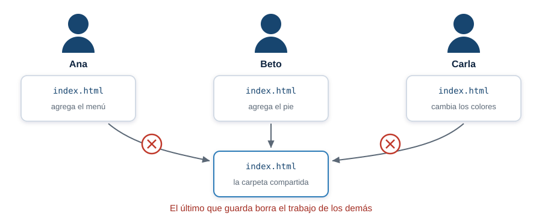{fig-alt="Tres integrantes de un equipo editan el mismo archivo y el ultimo que guarda borra el trabajo de los demas"}

## Lo que hace falta

- Volver a cualquier estado anterior.
- Saber quién cambió qué, y cuándo.
- Probar una idea sin romper lo que ya sirve.
- Unir el trabajo de dos personas sin perder ninguno de los dos.

. . .

[Eso hace Git.]{.grande}

## Dos cosas distintas con nombre parecido {.solo-diagrama}

{fig-alt="Git es un programa en tu computador y GitHub es un servicio en internet"}

## Dónde vive tu trabajo {.solo-diagrama}

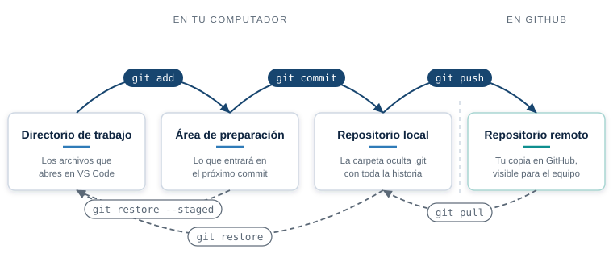{fig-alt="Las cuatro areas de Git y los comandos que mueven el contenido entre ellas"}

## Qué hace cada uno {.solo-diagrama}

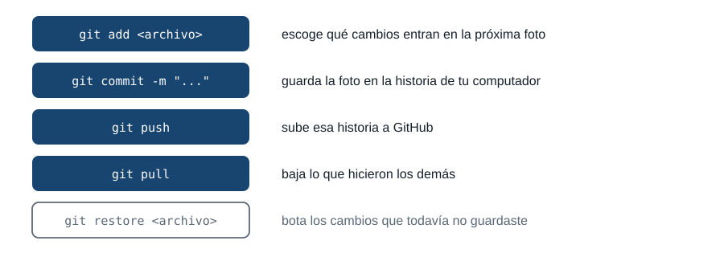{fig-alt="Los cinco comandos que mueven el trabajo entre las areas de Git y para que sirve cada uno"}

## Nada se mueve solo

```bash
git push    # sube tus commits a GitHub
git pull    # baja los del equipo
```

Tu commit vive en tu disco hasta que lo subas.

Lo que hizo la otra persona del equipo no aparece en tu pantalla hasta que lo bajes.

## Qué guarda un commit {.solo-diagrama}

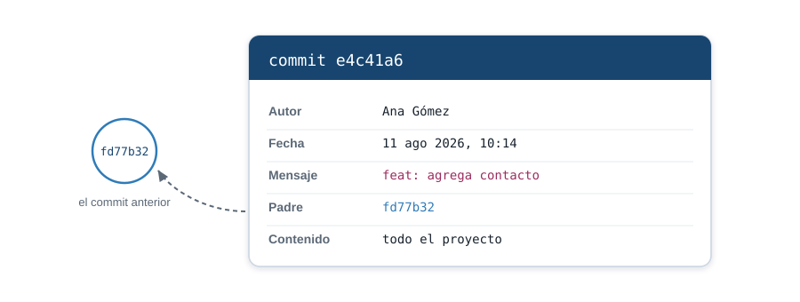{fig-alt="Un commit guarda autor, fecha, mensaje, el enlace al commit padre y una copia completa del proyecto"}

## La historia es una cadena {.solo-diagrama}

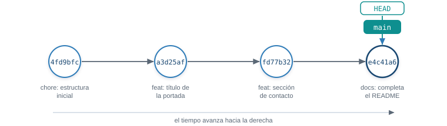{fig-alt="Cuatro commits en orden, del mas antiguo al mas reciente, con las etiquetas main y HEAD sobre el ultimo"}

## El nombre de cada commit

::: {.hash}
[e4c41a6]{.hash-corto}f2d81b9c0a7e35d4188c6f0b2ad19e7c3
:::

Git calcula ese número a partir del contenido. Cambia una coma y cambia entero.

En la práctica escribes los primeros siete y Git entiende de cuál hablas.

## Cómo se escribe un mensaje {.solo-diagrama}

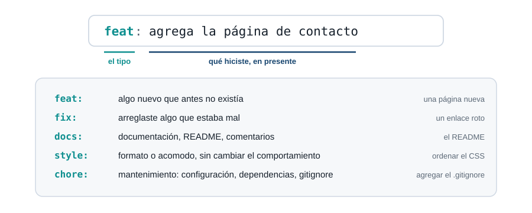{fig-alt="Anatomia de un mensaje de commit: el prefijo de tipo, dos puntos y la descripcion, con el significado de feat, fix, docs, style y chore"}

## El mensaje lo lees dentro de un mes {.solo-diagrama}

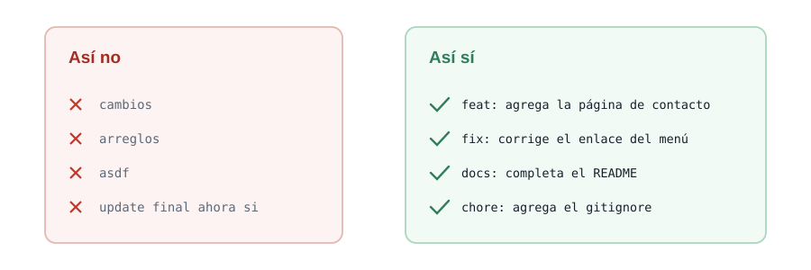{fig-alt="Comparacion entre mensajes de commit vagos y mensajes que describen el cambio con un prefijo de tipo"}

## Una rama es un puntero {.solo-diagrama}

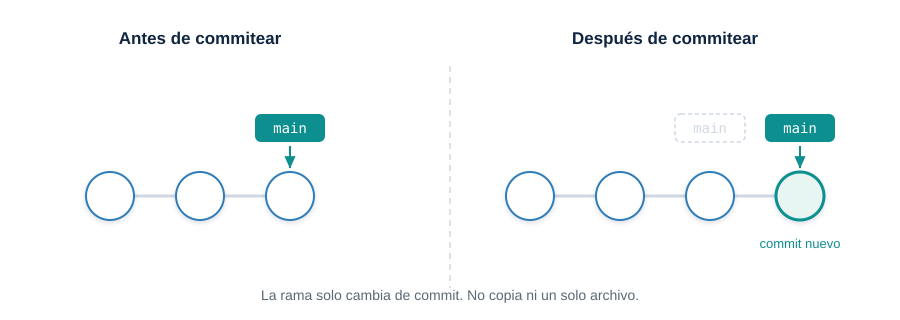{fig-alt="La etiqueta main se mueve al commit nuevo sin copiar archivos"}

## Trabajar aparte y volver

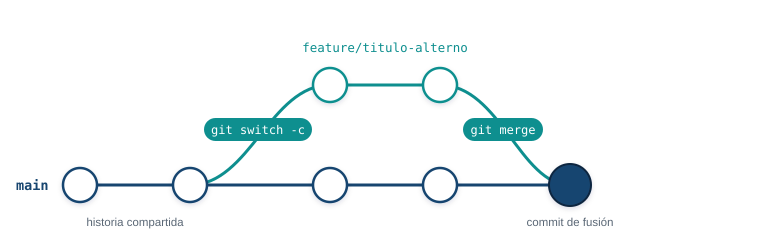{fig-alt="Una rama sale de main, avanza dos commits y vuelve en un commit de fusion"}

`git switch -c <rama>` crea la rama y te para en ella. `git merge <rama>` trae esos commits a
donde estás.

## Dos maneras de fusionar {.solo-diagrama}

{fig-alt="Avance rapido cuando main no se movio, y commit de fusion cuando las dos ramas avanzaron"}

## Cuando Git se detiene {.solo-diagrama}

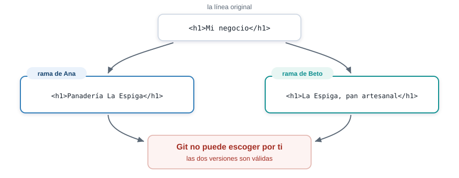{fig-alt="Dos ramas cambian la misma linea de forma distinta y Git no puede escoger"}

## Así se ve un conflicto {.solo-diagrama}

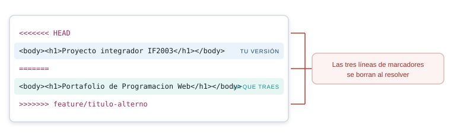{fig-alt="Anatomia de un conflicto: tu version, la version que traes y las tres lineas de marcadores"}

## Resolver toma un minuto

1. Abre el archivo y busca los marcadores.
2. Deja el texto que debe quedar.
3. Borra las tres líneas de marcadores y commitea.

. . .

```bash
git merge --abort
```

Ese comando te devuelve al punto de partida cuando el archivo queda irreconocible.

## El remoto {.solo-diagrama}

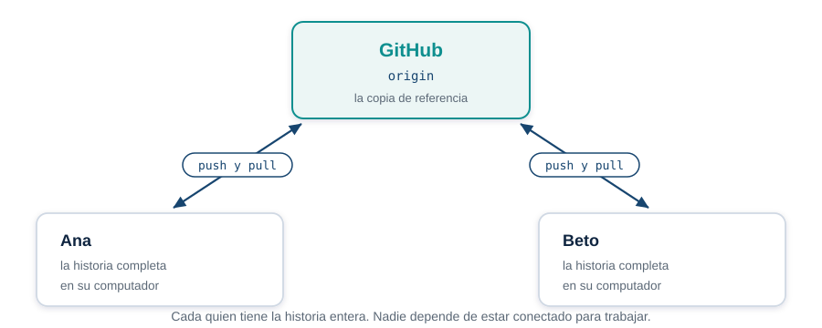{fig-alt="GitHub guarda la copia de referencia y cada integrante tiene la historia completa en su computador"}

## Qué es un Pull Request

Una **propuesta de cambio**. Dice: "tengo esto listo en mi rama, quiero meterlo en `main`,
revísenlo".

- Vive en GitHub, no en tu computador. No existe ningún `git pull-request`.
- Muestra el cambio línea por línea, para que la otra persona lo lea antes de que entre.
- Deja registro de quién propuso, quién revisó y qué se conversó.
- `main` no se toca hasta que alguien pulse el botón de fusión.

## El Pull Request {.solo-diagrama}

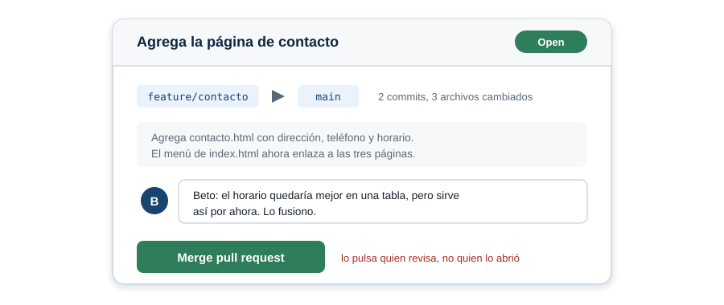{fig-alt="Un Pull Request muestra la rama, los commits, los archivos cambiados, el comentario de quien revisa y el boton de fusion"}

## El ciclo completo

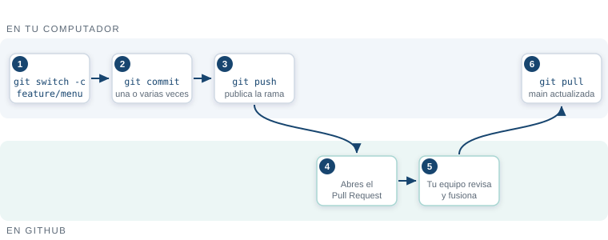{fig-alt="Flujo en dos carriles: creas la rama, commiteas y publicas; en GitHub se abre el Pull Request, se revisa y se fusiona"}

`git push -u origin <rama>` publica la rama por primera vez. `git pull` deja tu `main` al día
después de la fusión.

## Lo que no se versiona {.solo-diagrama}

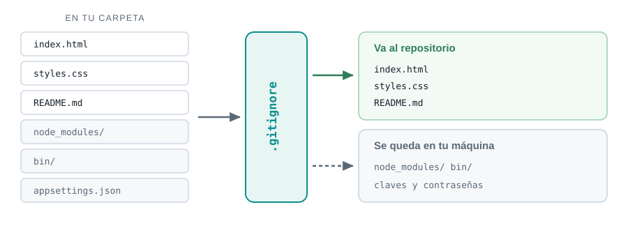{fig-alt="El gitignore deja pasar las paginas y el README, y retiene node_modules, bin y los archivos con claves"}

## Una clave subida ya está quemada

::: {.aviso}
Borrarla un minuto después no sirve. El historial la conserva, y cualquiera con el enlace puede
leerla.
:::

Por eso `appsettings.Development.json` entra al `.gitignore` **antes** del primer commit.

## Tres reglas

::: {.regla}
**`main` siempre funciona.** Lo que todavía no sirve vive en una rama.
:::

::: {.regla}
**Una rama por cada cosa nueva.** Se abre, se revisa, se fusiona y se borra.
:::

::: {.regla}
**El mensaje explica el cambio**, no el archivo que tocaste.
:::

## Siguientes pasos

[Crear un proyecto y ejecutar el flujo completo.]{.grande}
