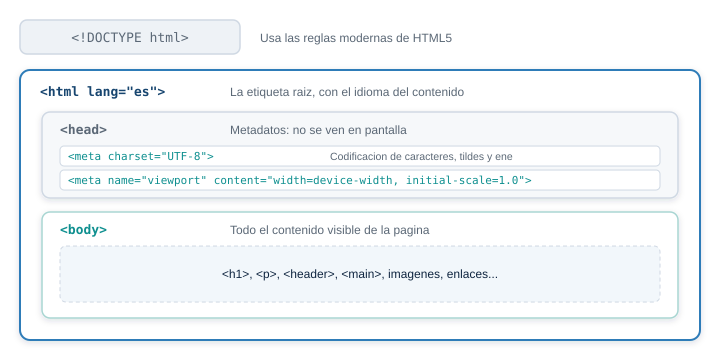
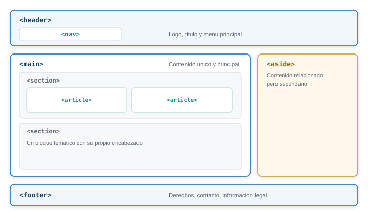
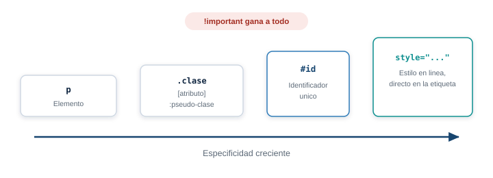
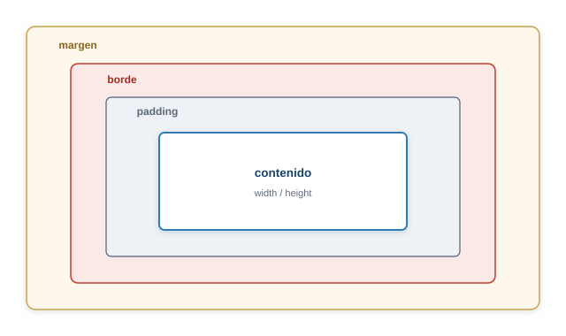
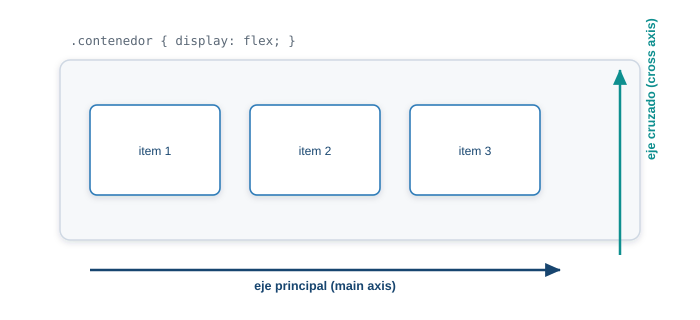
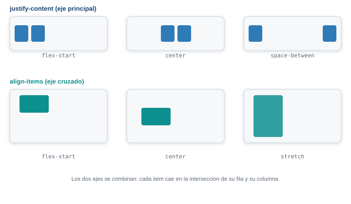
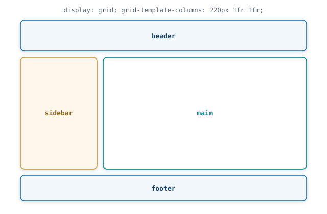
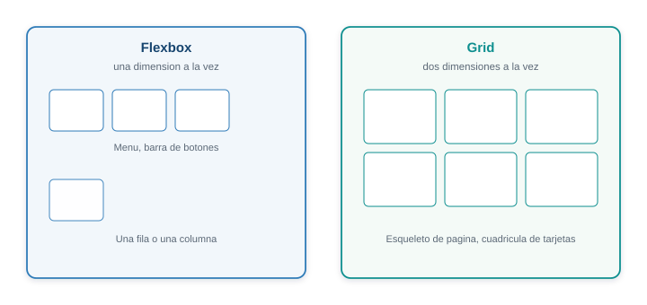
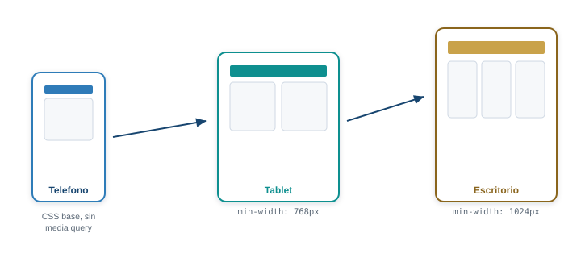
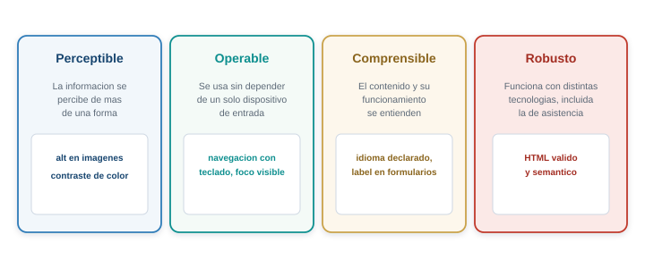

## Qué hace el navegador con un documento HTML

HTML no tiene variables ni condicionales. Es un lenguaje de marcado: describe **qué es** cada
parte de un documento, no cómo calcular algo.

. . .

El navegador lo lee de arriba hacia abajo y construye un árbol, el **DOM**. Cada etiqueta es un
nodo. Ese árbol es lo que se pinta en pantalla.

## HTML describe, CSS decora

- HTML: estructura y significado. Esto es un encabezado, esto es una lista, esto es el menú.
- CSS: apariencia. Colores, tamaños, posiciones.

. . .

Elegir una etiqueta solo porque "se ve" de cierta forma es la causa más común de páginas difíciles
de mantener y de leer con un lector de pantalla.

## Anatomía de un documento {.solo-diagrama}

{fig-alt="Anatomia de un documento HTML: DOCTYPE, la etiqueta html con su atributo lang, el head con los metadatos que no se ven, y el body con el contenido visible"}

## Todo documento tiene la misma forma mínima

```html
<!DOCTYPE html>
<html lang="es">
<head>
  <meta charset="UTF-8">
  <meta name="viewport" content="width=device-width, initial-scale=1.0">
  <title>Mi proyecto</title>
</head>
<body>
  <h1>Contenido visible</h1>
</body>
</html>
```

## Lo que hace cada línea

- `<!DOCTYPE html>`: reglas modernas de HTML5, no modo de compatibilidad viejo.
- `<html lang="es">`: declara el idioma. Un lector de pantalla lo usa para pronunciar.
- `<head>`: información sobre la página que el navegador no dibuja en el cuerpo.
- `<body>`: todo el contenido visible.

## Dos metadatos que nunca faltan

`<meta charset="UTF-8">` fija la codificación. Sin ella, las tildes y la eñe se ven rotas.

. . .

`<meta name="viewport" content="width=device-width, initial-scale=1.0">` le dice al celular que
use su ancho real. Sin esta línea, el diseño responsivo de más adelante no funciona en ningún
teléfono.

## Etiquetas, atributos y elementos vacíos

```html
<p>Esto es un párrafo.</p>


<br>
<input type="text">
```

Un elemento vacío no tiene contenido ni cierre: toda su información vive en los atributos.

## Un atributo agrega información

```html
<a href="https://iue.edu.co" target="_blank" rel="noopener">Sitio de la IUE</a>
```

`href` dice adónde va. `target="_blank"` abre pestaña nueva. `rel="noopener"` es seguridad: se
agrega siempre que uses `target="_blank"`.

## El anidamiento: la que abre última, cierra primera

```html
<!-- Correcto -->
<p>Un <strong>texto importante</strong> dentro de un párrafo.</p>

<!-- Incorrecto: las etiquetas se cruzan -->
<p>Un <strong>texto importante</p></strong>
```

Indenta cada nivel con dos espacios más que el anterior.

## Comentarios y entidades

```html
<!-- El navegador ignora esto -->
```

Algunos caracteres tienen significado especial (`<`, `>`, `&`). Para mostrarlos como texto:
`&lt;`, `&gt;`, `&amp;`.

## Encabezados: jerarquía, no tamaño

```html
<h1>Título del proyecto</h1>
<h2>Sección principal</h2>
<h3>Subsección dentro de esa sección</h3>
```

Un lector de pantalla arma con ellos un índice navegable.

. . .

**Un solo `h1` por página.** Los niveles no se saltan.

## Listas: tres formas

```html
<ul>                          <!-- el orden no importa -->
  <li>HTML</li>
  <li>CSS</li>
</ul>

<ol>                          <!-- el orden importa -->
  <li>Escribe el HTML</li>
  <li>Agrega el CSS</li>
</ol>

<dl>                          <!-- termino y descripcion -->
  <dt>HTML</dt>
  <dd>Estructura el contenido</dd>
</dl>
```

## Enlaces, énfasis y contenedores genéricos

`<a href="...">` para enlaces. El texto describe adónde lleva, nunca "click aquí".

`<strong>` marca importancia semántica, `<em>` marca énfasis. `<b>` e `<i>` solo cambian el
aspecto, sin decir nada del significado.

. . .

`<div>` y `<span>` no significan nada por sí mismos: existen solo para aplicarles CSS o
JavaScript.

## Antes de HTML5, todo era `div`

Cada sección se distinguía solo por `id` o `class`: `id="header"`, `class="nav"`.

. . .

Para el navegador, ese `div` era un contenedor genérico igual a cualquier otro. No había forma de
saber que era el encabezado del sitio.

## Elementos semánticos de HTML5 {.solo-diagrama}

{fig-alt="Layout de una página con los elementos semánticos de HTML5: header arriba, nav dentro del header, main con section y article adentro, aside al lado, y footer al final"}

## header, nav, main

- `<header>`: encabezado de la página o de una sección.
- `<nav>`: un bloque de enlaces de navegación.
- `<main>`: el contenido principal. Aparece una sola vez.

## section, article, aside, footer

- `<section>`: bloque temático con su propio encabezado.
- `<article>`: contenido que tiene sentido por sí solo.
- `<aside>`: relacionado pero secundario.
- `<footer>`: pie de la página o de una sección.

## Por qué importa usar estos elementos

- **Accesibilidad.** Un lector de pantalla salta directo a `main`, o pide la lista de todas las
  secciones `nav`.
- **SEO.** Los buscadores usan la estructura para entender qué parte es contenido real.
- **Mantenibilidad.** `<main>` y `<footer>` se explican solos. `<div id="cosa2">` no.

## Tablas: datos tabulares, no maquetación

```html
<table>
  <caption>Horario de clases</caption>
  <thead>
    <tr><th scope="col">Día</th><th scope="col">Materia</th></tr>
  </thead>
  <tbody>
    <tr><td>Miércoles</td><td>Programación Web</td></tr>
  </tbody>
</table>
```

Usar tablas invisibles para maquetar rompe la accesibilidad. Esa práctica se abandonó por
completo.

## Formularios: la relación label y for

```html
<label for="correo">Correo</label>
<input type="email" id="correo" name="correo" required>
```

`for` debe coincidir exactamente con el `id`. Sin esa relación, un lector de pantalla anuncia
"campo de texto" sin ningún nombre.

## El tipo de input importa

`text`, `email`, `password`, `number`, `checkbox`, `radio`, `date`.

. . .

En un celular, `type="email"` muestra el teclado con `@` a la mano. `type="number"` muestra
teclado numérico.

## Validación nativa, sin JavaScript

```html
<input type="text" required minlength="3">
<input type="number" min="16" max="99">
```

`required`, `minlength`/`maxlength`, `pattern`, `min`/`max`. El navegador bloquea el envío solo,
sin una línea de script.

## El alt no es decorativo

```html
<!-- Describe lo que aporta -->


<!-- Puramente decorativa: vacío, pero presente -->

```

Omitir `alt` es peor que dejarlo vacío: el lector de pantalla suele leer el nombre del archivo.

## HTML estructura, CSS decide cómo se ve

Terminó HTML. Ahora la apariencia: colores, tamaños, espaciados, disposición.

## Cómo se conecta CSS con HTML

```html
<link rel="stylesheet" href="estilos.css">   <!-- recomendado -->

<style> h1 { color: navy; } </style>          <!-- valido, mezcla estructura y apariencia -->

<h1 style="color: navy;">Título</h1>          <!-- evítalo salvo prueba puntual -->
```

## La sintaxis de una regla

```css
h1 {
  color: navy;
  font-size: 2rem;
}
```

Un **selector** (a qué le aplica) y declaraciones entre llaves: `propiedad: valor;`.

## Selectores básicos

```css
p { color: #333; }                    /* por elemento */
.destacado { background: yellow; }    /* por clase */
#titulo-principal { font-size: 3rem; } /* por id */
input[type="email"] { border-color: teal; } /* por atributo */
```

## Selectores de relación

```css
nav a { text-decoration: none; }   /* descendiente, cualquier nivel */
ul > li { margin-bottom: 0.5rem; } /* hijo directo */
h2 + p { font-weight: bold; }      /* hermano justo después */
h2 ~ p { color: gray; }            /* cualquier hermano después */
```

## Pseudo-clases y pseudo-elementos

```css
a:hover { color: crimson; }              /* estado: mouse encima */
li:first-child { font-weight: bold; }    /* posición */
input:focus { outline: 2px solid blue; } /* foco de teclado */

p::first-letter { font-size: 2em; }      /* parte que no es un nodo del HTML */
```

## La cascada: cuando dos reglas compiten {.solo-diagrama}

{fig-alt="Orden de especificidad en CSS de menor a mayor: elemento, clase o atributo o pseudo-clase, id, y estilo en línea, con important por encima de todo"}

## La especificidad decide, no el orden

```css
p { color: black; }
.aviso { color: orange; }
#mensaje-error { color: red; }
```

El id gana sobre la clase, la clase gana sobre el elemento, sin importar el orden de escritura.

. . .

`!important` evítalo: una vez que empiezas, la única forma de ganarle es con otro `!important`.

## Herencia: no es lo mismo que la cascada

Algunas propiedades pasan solas de padre a hijos: `color`, `font-family`, `font-size`,
`line-height`.

Otras no: `margin`, `padding`, `border`, `background`.

## Unidades de medida

| Unidad | Se mide respecto a |
|---|---|
| `px` | Un pixel fijo |
| `%` | El tamaño del elemento padre |
| `em` | El tamaño de fuente del padre |
| `rem` | El tamaño de fuente de la raíz |
| `vw` / `vh` | 1% del ancho / alto de la ventana |

## Por qué rem es la práctica moderna

`em` se acumula: varios niveles anidados con `font-size` en `em` se multiplican entre sí.

. . .

`rem` siempre se calcula sobre el mismo punto de referencia. No se acumula, es fácil de predecir.

## Colores

```css
.caja-hex  { background: #2f7bb8; }
.caja-rgb  { background: rgb(47, 123, 184); }
.caja-hsl  { background: hsl(207, 59%, 45%); }
```

`hsl()` es la más fácil de ajustar a mano: cambiar solo la luminosidad aclara u oscurece el mismo
tono.

## El modelo de caja {.solo-diagrama}

{fig-alt="Modelo de caja CSS: contenido en el centro, rodeado de padding, luego el borde, y por fuera el margen"}

## content-box suma. border-box no

```css
.tarjeta {
  width: 300px;
  padding: 20px;
  border: 2px solid #cfd8e3;
}
```

Por defecto, `padding` y `border` se **suman** al `width`: esa tarjeta mide 344px reales.

## La regla que va primero en todo proyecto

```css
*, *::before, *::after {
  box-sizing: border-box;
}
```

Con `border-box`, `width` fija el ancho total. `padding` y `border` se descuentan del espacio
interno.

## Variables CSS

```css
:root {
  --color-primario: #17456f;
  --espaciado-base: 1rem;
}

.boton {
  background: var(--color-primario);
  padding: var(--espaciado-base);
}
```

Cambiar `--color-primario` en un solo lugar actualiza cada regla que lo usa.

## Tipografía: pila de respaldo

```css
body {
  font-family: "Segoe UI", "Helvetica Neue", Arial, sans-serif;
  line-height: 1.6;
}
```

Si el navegador no tiene la primera fuente, prueba la siguiente, hasta una familia genérica.

## Flexbox: una sola dirección

El modelo correcto para un menú, una barra de botones, cualquier grupo que se acomoda uno detrás
del otro.

## Los ejes de Flexbox {.solo-diagrama}

{fig-alt="Ejes de Flexbox: el eje principal, horizontal por defecto con flex-direction row, y el eje cruzado, perpendicular al principal"}

## display: flex activa el modelo

```css
.contenedor {
  display: flex;
  flex-direction: row;   /* row (por defecto) o column */
  flex-wrap: wrap;
  gap: 1rem;
}
```

`flex-direction: column` gira el eje principal a vertical.

## justify-content y align-items {.solo-diagrama}

{fig-alt="Comparación visual de los valores más usados de justify-content (flex-start, center, space-between) y align-items (flex-start, center, stretch)"}

`justify-content` en el eje principal. `align-items` en el eje cruzado.

## Un ejemplo real: la barra de navegación

```css
.barra {
  display: flex;
  justify-content: space-between;
  align-items: center;
}
```

Logo a la izquierda, menú a la derecha, todo alineado al centro verticalmente.

## Cuánto crece cada elemento

```css
.columna-angosta { flex: 1; }         /* crece en partes iguales */
.columna-ancha   { flex: 2; }         /* crece el doble */
.columna-fija    { flex: 0 0 200px; } /* nunca cambia */
```

## Grid: dos dimensiones a la vez

El modelo correcto para el esqueleto general de una página, o una cuadrícula de tarjetas.

## Filas, columnas y áreas {.solo-diagrama}

{fig-alt="CSS Grid con tres columnas y dos filas, y grid-template-areas nombrando header, sidebar, main y footer sobre esa misma retícula"}

## fr reparte el espacio disponible

```css
.contenedor {
  display: grid;
  grid-template-columns: repeat(3, 1fr);
  gap: 1rem;
}
```

`repeat(3, 1fr)` es igual a `1fr 1fr 1fr`, más corto y fácil de ajustar.

## Dibuja el layout en el propio CSS

```css
.pagina {
  display: grid;
  grid-template-columns: 220px 1fr;
  grid-template-areas:
    "encabezado encabezado"
    "barra      contenido";
}

header { grid-area: encabezado; }
aside  { grid-area: barra; }
main   { grid-area: contenido; }
```

## Grid o Flexbox {.solo-diagrama}

{fig-alt="Grid o Flexbox: Flexbox para una fila o columna, como un menú o una barra de botones, y Grid para dos dimensiones a la vez, como el esqueleto de una página o una cuadrícula de tarjetas"}

## La pregunta que decide

Una dirección: menú, barra de botones. Eso es Flexbox.

. . .

Dos dimensiones a la vez, filas y columnas que se alinean entre sí: eso es Grid.

. . .

En la práctica, los dos juntos: Grid para el esqueleto, Flexbox adentro de cada bloque.

## Diseñar primero para el teléfono

Mobile-first: escribir primero el CSS pensado para la pantalla más angosta, y **agregar**
complejidad con media queries a medida que hay más espacio.

## Mobile-first y breakpoints {.solo-diagrama}

{fig-alt="Estrategia mobile-first: el CSS base está pensado para teléfono, y cada media query con min-width agrega complejidad para pantallas más anchas, de teléfono a tablet y de tablet a escritorio"}

## Media queries: agregar, nunca quitar

```css
.galeria {
  display: grid;
  grid-template-columns: 1fr;   /* base: teléfono */
}

@media (min-width: 768px) {
  .galeria {
    grid-template-columns: repeat(2, 1fr);
  }
}
```

El mejor punto de corte es donde tu diseño empieza a verse mal, no un número de una tabla.

## clamp(): tipografía fluida

```css
h1 {
  font-size: clamp(1.75rem, 4vw + 1rem, 3rem);
}
```

Nunca baja de 1.75rem ni sube de 3rem. En el rango intermedio, crece proporcional al ancho.

## Imágenes responsivas

```html

```

El navegador elige qué versión descargar según el tamaño real que va a ocupar.

## Dos técnicas más nuevas

**Container queries** (`@container`) responden al tamaño del propio contenedor, no al de la
ventana completa.

. . .

**Anidamiento nativo de CSS**: selectores anidados sin necesitar un preprocesador.

## Una página que funciona para todos

Quien navega con lector de pantalla, quien no puede usar el mouse, quien tiene baja visión.

. . .

Las **WCAG** son el estándar de referencia, organizado en cuatro principios: **POUR**.

## Los cuatro principios: POUR {.solo-diagrama}

{fig-alt="Los cuatro principios de accesibilidad WCAG: perceptible, operable, comprensible y robusto, cada uno con un ejemplo concreto de técnica"}

## Perceptible y Robusto ya están casi resueltos

HTML semántico, `alt` en las imágenes, `label` conectado a cada campo. Eso ya cubre buena parte
de dos de los cuatro principios.

## Contraste de color

Texto normal: relación mínima de **4.5 a 1** contra su fondo (nivel AA). Texto grande: **3 a 1**.

Un gris claro sobre blanco puede verse bien para ti y ser ilegible para otra persona.

## Navegación por teclado

Toda acción se hace con `Tab` y `Enter`, sin mouse.

```css
/* Nunca hagas esto sin reemplazo */
a:focus { outline: none; }

/* Esto sí: cambia el estilo del foco, lo deja visible */
a:focus { outline: 3px solid #2f7bb8; }
```

## ARIA, con moderación

Úsalo solo cuando el HTML semántico no alcanza.

```html
<button aria-label="Cerrar">
  <svg>...</svg>
</button>
```

Un `<button>` ya es operable con teclado sin agregar nada. Un `<div>` que se comporta como botón
sí necesita ARIA y manejo manual.

## Se puede medir, no adivinar

**Lighthouse**, integrado en Chrome DevTools, categoría Accessibility: puntaje y lista de
problemas con el elemento exacto que los causa.

**axe DevTools**: extensión de navegador, mismo propósito.

## Lo que ya tienes

- Estructura semántica que un lector de pantalla puede navegar.
- Un layout que se acomoda con Flexbox y Grid.
- Una estrategia responsiva desde el teléfono hacia arriba.
- Verificación de accesibilidad con herramientas reales.

## Siguientes pasos

[Construir la página principal de tu proyecto, adaptada a móvil y a escritorio.]{.grande}
