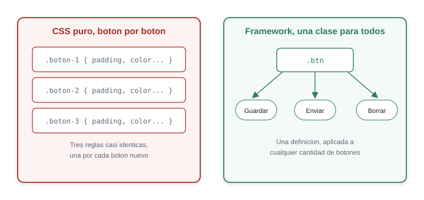
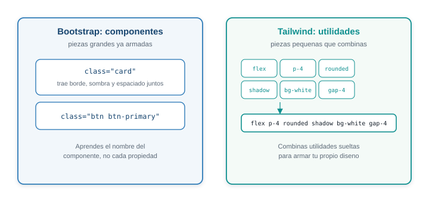
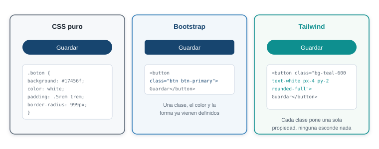
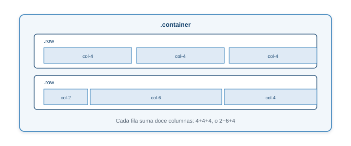
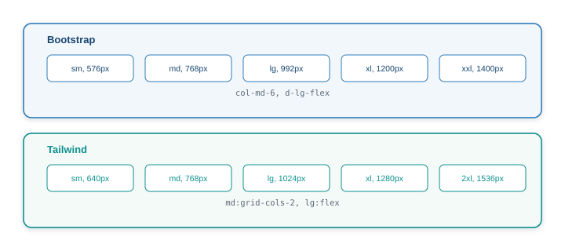
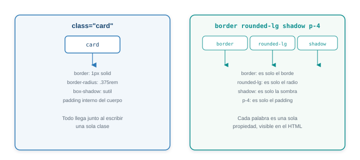
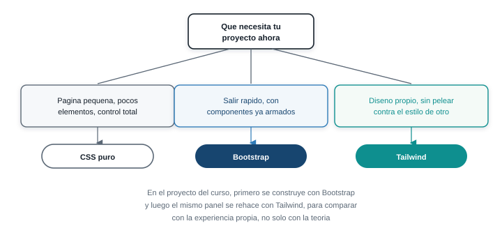
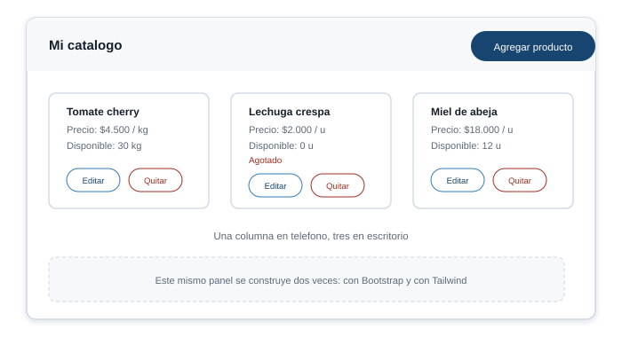

## Un boton, y despues otro, y otro {.solo-diagrama}

{fig-alt="Sin framework se repite una regla CSS por cada boton; con un framework una sola clase reutilizable da estilo a los tres"}

## Lo que gana un equipo

- **Velocidad.** El componente que toma media hora a mano ya viene resuelto.
- **Consistencia.** Todos los botones y tarjetas siguen las mismas reglas, sin que nadie tenga que
  acordarse de repetirlas.
- **Una base ya revisada.** Miles de proyectos ya encontraron los errores comunes de
  accesibilidad y compatibilidad.

## Lo que se paga a cambio

- Una curva de aprendizaje propia: el vocabulario del framework, ademas de CSS.
- Peso adicional: codigo para componentes que tu pagina quizas nunca use.
- Un estilo visual reconocible, salvo que lo personalices.

. . .

Ningun framework reemplaza lo que aprendiste la Semana 5. Sigue siendo CSS por detras.

## Dos filosofias {.solo-diagrama}

{fig-alt="Bootstrap entrega componentes ya armados, Tailwind entrega utilidades pequenas que se combinan"}

## El mismo boton, tres formas {.solo-diagrama}

{fig-alt="El mismo boton escrito de tres formas: HTML puro con CSS aparte, Bootstrap con la clase btn btn-primary, y Tailwind con utilidades combinadas"}

## Como elegir

| Criterio | Bootstrap | Tailwind |
|---|---|---|
| Que escribes | El nombre del componente | Una utilidad por propiedad |
| Personalizar | Sobrescribir el componente | Ajustar variables propias |
| HTML | Limpio, una clase | Cargado, pero explicito |
| Conviene cuando | Sales rapido con una interfaz estandar | Quieres un diseno propio, con control fino |

## Bootstrap: dos lineas, sin instalar nada

```html
<link
  href="https://cdn.jsdelivr.net/npm/bootstrap@5.3.8/dist/css/bootstrap.min.css"
  rel="stylesheet">

<script
  src="https://cdn.jsdelivr.net/npm/bootstrap@5.3.8/dist/js/bootstrap.bundle.min.js">
</script>
```

El `link` va en `head`. El `script` va antes de cerrar `body`: le da comportamiento a menus,
modales y alertas.

## Doce columnas para repartir el ancho {.solo-diagrama}

{fig-alt="El grid de Bootstrap: un container centra el contenido, una row agrupa columnas, y doce columnas reparten el ancho disponible"}

## Breakpoints comparados {.solo-diagrama}

{fig-alt="Comparacion de puntos de quiebre: Bootstrap usa sm md lg xl xxl con prefijo antes de la propiedad, Tailwind usa sm md lg xl 2xl como prefijo de la clase"}

## Componentes que ya trae Bootstrap

- `navbar`, la barra de navegacion, con menu colapsable en telefono.
- `card`, la tarjeta de contenido, con borde y espaciado resueltos.
- `form-control`, `form-label`, formularios con el mismo estilo en todos lados.
- `modal`, una ventana emergente que abre y cierra sin JavaScript propio.

. . .

Todos activados con clases y atributos `data-bs-*`, sin escribir un solo script.

## Y tambien utilidades cortas

```html
<div class="d-flex justify-content-between align-items-center p-3 mb-4 bg-light rounded">
  ...
</div>
```

`d-flex`, `m-*`, `p-*`, `text-center`: para el ajuste puntual que no merece un componente
completo.

## Tailwind: utilidades, no componentes

```html
<div class="flex items-center justify-between p-4 rounded-lg shadow bg-white">
  Contenido alineado, con fondo, sombra y esquinas redondeadas
</div>
```

Cada palabra es una sola propiedad. El HTML es la documentacion de como se ve.

## Un script, pensado para aprender

```html
<script src="https://cdn.jsdelivr.net/npm/@tailwindcss/browser@4"></script>
```

::: {.aviso}
El Play CDN es solo para desarrollo. En produccion, Tailwind se instala con su CLI o con Vite,
que genera un unico CSS con las clases que tu HTML usa de verdad.
:::

## Componente contra utilidades, la misma tarjeta {.solo-diagrama}

{fig-alt="La clase card de Bootstrap agrupa varias propiedades bajo un nombre, la combinacion de utilidades de Tailwind expone cada propiedad por separado"}

## Espaciado, color y tipografia

| Utilidad | Controla |
|---|---|
| `p-N`, `m-N`, `gap-N` | Padding, margen, espacio entre elementos, en una escala numerica |
| `text-{tamano}` | Tamano de fuente: `text-sm`, `text-xl`, `text-3xl` |
| `bg-{color}-{tono}` | Color de fondo, tono de 100 (claro) a 900 (oscuro) |

## Flexbox y Grid, como utilidad

```html
<header class="flex items-center justify-between p-4">
  ...
</header>

<div class="grid grid-cols-1 md:grid-cols-3 gap-4">
  ...
</div>
```

Las mismas herramientas de la Semana 5, sin escribir el CSS.

## Estados: hover y focus

```html
<button class="bg-blue-600 text-white px-4 py-2 rounded-lg
               hover:bg-blue-700 focus:ring-2 focus:ring-blue-300">
  Guardar producto
</button>
```

Un prefijo antes de la utilidad tambien describe un estado, no solo un ancho de pantalla.

## Por que se ve tan cargado

[Cada palabra dice exactamente una cosa, sin saltar a otro archivo para saber que hace.]{.grande}

. . .

Mas clases en el HTML, a cambio de que cada una se explique sola.

## Cual elegir {.solo-diagrama}

{fig-alt="Arbol de decision para elegir framework CSS: proyecto muy pequeno usa CSS puro, si se necesita salir rapido con componentes ya armados usa Bootstrap, si se necesita control fino y un diseno propio usa Tailwind"}

## El taller de hoy {.solo-diagrama}

{fig-alt="Mockup del panel de catalogo del productor: encabezado con boton para agregar producto, y una lista de tarjetas de producto con nombre, precio, cantidad disponible y botones de editar y quitar"}

## Siguientes pasos

[Construir el panel del productor dos veces, y sustentar cual framework sigue en tu proyecto.]{.grande}
