::: {.ficha}
|            |                                       |
|------------|---------------------------------------|
| Asignatura | Programación Web (IF2003)             |
| Grupo      | 603 de Ingeniería Informática         |
| Unidad     | Unidad 2. Frontend                    |
:::

::: {.acceso}
::: {.acceso-item}
Presentación interactiva de la sesión

[Abrir la presentación interactiva](presentacion-interactiva.html){.btn-doc target="_blank"}
:::

::: {.acceso-item}
Taller del panel de catálogo, paso a paso

[Ir directo al taller](#taller){.btn-doc}
:::
:::

## Lo que vas a lograr

Hasta la semana pasada, tu panel de catálogo era una página que se dibuja una vez y no cambia. Si el
productor agrega la panela, la página no se entera: alguien tendría que abrir el archivo, escribir
otra tarjeta a mano y volver a publicar. Esta semana cambia eso. Vas a escribir JavaScript que
reacciona a lo que hace la persona (un clic, una tecla, un formulario enviado) y modifica la página
sin recargarla.

Esta guía se centra en qué hace el navegador por dentro, más que en una lista de métodos, porque el que entiende el mecanismo puede resolver un error que nunca vio, y el que solo
copió el código se queda quieto cuando aparece uno nuevo. Por eso cada parte sigue el mismo
recorrido: un problema real del proyecto, una predicción tuya antes de ver la respuesta, el modelo
mental, el mecanismo paso a paso, el código como herramienta, lo que se rompe y cómo se lee el
error, un reto y la conexión con tu proyecto.

Al terminar la guía puedes:

1. Explicar qué es el DOM, en qué se diferencia del archivo HTML y por qué un cambio hecho con
   JavaScript desaparece al recargar.
2. Cargar un script sin que `querySelector` devuelva `null`, y diagnosticar el error cuando ocurre.
3. Seleccionar y modificar elementos, crear elementos nuevos y evitar la inyección de HTML.
4. Escribir manejadores de eventos, y usar delegación para atender botones que aún no existen.
5. Usar `let`, `const`, funciones flecha, plantillas literales, desestructuración, `spread` y los
   métodos `map`, `filter`, `find`, `reduce`, `some` y `every` para razonar sobre datos.
6. Estructurar una interfaz con un arreglo de datos y una función `render`, en vez de parchar el DOM
   a mano.
7. Validar un formulario en el navegador con mensajes útiles, y explicar por qué esa validación no
   protege nada por sí sola.
8. Depurar con `console`, el panel Elements, el panel Sources y breakpoints, siguiendo un método:
   reproducir, aislar, plantear una hipótesis y comprobar.
9. Construir, en el taller, el panel de catálogo del productor funcionando sin recargar la página:
   agregar con validación, editar, quitar, marcar agotado, filtrar por texto y ver el total.

::: {.callout-note}
Los recuadros **Para memorizar** reúnen lo poco que conviene saber de memoria. Los recuadros **Para
razonar** reúnen lo que se deduce del mecanismo. Antes de cada respuesta oculta, escribe tu predicción.
:::

::: {.callout-note}
## Antes de empezar

Necesitas:

- Las semanas 5 y 6 vistas: HTML5 y CSS3, y el panel de catálogo hecho con Bootstrap o Tailwind.
- Google Chrome o Microsoft Edge (los dos traen las mismas herramientas de desarrollador) y Visual
  Studio Code con la extensión Live Server.
- Cero JavaScript previo. Se asume que sabes qué es una variable, pero no más.

**Cómo abrir las herramientas de desarrollador.** Pulsa `F12`, o `Ctrl + Mayús + I`. Para ir directo
al panel Console, `Ctrl + Mayús + J`. Se abre un panel con pestañas: Elements, Console, Sources y
Network son las cuatro que usas esta semana.

**Estructura de archivos.** Trabajas con dos archivos en la carpeta de tu proyecto, uno junto al
otro:

```text
mi-proyecto/
  index.html     <- la estructura: formulario, lista, botones
  app.js         <- el comportamiento: todo el JavaScript de esta semana
```

Abre siempre la página con Live Server (clic derecho en `index.html`, "Open with Live Server"),
no con doble clic. Live Server sirve la página desde `http://127.0.0.1:5500/`, y eso evita
problemas que verás en la Parte 6 con los módulos de JavaScript.
:::

::: {.diagrama}
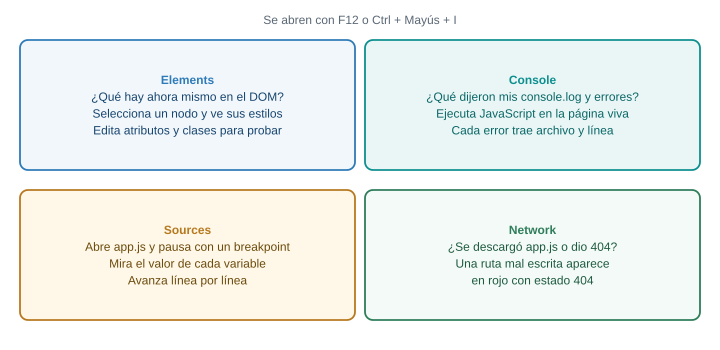{fig-alt="Los cuatro paneles de las herramientas de desarrollador que se usan esta semana: Elements, Console, Sources y Network, con la pregunta que responde cada uno"}

Los cuatro paneles que usarás. Cada uno responde una pregunta distinta, y saber cuál abrir ahorra
mucho tiempo.
:::

## Parte 1. Qué pasa cuando el navegador abre una página

### El problema real

Tu panel de catálogo de la Semana 6 muestra tres tarjetas escritas a mano en el HTML. El productor
quiere agregar la panela, y la regla de negocio RN-01 dice que un producto no se publica sin precio
y sin cantidad. Para que eso funcione, algo tiene que cambiar la página **después de que cargó**,
sin que nadie edite el archivo. Ese algo es JavaScript, y lo que JavaScript cambia es el **DOM**.

Antes de escribir una línea hay que entender qué es el DOM, porque casi todos los errores de esta
semana nacen de confundirlo con el archivo HTML.

**Predice primero.** Una línea de JavaScript cambia el texto del `h1` a "Catálogo 2026". Después abres `index.html` en tu editor. ¿Qué texto tiene el `h1` en el archivo?

::: {.callout-warning collapse="true"}
## Comprueba tu predicción

El archivo sigue diciendo lo que decía antes. JavaScript no escribe en el archivo: modifica una
copia del documento que el navegador guarda en memoria. Si dudas, repite la prueba: la sección "Haz
esto ahora" más abajo te deja comprobarlo con tus ojos.
:::

### Modelo mental: el archivo es una receta, el DOM es el plato

Un archivo `.html` es texto: una lista de etiquetas. El navegador no muestra ese texto. Hace un
trabajo en varios pasos para convertirlo en lo que ves:

::: {.diagrama}
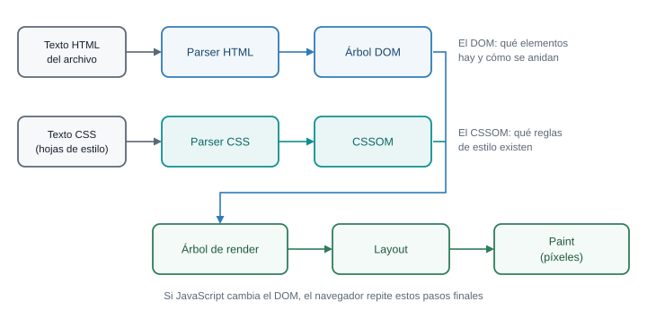{fig-alt="Del archivo HTML a la pantalla: el parser HTML construye el árbol DOM, el parser CSS construye el CSSOM, ambos se combinan en el árbol de render, luego layout y paint"}

El camino del texto a los píxeles. Cuando JavaScript cambia el DOM, el navegador repite los pasos
finales (árbol de render, layout y paint) y la pantalla se actualiza.
:::

1. **Parser HTML.** Lee el texto etiqueta por etiqueta y construye un **árbol de objetos** llamado
   **DOM** (Document Object Model). Cada etiqueta se vuelve un objeto, y cada objeto sabe quién es
   su padre y quiénes son sus hijos.
2. **Parser CSS.** Lee las hojas de estilo y construye otra estructura, el **CSSOM**: qué reglas
   existen y a qué se aplican.
3. **Árbol de render.** Combina el DOM con el CSSOM y deja solo lo que se va a dibujar. Un elemento
   con `display: none` está en el DOM, pero no entra aquí.
4. **Layout.** Calcula el tamaño y la posición de cada caja.
5. **Paint.** Convierte las cajas en píxeles.

::: {.diagrama}
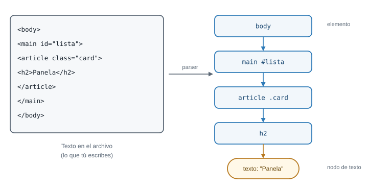{fig-alt="Un fragmento de HTML a la izquierda y su árbol DOM a la derecha: body contiene main con id lista, que contiene un article con clase card, que contiene un h2, que contiene el texto Panela"}

Cada etiqueta es un nodo de elemento. El texto también es un nodo, hijo del elemento que lo contiene.
:::

El DOM es un **árbol**: un nodo raíz, hijos, nietos. Por eso el navegador puede responder preguntas
como "¿cuáles son los hijos de este `ul`?" o "¿quién es el padre de este botón?". También por eso
las funciones que verás esta semana se llaman como se llaman: `children`, `parentElement`,
`append`, `remove`.

### El DOM es un objeto vivo

El punto que más confunde: el archivo y el DOM son cosas distintas. El navegador lee el archivo
**una vez**, construye el DOM y, a partir de ahí, la pantalla refleja el DOM, no el archivo.

::: {.diagrama}
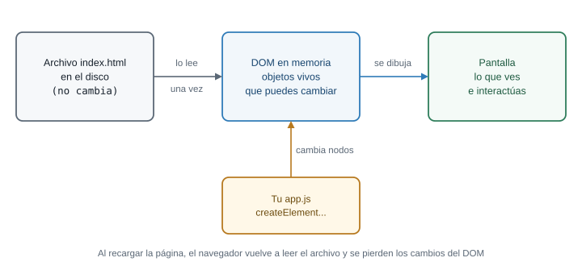{fig-alt="El archivo index.html no cambia; el navegador lo lee una vez y crea el DOM en memoria; JavaScript modifica el DOM y la pantalla refleja el DOM"}

Tres actores: el archivo (quieto), el DOM (vivo, en memoria) y tu JavaScript (que lo modifica).
:::

### Haz esto ahora

No necesitas escribir código para comprobarlo. Abre cualquier página de tu proyecto con Live Server y
sigue estos pasos:

1. Pulsa `F12` y abre la pestaña **Elements**. Lo que ves ahí es el DOM, no el archivo.
2. Haz doble clic sobre el texto de un `h1` dentro del panel Elements y cámbialo.
3. Mira la página: el título cambió, sin recargar.
4. Recarga con `F5`. El título original vuelve, porque el navegador volvió a leer el archivo, que
   nunca cambió.

Acabas de hacer, a mano, lo que va a hacer tu JavaScript: modificar el DOM. Y comprobaste lo que más
importa de esta parte: un cambio en el DOM vive mientras la página no se recargue.

### Qué pasa si el HTML tiene un error

El DOM puede diferir del archivo aunque nadie ejecute JavaScript. El parser corrige lo que puede.
Escribe esto en una página de prueba:

```html
<table id="tabla">
  <tr><td>Panela</td></tr>
</table>
```

Abre Elements y expande la tabla. Vas a ver que el navegador insertó un `<tbody>` entre `table` y
`tr`, aunque tú no lo escribiste. Si después escribes `document.querySelector("#tabla > tr")` y no
encuentras nada, no es un error tuyo de sintaxis: el `tr` ya no es hijo directo de `table`, porque
el DOM tiene un `tbody` en medio. Regla práctica: ante cualquier duda sobre la estructura, mira
**Elements**, no el archivo.

::: {.callout-important}
## Para memorizar

- **DOM**: el árbol de objetos que el navegador construye a partir del HTML.
- **Elements** muestra el DOM; el editor muestra el archivo.
- Recargar la página descarta los cambios que hizo JavaScript.
:::

::: {.callout-note}
## Para razonar, no para memorizar

- Si un cambio hecho con JavaScript no se guarda, ¿es un error o es el comportamiento esperado? Es el
  esperado: el DOM vive en memoria. Cuando necesites que algo sobreviva a una recarga, tendrás que
  guardarlo en otro lado (el navegador, o un servidor más adelante en el curso).
- Si el DOM no coincide con tu archivo, ¿a cuál le crees al depurar? Al DOM: es lo que el navegador
  realmente tiene.
:::

::: {.callout-tip}
## Para pensar

El archivo `index.html` de tu proyecto lo lee el navegador una sola vez al cargar. Entonces, ¿cómo
podría ver el productor su catálogo actualizado mañana, si la página se cierra hoy? Anota la
pregunta: la respuesta completa llega cuando el curso conecte el panel con un servidor.
:::

## Parte 2. JavaScript y el DOM: dónde y cuándo se ejecuta tu script

### El problema real

Quieres que, al cargar el panel, aparezca en la consola la frase "app.js cargó", para confirmar que tu
código se está ejecutando. Parece trivial. Sin embargo, el error más frecuente entre quienes empiezan
con JavaScript en el navegador nace aquí: el script corre **antes** de que existan los elementos que
intenta buscar.

**Predice primero.** Pones `<script src="app.js"></script>` dentro de `<head>`, y `app.js` contiene `document.querySelector("#titulo").textContent = "Hola"`. El `h1` con id `titulo` está más abajo, en el `body`. ¿Qué ocurre?

::: {.callout-warning collapse="true"}
## Comprueba tu predicción

Falla con un error en la consola:

```text
Uncaught TypeError: Cannot set properties of null (setting 'textContent')
```

Cuando el parser llega a `<script>`, se detiene, descarga el archivo, lo ejecuta y solo después sigue
leyendo. En ese momento el `body` todavía no se ha leído. `querySelector` no encuentra nada y
devuelve `null`. Intentar poner `textContent` en `null` provoca el error.
:::

### Modelo mental: el parser lee de arriba hacia abajo

El parser HTML trabaja como alguien que lee un libro de principio a fin. Cuando se topa con una
etiqueta `<script>` normal, deja de leer, ejecuta el script y recién entonces continúa. Por eso un
script puesto en `<head>` se ejecuta cuando el `body` aún no existe.

::: {.diagrama}
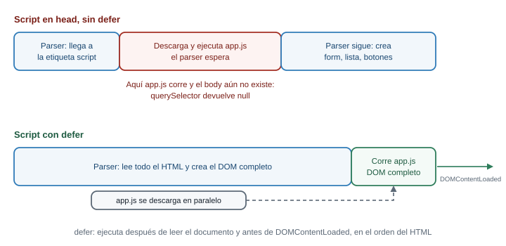{fig-alt="Línea de tiempo de carga: sin defer el script en head detiene al parser y corre antes de que exista el body; con defer el parser termina primero y el script corre después, antes de DOMContentLoaded"}

Arriba, un script sin `defer` en el `head` detiene el parser y corre con el `body` vacío. Abajo, con
`defer`, el navegador descarga el script en paralelo y lo ejecuta cuando el documento está completo.
:::

### Las tres formas de cargar tu script

| Forma | Cuándo corre | Para qué sirve hoy |
|---|---|---|
| `<script src="app.js"></script>` en el `head` | Al leerlo, con el `body` aún vacío | Casi nunca; produce el error de arriba |
| `<script src="app.js"></script>` justo antes de `</body>` | Cuando el parser ya leyó todo lo anterior | Funciona, y es lo que verás en tutoriales antiguos |
| `<script src="app.js" defer></script>` en el `head` | Después de leer todo el documento y antes de `DOMContentLoaded` | La forma recomendada: el script se descarga en paralelo y los elementos ya existen |

La tercera es la que usa esta guía. Según MDN, un script con `defer` se ejecuta después de que
termina el análisis del documento y antes del evento `DOMContentLoaded`, y varios scripts con `defer`
corren en el orden en que aparecen en el HTML. El atributo `defer` solo tiene efecto en scripts con
`src`; en un script escrito dentro de la propia etiqueta, no hace nada.

También existe `async`, que ejecuta el script apenas se descarga, sin importar si el DOM está listo.
Sirve para scripts independientes (una analítica, por ejemplo) y no para el código que busca tus
elementos.

::: {.callout-important}
## Para memorizar

El esqueleto de `index.html` para toda la semana:

```html
<!DOCTYPE html>
<html lang="es">
<head>
  <meta charset="UTF-8">
  <meta name="viewport" content="width=device-width, initial-scale=1.0">
  <title>Catálogo del productor</title>
  <script src="app.js" defer></script>
</head>
<body>
  <!-- tu página -->
</body>
</html>
```

`defer` va en el `script` del `head`. Sin `src`, `defer` no sirve.
:::

::: {.callout-note}
## Para razonar, no para memorizar

¿Por qué `defer` arregla el problema? Porque cambia **cuándo** corre el script; lo que hace queda igual. El
error `Cannot set properties of null` señala que el elemento no existía
cuando lo buscaste. La pregunta correcta ante un `null` es siempre la misma: ¿existía ese elemento en
el momento exacto en que corrió esta línea?
:::

### La consola: tu primer laboratorio

La consola es un lugar donde escribes una línea de JavaScript, pulsas Enter y el navegador la ejecuta
sobre la página abierta, con acceso a su DOM. Ábrela con `Ctrl + Mayús + J`. Prueba, con cualquier
página abierta:

```js
document.title
```

```js
document.body.children.length
```

La consola imprime el resultado de la última expresión. Para imprimir algo desde tu propio script usa
`console.log`:

```js
console.log("app.js cargó");
```

Pon esa línea en `app.js`, guarda, y mira la consola. Si no aparece, el script no se está cargando.
Ese es el primer diagnóstico del día: hazlo siempre que algo no responda.

### Qué pasa si... el script no carga

Si escribes mal el nombre del archivo (`<script src="apps.js" defer>`), la consola muestra un error
de red, no de JavaScript. En Chrome aparece algo como:

```text
Failed to load resource: the server responded with a status of 404
```

El texto que sigue al `404` cambia según el servidor. El 404 significa "no encontré ese archivo". La
forma más rápida de confirmarlo es el panel **Network**: recarga la página con ese panel abierto y
busca la fila de `app.js` en rojo. Los errores de red no se arreglan en el código JavaScript, se
arreglan en la ruta del `src`.

### Qué pasa si... el mismo nombre se declara dos veces

Si dos scripts de la misma página declaran `const productos`, el segundo falla:

```text
Uncaught SyntaxError: Identifier 'productos' has already been declared
```

Los scripts clásicos comparten un único espacio de nombres global. Cuando tengas un solo `app.js`
no te pasa, pero conviene reconocer el mensaje, porque aparece al pegar código de varias fuentes.

### Conexión con el proyecto

Todo lo que escribas esta semana va a `app.js`, y `index.html` lleva siempre el `defer`. Si tu
proyecto ya tiene un `estilos.css` o una carga de Bootstrap en el `head`, no los quites: el
JavaScript convive con ellos.

## Parte 3. Seleccionar elementos

### El problema real

El panel tiene una lista de productos y un botón "Agregar producto". Para que el botón haga algo,
primero tu código tiene que **encontrarlo** en el DOM. Seleccionar es obtener una referencia a un
nodo, para poder leerlo o modificarlo después.

Para practicar, usa esta página. Guárdala como `index.html` con el esqueleto de la Parte 2:

```html
<body>
  <h1 id="titulo">Mi catálogo</h1>
  <p class="aviso">Hoy hay 4 productos.</p>
  <ul id="productos">
    <li class="producto">Tomate chonto</li>
    <li class="producto">Papa criolla</li>
    <li class="producto agotado">Aguacate hass</li>
    <li class="producto">Panela</li>
  </ul>
  <button id="agregar">Agregar producto</button>
</body>
```

**Predice primero.** Guardas `const items = document.querySelectorAll(".producto")` y después borras un `li` con `.remove()`. ¿Cuánto vale `items.length`?

::: {.callout-warning collapse="true"}
## Comprueba tu predicción

Sigue valiendo **4**. `querySelectorAll` devuelve una `NodeList` **estática**: una foto del DOM en el
momento de la llamada. Si el DOM cambia después, la lista no se actualiza. Si necesitas datos
frescos, vuelve a llamar a `querySelectorAll`.
:::

### Los métodos de selección

::: {.diagrama}
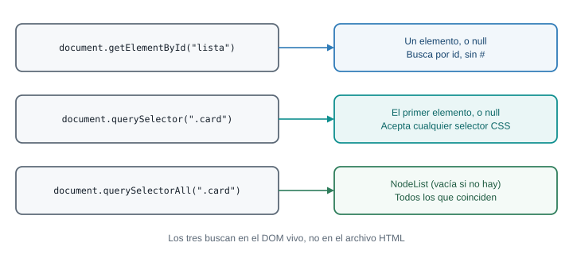{fig-alt="Tres formas de seleccionar: getElementById y querySelector devuelven un elemento o null; querySelectorAll devuelve una NodeList estática, vacía si no hay coincidencias"}

Los tres métodos buscan en el DOM vivo. Lo importante es qué devuelve cada uno cuando **no encuentra
nada**.
:::

```js
const titulo = document.getElementById("titulo");        // un elemento, o null
const primero = document.querySelector(".producto");     // el primero que coincide, o null
const todos = document.querySelectorAll(".producto");    // NodeList (vacía si no hay)
```

- `getElementById("titulo")` busca por `id`. Se escribe **sin** `#`, porque ya sabe que es un id.
- `querySelector(selector)` acepta **cualquier selector CSS**, los mismos que escribiste en la Semana
  5: `#titulo`, `.producto`, `ul > li`, `li:not(.agotado)`. Devuelve el **primer** elemento que
  coincide.
- `querySelectorAll(selector)` devuelve **todos** los que coinciden, en el orden del documento.

Una ventaja de `querySelector`: puedes llamarlo sobre un elemento, no solo sobre `document`, y busca
únicamente dentro de él.

```js
const lista = document.querySelector("#productos");
const agotado = lista.querySelector(".agotado");   // solo busca dentro de la lista
console.log(agotado.textContent);                  // "Aguacate hass"
```

### Qué pasa si... no encuentra el elemento

Los dos primeros métodos devuelven `null` cuando no hay coincidencia. `querySelectorAll` devuelve una
lista vacía, no `null`. Esa diferencia importa:

```js
const buscado = document.querySelector("#no-existe");
console.log(buscado);          // null
buscado.textContent = "x";     // TypeError
```

El mensaje es `Uncaught TypeError: Cannot set properties of null (setting 'textContent')`. Si en
cambio **lees** una propiedad de `null` (`buscado.textContent`), el mensaje es
`Cannot read properties of null (reading 'textContent')`. La palabra entre paréntesis dice qué
intentaste hacer con el `null`, y el nombre de la variable en la línea del error dice cuál fue. Con
esas dos pistas, casi siempre sabes dónde buscar.

Las tres causas más comunes de un `null`:

1. El elemento aún no existe porque el script corrió antes (Parte 2).
2. El selector está mal escrito: `querySelector("productos")` busca una etiqueta `<productos>`, no el id
   `productos`. Falta el `#`.
3. El id o la clase del HTML no coincide con el del JavaScript (`lista` frente a `listado`).

Y una cuarta, que no devuelve `null` sino que falla a lo bestia: un id que empieza por un dígito
necesita escape en CSS.

```js
document.querySelector("#1abc");
// Uncaught SyntaxError: Failed to execute 'querySelector' on 'Document': '#1abc' is not a valid selector.
```

### NodeList frente a Array

`querySelectorAll` no devuelve un arreglo. Devuelve una `NodeList`, que se parece a uno (tiene
`length`, se indexa con `[0]` y tiene `forEach`) pero no tiene `map`, `filter` ni `reduce`.

::: {.diagrama}
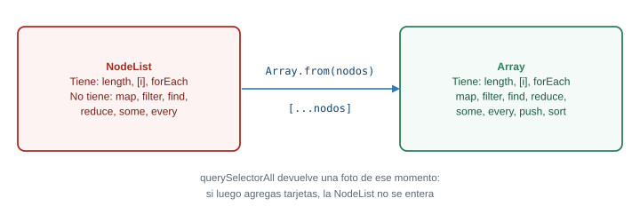{fig-alt="Una NodeList tiene length, forEach y acceso por índice pero no map ni filter; un Array tiene map, filter, find y reduce; Array.from convierte una NodeList en Array"}

Si necesitas los métodos de arreglo, conviertes la `NodeList` con `Array.from(...)` o con `[...nodos]`.
:::

```js
const items = document.querySelectorAll(".producto");

items.forEach((li) => console.log(li.textContent));   // funciona

const nombres = items.map((li) => li.textContent);
// Uncaught TypeError: items.map is not a function

const nombresOk = Array.from(items).map((li) => li.textContent);
console.log(nombresOk);  // ["Tomate chonto", "Papa criolla", "Aguacate hass", "Panela"]
```

`getElementsByClassName` y `getElementsByTagName` existen y devuelven una colección **viva** (se
actualiza sola) que tampoco tiene `map`. Puedes encontrarlas en código antiguo. Esta guía usa
`querySelector` y `querySelectorAll`.

::: {.callout-important}
## Para memorizar

| Método | Devuelve |
|---|---|
| `getElementById("x")` | Elemento o `null` |
| `querySelector(".x")` | Primer elemento o `null` |
| `querySelectorAll(".x")` | `NodeList` estática (vacía si no hay) |

`Array.from(nodelist)` para tener `map` y `filter`.
:::

::: {.callout-note}
## Para razonar, no para memorizar

Si ves `X is not a function` y `X` es el resultado de `querySelectorAll`, sospecha de la `NodeList`.
Si ves `Cannot read properties of null`, pregúntate si el elemento existía en ese momento. Ninguna de
las dos cosas se memoriza como caso: se deduce de **qué devuelve cada método cuando no encuentra** y
**qué tipo de objeto es lo que devuelve**.
:::

::: {.callout-tip}
## Reto 1. Preguntas a la página

Con la página de práctica abierta, escribe en la consola, sin tocar el HTML:

1. Una expresión que devuelva cuántos productos **no** están agotados.
2. Una expresión que devuelva el texto del último `li`.
3. Una expresión que devuelva un arreglo con los nombres de todos los productos.
:::

::: {.callout-note collapse="true"}
## Solución del Reto 1

```js
document.querySelectorAll(".producto:not(.agotado)").length;
```

Devuelve `3`. Usa el selector CSS `:not()` que conoces de la Semana 5.

```js
const items = document.querySelectorAll(".producto");
items[items.length - 1].textContent;
```

Devuelve `"Panela"`. El último índice de una lista es `length - 1`. Otra opción es
`document.querySelector("#productos li:last-child").textContent`.

```js
Array.from(document.querySelectorAll(".producto"), (li) => li.textContent);
```

`Array.from` acepta como segundo argumento una función que se aplica a cada elemento, así que sirve
de conversión y de `map` a la vez. Si prefieres dos pasos:
`Array.from(items).map((li) => li.textContent)`.
:::

### Conexión con el proyecto

En el panel del productor vas a seleccionar siempre lo mismo: el formulario, los campos, el contenedor
de las tarjetas. Esas búsquedas se hacen **una sola vez**, al inicio de `app.js`, y se guardan en
constantes. Buscar el mismo elemento dentro de una función que se ejecuta muchas veces es más lento
y deja el código lleno de selectores repetidos.

## Parte 4. Modificar el DOM

### El problema real

El productor agrega "Yuca" con precio y cantidad. Para que aparezca en el catálogo, tu código tiene que
**crear** un elemento nuevo y ponerlo en el árbol. Si la cantidad es cero, la tarjeta debe verse como
agotada (RN-03). Esas dos cosas, crear y cambiar el aspecto, son el contenido de esta parte.

**Predice primero.** El primer `li` de la lista tiene un listener de clic que escribe "clic" en la consola. Ejecutas `lista.innerHTML += "<li class='producto'>Yuca</li>"`. Haces clic en el primer `li`. ¿Qué pasa?

::: {.callout-warning collapse="true"}
## Comprueba tu predicción

No pasa nada: el listener se perdió. `innerHTML +=` lee todo el HTML de la lista como texto, le
agrega la cadena nueva y vuelve a **construir todos los hijos desde cero**. Los `li` viejos se
descartan y los nuevos son objetos distintos, sin listeners. No aparece ningún error, y eso lo vuelve
un bug difícil: la página se ve igual, pero un comportamiento dejó de existir.
:::

### Leer y escribir texto: `textContent`

```js
const titulo = document.querySelector("#titulo");
console.log(titulo.textContent);        // "Mi catálogo"
titulo.textContent = "Catálogo 2026";   // el cambio se ve en pantalla
```

`textContent` trata lo que escribes como **texto**, nunca como HTML. Si le asignas `"<b>hola</b>"`,
verás las etiquetas literales en pantalla. Esa propiedad es la que usarás siempre que pongas en la
página un dato que viene de una persona.

### Cambiar el aspecto: `classList` antes que `style`

La forma sana de cambiar cómo se ve algo es agregarle o quitarle una **clase** que ya está definida en
tu CSS, y no escribir estilos desde JavaScript.

```js
const panela = document.querySelector(".producto:last-child");

panela.classList.add("agotado");              // agrega la clase
panela.classList.remove("agotado");           // la quita
panela.classList.toggle("agotado");           // la agrega si no está, la quita si está
console.log(panela.classList.contains("agotado"));   // true o false
```

`style` existe y escribe un estilo directo sobre el elemento:

```js
panela.style.backgroundColor = "tomato";
panela.style.color = "white";
```

Dos cosas que debes saber de `style`. Las propiedades CSS con guion se escriben en camelCase
(`background-color` se vuelve `backgroundColor`). Y si escribes con guion, el error es confuso, porque
JavaScript lee el guion como una resta:

```js
panela.style.background-color = "tomato";
// Uncaught SyntaxError: Invalid left-hand side in assignment
```

Aun sabiendo escribirlo bien, `style` tiene un problema de fondo: reparte la apariencia entre tu CSS y
tu JavaScript. Con `classList`, el CSS dice **cómo** se ve "agotado" en un único lugar, y el
JavaScript solo decide **cuándo** aplica. Usa `style` solo para valores que se calculan en el momento
(un ancho que depende de un dato, por ejemplo).

### Atributos: `getAttribute`, `setAttribute` y `dataset`

Los atributos HTML (`id`, `href`, `disabled`, `data-*`) se leen y escriben con métodos, o con una
propiedad directa si existe:

```js
const boton = document.querySelector("#agregar");

boton.setAttribute("title", "Agrega un producto nuevo");
console.log(boton.getAttribute("title"));
boton.disabled = true;     // propiedad directa: deshabilita el botón
boton.hidden = true;       // oculta el botón
```

Los atributos que empiezan por `data-` están hechos para que guardes datos propios en el HTML. En
JavaScript aparecen en `dataset`, con el guion convertido a camelCase:

```js
const item = document.querySelector(".producto");
item.dataset.id = 7;                  // escribe el atributo data-id="7"
console.log(item.dataset.id);         // "7"
console.log(typeof item.dataset.id);  // "string"
```

Guarda ese último dato: **todo lo que sale de `dataset` es texto**, aunque hayas escrito un número.
Esa conversión silenciosa causa un bug clásico que resolverás en la Parte 9.

### Crear elementos: el ciclo de cuatro pasos

::: {.diagrama}
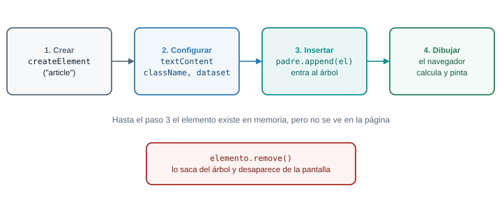{fig-alt="Para agregar un elemento: createElement lo crea fuera de la página, se configura, append lo inserta en un padre del DOM y el navegador lo dibuja; remove lo saca"}

Un elemento recién creado existe solo en memoria. No se ve hasta que lo insertas en un padre que ya
está en el DOM.
:::

```js
const lista = document.querySelector("#productos");

const nuevo = document.createElement("li");      // 1. crear
nuevo.textContent = "Yuca";                       // 2. configurar
nuevo.className = "producto";
lista.append(nuevo);                              // 3. insertar al final del padre
```

`append` inserta al final; `prepend` al principio. Para quitar un elemento, se lo pides a él mismo:
`nuevo.remove()`. Para vaciar un contenedor de un solo golpe, usa `lista.replaceChildren()`.

`append` acepta varios argumentos a la vez, y cadenas de texto además de nodos:

```js
lista.append(nuevo, "texto suelto");
```

Un detalle que no genera ningún error: si le pasas `null` o `undefined` a `append`, no falla, sino que
agrega el **texto** `"null"` o `"undefined"`. Cuando veas la palabra "null" impresa en tu página, es
casi seguro que una variable llegó vacía a un `append`.

### `innerHTML` y el riesgo de inyección

`innerHTML` lee o escribe el contenido de un elemento **como HTML**. Es cómodo, porque permite armar
una tarjeta completa con una plantilla de texto. También es la puerta de entrada de un ataque
conocido.

::: {.diagrama}
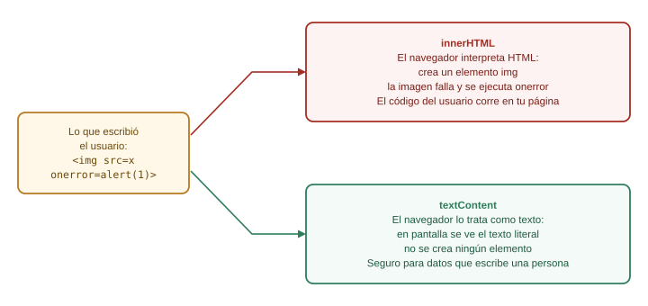{fig-alt="Si el texto de un usuario contiene una etiqueta img con onerror, innerHTML la interpreta como HTML y ejecuta el código; textContent la muestra como texto literal"}

Con `innerHTML`, el navegador **interpreta** lo que recibe. Con `textContent`, solo lo muestra.
:::

Imagina que el nombre del producto lo escribe una persona y tu código hace esto:

```js
const nombre = "";   // lo que escribió alguien
const tarjeta = document.createElement("div");
tarjeta.innerHTML = `<h2>${nombre}</h2>`;        // peligroso
```

El navegador crea una imagen con un `src` inválido. La imagen falla al cargar y dispara su evento
`onerror`, que ejecuta el código escrito por quien llenó el formulario. Según MDN, los elementos
`<script>` insertados con `innerHTML` no se ejecutan, pero los manejadores de eventos como `onerror`
sí. A esto se le llama **inyección de código** (XSS), y MDN recomienda usar `textContent` cuando el
contenido es texto plano.

La regla práctica, simple y suficiente para esta semana:

- Datos que vienen de una persona (nombre, descripción, comentario): **`textContent`**, siempre.
- HTML que escribiste tú, sin ningún dato externo: `innerHTML` es aceptable, pero crear los
  elementos con `createElement` también lo es y no te obliga a pensarlo.

Tu taller de la Parte 10 construye cada tarjeta con `createElement` y `textContent`. Ese es el motivo.

### Qué pasa si... el selector no encuentra el contenedor

Si `lista` es `null` porque el selector está mal escrito, el `append` falla con
`Cannot read properties of null (reading 'append')`. Si en cambio le pasas algo que no es un nodo a
`appendChild` (el método antiguo, que solo acepta un nodo), el mensaje es
`Failed to execute 'appendChild' on 'Node': parameter 1 is not of type 'Node'.` Léelo como "me diste
algo que no es un elemento": casi siempre es `null` o un texto.

::: {.callout-important}
## Para memorizar

- Texto: `elemento.textContent`.
- Aspecto: `elemento.classList.add / remove / toggle / contains`.
- Crear: `createElement`, configurar, `padre.append(hijo)`; quitar: `elemento.remove()`.
- Datos propios en el HTML: `data-algo` y `elemento.dataset.algo` (siempre `string`).
- Datos que escribió una persona: `textContent`, no `innerHTML`.
:::

::: {.callout-note}
## Para razonar, no para memorizar

Frente a una tarea de modificación, no preguntes "¿qué método era?". Pregunta primero cuál de estas
cuatro cosas quieres cambiar: el **contenido** (`textContent`), el **aspecto** (clases), un **dato**
(atributo o `dataset`) o la **estructura** (crear, insertar, quitar). Con la categoría clara, el
método sale de la lista corta de arriba.
:::

::: {.callout-tip}
## Reto 2. La lista desde un arreglo

Con la página de práctica, escribe en `app.js` un arreglo `productos` con objetos
`{ nombre, cantidad }` (tomate chonto 40, papa criolla 25, aguacate hass 0, panela 12). Vacía la lista
y vuelve a dibujarla desde el arreglo: un `li` por producto, con el nombre como texto. Si la cantidad
es 0, el `li` lleva además la clase `agotado`. Hazlo sin `innerHTML`.
:::

::: {.callout-note collapse="true"}
## Solución del Reto 2

```js
const productos = [
  { nombre: "Tomate chonto", cantidad: 40 },
  { nombre: "Papa criolla", cantidad: 25 },
  { nombre: "Aguacate hass", cantidad: 0 },
  { nombre: "Panela", cantidad: 12 },
];

const lista = document.querySelector("#productos");
lista.replaceChildren();

for (const producto of productos) {
  const item = document.createElement("li");
  item.className = "producto";
  item.textContent = producto.nombre;
  if (producto.cantidad === 0) {
    item.classList.add("agotado");
  }
  lista.append(item);
}
```

Cada vuelta del `for...of` hace los cuatro pasos del ciclo: crear, configurar, decidir la clase,
insertar. La condición `cantidad === 0` es la regla RN-03 aplicada: el estado "agotado" **se
deduce** de la cantidad, no se guarda aparte. Esa idea vuelve en la Parte 7.
:::

### Conexión con el proyecto

La tarjeta de producto de tu panel es exactamente esto, con más elementos: un contenedor, un título, un
párrafo con el precio y la cantidad, y botones. En el taller la construyes con una función
`crearTarjeta` que recibe un producto y devuelve el elemento, para no repetir el ciclo a mano cada
vez.

## Parte 5. Eventos

### El problema real

Hay dos botones en el panel: "Agregar" y, dentro de cada tarjeta, "Quitar". Los botones de las
tarjetas **no existen todavía** cuando la página carga: se crean cuando el productor agrega algo.
¿Cómo le dices a un botón que no existe "cuando te pulsen, haz esto"? La respuesta pasa por entender
cómo viaja un evento por el DOM.

**Predice primero.** Una lista contiene un `li` y dentro del `li` hay un botón. Registras un listener de clic en el botón, otro en el `li` y otro en la lista, cada uno con su `console.log`. Haces clic en el botón. ¿En qué orden salen los tres mensajes?

::: {.callout-warning collapse="true"}
## Comprueba tu predicción

El orden es **botón, li, lista**: del elemento más interno hacia afuera. Un clic en el botón es, para
el navegador, un clic dentro del `li` y dentro de la lista también, porque el botón está contenido en
ellos. El evento "sube" por los ancestros. A ese viaje de subida se le llama **burbujeo**.
:::

### Modelo mental: registrar, no llamar

Un evento es algo que le ocurre a un elemento: un clic, una tecla, un formulario enviado. Tú no
preguntas "¿ya hicieron clic?" una y otra vez. Le **registras** al elemento una función, y el navegador
la llama cuando el evento ocurre. Esa función se llama **manejador** (handler).

```js
const agregar = document.querySelector("#agregar");

function saludar() {
  console.log("Hola desde el panel");
}

agregar.addEventListener("click", saludar);
```

`addEventListener(tipo, manejador)` recibe dos cosas principales: el tipo de evento como texto
(`"click"`) y la función. Observa que escribes `saludar` **sin paréntesis**. La razón es el centro de
esta parte, y la verás en el siguiente error.

### Qué pasa si... llamas a la función en vez de pasarla

```js
agregar.addEventListener("click", saludar());   // incorrecto: con paréntesis
```

`saludar()` con paréntesis **ejecuta la función ahora** y pasa lo que devuelve (`undefined`) como
manejador. El resultado es un bug sin ningún mensaje de error: la función corre una vez, al cargar la
página, y después no hace nada cuando pulsas el botón. Si ves en la consola un mensaje que aparece al
cargar, pero nunca al hacer clic, revisa los paréntesis. Pasar la función es darle la receta; llamarla
es cocinar en ese momento.

### Los eventos que más usarás

| Evento | Cuándo ocurre | Dato útil |
|---|---|---|
| `click` | Se pulsa el elemento | `event.target` |
| `input` | El valor de un campo cambia con cada tecla | `event.target.value` |
| `change` | El valor se confirma (al salir del campo, al elegir en un `select`) | `event.target.value` |
| `submit` | Se envía un formulario (clic en el botón de envío o Enter) | se escucha en el `form` |
| `keydown` | Se pulsa una tecla | `event.key` |
| `DOMContentLoaded` | El documento terminó de leerse | se escucha en `document` |

Con `defer` en tu script, no necesitas `DOMContentLoaded`: el DOM ya está listo cuando corres. Si
algún día no usas `defer`, envuelves tu código así:

```js
document.addEventListener("DOMContentLoaded", () => {
  // aquí el DOM ya existe
});
```

### El objeto `event`

El navegador le pasa a tu manejador un objeto con información de lo ocurrido. Las propiedades que
debes conocer:

- `event.type`: el tipo ("click", "input").
- `event.target`: el elemento **donde se originó** el evento (el más profundo que recibió el clic).
- `event.currentTarget`: el elemento **al que está pegado el listener** que se está ejecutando.
- `event.key`: en eventos de teclado, la tecla.
- `event.preventDefault()`: cancela la acción por defecto (enviar el formulario, seguir un enlace).
- `event.stopPropagation()`: detiene el viaje del evento hacia otros elementos.

```js
const filtro = document.querySelector("#filtro");

filtro.addEventListener("input", (event) => {
  console.log("Escribió:", event.target.value);
});
```

### Las tres fases: captura, objetivo y burbujeo

::: {.diagrama}
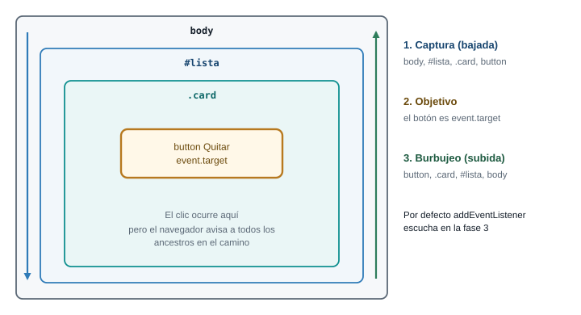{fig-alt="Un clic en un botón recorre tres fases: captura de body hacia el botón, objetivo en el botón y burbujeo del botón de vuelta hacia body"}

Un clic en el botón baja por los ancestros (captura), llega al botón (objetivo) y sube de nuevo
(burbujeo). Por defecto, `addEventListener` escucha durante la subida.
:::

Según MDN, un evento pasa por tres fases: la **captura**, que va desde el elemento más externo hacia
el objetivo; la **fase de objetivo**, en el propio elemento; y el **burbujeo**, que sube desde el
objetivo hacia afuera. Por defecto, los listeners se registran en la fase de burbujeo. Si necesitas
escuchar en la captura, lo pides con una opción:

```js
lista.addEventListener("click", manejador, { capture: true });
```

En la práctica usarás el burbujeo casi siempre. La captura la verás muy poco.

`event.target` y `event.currentTarget` casi siempre se confunden. Ejemplo con la lista, el `li` y el
botón: si haces clic en el botón y el listener está en la lista, `event.target` es el **botón** (donde
ocurrió) y `event.currentTarget` es la **lista** (donde está el listener).

### `preventDefault` y `stopPropagation`

`preventDefault()` cancela lo que el navegador haría por defecto. En un formulario, el comportamiento
por defecto de `submit` es **recargar la página** enviando los datos. Sin cancelarlo, tu código corre
y la página se recarga inmediatamente después, borrando todo lo que dibujaste:

```js
form.addEventListener("submit", (event) => {
  event.preventDefault();   // sin esto, la página se recarga
  // ... tu lógica
});
```

`stopPropagation()` es otra cosa: no cancela la acción, sino que corta el burbujeo. Úsalo con
moderación. Si un `stopPropagation` impide que el evento llegue a un contenedor, cualquier listener
que estuviera ahí (el de tu delegación, por ejemplo) deja de funcionar sin que se entienda por qué.

### Delegación: un solo listener para muchos botones

Volvamos al problema inicial. Hay dos formas de atender los botones "Quitar" de las tarjetas:

::: {.diagrama}
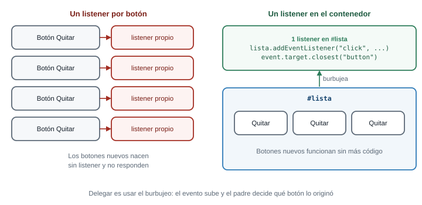{fig-alt="Sin delegación hay un listener por cada botón; con delegación hay un solo listener en el contenedor lista que recibe los clics que burbujean desde los botones"}

A la izquierda, un listener por botón: los botones que se crean después nacen sin listener. A la
derecha, un único listener en el contenedor aprovecha el burbujeo.
:::

La forma ingenua recorre los botones existentes y pega un listener a cada uno. Funciona para los que
ya están en la página, pero los botones creados después no lo tienen. La **delegación** aprovecha el
burbujeo: un clic en cualquier botón de la lista sube hasta la lista, y es la lista la que decide qué
hacer.

```js
const lista = document.querySelector("#productos");

lista.addEventListener("click", (event) => {
  const boton = event.target.closest("button");   // ¿el clic fue en (o dentro de) un botón?
  if (!boton) {
    return;                                       // el clic fue en otra parte de la lista
  }
  boton.closest("li").remove();                   // quita el li que contiene ese botón
});
```

`closest(selector)` sube por los ancestros desde el elemento hasta encontrar el primero que coincide
con el selector (incluyéndose a sí mismo), o devuelve `null` si no hay ninguno. Se usa porque
`event.target` puede ser un elemento **dentro** del botón (un icono, un `span`) y no el botón mismo.
Con `closest`, resuelves el caso sin pensarlo.

::: {.callout-important}
## Para memorizar

- Registrar: `elemento.addEventListener("click", manejador)`, sin paréntesis tras el nombre.
- `submit` en un formulario: empieza siempre con `event.preventDefault()`.
- `event.target` es dónde ocurrió; `event.currentTarget` es dónde está el listener.
- Delegación: un listener en el contenedor y `event.target.closest(...)` dentro.
:::

::: {.callout-note}
## Para razonar, no para memorizar

¿Por qué la delegación atiende botones que aún no existen? Porque el listener no está en los botones,
está en el contenedor, que sí existe. El clic **sube** hasta él pase lo que pase con los hijos. Si
entiendes el burbujeo, no hay nada que memorizar sobre delegación: es una consecuencia.

¿Y por qué `submit` recarga la página? Porque un formulario HTML existe desde mucho antes que
JavaScript: su comportamiento original era enviar datos a otra página. `preventDefault` es la forma de
decir "yo me encargo".
:::

### Hilo de diagnóstico: el botón Quitar de un producto nuevo no responde

Este es el bug que más se repite con eventos. Un estudiante escribe esto:

```js
const botones = document.querySelectorAll(".quitar");
botones.forEach((boton) => {
  boton.addEventListener("click", () => {
    boton.closest("li").remove();
  });
});
```

Los botones que estaban en el HTML funcionan. Los de productos agregados después, no. Aplica el método:

1. **Reproducir.** Agregar un producto y pulsar su botón. Falla siempre, y solo con los nuevos.
2. **Aislar.** En la consola, `document.querySelectorAll(".quitar").length` antes y después de
   agregar. El número crece, así que el botón nuevo existe. El problema no es que falte el botón.
3. **Hipótesis.** El `querySelectorAll` se ejecutó **una vez**, al cargar. Devolvió una `NodeList`
   estática (Parte 3) con los botones de ese momento. Los nuevos nunca entraron en ella, y nunca
   recibieron listener.
4. **Comprobar.** Pega el listener en el contenedor (delegación) y prueba de nuevo: funciona con
   todos, nuevos y viejos.

La corrección no está en la línea que "falla": está en el modelo. El método dio el diagnóstico sin
adivinar.

::: {.callout-tip}
## Reto 3. Seleccionar productos con un clic

En la página de práctica, haz que un clic sobre cualquier `li` alterne la clase `seleccionado` (la
agrega si no está, la quita si está). Debe funcionar también con un `li` que agregues después con
JavaScript. Usa **un solo** listener.
:::

::: {.callout-note collapse="true"}
## Solución del Reto 3

```js
const lista = document.querySelector("#productos");

lista.addEventListener("click", (event) => {
  const item = event.target.closest("li");
  if (!item) {
    return;
  }
  item.classList.toggle("seleccionado");
});
```

El listener está en el `ul`, que existe desde la carga. `closest("li")` encuentra el `li` que contiene
el punto donde se hizo clic. Si el clic cae en el `ul` pero fuera de cualquier `li`, `closest`
devuelve `null` y el `if` evita un error. Para probar un `li` nuevo, en la consola:
`lista.append(Object.assign(document.createElement("li"), { textContent: "Yuca" }))` y haz clic sobre
él: también se alterna, aunque se creó después de registrar el listener.
:::

### Conexión con el proyecto

En el taller, un solo listener en el contenedor de las tarjetas atiende los tres botones de cada
producto (editar, marcar agotado, quitar), y un solo listener de `submit` en el formulario atiende el
alta y la edición. Dos listeners, no veinte.

## Parte 6. El ES6 que necesitas

### El problema real

Un panel de catálogo no es solo DOM: es **datos**. Una lista de productos, cada uno con nombre, precio y
cantidad, y preguntas sobre ella: ¿cuántos hay agotados?, ¿cuánto vale el inventario?, ¿cuál es la
panela? Para responderlas necesitas las herramientas del lenguaje. **ES6** (también llamado ES2015) es
la versión de JavaScript que las introdujo, y hoy es el JavaScript normal de cualquier navegador. No
la vas a memorizar entera: aprendes las piezas que usa el taller.

**Predice primero.** `const producto = { nombre: "Panela", cantidad: 12 };` y después `producto.cantidad = 0;`. ¿Da error? ¿Y `producto = { nombre: "Yuca" };`?

::: {.callout-warning collapse="true"}
## Comprueba tu predicción

La primera **no da error**. La segunda sí:
`Uncaught TypeError: Assignment to constant variable.` `const` impide **reasignar el nombre** a otra
cosa, no impide modificar el contenido del objeto al que apunta. Piensa en `const` como una etiqueta
pegada a un cajón: no puedes cambiar la etiqueta de cajón, pero sí meter y sacar cosas dentro.
:::

### `let`, `const` y el alcance

Hay tres palabras para declarar una variable. Una de ellas, `var`, es la forma antigua, y la verás en
código viejo. Esta guía no la usa.

| Palabra | Se puede reasignar | Alcance |
|---|---|---|
| `const` | No | El bloque `{ }` donde se declara |
| `let` | Sí | El bloque `{ }` donde se declara |
| `var` | Sí | La función completa (comportamiento heredado; evítalo) |

La regla de uso: **`const` por defecto**; `let` solo cuando vas a reasignar la variable (un contador,
un acumulador). Si lees `let` en un código, ya sabes que ese valor cambia en algún punto.

El **alcance** (scope) es la región del código donde existe una variable. Un bloque es todo lo que
queda entre llaves: una función, un `if`, un `for`. Una variable declarada con `let` o `const` solo
existe dentro de su bloque y los bloques que contiene.

::: {.diagrama}
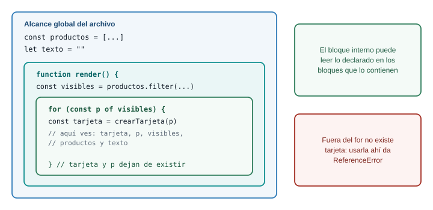{fig-alt="Alcance de variables: lo declarado afuera se ve desde adentro, lo declarado adentro no se ve desde afuera; let y const viven dentro del bloque donde se declaran"}

Un bloque interno puede leer lo declarado en los bloques que lo contienen. A la inversa, no.
:::

```js
const productos = [{ nombre: "Panela", cantidad: 12 }];

for (const producto of productos) {
  const mensaje = `Hay ${producto.cantidad} de ${producto.nombre}`;
  console.log(mensaje);          // aquí existe: está dentro del for
}

console.log(mensaje);
// Uncaught ReferenceError: mensaje is not defined
```

El error `X is not defined` aparece cuando usas una variable fuera del bloque donde existe, o cuando
escribiste mal el nombre. Hay un caso más sutil, que lleva su propio mensaje:

```js
console.log(total);   // Uncaught ReferenceError: Cannot access 'total' before initialization
let total = 5;
```

Lees `total` antes de la línea donde se declara. El mensaje no dice "no existe" sino "no la puedes
tocar todavía". Con ese texto, sabes que la variable está declarada más abajo en el mismo bloque.

### Funciones flecha

Una función se puede escribir de dos maneras. La **flecha** es más corta y es la que usarás en
`map`, `filter` y en los manejadores de eventos:

```js
function doble(n) {
  return n * 2;
}

const dobleFlecha = (n) => n * 2;
```

Con una sola expresión y sin llaves, el resultado se devuelve solo (`return` implícito). Si pones
llaves, vuelves a necesitar `return`. Con un solo parámetro, los paréntesis son opcionales, pero
escribirlos siempre hace el código más uniforme.

Un tropiezo clásico aparece cuando una flecha debe **devolver un objeto**:

```js
const productos = [{ nombre: "Panela", precio: 5500 }];

const mal = productos.map((p) => { nombre: p.nombre });
console.log(mal);   // [undefined]

const bien = productos.map((p) => ({ nombre: p.nombre }));
console.log(bien);  // [{ nombre: "Panela" }]
```

En la primera, las llaves se leen como el **cuerpo** de la función, no como un objeto, y como no hay
`return`, cada elemento queda en `undefined`. En la segunda, los paréntesis le dicen a JavaScript "esto
es una expresión, un objeto". No hay error en consola, solo un resultado vacío.

### Plantillas literales

Las comillas invertidas (`` ` ``) permiten insertar valores dentro de un texto con `${ }`, y escribir
texto de varias líneas:

```js
const producto = { nombre: "Panela", precio: 5500, cantidad: 12 };

const linea = `${producto.nombre}: ${producto.cantidad} unidades a ${producto.precio} COP`;
console.log(linea);   // "Panela: 12 unidades a 5500 COP"
```

Dentro de `${ }` cabe cualquier expresión, no solo un nombre de variable: `${precio * cantidad}`,
`${cantidad === 0 ? "agotado" : "disponible"}`.

Para mostrar dinero en pesos colombianos, no armes el formato a mano. El navegador trae
`Intl.NumberFormat`, que sabe poner los separadores de miles:

```js
const formatoCOP = new Intl.NumberFormat("es-CO", {
  style: "currency",
  currency: "COP",
  maximumFractionDigits: 0,
});

console.log(formatoCOP.format(3500));   // "$ 3.500"
```

El espacio entre `$` y el número es un espacio de no separación, por eso conviene que no compares ese
texto a mano con otro texto: úsalo solo para mostrar.

### Objetos y arreglos

Un **objeto** agrupa datos con nombre. Un **arreglo** agrupa valores en orden. Casi todo el taller
usa un arreglo de objetos:

```js
const productos = [
  { id: 1, nombre: "Tomate chonto", precio: 3500, cantidad: 40 },
  { id: 2, nombre: "Papa criolla", precio: 4200, cantidad: 25 },
  { id: 3, nombre: "Aguacate hass", precio: 6800, cantidad: 0 },
  { id: 4, nombre: "Panela", precio: 5500, cantidad: 12 },
];

console.log(productos[3].nombre);        // "Panela" (se cuenta desde 0)
console.log(productos.length);           // 4
productos.push({ id: 5, nombre: "Yuca", precio: 2000, cantidad: 10 });   // agrega al final
```

Una trampa que sorprende: copiar una variable que apunta a un arreglo no copia el arreglo.

```js
const copia = productos;       // NO es una copia: es otro nombre para el mismo arreglo
copia.pop();
console.log(productos.length); // 4: el original también perdió el elemento
```

Los objetos y los arreglos son **referencias**: dos variables pueden apuntar al mismo contenido. Para
hacer una copia de verdad, usas `spread`, que viene en un momento.

### Desestructuración

La desestructuración saca valores de un objeto o de un arreglo en variables, en una sola línea:

```js
const producto = { nombre: "Panela", precio: 5500, cantidad: 12 };

const { nombre, cantidad } = producto;     // dos variables nuevas: nombre y cantidad
console.log(nombre, cantidad);             // "Panela" 12

const [primero, segundo] = productos;      // por posición, en arreglos
console.log(primero.nombre);               // "Tomate chonto"
```

En objetos se extrae por **nombre**, así que el orden no importa. En arreglos se extrae por
**posición**. También funciona en los parámetros de una función, y es una forma cómoda de dejar claro
qué campos usa:

```js
const describir = ({ nombre, precio }) => `${nombre} cuesta ${precio}`;
console.log(describir(producto));          // "Panela cuesta 5500"
```

### `spread`: copiar y combinar

Tres puntos (`...`) esparcen el contenido de un arreglo o de un objeto:

```js
const todos = [...productos, { id: 6, nombre: "Café", precio: 18000, cantidad: 5 }];
// un arreglo NUEVO con los elementos de productos y uno más

const agotado = { ...producto, cantidad: 0 };
// un objeto NUEVO con los campos de producto, pero con cantidad en 0
console.log(producto.cantidad, agotado.cantidad);   // 12 0
```

Cuando hay campos repetidos, gana el último. Esa es la forma de "modificar sin tocar el original". Es una
copia **superficial**: si el objeto contiene otro objeto, ese interior se sigue compartiendo.

### `map`, `filter`, `find`, `reduce`, `some` y `every`

Estos seis métodos de arreglo hacen casi todo el trabajo con datos. Cada uno recibe una **función** que
se aplica a cada elemento. La clave para no confundirlos es **qué devuelve** cada uno:

| Método | Pregunta que responde | Devuelve |
|---|---|---|
| `map(f)` | ¿Cómo se ve cada elemento transformado? | Un arreglo nuevo del mismo largo |
| `filter(f)` | ¿Cuáles cumplen la condición? | Un arreglo nuevo, tal vez más corto o vacío |
| `find(f)` | ¿Cuál es el primero que cumple? | Un elemento, o `undefined` |
| `reduce(f, inicial)` | ¿A qué valor único se resume todo? | Un solo valor |
| `some(f)` | ¿Alguno cumple? | `true` o `false` |
| `every(f)` | ¿Todos cumplen? | `true` o `false` |

```js
const nombres = productos.map((p) => p.nombre);
// ["Tomate chonto", "Papa criolla", "Aguacate hass", "Panela"]

const agotados = productos.filter((p) => p.cantidad === 0);
// [{ id: 3, nombre: "Aguacate hass", ... }]

const panela = productos.find((p) => p.nombre === "Panela");
// { id: 4, nombre: "Panela", ... }

const hayAgotados = productos.some((p) => p.cantidad === 0);    // true
const todosConPrecio = productos.every((p) => p.precio > 0);    // true
```

`reduce` es el más difícil de leer. Recibe una función con dos parámetros, el **acumulador** (lo que
llevas hasta ahora) y el elemento actual, y un valor inicial:

```js
const valor = productos.reduce((suma, p) => suma + p.precio * p.cantidad, 0);
```

Con los cuatro productos originales (sin Yuca), la ejecución paso a paso es:

| Vuelta | `suma` al entrar | Elemento | `suma` al salir |
|---|---|---|---|
| 1 | 0 (el valor inicial) | Tomate: 3500 x 40 | 140000 |
| 2 | 140000 | Papa: 4200 x 25 | 245000 |
| 3 | 245000 | Aguacate: 6800 x 0 | 245000 |
| 4 | 245000 | Panela: 5500 x 12 | 311000 |

El valor que devuelve la función en cada vuelta se vuelve el `suma` de la siguiente. Al final, `reduce`
devuelve el último acumulador: `311000`.

**Qué pasa si... `find` no encuentra nada.** Devuelve `undefined`, y usar ese resultado sin comprobar
produce el error más común del taller:

```js
const yuca = productos.find((p) => p.nombre === "Yucca");   // typo: no existe
console.log(yuca.cantidad);
// Uncaught TypeError: Cannot read properties of undefined (reading 'cantidad')
```

El mensaje describe el síntoma, no la causa. La causa está **una línea antes**: algo devolvió
`undefined`. Siempre que veas `Cannot read properties of undefined`, sube en el código hasta la línea
donde se asignó esa variable y pregúntate qué pudo devolver `undefined` (un `find` sin resultado, un
índice fuera de rango, una propiedad mal escrita).

`map`, `filter`, `find`, `some`, `every` y `reduce` **no modifican** el arreglo original: devuelven algo
nuevo. En cambio, `push`, `pop`, `sort` y `splice` sí lo modifican. `sort` en particular sorprende: si
necesitas ordenar sin alterar el original, ordena una copia, `[...productos].sort(...)`.

### Módulos, en breve

Cuando un proyecto crece, un solo `app.js` se vuelve incómodo. Los **módulos** permiten partir el
código en varios archivos, cada uno exporta lo que quiere compartir y otro lo importa:

```js
// utilidades.js
export const formatoCOP = new Intl.NumberFormat("es-CO", { style: "currency", currency: "COP" });

// app.js
import { formatoCOP } from "./utilidades.js";
```

Se cargan con `<script type="module" src="app.js">`. Dos consecuencias que debes conocer: un módulo se
ejecuta como si tuviera `defer` (lo comprobamos en Chrome al preparar esta guía), y los módulos **no
funcionan abriendo el archivo con doble clic**: el navegador bloquea las importaciones desde `file://`
con un error de CORS.

```text
Access to script at 'file:///.../app.js' from origin 'null' has been blocked by CORS policy
```

Con Live Server funciona, porque la página se sirve por `http://`. Esta semana trabajas con un solo
archivo y sin módulos, así que tampoco tendrías ese error, pero ya sabes qué significa si aparece.

::: {.callout-important}
## Para memorizar

- `const` por defecto, `let` si reasignas; no uses `var`.
- Flecha: `(a, b) => a + b`; si devuelves un objeto, ponlo entre paréntesis: `(p) => ({ ... })`.
- Plantilla: `` `Hola ${nombre}` ``.
- Qué devuelve cada método: `map` arreglo del mismo largo, `filter` arreglo, `find` elemento o
  `undefined`, `reduce` un valor, `some` y `every` un booleano.
- Compara siempre con `===`, no con `==`.
:::

::: {.callout-note}
## Para razonar, no para memorizar

- ¿Por qué `const copia = productos` no copia? Porque el arreglo es una referencia. No hay nada que
  memorizar: dos nombres, un mismo cajón. Para dos cajones, `[...productos]`.
- ¿Qué método uso? Mira la **forma del resultado** que necesitas. Un arreglo del mismo tamaño con cada
  elemento transformado es `map`. Un subconjunto es `filter`. Uno solo es `find`. Un número o un
  texto que resume todo es `reduce`. Sí o no es `some` o `every`.
- ¿Por qué falla `X is not defined` aquí? Pregúntate en qué bloque se declaró `X` y si estás dentro
  de él.
:::

::: {.callout-tip}
## Reto 4. Resumen del inventario, sin DOM

Escribe una función `resumir(productos)` que reciba el arreglo de productos y devuelva un objeto con
tres datos: `disponibles` (cuántos productos tienen cantidad mayor que 0), `agotados` (cuántos tienen
cantidad 0) y `valor` (la suma de precio por cantidad de todos). Pruébala con los cuatro productos
originales: debe dar `{ disponibles: 3, agotados: 1, valor: 311000 }`. Usa solo `filter`, `reduce` y
desestructuración o plantillas si quieres.
:::

::: {.callout-note collapse="true"}
## Solución del Reto 4

```js
function resumir(productos) {
  const disponibles = productos.filter((p) => p.cantidad > 0).length;
  const agotados = productos.filter((p) => p.cantidad === 0).length;
  const valor = productos.reduce((suma, p) => suma + p.precio * p.cantidad, 0);
  return { disponibles, agotados, valor };
}

const productos = [
  { id: 1, nombre: "Tomate chonto", precio: 3500, cantidad: 40 },
  { id: 2, nombre: "Papa criolla", precio: 4200, cantidad: 25 },
  { id: 3, nombre: "Aguacate hass", precio: 6800, cantidad: 0 },
  { id: 4, nombre: "Panela", precio: 5500, cantidad: 12 },
];

console.log(resumir(productos));   // { disponibles: 3, agotados: 1, valor: 311000 }
```

`{ disponibles, agotados, valor }` es la forma corta de `{ disponibles: disponibles, agotados:
agotados, valor: valor }`: cuando la variable y la clave se llaman igual, se escribe una vez. La
función no toca el DOM, y esa separación es deliberada: se puede probar sin abrir una página, y la
vas a reutilizar en la Parte 7.
:::

### Conexión con el proyecto

Tu panel tiene un arreglo de productos, y todo lo que muestra (las tarjetas, el aviso de agotado, el
total) sale de calcular sobre ese arreglo con estos métodos. Quien domina `filter`, `find` y `reduce`
ya resolvió la mitad del taller.

## Parte 7. Estado y render: el DOM como consecuencia de los datos

### El problema real

El productor quita la panela. ¿Qué tiene que cambiar en la pantalla? La tarjeta desaparece, el
contador baja de 4 a 3, el valor total del inventario se recalcula y, si era el último producto,
aparece un aviso de catálogo vacío. Son cuatro lugares distintos para un solo hecho: **se quitó un
producto**.

**Predice primero.** Para cada producto guardas `cantidad` y además `agotado: true` o `false`. El productor edita la cantidad de aguacate de 0 a 5, y tu código solo actualiza `cantidad`. ¿Qué muestra el panel?

::: {.callout-warning collapse="true"}
## Comprueba tu predicción

Muestra un aguacate con **5 disponibles** y la etiqueta **"Agotado"**: una contradicción. Guardaste el
mismo hecho en dos lugares, y solo cambiaste uno. Esa es la razón de fondo de esta parte: si algo se
puede **deducir** de otro dato (`agotado` se deduce de `cantidad === 0`), no lo guardes aparte. Un solo
lugar para cada verdad.
:::

### Dos maneras de mantener la pantalla al día

::: {.diagrama}
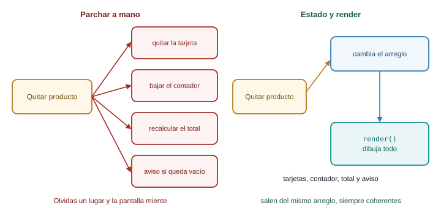{fig-alt="Parchar el DOM a mano obliga a actualizar cada lugar afectado por separado; con render se cambia el arreglo y una función redibuja todo de forma consistente"}

Parchar es acordarse de cada lugar. Con estado y render, un solo arreglo manda y una función
redibuja.
:::

**Parchar el DOM a mano.** Cuando ocurre un evento, tu código busca cada elemento afectado y lo
modifica: quita la tarjeta, baja el contador, recalcula el total, muestra el aviso. Funciona hasta que
olvidas un lugar. Con cada función nueva (filtrar, editar) aumentan los lugares que hay que recordar,
y los bugs aparecen en las combinaciones: "al filtrar y luego quitar, el total queda mal".

**Estado y render.** Separas dos cosas. El **estado** son los datos: el arreglo `productos`. El
**render** es una función que lee el estado y dibuja la pantalla completa. Los eventos solo cambian el
estado y llaman a `render()`.

::: {.diagrama}
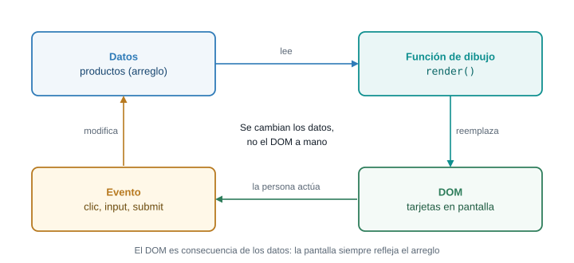{fig-alt="Ciclo de estado y render: los datos viven en un arreglo, render dibuja las tarjetas en el DOM, el usuario genera un evento y el evento cambia los datos, que vuelven a dibujarse"}

El ciclo: el evento cambia los datos, `render()` redibuja, y la persona ve el resultado y genera otro
evento. El DOM nunca se edita a mano: es consecuencia de los datos.
:::

### El mecanismo, con el código mínimo

Con la página de práctica de la Parte 3 (la lista `#productos` y el párrafo `.aviso`), este es el patrón
completo, en pocas líneas:

```js
let productos = [
  { id: 1, nombre: "Tomate chonto", precio: 3500, cantidad: 40 },
  { id: 2, nombre: "Papa criolla", precio: 4200, cantidad: 25 },
  { id: 3, nombre: "Aguacate hass", precio: 6800, cantidad: 0 },
  { id: 4, nombre: "Panela", precio: 5500, cantidad: 12 },
];

const lista = document.querySelector("#productos");
const aviso = document.querySelector(".aviso");

function render() {
  lista.replaceChildren();
  for (const p of productos) {
    const item = document.createElement("li");
    item.className = p.cantidad === 0 ? "producto agotado" : "producto";
    item.dataset.id = p.id;
    item.textContent = `${p.nombre} (${p.cantidad}) `;

    const quitar = document.createElement("button");
    quitar.textContent = "Quitar";
    item.append(quitar);

    lista.append(item);
  }
  aviso.textContent = `Hoy hay ${productos.length} productos.`;
}

lista.addEventListener("click", (event) => {
  const boton = event.target.closest("button");
  if (!boton) {
    return;
  }
  const id = Number(boton.closest("li").dataset.id);
  productos = productos.filter((p) => p.id !== id);   // 1. cambia el estado
  render();                                           // 2. redibuja
});

render();
```

Lee el flujo con calma. El evento no toca el `li`: solo reemplaza el arreglo por uno sin ese producto
y llama a `render()`. `render` vacía la lista y la reconstruye entera a partir de `productos`, y
actualiza también el aviso. Si mañana agregas "filtrar" o "editar", cada nueva función hace lo mismo:
cambiar el estado y llamar a `render()`. No hay lugares que recordar.

El costo es que se reconstruye todo cada vez. Con decenas o cientos de productos, el navegador lo hace
en una fracción de segundo, y no lo notas. Con decenas de miles necesitarías otras técnicas, pero eso
es otro problema de otra semana. Frameworks como React se construyen sobre esta misma idea
(la pantalla como función de los datos), así que el patrón que aprendes hoy no se pierde.

Dos consecuencias prácticas de redibujar:

- **Lo que está dentro de lo redibujado se pierde**: foco, texto a medio escribir, scroll interno. Por
  eso el formulario del taller **no** está dentro del contenedor que se redibuja.
- **Los listeners sobre elementos viejos desaparecen**, porque esos elementos ya no existen. Por eso se
  usa delegación sobre el contenedor, que no se reemplaza.

### Qué pasa si... cambias el estado y olvidas `render()`

```js
productos = productos.filter((p) => p.id !== id);
// falta render()
```

No hay error. La pantalla sigue igual, pero los datos ya cambiaron. Si escribes `productos` en la
consola, verás un producto menos. Esa **desincronización** (datos y pantalla distintos) es el síntoma
característico de este bug: compara la consola (los datos) con el panel Elements (la pantalla). Si no
coinciden, falta un `render()`.

Y al revés: si `render()` se llama pero el estado no cambió (porque modificaste una **copia** en vez
del arreglo real), la pantalla se redibuja idéntica. En los dos casos la regla es la misma: pregunta
primero si el **estado** es el correcto, y solo después si el dibujo lo es.

::: {.callout-important}
## Para memorizar

- Un solo arreglo de datos es la fuente de verdad.
- Los eventos cambian el estado y llaman a `render()`.
- `render()` lee el estado y dibuja todo; no guarda nada.
- Lo que se puede calcular (agotado, total, contador) no se guarda: se calcula en `render`.
:::

::: {.callout-note}
## Para razonar, no para memorizar

¿Siempre hay que redibujar todo? No es un dogma. Si solo cambias el texto de un contador, hacer
`contador.textContent = n` es correcto y más simple. Lo que importa es el criterio: cuando un hecho
afecta varios lugares, o cuando sabes que va a crecer, el estado y el render te evitan olvidar uno. Si
el cambio es local y seguirá siéndolo, parchar es legítimo.
:::

::: {.callout-tip}
## Para pensar

En el taller, el filtro de búsqueda cambia lo que se ve pero no quita productos. ¿Dónde guardarías el
texto del filtro: en el DOM (el valor del `input`) o en una variable? ¿Y qué pasaría si guardas la
lista ya filtrada como si fuera `productos`? Pista: al borrar el texto del filtro, ¿de dónde sacarías
los productos que ya no están?
:::

### Conexión con el proyecto

El panel de catálogo es un caso de manual para este patrón: un arreglo `productos`, una función
`render`, y todo lo demás (agregar, editar, quitar, marcar agotado, filtrar) son manejadores que
cambian el estado y vuelven a llamar a `render`. Cuando llegues al taller, vas a reconocer la forma.

## Parte 8. Validación en el navegador

### El problema real

La regla RN-01 dice que un producto no se publica sin precio y sin cantidad, y la RN-03 que un
producto sin cantidad disponible se muestra como agotado. Antes de agregar un producto al arreglo,
el formulario tiene que comprobar que lo que escribió la persona tiene sentido. Validar es decidir,
**antes de guardar**, si los datos sirven, y decirle a la persona qué corregir.

**Predice primero.** El campo "Precio" es un `input type="number"` y la persona lo deja vacío. Tu código hace `const precio = Number(campo.value)`. ¿Cuánto vale `precio`? ¿Y qué resultado da `"10" > "9"`?

::: {.callout-warning collapse="true"}
## Comprueba tu predicción

`precio` vale **0**, no `NaN` ni un error. `Number("")` es `0`, así que un campo vacío pasaría una
validación del tipo "es un número" y quedaría como un producto gratis. Por eso el taller comprueba
primero que el texto **no esté vacío** y solo después lo convierte. En cuanto a `"10" > "9"`, da
`false`: al comparar dos **textos**, JavaScript compara carácter por carácter, y `"1"` va antes que
`"9"`. Los dos casos tienen la misma raíz, que desarrolla la sección siguiente.
:::

### El flujo de una validación

::: {.diagrama}
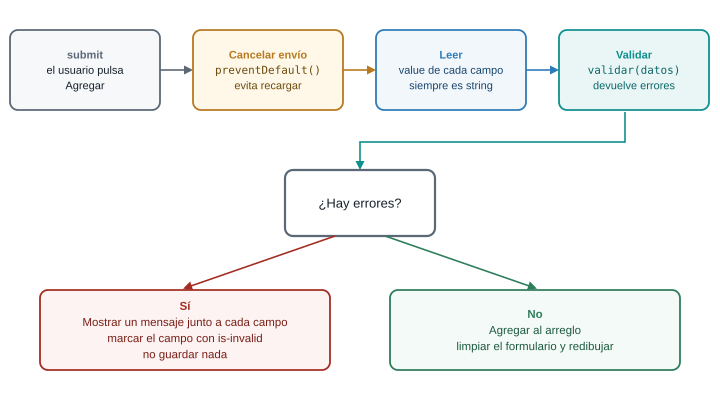{fig-alt="Flujo de validación en el submit: se cancela el envío, se leen los valores como texto, se validan, y si hay errores se muestran mensajes sin guardar; si no hay errores se guarda y se redibuja"}

Cuatro pasos y una decisión. Observa que el paso de leer entrega **texto**, y que validar y guardar
son pasos distintos.
:::

### Los valores de un campo siempre son texto

`campo.value` es **siempre un `string`**, aunque el campo sea de tipo `number`:

```js
const precio = document.querySelector("#precio");
// la persona escribió 3500
console.log(precio.value);          // "3500"
console.log(typeof precio.value);   // "string"
```

De ahí salen las trampas de las conversiones automáticas de JavaScript:

```js
console.log("5" + 3);         // "53"   (el + une textos)
console.log("5" - 3);         // 2      (el - solo sabe restar números)
console.log("10" > "9");      // false  (comparación de texto)
console.log(10 > 9);          // true
console.log(Number(""));      // 0
console.log(Number("abc"));   // NaN    (Not a Number)
```

Un `input type="number"` filtra lo que se escribe: si la persona teclea letras, `value` queda como
cadena vacía `""`, y en la consola el navegador avisa con un mensaje como
`The specified value "abc" cannot be parsed, or is out of range.` Por eso la comprobación de "vacío"
debe ir **antes** que la de "es número": un campo vacío y un campo con basura se ven igual desde
`value`.

El patrón seguro es siempre el mismo: leer el texto, comprobar que no está vacío, convertir con
`Number(...)` y comprobar el resultado.

```js
const texto = campos.precio.value;
if (texto === "") {
  // falta el precio
} else if (!(Number(texto) > 0)) {
  // no es un número mayor que cero
}
```

Fíjate en `!(Number(texto) > 0)`. Si `texto` es `"abc"`, `Number` da `NaN`, y cualquier comparación con
`NaN` es `false`. Negar el "mayor que cero" atrapa tanto los números no positivos como `NaN` en una
sola condición.

### La validación nativa del navegador

HTML ya trae validación sin que escribas JavaScript. Los atributos que más usarás:

| Atributo | Qué exige |
|---|---|
| `required` | Que el campo no esté vacío |
| `type="number"`, `email`, `url` | Que el valor tenga ese formato |
| `min`, `max` | Límites numéricos |
| `minlength`, `maxlength` | Largo del texto |
| `pattern` | Que el texto cumpla una expresión regular |

```html
<form id="formNativo">
  <input id="nombre" name="nombre" required minlength="3">
  <input id="precio" name="precio" type="number" min="1" required>
  <button type="submit">Agregar</button>
</form>
```

Con esto, al pulsar el botón, el navegador revisa los campos y, si alguno falla, muestra su propio
mensaje y **no dispara el evento `submit`**. Tu manejador ni siquiera se entera. La validación
nativa tiene dos límites: el texto del mensaje lo decide el navegador, y su idioma sigue la
configuración de quien lo usa; y no puede expresar reglas del negocio como "el nombre no se puede
repetir".

Para controlar los mensajes, se desactiva la nativa con `novalidate` en el `form` y se valida con
código propio. Los atributos `required` y `min` pueden quedarse en el HTML, porque siguen
describiendo la intención y ayudan a lectores de pantalla.

### La validación propia

La idea central es separar tres cosas: **leer** el formulario, **validar** los datos (sin tocar el
DOM) y **mostrar** los errores. La función de validación recibe datos y devuelve un objeto con los
errores:

```js
function validar(datos) {
  const errores = {};

  if (datos.nombre === "") {
    errores.nombre = "Escribe el nombre del producto.";
  } else if (datos.nombre.length < 3) {
    errores.nombre = "El nombre necesita al menos 3 letras.";
  }

  if (datos.precio === "") {
    errores.precio = "Escribe el precio: un producto sin precio no se publica.";
  } else if (!(Number(datos.precio) > 0)) {
    errores.precio = "El precio debe ser mayor que 0.";
  }

  if (datos.cantidad === "") {
    errores.cantidad = "Escribe la cantidad: un producto sin cantidad no se publica.";
  } else if (!Number.isInteger(Number(datos.cantidad)) || Number(datos.cantidad) < 0) {
    errores.cantidad = "La cantidad es un número entero, 0 o mayor.";
  }

  return errores;
}
```

Si el objeto devuelto no tiene claves, los datos son válidos. Esa función no sabe nada de campos,
clases ni pantallas, así que puedes probarla con un objeto cualquiera:

```js
console.log(validar({ nombre: "Panela", precio: "5500", cantidad: "12" }));   // {}
console.log(validar({ nombre: "", precio: "", cantidad: "-3" }));
// { nombre: "Escribe el nombre del producto.",
//   precio: "Escribe el precio: un producto sin precio no se publica.",
//   cantidad: "La cantidad es un número entero, 0 o mayor." }
```

Esas dos líneas de prueba son la forma más barata de comprobar una regla de negocio: no necesitas abrir
la página ni llenar un formulario.

### Mensajes de error que sirven

Un mensaje útil responde a tres preguntas: **qué** está mal, **dónde** (junto al campo, no en una
ventana aparte) y **cómo** se arregla. Compara:

| Mensaje | Problema |
|---|---|
| "Error" | No dice nada |
| "Dato inválido" | No dice cuál ni por qué |
| "El precio debe ser mayor que 0." | Dice qué, dónde (junto al campo) y la regla |

Evita `alert()`: bloquea toda la página, no queda junto al campo y no se puede estilizar. Escribe el
mensaje en un elemento al lado del campo y marca el campo (con Bootstrap, la clase `is-invalid` y un
`div.invalid-feedback` hermano muestran el mensaje solos).

### Cuándo validar

- **Al enviar** (`submit`): imprescindible, es el momento en que los datos pasan a ser definitivos.
- **Después del primer error, mientras la persona corrige** (`input`): da respuesta inmediata cuando
  ya sabe que se equivocó.
- **No desde la primera tecla**: mostrar "nombre muy corto" apenas teclea la primera letra molesta y
  genera ruido.

El taller valida al enviar. Validar también mientras la persona corrige es una mejora que puedes probar después.

### Por qué la validación del navegador no basta

::: {.diagrama}
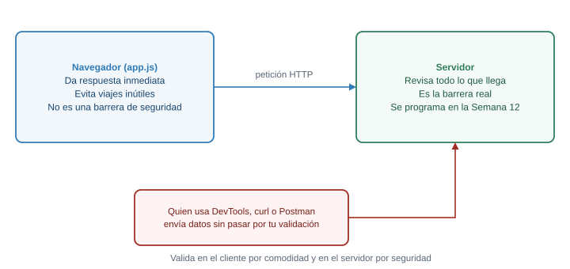{fig-alt="La validación del navegador mejora la experiencia pero se puede saltar con DevTools o herramientas como curl; el servidor debe validar de nuevo, lo cual se hace en la Semana 12"}

El navegador está en manos de quien lo usa. Cualquiera puede saltarse tu validación.
:::

Todo lo que corre en el navegador está bajo el control de quien lo usa. Una persona puede abrir
DevTools y quitar el atributo `required`, desactivar JavaScript, o ni siquiera usar tu página y
enviar la petición directamente con una herramienta como `curl` o Postman. MDN lo dice sin rodeos: la
validación en el cliente no se debe considerar una medida de seguridad exhaustiva, y la aplicación
tiene que validar también en el servidor.

Entonces, ¿para qué validar en el navegador? Por **experiencia de usuario**: respuesta inmediata, sin
viaje a la red, con mensajes junto al campo. La **seguridad** la da el servidor, que revisa de nuevo
todo lo que llega. Cuando el curso llegue a la Semana 12, vas a escribir esa segunda validación en
ASP.NET Core, y las reglas RN-01 y RN-03 se escribirán dos veces: una para ayudar, otra para
proteger.

::: {.callout-important}
## Para memorizar

- `campo.value` es siempre `string`.
- Comprueba "vacío" antes de convertir: `Number("")` es `0`.
- Compara con `Number(...)` ya convertido, no con textos.
- `novalidate` en el `form` desactiva los mensajes nativos del navegador.
- La validación del navegador mejora la experiencia; no protege.
:::

::: {.callout-note}
## Para razonar, no para memorizar

Dado un campo nuevo, ¿qué reglas valida? No las memorizas: se deducen de la pregunta "¿qué valores
harían daño al negocio?". Una cantidad negativa, un precio en cero, un nombre vacío. Cada una de esas
preguntas es una línea de `validar`. Y cuando una regla del negocio cambie (RN-01 pide algo más),
cambia una función, no cinco manejadores.
:::

::: {.callout-tip}
## Reto 5. No repetir nombres

Agrega una regla a `validar`: no se puede publicar un producto cuyo nombre ya exista en el catálogo,
sin distinguir mayúsculas de minúsculas ("panela" y "Panela" son el mismo). Al **editar** un producto,
su propio nombre no cuenta como repetido. Como `validar` solo recibe `datos`, cámbiala para que reciba
también la lista de productos y el id que se está editando (`null` si es un producto nuevo).
:::

::: {.callout-note collapse="true"}
## Solución del Reto 5

```js
function validar(datos, productos, editandoId) {
  const errores = {};

  if (datos.nombre === "") {
    errores.nombre = "Escribe el nombre del producto.";
  } else if (datos.nombre.length < 3) {
    errores.nombre = "El nombre necesita al menos 3 letras.";
  } else {
    const repetido = productos.some(
      (p) => p.id !== editandoId && p.nombre.toLowerCase() === datos.nombre.toLowerCase()
    );
    if (repetido) {
      errores.nombre = "Ya existe un producto con ese nombre.";
    }
  }

  return errores;
}

const productos = [{ id: 4, nombre: "Panela", precio: 5500, cantidad: 12 }];
console.log(validar({ nombre: "panela" }, productos, null));
// { nombre: "Ya existe un producto con ese nombre." }
console.log(validar({ nombre: "panela" }, productos, 4));
// {}  (es el mismo producto que se edita)
```

`some` devuelve `true` apenas encuentra un producto que cumple las dos condiciones: un id distinto del
que se edita **y** el mismo nombre sin importar mayúsculas. En el taller, la llamada al validar queda
como `validar(datos, productos, editandoId)`. Observa que el cambio fue **solo** en `validar`: gracias
a haber separado leer, validar y mostrar, ningún otro manejador cambió.
:::

### Conexión con el proyecto

RN-01 y RN-03 viven en `validar` y en `render`: la primera impide publicar sin precio ni cantidad, la
segunda deduce "agotado" de `cantidad === 0`. Cuando el proyecto tenga un servidor, esas mismas
reglas se escribirán de nuevo allá. Por eso conviene que hoy queden en un solo lugar y sin mezclarse
con el DOM.

## Parte 9. Depuración desde consola

### El problema real

Tarde o temprano, el panel hace algo que no esperabas. El botón "Quitar" no quita, el total sale
`NaN`, la tarjeta duplica el texto. Un programador con experiencia no es quien no se equivoca: es quien
encuentra el error rápido. Esa velocidad viene de un método y de saber qué herramienta abrir.

**Predice primero.** Tienes `productos` con ids numéricos (`1`, `2`, `3`, `4`) y el botón Quitar guarda el id en `data-id`. Tu código hace `productos.filter((p) => p.id !== id)` con `const id = boton.closest("li").dataset.id`. ¿Se quita el producto?

::: {.callout-warning collapse="true"}
## Comprueba tu predicción

**No**, y no se muestra ningún error. `dataset.id` es un `string` (`"4"`), y el id del producto es un
número (`4`). Con `!==`, `4 !== "4"` es `true` para todos los productos, así que el `filter` los
conserva todos. Es un bug silencioso. En esta parte lo cazas con el método, no adivinando.
:::

### Las herramientas

Las cuatro pestañas de DevTools que usarás ya las viste en el diagrama de "Antes de empezar". Aquí,
cuándo abrir cada una:

| Pregunta | Panel |
|---|---|
| ¿Qué hay realmente en el DOM ahora mismo? | Elements |
| ¿Qué dicen mis `console.log`? ¿Hay errores? | Console |
| ¿Qué valen mis variables en esta línea? | Sources, con breakpoints |
| ¿Se descargó `app.js`? ¿Dio 404? | Network |

### `console`: más allá de `log`

```js
console.log("valor:", productos.length);   // imprime lo que le pases
console.table(productos);                  // un arreglo de objetos como tabla
console.warn("Cantidad rara:", 0);         // aviso, en amarillo
console.error("No se encontró el id", 9);  // error, en rojo
console.group("render");                   // agrupa mensajes con sangría
console.log("tarjetas:", 4);
console.groupEnd();
```

`console.table` es la herramienta más infrautilizada de la lista: un arreglo de objetos se ve como una
tabla con una fila por producto, mucho más fácil de leer que una lista de `{...}` plegados. Para ver
**el tipo** de un valor, `console.log(typeof valor)`; es la forma más rápida de descubrir un
`"string"` donde esperabas un número.

Una advertencia: `console.log(objeto)` imprime una **referencia** al objeto. Si lo modificas después,
al expandirlo en la consola puedes ver los valores nuevos y no los de cuando lo imprimiste. Si
necesitas una fotografía, imprime una copia: `console.log({ ...objeto })`.

### Leer un error

Cuando algo falla, la consola muestra el mensaje y, debajo, una **pila de llamadas** (stack trace):

```text
Uncaught TypeError: Cannot read properties of undefined (reading 'toFixed')
    at crearTarjeta (http://127.0.0.1:5500/app.js:52:30)
    at render (http://127.0.0.1:5500/app.js:98:23)
    at alEnviar (http://127.0.0.1:5500/app.js:170:3)
```

Se lee de **arriba hacia abajo, de lo más reciente a lo más antiguo**. La primera línea es donde
explotó (`crearTarjeta`, línea 52, columna 30), la siguiente es quién la llamó (`render`), y así
sucesivamente. Cada una es un enlace: pulsa y DevTools abre `app.js` en esa línea. Para un error de
tu código, empieza siempre por la **primera línea que apunte a un archivo tuyo**.

El mensaje se descompone en dos partes. `TypeError`, `ReferenceError` y `SyntaxError` son la **clase**
del error: un tipo equivocado, un nombre que no existe, o código mal escrito. Lo que sigue explica el
detalle. Con las dos partes, casi siempre sabes qué buscar.

### Breakpoints: pausar el programa

`console.log` obliga a editar el código, guardar, recargar y volver a mirar. Un **breakpoint** pausa
el programa en una línea y te deja inspeccionar todo en ese instante.

1. Abre **Sources**, busca `app.js` en el árbol de archivos de la izquierda.
2. Pulsa el **número de línea** donde quieres detener el programa. Aparece un marcador azul.
3. Provoca la acción (haz clic en el botón). El programa se **pausa** en esa línea, sin ejecutarla.
4. Mira el panel **Scope** a la derecha: ahí están los valores actuales de todas las variables.
5. Avanza con los controles, o con el teclado:

| Acción | Atajo | Qué hace |
|---|---|---|
| Resume (reanudar) | `F8` | Sigue hasta el próximo breakpoint |
| Step over | `F10` | Ejecuta la línea actual y pasa a la siguiente |
| Step into | `F11` | Entra a la función que se llama en esa línea |
| Step out | `Mayús + F11` | Sale de la función actual |
| Poner o quitar breakpoint | `Ctrl + B` | En la línea donde está el cursor |

También puedes escribir `debugger;` en tu código: con DevTools abierto, el navegador se pausa en esa
línea como si fuera un breakpoint, y con DevTools cerrado no hace nada. Úsalo para depurar y bórralo
antes del commit.

::: {.diagrama}
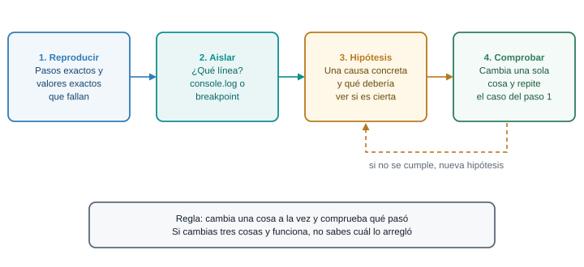{fig-alt="Método de depuración en cuatro pasos: reproducir el error, aislar dónde ocurre, formular una hipótesis y comprobarla; si la hipótesis falla se plantea otra"}

El método: cuatro pasos y un solo cambio por intento.
:::

### Hilo de diagnóstico: el producto no se quita

Aplica el método al bug de la predicción. Este es el código que escribió el estudiante:

```js
lista.addEventListener("click", (event) => {
  const boton = event.target.closest("button");
  if (!boton) {
    return;
  }
  const id = boton.closest("li").dataset.id;
  productos = productos.filter((p) => p.id !== id);
  render();
});
```

**1. Reproducir.** Pulsa "Quitar" en la panela. No ocurre nada. Pruébalo con otros productos: tampoco.
Es un fallo **siempre**, no a veces. Anota el caso exacto: "clic en Quitar de la panela: no desaparece, y
no hay errores en la consola".

**2. Aislar.** Que no haya error descarta una excepción. Entonces la pregunta es dónde se rompe la
cadena: ¿el listener se ejecuta? Agrega un `console.log("clic", id)` justo después de calcular `id`. La
consola muestra `clic 4`. El listener corre, y `id` existe. Después del `filter`, imprime
`console.log(productos.length)`: sigue siendo 4. El problema está en el `filter`.

**3. Hipótesis.** El `filter` conserva todos los productos, así que la condición `p.id !== id` es
siempre `true`. ¿Por qué? Una causa posible: los dos lados no son del mismo tipo. Una hipótesis
concreta que se puede comprobar: `p.id` es un número y `id` es un texto.

**4. Comprobar.** En la consola, con el programa pausado o con `console.log`:

```js
console.log(typeof productos[3].id, typeof id);   // "number" "string"
console.log(productos[3].id === id);              // false, aunque ambos dicen 4
console.table(productos);
```

La hipótesis se confirma. Cambia **una sola cosa**, la conversión:

```js
const id = Number(boton.closest("li").dataset.id);
```

Repite el caso exacto del paso 1: ahora la panela desaparece. Si no hubiera desaparecido, tendrías
que volver al paso 3 con una nueva hipótesis, no seguir tocando código al azar.

Observa lo que **no** hiciste: no reescribiste el listener, no probaste cambiar `!==` por `!=` a ver
si funcionaba (aunque en este caso sí habría funcionado, por una conversión implícita que te habría
escondido el problema real), no pediste que alguien más lo viera. El método convirtió un "no funciona" en
una frase comprobable.

### Tabla de errores frecuentes

| Síntoma (lo que ves) | Causa probable | Arreglo |
|---|---|---|
| `Cannot read properties of null (reading 'addEventListener')` | El selector no encontró nada: el script corrió antes del elemento, o el selector está mal escrito | `defer` en el script; revisar el `#` o el `.`; comparar el id con el HTML |
| `X is not defined` | Nombre mal escrito, o la variable se declaró en otro bloque | Revisar la ortografía; declarar la variable en un bloque que la contenga |
| `X is not a function` | Llamas como función algo que no lo es (`NodeList.map`, o una propiedad que no es método) | Convertir con `Array.from`; revisar qué tipo devuelve el método |
| `Cannot read properties of undefined (reading 'cantidad')` | Un `find` sin resultado, o un índice fuera del arreglo, devolvió `undefined` | Subir hasta donde se asignó la variable; comprobar con `if` antes de usarla |
| `Assignment to constant variable.` | Reasignas una variable declarada con `const` | Declarar con `let`, o modificar el contenido en vez de reasignar |
| `Identifier 'productos' has already been declared` | La misma variable se declaró dos veces con `let` o `const` en el mismo ámbito | Quitar la duplicada; revisar si pegaste el mismo bloque dos veces |
| `Unexpected token '{'`, `Unexpected identifier 'b'` o `Unexpected end of input` | Falta un paréntesis, una coma o una llave de cierre en el código | Mirar la línea indicada **y la anterior**; el editor suele marcar los pares de llaves |
| `Failed to load resource: ... 404` | El `src` del script o de otro recurso apunta a un archivo que no existe | Revisar la ruta; confirmar en Network qué URL pidió el navegador |
| El total sale `NaN` o aparece el texto "undefined" o "null" | Una operación con `undefined`, o `append` recibió un valor vacío | `console.log(typeof valor)` en cada paso; revisar nombres de propiedades |
| Nada pasa al hacer clic, y no hay error | Listener registrado con paréntesis (`f()`), o delegado en el contenedor equivocado | Revisar que se pase la función; poner un `console.log` dentro del manejador |
| Un cambio no se ve, y los datos sí cambiaron | Falta llamar a `render()` | Comparar `productos` en la consola con lo que muestra Elements |
| Access to script ... blocked by CORS policy | Abriste la página con doble clic y el script es un módulo | Abrir con Live Server (`http://`) |

Las filas con "sin error" son las peligrosas: el navegador no te avisa. Para esas, el **método** es la
única herramienta: reproducir, aislar con `console.log` o breakpoints, y comprobar una hipótesis.

### Qué hacer cuando nada de esto funciona

Si llevas más de veinte minutos sobre el mismo problema, para y reduce el caso. Crea una página nueva
con el HTML mínimo y el JavaScript mínimo que reproducen el error. Casi siempre, en el camino de
recortar, encuentras la causa. Si no la encuentras, ya tienes un ejemplo corto para preguntar, y una
pregunta con un ejemplo corto se contesta en minutos.

::: {.callout-important}
## Para memorizar

- Abrir DevTools: `F12`. Consola: `Ctrl + Mayús + J`.
- `console.log`, `console.table`, `console.error`.
- Breakpoint: clic en el número de línea en Sources. `F10` avanza, `F8` reanuda.
- Los cuatro pasos: reproducir, aislar, hipótesis, comprobar.
:::

::: {.callout-note}
## Para razonar, no para memorizar

Ningún mensaje de error se memoriza. Se lee en dos partes: la **clase** (`TypeError`, `ReferenceError`,
`SyntaxError`) y el **detalle**, y se contrasta con la pila de llamadas para saber dónde. Si te
descubres buscando el mensaje exacto en una tabla, estás evitando razonar. Pregúntate qué intentó hacer
el programa y qué encontró en su lugar.
:::

::: {.callout-tip}
## Para pensar

En el hilo de diagnóstico, cambiar `!==` por `!=` habría "arreglado" el bug sin revelar la causa.
¿Qué costo tiene un arreglo que funciona sin que entiendas por qué? Piensa en qué ocurrirá cuando el
id llegue desde un servidor como número en un sitio y como texto en otro.
:::

### Conexión con el proyecto

Ten DevTools abierto **todo el tiempo** mientras construyes el taller. Una pestaña de Console visible a
un costado cambia el ritmo de trabajo: el error aparece en el instante en que lo provocas, no cinco
cambios más tarde.

## Parte 10. Taller: el panel de catálogo del productor, dinámico {#taller}

Es el momento de juntar todo. Vas a construir, en ocho pasos, el panel de catálogo del productor que
en la Semana 6 era estático. Al terminar, el panel puede:

- **agregar** un producto, con validación (RN-01: no se publica sin precio ni cantidad);
- **marcar un producto como agotado** con un clic, o ver un producto con cantidad 0 como agotado
  automáticamente (RN-03);
- **editar** un producto existente;
- **quitar** un producto;
- **filtrar** por texto mientras escribes;
- mostrar un **total** del inventario;
- y todo **sin recargar la página**.

El ejemplo usa los productos de la guía (tomate chonto, papa criolla, aguacate hass, panela, con precios
en COP). Puedes cambiar los productos por los de tu propio proyecto.

::: {.callout-note}
Trabaja con Live Server y la consola abierta (`F12`), escribe el código en vez de pegarlo, y pon el
código nuevo de cada paso encima de la línea `render();` que cierra el archivo. Bootstrap 5.3.8 solo da
el aspecto; con Tailwind, el JavaScript es el mismo.
:::

### [1]{.paso} Esqueleto: el HTML y la prueba de que el script carga

Crea `index.html` (o reemplaza el de tu práctica). La estructura completa se escribe **una sola vez**:
a partir de aquí, el HTML no cambia, y `app.js` va creciendo.

```html
<!DOCTYPE html>
<html lang="es">
<head>
  <meta charset="UTF-8">
  <meta name="viewport" content="width=device-width, initial-scale=1.0">
  <title>Catálogo del productor</title>
  <link
    href="https://cdn.jsdelivr.net/npm/bootstrap@5.3.8/dist/css/bootstrap.min.css"
    rel="stylesheet">
  <script src="app.js" defer></script>
</head>
<body>
  <div class="container py-4">
    <h1 class="h3 mb-4">Mi catálogo</h1>

    <form id="form-producto" class="row g-2 mb-4" novalidate>
      <div class="col-12 col-md-4">
        <label for="nombre" class="form-label">Nombre</label>
        <input type="text" class="form-control" id="nombre" name="nombre" required>
        <div class="invalid-feedback" id="error-nombre"></div>
      </div>
      <div class="col-6 col-md-3">
        <label for="precio" class="form-label">Precio (COP)</label>
        <input type="number" class="form-control" id="precio" name="precio" min="1" required>
        <div class="invalid-feedback" id="error-precio"></div>
      </div>
      <div class="col-6 col-md-3">
        <label for="cantidad" class="form-label">Cantidad</label>
        <input type="number" class="form-control" id="cantidad" name="cantidad" min="0" required>
        <div class="invalid-feedback" id="error-cantidad"></div>
      </div>
      <div class="col-12 col-md-2 d-flex align-items-start gap-2 pt-md-4 mt-md-2">
        <button type="submit" class="btn btn-primary" id="guardar">Agregar</button>
        <button type="button" class="btn btn-outline-secondary d-none" id="cancelar">Cancelar</button>
      </div>
    </form>

    <div class="row g-2 mb-3 align-items-end">
      <div class="col-12 col-md-5">
        <label for="filtro" class="form-label">Buscar por nombre</label>
        <input type="search" class="form-control" id="filtro" autocomplete="off">
      </div>
      <div class="col-12 col-md-7">
        <p class="mb-0" id="resumen"></p>
      </div>
    </div>

    <div class="row g-3" id="lista"></div>
  </div>
</body>
</html>
```

Qué hay que notar antes de seguir:

- `<script src="app.js" defer></script>` va en el `head` y con `defer` (Parte 2).
- El `form` tiene `novalidate`: el navegador no mostrará sus propios mensajes, los mostrarás tú.
- Los campos tienen `id` para seleccionarlos y un `div.invalid-feedback` con `id="error-..."` para el
  mensaje de cada uno.
- Los botones `guardar` y `cancelar` ya existen. El segundo nace oculto con la clase `d-none` de
  Bootstrap, y el código la quitará en el modo edición.
- `#resumen` y `#lista` están vacíos: los llenará JavaScript.

Crea `app.js` con una sola línea:

```js
console.log("app.js cargó");
```

**Qué debe verse.** Una página con el formulario (tres campos y un botón "Agregar"), el campo de
búsqueda y nada más debajo. En la consola, el mensaje `app.js cargó`.

**Si no se ve.** Si la consola no muestra el mensaje, el script no carga: revisa el `src` y mira el
panel Network. Si aparece un error rojo, léelo: dice qué falló y en qué línea.

### [2]{.paso} Los datos y el primer render

Reemplaza el contenido de `app.js` con lo siguiente. Aquí nace el patrón de la Parte 7: un arreglo de
datos y una función que los dibuja.

```js
// Datos: la única fuente de verdad
let productos = [
  { id: 1, nombre: "Tomate chonto", precio: 3500, cantidad: 40 },
  { id: 2, nombre: "Papa criolla", precio: 4200, cantidad: 25 },
  { id: 3, nombre: "Aguacate hass", precio: 6800, cantidad: 0 },
  { id: 4, nombre: "Panela", precio: 5500, cantidad: 12 },
];
let siguienteId = 5; // id para el próximo producto que se agregue
let editandoId = null; // id del producto en edición, o null
let texto = ""; // texto del filtro de búsqueda

// Referencias al DOM, buscadas una sola vez
const lista = document.querySelector("#lista");

const formatoCOP = new Intl.NumberFormat("es-CO", {
  style: "currency",
  currency: "COP",
  maximumFractionDigits: 0,
});

function crearBoton(etiqueta, clase, accion) {
  const boton = document.createElement("button");
  boton.type = "button";
  boton.className = `btn btn-sm ${clase}`;
  boton.dataset.accion = accion;
  boton.textContent = etiqueta;
  return boton;
}

function crearTarjeta(producto) {
  const agotado = producto.cantidad === 0;

  const columna = document.createElement("div");
  columna.className = "col-12 col-md-6 col-lg-3";

  const tarjeta = document.createElement("div");
  tarjeta.className = agotado ? "card h-100 border-danger" : "card h-100";
  tarjeta.dataset.id = producto.id;

  const cuerpo = document.createElement("div");
  cuerpo.className = "card-body";

  const titulo = document.createElement("h2");
  titulo.className = "h5 card-title";
  titulo.textContent = producto.nombre;

  const detalle = document.createElement("p");
  detalle.className = "card-text";
  detalle.textContent = `${formatoCOP.format(producto.precio)} | Disponible: ${producto.cantidad}`;

  cuerpo.append(titulo, detalle);

  if (agotado) {
    const etiqueta = document.createElement("span");
    etiqueta.className = "badge text-bg-danger mb-2";
    etiqueta.textContent = "Agotado";
    cuerpo.append(etiqueta);
  }

  const botones = document.createElement("div");
  botones.className = "d-flex flex-wrap gap-2";
  botones.append(crearBoton("Editar", "btn-outline-primary", "editar"));
  if (!agotado) {
    botones.append(crearBoton("Marcar agotado", "btn-outline-warning", "agotar"));
  }
  botones.append(crearBoton("Quitar", "btn-outline-danger", "quitar"));
  cuerpo.append(botones);

  tarjeta.append(cuerpo);
  columna.append(tarjeta);
  return columna;
}

function render() {
  lista.replaceChildren();
  for (const producto of productos) {
    lista.append(crearTarjeta(producto));
  }
}

render();
```

Qué hace cada bloque:

- `productos` es el **estado**: la única fuente de verdad. `siguienteId`, `editandoId` y `texto` los
  usarás en los pasos siguientes; se declaran ya para que todo el estado quede junto.
- `lista` es la referencia al contenedor, buscada **una vez**.
- `formatoCOP` convierte `3500` en `$ 3.500`.
- `crearBoton` y `crearTarjeta` construyen elementos con `createElement`. El nombre del producto entra
  por `textContent`: aunque alguien escribiera una etiqueta HTML, se vería como texto, no se ejecutaría.
- `crearTarjeta` deduce `agotado` de `producto.cantidad === 0` (RN-03). No hay un campo `agotado`
  guardado.
- `render` vacía el contenedor y dibuja una tarjeta por cada producto.

**Qué debe verse.** Cuatro tarjetas. La del aguacate hass tiene borde rojo y la etiqueta "Agotado", y no
tiene el botón "Marcar agotado" (ya lo está). Los botones todavía no hacen nada.

**Si no se ve.** Si ves `Cannot read properties of null (reading 'replaceChildren')`, el `id="lista"` del
HTML no coincide con el `#lista` del JavaScript. Si ves `formatoCOP is not defined`, revisa que
copiaste el bloque completo de las declaraciones iniciales.

### [3]{.paso} Quitar y marcar agotado, con delegación

Agrega este bloque **antes** de la línea `render();`:

```js
// Acciones de los botones de cada tarjeta, indexadas por data-accion
const acciones = {
  quitar(id) {
    productos = productos.filter((p) => p.id !== id);
  },
  agotar(id) {
    productos.find((p) => p.id === id).cantidad = 0;
  },
};

// Un solo listener en el contenedor atiende todos los botones (delegación)
lista.addEventListener("click", (event) => {
  const boton = event.target.closest("button[data-accion]");
  if (!boton) {
    return;
  }
  const id = Number(boton.closest("[data-id]").dataset.id);
  const accion = acciones[boton.dataset.accion];
  if (accion) {
    accion(id);
    render();
  }
});
```

El objeto `acciones` asocia cada valor de `data-accion` con la función que lo atiende. Un solo
listener en `#lista` recibe todos los clics; `closest("button[data-accion]")` descubre si el clic fue
en (o dentro de) uno de los botones, y `closest("[data-id]")` encuentra la tarjeta para leer su id.
Fíjate en `Number(...)`: `dataset.id` es texto, y los ids del arreglo son números (Parte 9).

Después de cada acción se llama a `render()`: cambia el estado, redibuja.

**Qué debe verse.** "Quitar" hace desaparecer la tarjeta. "Marcar agotado" pone la cantidad en 0: la
tarjeta se vuelve roja, aparece la etiqueta y el botón "Marcar agotado" desaparece. "Editar" aún no
hace nada, y no debe dar error: `if (accion)` ignora lo que no está en `acciones`.

### [4]{.paso} Agregar un producto, con validación

Agrega este bloque antes de `render();`. Reúne la lectura, la validación y la muestra de errores de la
Parte 8:

```js
const form = document.querySelector("#form-producto");
const campos = {
  nombre: document.querySelector("#nombre"),
  precio: document.querySelector("#precio"),
  cantidad: document.querySelector("#cantidad"),
};

// Los value de un input siempre son string: aquí solo se leen, no se convierten
function leerFormulario() {
  return {
    nombre: campos.nombre.value.trim(),
    precio: campos.precio.value,
    cantidad: campos.cantidad.value,
  };
}

// Devuelve un objeto con un mensaje por cada campo inválido; vacío si todo está bien
function validar(datos) {
  const errores = {};

  if (datos.nombre === "") {
    errores.nombre = "Escribe el nombre del producto.";
  } else if (datos.nombre.length < 3) {
    errores.nombre = "El nombre necesita al menos 3 letras.";
  }

  if (datos.precio === "") {
    errores.precio = "Escribe el precio: un producto sin precio no se publica.";
  } else if (!(Number(datos.precio) > 0)) {
    errores.precio = "El precio debe ser mayor que 0.";
  }

  if (datos.cantidad === "") {
    errores.cantidad = "Escribe la cantidad: un producto sin cantidad no se publica.";
  } else if (!Number.isInteger(Number(datos.cantidad)) || Number(datos.cantidad) < 0) {
    errores.cantidad = "La cantidad es un número entero, 0 o mayor.";
  }

  return errores;
}

function mostrarErrores(errores) {
  for (const clave of Object.keys(campos)) {
    const mensaje = errores[clave] || "";
    campos[clave].classList.toggle("is-invalid", mensaje !== "");
    document.querySelector(`#error-${clave}`).textContent = mensaje;
  }
}

form.addEventListener("submit", (event) => {
  event.preventDefault();

  const datos = leerFormulario();
  const errores = validar(datos);
  mostrarErrores(errores);
  if (Object.keys(errores).length > 0) {
    return;
  }

  guardar(datos);
});
```

Y esta función, justo debajo. Es lo que ocurre cuando la validación pasa:

```js
function guardar(datos) {
  productos.push({
    id: siguienteId,
    nombre: datos.nombre,
    precio: Number(datos.precio),
    cantidad: Number(datos.cantidad),
  });
  siguienteId++;

  form.reset();
  campos.nombre.focus();
  render();
}
```

El manejador de `submit` hace, en orden: cancela el envío, lee, valida, muestra errores y, si no hay
ninguno, guarda. `guardar` agrega el producto con los números ya convertidos, avanza `siguienteId`,
limpia el formulario, devuelve el foco al primer campo y redibuja.

**Qué debe verse.** Pulsa "Agregar" con el formulario vacío: aparecen tres mensajes rojos, uno bajo
cada campo, y no se agrega nada. Escribe "Yuca", precio 2000, cantidad 10: aparece la quinta tarjeta, el
formulario queda limpio y la página no recargó. Prueba una cantidad de `0`: el producto se agrega y
nace agotado. Prueba un precio de `0` y una cantidad de `1.5`: cada uno muestra su mensaje.

**Si no se ve.** Si la página se recarga al pulsar "Agregar", falta `event.preventDefault()`. Si el
total de errores es siempre cero, revisa que `leerFormulario` devuelva `precio` y `cantidad` como
**texto**, sin `Number(...)`. Si ves `guardar is not defined`, pusiste la función fuera del archivo o
con un error de escritura.

### [5]{.paso} Editar un producto

La edición reutiliza el formulario: al pulsar "Editar", los datos del producto pasan a los campos, el
botón cambia a "Guardar cambios" y aparece "Cancelar". Agrega esto antes de `render();`. La función
`guardar` de este bloque **reemplaza** a la del paso 4: borra la anterior.

```js
const botonGuardar = document.querySelector("#guardar");
const botonCancelar = document.querySelector("#cancelar");

function salirDeEdicion() {
  editandoId = null;
  form.reset();
  mostrarErrores({});
  botonGuardar.textContent = "Agregar";
  botonCancelar.classList.add("d-none");
}

function entrarEnEdicion(id) {
  const producto = productos.find((p) => p.id === id);
  editandoId = id;
  campos.nombre.value = producto.nombre;
  campos.precio.value = producto.precio;
  campos.cantidad.value = producto.cantidad;
  mostrarErrores({});
  botonGuardar.textContent = "Guardar cambios";
  botonCancelar.classList.remove("d-none");
  campos.nombre.focus();
}

// Esta versión reemplaza a la del paso 4: sirve para agregar y para editar
function guardar(datos) {
  const nuevo = {
    nombre: datos.nombre,
    precio: Number(datos.precio),
    cantidad: Number(datos.cantidad),
  };
  const existente = productos.find((p) => p.id === editandoId);

  if (existente) {
    Object.assign(existente, nuevo);
  } else {
    productos.push({ id: siguienteId, ...nuevo });
    siguienteId++;
  }

  salirDeEdicion();
  campos.nombre.focus();
  render();
}

acciones.editar = entrarEnEdicion;
botonCancelar.addEventListener("click", salirDeEdicion);
```

Qué pasa por dentro: `editandoId` guarda el id del producto en edición, o `null` si no hay ninguno. La
función `guardar` consulta `productos.find(...)`: si encuentra el producto, lo actualiza con
`Object.assign`; si no, es un producto nuevo. `acciones.editar = entrarEnEdicion` conecta el botón
"Editar" con su acción, sin tocar el listener del paso 3, y es una muestra de por qué la delegación
con un objeto de acciones crece bien.

**Qué debe verse.** "Editar" en la panela: el formulario se llena, el botón dice "Guardar cambios" y
aparece "Cancelar". Cambia el precio a 6000 y guarda: la tarjeta se actualiza y el formulario vuelve a
su estado normal. "Cancelar" limpia el formulario sin cambiar nada.

**Si no se ve.** Si tras editar se **duplica** la tarjeta en vez de actualizarse, `editandoId` no llegó
a `guardar` con el valor esperado: pon un `console.log(editandoId)` al inicio de `guardar`. Si ves
`salirDeEdicion is not defined`, la función quedó fuera del archivo.

### [6]{.paso} Filtrar por texto

Agrega este bloque antes de `render();`. La función `render` **reemplaza** a la anterior: ahora dibuja
solo los productos visibles, sin borrar ninguno de `productos`.

```js
const filtro = document.querySelector("#filtro");

// Esta versión reemplaza a la del paso 2: ahora dibuja solo los productos visibles
function render() {
  const visibles = productos.filter((p) =>
    p.nombre.toLowerCase().includes(texto.toLowerCase())
  );

  lista.replaceChildren();
  if (visibles.length === 0) {
    const aviso = document.createElement("p");
    aviso.className = "text-body-secondary";
    aviso.textContent = "Ningún producto coincide con la búsqueda.";
    lista.append(aviso);
  }
  for (const producto of visibles) {
    lista.append(crearTarjeta(producto));
  }
}

filtro.addEventListener("input", () => {
  texto = filtro.value;
  render();
});
```

El texto del filtro vive en la variable `texto`, no solo en el `input`. El filtro **no quita**
productos del arreglo: solo decide cuáles se dibujan. Por eso, al borrar el texto, todos reaparecen.
`includes` busca un fragmento dentro del nombre, y `toLowerCase()` en ambos lados hace que "PAP"
encuentre "Papa criolla".

**Qué debe verse.** Escribe "pap": queda una sola tarjeta. Escribe "zzz": aparece el aviso "Ningún
producto coincide con la búsqueda." Borra el texto: vuelven todas.

### [7]{.paso} El total del inventario

Agrega este bloque antes de `render();`. Esta es la **versión final** de `render`: reemplaza la del
paso 6 y agrega el resumen.

```js
const resumen = document.querySelector("#resumen");

// Versión final: agrega el resumen con el total del inventario
function render() {
  const visibles = productos.filter((p) =>
    p.nombre.toLowerCase().includes(texto.toLowerCase())
  );

  lista.replaceChildren();
  if (visibles.length === 0) {
    const aviso = document.createElement("p");
    aviso.className = "text-body-secondary";
    aviso.textContent = "Ningún producto coincide con la búsqueda.";
    lista.append(aviso);
  }
  for (const producto of visibles) {
    lista.append(crearTarjeta(producto));
  }

  const valor = productos.reduce((suma, p) => suma + p.precio * p.cantidad, 0);
  resumen.textContent =
    `Mostrando ${visibles.length} de ${productos.length} productos. ` +
    `Valor del inventario: ${formatoCOP.format(valor)}`;
}
```

El resumen se calcula **dentro de `render`**, a partir del arreglo, con `reduce` (Parte 6). No se
guarda en ninguna variable: es un dato derivado. "Mostrando X de Y" indica cuántos pasan el filtro del
total. El valor del inventario suma precio por cantidad de **todos** los productos, no solo los
visibles.

**Qué debe verse.** Con los cuatro productos originales, la línea dice: "Mostrando 4 de 4 productos.
Valor del inventario: $ 311.000". Agrega un producto o márcalo agotado: el valor se actualiza solo,
porque cada acción termina en `render()`.

### [8]{.paso} Comprobar que todo funciona, sin recargar

Haz este recorrido completo con la consola abierta. Cada punto debe cumplirse, y la consola debe
quedar **sin errores en rojo**.

1. Agrega "Yuca" (precio 2000, cantidad 10). La quinta tarjeta aparece y el valor del inventario sube a
   $ 331.000.
2. Intenta agregar sin precio: el mensaje aparece junto al campo y la lista no cambia.
3. Marca la panela como agotada: etiqueta y borde rojo, botón "Marcar agotado" fuera, valor del
   inventario baja.
4. Edita el tomate chonto: cámbiale el precio a 4000 y guarda. El total se ajusta.
5. Filtra por "pa": solo quedan la papa criolla y la panela. Quita un producto con el filtro
   activo: sigue filtrado y el total refleja el cambio.
6. Abre **Network** y repite algunas acciones: **no aparece ninguna petición nueva** al agregar, editar
   o quitar. La página no recarga ni pide nada; todo ocurre en memoria.
7. Abre **Elements**: mira cómo las tarjetas se reconstruyen en el DOM al hacer cada acción.
8. Recarga con `F5`: todo vuelve al estado inicial de `productos`. Es lo que esperabas, porque el DOM
   vive en memoria y los datos están escritos en tu archivo. Guardarlos de forma permanente es trabajo
   de las semanas en que el curso conecte el panel con un servidor.

Si quieres comparar tu archivo con el resultado de los ocho pasos, aquí está el `app.js` completo. Ábrelo
**después** de intentar el taller: sirve para comparar, no para copiar.

::: {.callout-note collapse="true"}
## `app.js` completo al terminar el paso 7

```js
// Datos: la única fuente de verdad
let productos = [
  { id: 1, nombre: "Tomate chonto", precio: 3500, cantidad: 40 },
  { id: 2, nombre: "Papa criolla", precio: 4200, cantidad: 25 },
  { id: 3, nombre: "Aguacate hass", precio: 6800, cantidad: 0 },
  { id: 4, nombre: "Panela", precio: 5500, cantidad: 12 },
];
let siguienteId = 5; // id para el próximo producto que se agregue
let editandoId = null; // id del producto en edición, o null
let texto = ""; // texto del filtro de búsqueda

// Referencias al DOM, buscadas una sola vez
const lista = document.querySelector("#lista");

const formatoCOP = new Intl.NumberFormat("es-CO", {
  style: "currency",
  currency: "COP",
  maximumFractionDigits: 0,
});

function crearBoton(etiqueta, clase, accion) {
  const boton = document.createElement("button");
  boton.type = "button";
  boton.className = `btn btn-sm ${clase}`;
  boton.dataset.accion = accion;
  boton.textContent = etiqueta;
  return boton;
}

function crearTarjeta(producto) {
  const agotado = producto.cantidad === 0;

  const columna = document.createElement("div");
  columna.className = "col-12 col-md-6 col-lg-3";

  const tarjeta = document.createElement("div");
  tarjeta.className = agotado ? "card h-100 border-danger" : "card h-100";
  tarjeta.dataset.id = producto.id;

  const cuerpo = document.createElement("div");
  cuerpo.className = "card-body";

  const titulo = document.createElement("h2");
  titulo.className = "h5 card-title";
  titulo.textContent = producto.nombre;

  const detalle = document.createElement("p");
  detalle.className = "card-text";
  detalle.textContent = `${formatoCOP.format(producto.precio)} | Disponible: ${producto.cantidad}`;

  cuerpo.append(titulo, detalle);

  if (agotado) {
    const etiqueta = document.createElement("span");
    etiqueta.className = "badge text-bg-danger mb-2";
    etiqueta.textContent = "Agotado";
    cuerpo.append(etiqueta);
  }

  const botones = document.createElement("div");
  botones.className = "d-flex flex-wrap gap-2";
  botones.append(crearBoton("Editar", "btn-outline-primary", "editar"));
  if (!agotado) {
    botones.append(crearBoton("Marcar agotado", "btn-outline-warning", "agotar"));
  }
  botones.append(crearBoton("Quitar", "btn-outline-danger", "quitar"));
  cuerpo.append(botones);

  tarjeta.append(cuerpo);
  columna.append(tarjeta);
  return columna;
}

// Acciones de los botones de cada tarjeta, indexadas por data-accion
const acciones = {
  quitar(id) {
    productos = productos.filter((p) => p.id !== id);
  },
  agotar(id) {
    productos.find((p) => p.id === id).cantidad = 0;
  },
};

// Un solo listener en el contenedor atiende todos los botones (delegación)
lista.addEventListener("click", (event) => {
  const boton = event.target.closest("button[data-accion]");
  if (!boton) {
    return;
  }
  const id = Number(boton.closest("[data-id]").dataset.id);
  const accion = acciones[boton.dataset.accion];
  if (accion) {
    accion(id);
    render();
  }
});

const form = document.querySelector("#form-producto");
const campos = {
  nombre: document.querySelector("#nombre"),
  precio: document.querySelector("#precio"),
  cantidad: document.querySelector("#cantidad"),
};

// Los value de un input siempre son string: aquí solo se leen, no se convierten
function leerFormulario() {
  return {
    nombre: campos.nombre.value.trim(),
    precio: campos.precio.value,
    cantidad: campos.cantidad.value,
  };
}

// Devuelve un objeto con un mensaje por cada campo inválido; vacío si todo está bien
function validar(datos) {
  const errores = {};

  if (datos.nombre === "") {
    errores.nombre = "Escribe el nombre del producto.";
  } else if (datos.nombre.length < 3) {
    errores.nombre = "El nombre necesita al menos 3 letras.";
  }

  if (datos.precio === "") {
    errores.precio = "Escribe el precio: un producto sin precio no se publica.";
  } else if (!(Number(datos.precio) > 0)) {
    errores.precio = "El precio debe ser mayor que 0.";
  }

  if (datos.cantidad === "") {
    errores.cantidad = "Escribe la cantidad: un producto sin cantidad no se publica.";
  } else if (!Number.isInteger(Number(datos.cantidad)) || Number(datos.cantidad) < 0) {
    errores.cantidad = "La cantidad es un número entero, 0 o mayor.";
  }

  return errores;
}

function mostrarErrores(errores) {
  for (const clave of Object.keys(campos)) {
    const mensaje = errores[clave] || "";
    campos[clave].classList.toggle("is-invalid", mensaje !== "");
    document.querySelector(`#error-${clave}`).textContent = mensaje;
  }
}

form.addEventListener("submit", (event) => {
  event.preventDefault();

  const datos = leerFormulario();
  const errores = validar(datos);
  mostrarErrores(errores);
  if (Object.keys(errores).length > 0) {
    return;
  }

  guardar(datos);
});

const botonGuardar = document.querySelector("#guardar");
const botonCancelar = document.querySelector("#cancelar");

function salirDeEdicion() {
  editandoId = null;
  form.reset();
  mostrarErrores({});
  botonGuardar.textContent = "Agregar";
  botonCancelar.classList.add("d-none");
}

function entrarEnEdicion(id) {
  const producto = productos.find((p) => p.id === id);
  editandoId = id;
  campos.nombre.value = producto.nombre;
  campos.precio.value = producto.precio;
  campos.cantidad.value = producto.cantidad;
  mostrarErrores({});
  botonGuardar.textContent = "Guardar cambios";
  botonCancelar.classList.remove("d-none");
  campos.nombre.focus();
}

// Esta versión reemplaza a la del paso 4: sirve para agregar y para editar
function guardar(datos) {
  const nuevo = {
    nombre: datos.nombre,
    precio: Number(datos.precio),
    cantidad: Number(datos.cantidad),
  };
  const existente = productos.find((p) => p.id === editandoId);

  if (existente) {
    Object.assign(existente, nuevo);
  } else {
    productos.push({ id: siguienteId, ...nuevo });
    siguienteId++;
  }

  salirDeEdicion();
  campos.nombre.focus();
  render();
}

acciones.editar = entrarEnEdicion;
botonCancelar.addEventListener("click", salirDeEdicion);

const filtro = document.querySelector("#filtro");

// Esta versión reemplaza a la del paso 2: ahora dibuja solo los productos visibles
filtro.addEventListener("input", () => {
  texto = filtro.value;
  render();
});

const resumen = document.querySelector("#resumen");

// Versión final: agrega el resumen con el total del inventario
function render() {
  const visibles = productos.filter((p) =>
    p.nombre.toLowerCase().includes(texto.toLowerCase())
  );

  lista.replaceChildren();
  if (visibles.length === 0) {
    const aviso = document.createElement("p");
    aviso.className = "text-body-secondary";
    aviso.textContent = "Ningún producto coincide con la búsqueda.";
    lista.append(aviso);
  }
  for (const producto of visibles) {
    lista.append(crearTarjeta(producto));
  }

  const valor = productos.reduce((suma, p) => suma + p.precio * p.cantidad, 0);
  resumen.textContent =
    `Mostrando ${visibles.length} de ${productos.length} productos. ` +
    `Valor del inventario: ${formatoCOP.format(valor)}`;
}

render();
```
:::

::: {.callout-tip}
## Para pensar

Hay un caso que el taller no resuelve a propósito: el productor pulsa "Editar" en un producto y, antes
de guardar, otro clic en "Quitar" lo elimina. ¿Qué pasa si después pulsa "Guardar cambios"? Prueba
describir qué hace `guardar` en ese caso, línea por línea, y decide qué debería ocurrir. ¿Dónde
arreglarías el comportamiento: en `guardar`, en la acción `quitar`, o en ambos?
:::

## Lo que debes poder explicar

Esta semana no tiene actividad ni entregable. Esta lista es solo para que compruebes tu comprensión.

::: {.checklist}
- [ ] La diferencia entre el archivo HTML y el DOM, y por qué recargar descarta los cambios.
- [ ] Por qué `querySelector` puede devolver `null`, y cómo `defer` lo evita.
- [ ] La diferencia entre una `NodeList` y un `Array`.
- [ ] Por qué `textContent` es seguro con datos de una persona e `innerHTML` no.
- [ ] Qué son el burbujeo y la delegación, y cuándo `event.target` difiere de `event.currentTarget`.
- [ ] Por qué se pasa la función al listener sin paréntesis.
- [ ] Qué devuelve cada método: `map`, `filter`, `find`, `reduce`, `some` y `every`.
- [ ] Cómo un arreglo de datos y una función `render` reemplazan el parchado manual del DOM.
- [ ] Por qué `value` es siempre texto y qué hace `preventDefault` en un `submit`.
- [ ] Por qué la validación del navegador no basta y el servidor valida de nuevo.
- [ ] Los cuatro pasos de depuración: reproducir, aislar, hipótesis y comprobar.
:::

## Autoevaluación formativa

Ocho preguntas para comprobar si el mecanismo quedó claro. No tienen nota: sirven para ti. Responde
primero por escrito, y después abre la respuesta.

**1. Cambias el título con JavaScript y recargas la página. ¿Qué título ves y por qué?**

::: {.callout-note collapse="true"}
## Ver la respuesta

Ves el título original del archivo. JavaScript modificó el **DOM**, que vive en memoria. Al recargar, el
navegador vuelve a leer el archivo HTML (que nunca cambió) y construye un DOM nuevo.
:::

**2. `querySelector("#titulo")` devuelve `null` aunque el `h1` existe en el HTML. Menciona dos causas posibles y cómo las distinguirías.**

::: {.callout-note collapse="true"}
## Ver la respuesta

Una: el script corrió **antes** de que el `h1` existiera en el DOM (script en `head` sin `defer`); se
comprueba moviendo el script al final del `body` o añadiendo `defer`. Dos: el selector está mal (falta
el `#`, o el id del HTML es otro); se comprueba mirando el id real en el panel Elements y
comparándolo carácter por carácter con el selector.
:::

**3. `document.querySelectorAll(".card").map(...)` falla con "map is not a function". ¿Por qué, y cuáles son dos maneras de arreglarlo?**

::: {.callout-note collapse="true"}
## Ver la respuesta

`querySelectorAll` devuelve una `NodeList`, que tiene `forEach` pero no `map`. Se arregla convirtiéndola
a arreglo con `Array.from(...)` o con `[...nodos]`, y después usando `map`. Otra opción es recorrerla
con `forEach` si no necesitas un arreglo nuevo.
:::

**4. Hay un listener de clic en `#lista` y haces clic en un botón dentro de una tarjeta. ¿Qué valen `event.target` y `event.currentTarget` dentro del listener?**

::: {.callout-note collapse="true"}
## Ver la respuesta

`event.target` es el **botón** (o el elemento más interno donde se hizo clic). `event.currentTarget` es
`#lista`, el elemento al que está pegado el listener. Por eso en delegación se usa
`event.target.closest(...)` para subir hasta el elemento que interesa.
:::

**5. `boton.addEventListener("click", guardar())` ejecuta `guardar` al cargar la página y nunca al hacer clic. ¿Por qué?**

::: {.callout-note collapse="true"}
## Ver la respuesta

Con los paréntesis, `guardar()` se **ejecuta en ese momento** y lo que devuelve (`undefined`) se registra
como manejador. Hay que pasar la función misma, sin paréntesis: `addEventListener("click", guardar)`.
No produce ningún error en la consola, por eso es fácil pasarlo por alto.
:::

**6. ¿Por qué el taller no guarda un campo `agotado` en cada producto?**

::: {.callout-note collapse="true"}
## Ver la respuesta

Porque `agotado` se **deduce** de `cantidad === 0`. Guardarlo aparte significa tener el mismo hecho en
dos lugares, y si se actualiza solo uno, el panel muestra una contradicción (5 disponibles pero
"Agotado"). Cada verdad debe vivir en un solo lugar; lo demás se calcula en `render`.
:::

**7. Un campo `type="number"` queda vacío y haces `Number(campo.value)`. ¿Qué obtienes, y qué problema causa en la validación?**

::: {.callout-note collapse="true"}
## Ver la respuesta

Obtienes `0`, porque `Number("")` es `0`. Un campo vacío pasaría la comprobación "es un número" y el
producto se publicaría con precio cero, violando RN-01. Por eso se comprueba **primero** que el texto no
sea la cadena vacía, y solo después se convierte.
:::

**8. Si el navegador ya valida el formulario, ¿por qué hará falta validar de nuevo en el servidor?**

::: {.callout-note collapse="true"}
## Ver la respuesta

Porque todo lo que corre en el navegador está bajo el control de quien lo usa: se puede quitar un
atributo con DevTools, desactivar JavaScript o enviar la petición con `curl`. La validación del
navegador mejora la **experiencia**; la **seguridad** la da el servidor, que revisa de nuevo todo lo que
llega. En el curso, esa segunda validación se escribe en la Semana 12.
:::

## Recursos

- Presentación interactiva de la sesión: [abrir la presentación interactiva](presentacion-interactiva.html){.btn-doc target="_blank"}
- Introducción al DOM, MDN: [developer.mozilla.org](https://developer.mozilla.org/en-US/docs/Web/API/Document_Object_Model/Introduction)
- Cómo trabajan los navegadores, MDN: [developer.mozilla.org](https://developer.mozilla.org/en-US/docs/Web/Performance/Guides/How_browsers_work)
- El elemento `script` (`defer` y `async`), MDN: [developer.mozilla.org](https://developer.mozilla.org/en-US/docs/Web/HTML/Reference/Elements/script)
- `document.querySelectorAll`, MDN: [developer.mozilla.org](https://developer.mozilla.org/en-US/docs/Web/API/Document/querySelectorAll)
- `Element.innerHTML` y sus riesgos de seguridad, MDN: [developer.mozilla.org](https://developer.mozilla.org/en-US/docs/Web/API/Element/innerHTML)
- Burbujeo de eventos y delegación, MDN: [developer.mozilla.org](https://developer.mozilla.org/en-US/docs/Learn_web_development/Core/Scripting/Event_bubbling)
- `Event.preventDefault()`, MDN: [developer.mozilla.org](https://developer.mozilla.org/en-US/docs/Web/API/Event/preventDefault)
- `Array.prototype.map()`, MDN: [developer.mozilla.org](https://developer.mozilla.org/en-US/docs/Web/JavaScript/Reference/Global_Objects/Array/map)
- Validación de formularios en el cliente, MDN: [developer.mozilla.org](https://developer.mozilla.org/en-US/docs/Learn_web_development/Extensions/Forms/Form_validation)
- La API `console`, MDN: [developer.mozilla.org](https://developer.mozilla.org/en-US/docs/Web/API/console)
- La instrucción `debugger`, MDN: [developer.mozilla.org](https://developer.mozilla.org/en-US/docs/Web/JavaScript/Reference/Statements/debugger)
- Panel Console, Chrome DevTools: [developer.chrome.com](https://developer.chrome.com/docs/devtools/console)
- Depurar JavaScript con breakpoints, Chrome DevTools: [developer.chrome.com](https://developer.chrome.com/docs/devtools/javascript)
- Atajos de teclado de Chrome DevTools: [developer.chrome.com](https://developer.chrome.com/docs/devtools/shortcuts)

::: {.pie-doc}
Programación Web (IF2003). Institución Universitaria de Envigado. Facultad de Ingenierías.
Semestre 2026-02.

**Transparencia.** La redacción de esta guía contó con el apoyo de inteligencia artificial, usando
el modelo Claude Sonnet 5 de Anthropic. Todo el contenido fue revisado y validado.
:::
