::: {.ficha}
|            |                                       |
|------------|---------------------------------------|
| Asignatura | Programación Web (IF2003)             |
| Grupo      | 603 de Ingeniería Informática         |
| Unidad     | Unidad 2. Frontend                    |
:::

::: {.acceso}
::: {.acceso-item}
Presentación interactiva de la sesión

[Abrir la presentación interactiva](presentacion-interactiva.html){.btn-doc target="_blank"}
:::
:::

## Lo que vas a lograr

Hasta la semana pasada, el panel del productor de tu proyecto mostraba productos escritos a mano en
un arreglo de JavaScript. Funcionaba, pero ningún productor real escribe su catálogo dentro del
código: los datos viven en un servidor y el frontend los pide. Esta semana el panel deja de usar
datos de mentira y pasa a **pedir su catálogo a una API**: una lista de productos con nombre, precio
en pesos colombianos, cantidad y categoría. El backend propio del proyecto, en ASP.NET Core, llega en
las Semanas 10 a 13. Mientras tanto usas una API pública que se comporta como lo hará tu backend.

El tema parece pequeño (una función llamada `fetch`), pero detrás hay tres ideas que casi nadie
entiende a la primera: cómo viaja una petición por la red, por qué JavaScript no se queda esperando
la respuesta y qué pasa cuando algo sale mal. La guía enseña esas tres ideas desde su raíz, para que
puedas **razonar** cuando un error no se parezca a ninguno de los ejemplos.

Al terminar la guía sabes:

1. Describir qué viaja en una petición y en una respuesta HTTP, y leer un código de estado.
2. Explicar qué es una API, qué es JSON y cómo pasar de texto JSON a un objeto y de vuelta.
3. Predecir el orden de salida de código asíncrono usando la pila, las colas y el bucle de eventos.
4. Usar promesas, `fetch` y `async/await`, y manejar los errores que `fetch` no avisa por sí solo.
5. Mostrar en la interfaz los cuatro estados de una carga: cargando, éxito, vacío y error.
6. Explicar CORS, pintar datos externos sin abrir una puerta a XSS y no poner secretos en el frontend.
7. Diagnosticar una petición fallida con la pestaña Network de DevTools.
8. Integrar el panel del productor con una API pública, con una capa `api.js` que lo aísla de ella.

Cada parte plantea un problema del proyecto y te pide **predecir** antes de abrir la respuesta.

::: {.callout-note}
## Antes de empezar

Necesitas el panel del productor de la Semana 7 (HTML, CSS y JavaScript con DOM, `map`, `filter` y
`find`) y el editor que usas en el curso. Esta semana no puedes abrir tus archivos con doble clic:
`fetch` y los módulos de JavaScript no funcionan desde una dirección `file://`, porque el navegador
los trata como origen inseguro. Sirve la carpeta con una de estas dos formas:

- La extensión **Live Server** de VS Code: clic derecho sobre `index.html` y *Open with Live Server*.
- El servidor de Python, desde una terminal dentro de la carpeta del proyecto:
  `python -m http.server 8921` y luego abre `http://localhost:8921`.

Para abrir **DevTools** pulsa F12 (o clic derecho, *Inspeccionar*) en Chrome o Edge. Esta semana usas
dos pestañas: **Console** y **Network**. En Network marca *Preserve log* para que la lista no se
borre al recargar, y deja el filtro en *Fetch/XHR* cuando quieras ver solo las peticiones de tu
JavaScript.
:::

## Parte 1. La red por dentro

### El problema

El panel del productor necesita su catálogo. Ese catálogo vive en otro
computador, quizá al otro lado del mundo. Antes de escribir una línea de JavaScript conviene saber
qué significa "pedirle algo a otro computador", porque cada error que verás esta semana nace en uno
de los pasos de ese viaje.

::: {.callout-tip}
## Predice antes de seguir

Escribes `https://dummyjson.com/products?limit=3` en la barra del navegador y pulsas Enter. Sin leer
más, escribe en una hoja qué cosas crees que ocurren entre el Enter y el momento en que ves el
resultado. ¿Quién habla primero? ¿Qué se envía? ¿Qué vuelve?
:::

::: {.callout-note collapse="true"}
## Respuesta

El navegador (el **cliente**) abre una conexión con el computador que atiende en `dummyjson.com` (el
**servidor**) y le envía un mensaje de texto con lo que quiere: la **petición**. El servidor lee esa
petición, decide qué hacer y devuelve otro mensaje de texto: la **respuesta**. Habla primero siempre
el cliente. Un servidor jamás te escribe por su cuenta; solo contesta. Esa conversación se llama
protocolo **HTTP**.
:::

### Modelo mental: cliente y servidor

::: {.diagrama}
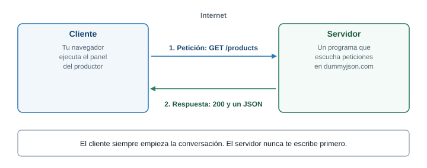{fig-alt="Un navegador cliente envía una petición GET /products a un servidor y recibe una respuesta 200 con un JSON"}

Todo el consumo de APIs es esta conversación de dos mensajes, repetida muchas veces.
:::

Un **cliente** es cualquier programa que pide algo: tu navegador, una app móvil, o un script de
Node. Un **servidor** es un programa que está encendido todo el tiempo, esperando peticiones en una
dirección. Los dos se comunican con mensajes de texto con un formato fijo, y eso es lo que hace
posible que un frontend escrito con HTML y JavaScript hable con un backend escrito en ASP.NET Core:
no necesitan conocer el lenguaje del otro, solo el formato del mensaje.

### Anatomía de una URL

La dirección que escribes tiene partes, y cada una responde una pregunta distinta.

::: {.diagrama}
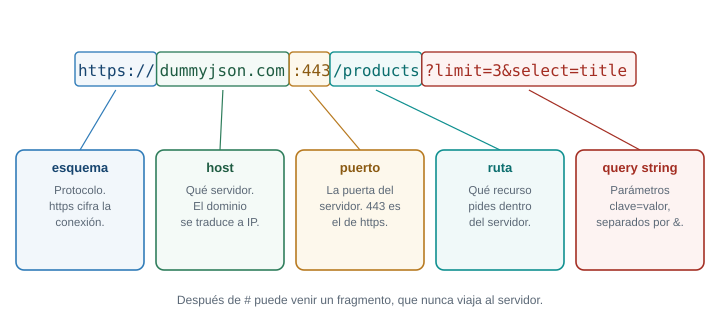{fig-alt="La URL https://dummyjson.com:443/products?limit=3&select=title dividida en esquema, host, puerto, ruta y query string"}
:::

| Parte | En el ejemplo | Qué responde |
|---|---|---|
| Esquema | `https://` | Con qué protocolo hablamos. `https` es HTTP cifrado |
| Host | `dummyjson.com` | A qué servidor le hablamos |
| Puerto | `:443` | Por cuál puerta. Con `https` se omite porque 443 es el valor por defecto |
| Ruta | `/products` | Qué recurso queremos dentro de ese servidor |
| Query string | `?limit=3&select=title` | Parámetros opcionales, como `clave=valor` separados por `&` |

El **query string** merece atención porque lo usarás mucho: sirve para pedir "solo tres productos"
(`limit=3`) o "solo estos campos" (`select=title`) sin que el servidor tenga una ruta distinta para
cada combinación. Los caracteres especiales (espacios, tildes, `&`) tienen que ir codificados. Para
construir una URL con parámetros sin equivocarte, JavaScript trae la clase `URL`:

```js
const url = new URL("https://dummyjson.com/products/search");
url.searchParams.set("q", "miel de abeja");
console.log(url.href);
```

```text
https://dummyjson.com/products/search?q=miel+de+abeja
```

`searchParams.set` codificó los espacios como `+` por ti. Si armas la URL pegando textos con `+`, un
`&` dentro del dato rompe la petición sin avisar.

### La petición y la respuesta HTTP

Un mensaje HTTP tiene tres zonas: una línea inicial, unos **encabezados** y, a veces, un **cuerpo**.

::: {.diagrama}
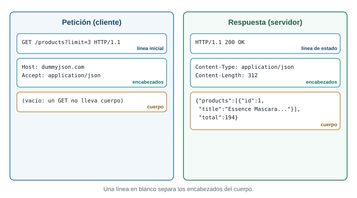{fig-alt="Una petición GET con línea inicial y encabezados sin cuerpo, y una respuesta 200 con encabezados y un cuerpo JSON"}
:::

- La **línea inicial** de la petición dice el **método** y la ruta (`GET /products?limit=3`). La de la
  respuesta trae el **código de estado** (`200 OK`).
- Los **encabezados** son pares `nombre: valor` con información sobre el mensaje: qué formato tiene
  el cuerpo (`Content-Type`), qué formato acepta el cliente (`Accept`), cuánto pesa, qué origen
  pregunta, etc.
- El **cuerpo** es el contenido. Un `GET` no lleva cuerpo: solo pide. Un `POST` sí lo lleva: ahí
  viaja el producto nuevo. La respuesta de un `GET /products` lleva el catálogo en el cuerpo.

### Métodos y el ciclo crear, leer, actualizar y borrar

El **método** declara la intención de la petición. Las cuatro operaciones básicas de cualquier
aplicación con datos tienen un método habitual:

::: {.diagrama}
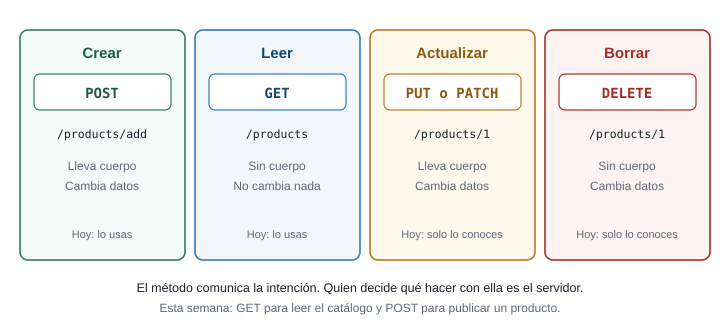{fig-alt="Cuatro tarjetas: crear usa POST, leer usa GET, actualizar usa PUT o PATCH y borrar usa DELETE"}
:::

| Operación | Método | Ejemplo | Cambia datos |
|---|---|---|---|
| Crear | `POST` | `POST /products/add` con el producto en el cuerpo | Sí |
| Leer | `GET` | `GET /products` | No |
| Actualizar | `PUT` o `PATCH` | `PUT /products/1` con los campos nuevos | Sí |
| Borrar | `DELETE` | `DELETE /products/1` | Sí |

Que `GET` no cambie datos es una promesa que el resto de la web da por cierta.
Los navegadores guardan en caché las respuestas de `GET`, los buscadores los repiten, y un enlace
puede volver a ejecutarlo. Por eso nunca se borra o se crea algo con un `GET`.

### Códigos de estado

El servidor resume el resultado en un número de tres cifras. La primera cifra es la que importa
para razonar:

::: {.diagrama}
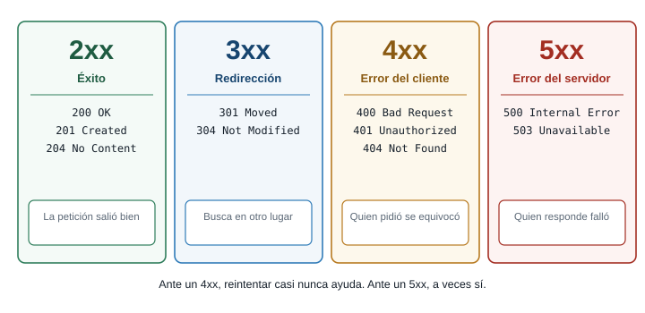{fig-alt="Cuatro columnas: 2xx éxito, 3xx redirección, 4xx error del cliente y 5xx error del servidor, con ejemplos"}
:::

La división útil es quién se equivocó. En un **4xx** la petición estaba mal (ruta que no existe,
dato inválido, falta de permiso): repetirla igual dará el mismo error. En un **5xx** la petición
estaba bien y el servidor falló: repetirla más tarde puede funcionar. Esa distinción gobierna la
estrategia de reintentos de la Parte 7.

Los más frecuentes: `200 OK`, `201 Created` (se creó el recurso), `204 No Content` (salió bien y no
hay cuerpo), `400 Bad Request`, `401 Unauthorized` (falta autenticación), `403 Forbidden` (estás
autenticado, pero no tienes permiso), `404 Not Found`, `500 Internal Server Error` y
`503 Service Unavailable`. No se memorizan: se reconocen por familia.

### Mira una petición real

Abre el navegador, abre DevTools en la pestaña **Network**, deja marcado *Preserve log* y escribe en
la barra de direcciones: `https://dummyjson.com/products?limit=2&select=title,price`. Haz clic en la
petición que aparece y revisa las pestañas **Headers** y **Response**. Verás la línea de estado, los
encabezados y el cuerpo con exactamente la estructura del diagrama. En **Headers**, dentro de
*Response Headers*, localiza `content-type`: dice `application/json; charset=utf-8`. Ese encabezado
es la forma en que el servidor avisa "lo que sigue es JSON".

::: {.callout-tip}
## Reto 1. Lee una petición

Para cada petición, di el método, el esquema, el host, la ruta y los parámetros, y qué esperas de
la respuesta:

1. `https://dummyjson.com/products/7?select=title`
2. `https://dummyjson.com/products/search?q=phone&limit=2`
3. `POST https://dummyjson.com/products/add` con cuerpo `{"title":"Miel"}`
:::

::: {.callout-note collapse="true"}
## Solución del Reto 1

1. `GET` (si no dices método en el navegador, es `GET`), esquema `https`, host `dummyjson.com`, ruta
   `/products/7` y parámetro `select=title`. Espera un `200` con el producto 7 solo con los campos
   `id` y `title`.
2. `GET`, ruta `/products/search`, parámetros `q=phone` y `limit=2`. Espera un `200` con un objeto que
   incluye una lista con dos productos que coinciden con "phone".
3. `POST`, ruta `/products/add`, sin parámetros. Lleva cuerpo JSON. Espera una respuesta con el
   producto creado y un `id` nuevo. En esta API de práctica el producto no queda guardado de verdad.
:::

::: {.callout-tip}
## Para pensar

El navegador agrega solo muchos encabezados que tú nunca escribiste (`Host`, `User-Agent`,
`Accept-Language`). ¿Por qué crees que no le dejan a JavaScript cambiar algunos, como `Origin`?
:::

::: {.callout-note collapse="true"}
## Respuesta

Si cualquier página pudiera falsificar `Origin`, un sitio malicioso podría hacerse pasar por tu
panel ante el servidor, y el servidor no tendría forma de distinguirlos. El navegador es quien
garantiza ese dato, y por eso JavaScript no puede modificarlo. Vuelve a esta idea en la Parte 8.
:::

### Conexión con el proyecto

Cuando el backend ASP.NET exista, tu panel hablará con él con estas mismas piezas: `GET /api/productos`
para leer el catálogo, `POST /api/productos` para publicar uno, códigos `4xx` cuando el dato sea
inválido (RN-01) y `5xx` cuando algo falle del lado del servidor. Lo que aprendas hoy con una API
pública se traslada casi sin cambios.

## Parte 2. Qué es una API y qué es JSON

### El problema

El servidor responde con un cuerpo. Ese cuerpo no puede ser "una lista de JavaScript", porque el
servidor puede estar escrito en C#, Python o Java, y esos lenguajes no comparten estructuras. Hace
falta un formato de texto que todos entiendan.

::: {.callout-tip}
## Predice antes de seguir

Una función de JavaScript puede devolver un objeto `{ nombre: "Tomate", precio: 4500 }`. Un servidor
en C# quiere enviarle ese mismo dato a tu navegador por la red. ¿Qué viaja por el cable: el objeto,
o otra cosa? ¿Qué problemas tendría enviar el objeto tal cual?
:::

::: {.callout-note collapse="true"}
## Respuesta

Por el cable solo viajan **bytes**, es decir, texto. Un objeto de memoria no se puede enviar: es un
conjunto de referencias dentro de un programa en ejecución, y el programa del otro lado no lo
entendería. Hay que convertir el dato en una cadena de texto con un formato acordado (**serializar**)
y, al llegar, reconstruirlo (**deserializar**). Ese formato acordado, hoy el más usado, es JSON.
:::

### Qué es una API

Una **API** (interfaz de programación de aplicaciones) es un **contrato entre programas**: dice qué
rutas existen, qué hay que enviar a cada una y qué devuelve. Una API web publica ese contrato en
HTTP. No importa cómo está escrito el servidor por dentro; mientras respete el contrato, tu frontend
funciona. Esa es la razón por la que esta semana puedes trabajar con una API pública y la próxima
vez cambiarla por tu backend con pocos cambios.

El contrato de la API que usas en esta guía, `dummyjson.com`, incluye entre otras estas rutas:

| Ruta | Qué hace |
|---|---|
| `GET /products` | Lista productos. Acepta `limit`, `skip` y `select` |
| `GET /products/{id}` | Un producto por su `id` |
| `GET /products/search?q=...` | Productos cuyo texto coincide |
| `POST /products/add` | Simula crear un producto (no lo guarda de verdad) |
| `GET /http/{codigo}` | Responde con ese código de estado, útil para practicar errores |

Cada producto trae, entre otros, `id`, `title`, `price` (en dólares), `stock` y `category`. La forma
que observamos al consultar `GET /products?limit=1&select=title,price,stock,category` es:

```json
{
  "products": [
    { "id": 1, "title": "Essence Mascara Lash Princess", "price": 9.99, "stock": 99, "category": "beauty" }
  ],
  "total": 194,
  "skip": 0,
  "limit": 1
}
```

Fíjate en dos detalles. La lista no llega sola: viene dentro de un objeto, en la clave `products`,
junto con datos de paginación (`total`, `skip`, `limit`). Y los nombres no son los de tu proyecto:
la API dice `title`, `price` y `stock`; tu proyecto dice `nombre`, `precio` y `cantidad`. Ese
desajuste se resuelve en la Parte 11.

::: {.callout-warning}
## Una API de práctica no es el backend

`dummyjson.com` es un servicio gratuito para aprender. Sus productos están en inglés, los precios
están en dólares y sus datos no se guardan. Nada de eso afecta lo que aprendes, porque la técnica es
la misma que usarás con tu backend. Tampoco es un servicio que debas usar en producción: puede
cambiar o dejar de estar disponible.
:::

### JSON frente a un objeto de JavaScript

**JSON** (*JavaScript Object Notation*) es un formato de **texto** para representar datos. Se parece
a un objeto de JavaScript, pero tiene reglas más estrictas.

::: {.diagrama}
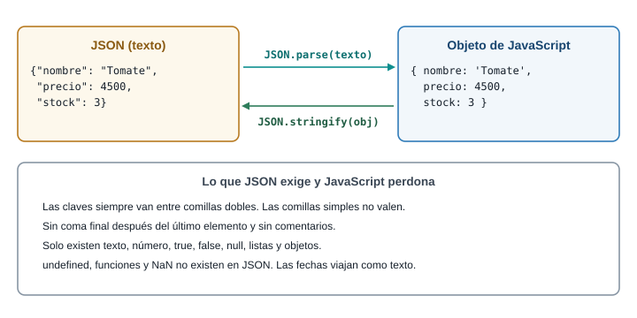{fig-alt="Un texto JSON se convierte en un objeto de JavaScript con JSON.parse y un objeto vuelve a texto con JSON.stringify"}
:::

La diferencia esencial: un JSON es una **cadena de texto**; un objeto es una **estructura en
memoria**. No puedes escribir `texto.precio` sobre una cadena JSON; primero hay que convertirla.

```js
const texto = '{"nombre":"Tomate","precio":4500,"stock":3}';

const producto = JSON.parse(texto);
console.log(producto.precio);
console.log(typeof texto, typeof producto);

const deVuelta = JSON.stringify(producto);
console.log(deVuelta);
console.log(deVuelta === texto);
```

```text
4500
string object
{"nombre":"Tomate","precio":4500,"stock":3}
true
```

- `JSON.parse(texto)` toma una cadena y devuelve el objeto o la lista que describe.
- `JSON.stringify(valor)` hace el camino inverso: devuelve la cadena JSON del valor.
- `typeof` confirma la diferencia: la variable `texto` es `string`, la variable `producto` es `object`.
- La última línea compara los dos textos. Son idénticos porque no había espacios sobrantes.

Para que el JSON sea legible, `stringify` acepta una sangría como tercer argumento:
`JSON.stringify(producto, null, 2)`. El segundo argumento (`null`) es un filtro que casi nunca usarás.

### Reglas de JSON que JavaScript perdona y JSON no

| En JavaScript sí | En JSON no |
|---|---|
| Claves sin comillas: `{ nombre: "x" }` | Las claves van siempre entre **comillas dobles** |
| Comillas simples: `'x'` | Solo comillas dobles |
| Coma final: `[1, 2, ]` | Prohibida |
| Comentarios `//` y `/* */` | No existen |
| `undefined`, funciones, `NaN` | No existen. Una fecha viaja como texto |

### Errores típicos al leer JSON, con su mensaje real

Cuando `JSON.parse` recibe texto que no cumple las reglas lanza un `SyntaxError`. Esto es lo que
muestra la consola de Chrome para los errores más frecuentes:

```js
JSON.parse("{'a': 1}");        // comillas simples
JSON.parse('{"a": 1,}');       // coma final
JSON.parse("");                // texto vacío
JSON.parse(undefined);         // se pasó undefined
JSON.parse("<!DOCTYPE html>"); // llegó HTML en lugar de JSON
JSON.parse(Promise.resolve(1)); // se pasó una promesa, no un texto
```

```text
SyntaxError: Expected property name or '}' in JSON at position 1 (line 1 column 2)
SyntaxError: Expected double-quoted property name in JSON at position 7 (line 1 column 8)
SyntaxError: Unexpected end of JSON input
SyntaxError: "undefined" is not valid JSON
SyntaxError: Unexpected token '<', "<!DOCTYPE html>" is not valid JSON
SyntaxError: Unexpected token 'o', "[object Promise]" is not valid JSON
```

El **número de posición** del mensaje es una pista valiosa: te dice en qué carácter dejó de entender
el texto. Con textos largos, el mensaje muestra solo el comienzo seguido de puntos suspensivos
(`"<!DOCTYPE "...`). Los dos últimos errores son los que más verás con APIs. `"undefined" is not valid JSON`
significa que pasaste a `parse` una variable sin valor, por ejemplo una propiedad que no existe. `[object Promise]` significa que olvidaste un `await` y le diste a `parse` la promesa en lugar del
texto. Y `Unexpected token '<'` significa que **el servidor te respondió una página HTML, no JSON**:
suele ser una ruta mal escrita que devolvió una página de error. La causa está
en la petición. Mira en Network la pestaña **Response** y lo verás con tus ojos.

::: {.callout-tip}
## Reto 2. Corrige el JSON

El siguiente texto tiene cuatro errores. Encuéntralos sin ejecutarlo y escribe el JSON correcto:

```text
{
  nombre: 'Miel de abeja',
  "precio": 18000,
  "disponible": undefined,
  "etiquetas": ["dulce", "natural",],
}
```
:::

::: {.callout-note collapse="true"}
## Solución del Reto 2

Los cuatro errores: la clave `nombre` sin comillas dobles, el valor entre comillas simples,
`undefined` (no existe en JSON) y la coma final después de `"natural"`. Una versión válida:

```json
{
  "nombre": "Miel de abeja",
  "precio": 18000,
  "disponible": null,
  "etiquetas": ["dulce", "natural"]
}
```

Reemplazar `undefined` por `null` es una decisión de diseño: `null` dice "no hay valor". Otra opción
válida es omitir la clave `disponible`.
:::

### Conexión con el proyecto

El contrato de tu futura API de productos es un JSON como el anterior. Decidir sus nombres y su
forma (¿`cantidad` o `stock`? ¿el precio en pesos enteros o con decimales?) es una decisión de diseño
que tomarás entre el frontend y el backend. Por eso conviene que tu frontend no dependa de los
nombres de una API en particular: lo resolverás con una capa de adaptación en el taller.

## Parte 3. El problema de esperar

### El problema

Pedir el catálogo tarda. No es instantáneo: la petición viaja, el servidor trabaja, la respuesta
regresa. Si JavaScript se quedara parado esperando, la página entera se congelaría: nadie podría
hacer clic ni desplazarse. Entender cómo evita JavaScript ese congelamiento es el paso más difícil de
la semana y el que más errores evita después.

::: {.callout-tip}
## Predice antes de seguir

Este código se ejecuta en la consola. ¿En qué orden crees que aparecen las letras?

```js
console.log("A");
setTimeout(() => console.log("B"), 0);
Promise.resolve().then(() => console.log("C"));
console.log("D");
```

El temporizador está en 0 milisegundos. Escribe tu predicción antes de abrir la respuesta.
:::

::: {.callout-note collapse="true"}
## Respuesta

La salida es `A`, `D`, `C`, `B`. Si esperabas `A`, `B`, `C`, `D` o `A`, `D`, `B`, `C`, tu modelo del
orden de ejecución todavía no incluye las colas. Las dos secciones siguientes explican por qué.
:::

### Un solo hilo

JavaScript ejecuta tu código en **un solo hilo**: hace una cosa a la vez, de arriba abajo. Mientras
una función corre, nada más corre. Si pidieras datos de forma bloqueante (esperando parado), tu
código, las animaciones, los clics y el desplazamiento esperarían con él.

::: {.diagrama}
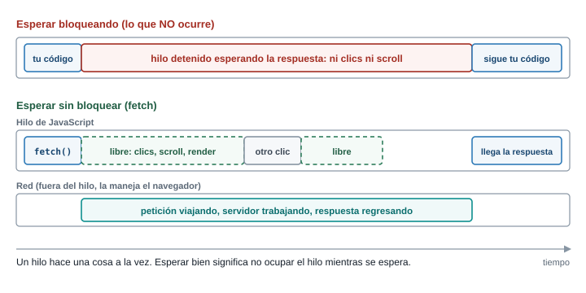{fig-alt="Comparación entre esperar bloqueando el hilo y esperar sin bloquear mientras la red trabaja fuera del hilo"}
:::

La solución es que **esperar no sea trabajo de JavaScript**. Cuando llamas a `fetch` o a
`setTimeout`, JavaScript no espera: le entrega la tarea al navegador, que la hace por fuera de tu
hilo, y sigue con la siguiente línea. Cuando la tarea termina, el navegador deja avisado a
JavaScript para que ejecute lo que tú pediste que ocurriera "después".

Puedes comprobar que un hilo ocupado congela todo. Pega esto en la consola:

```js
const inicio = Date.now();
setTimeout(() => console.log("el timer de 0 ms se ejecutó"), 0);
while (Date.now() - inicio < 2000) {} // ocupa el hilo 2 segundos
console.log("bucle terminado");
```

```text
bucle terminado
el timer de 0 ms se ejecutó
```

El temporizador de 0 ms espera dos segundos completos, porque el hilo estaba ocupado con el
`while`. Durante ese tiempo, la pestaña no respondió a nada. **Un temporizador no garantiza cuándo
corre: garantiza que no corre antes** del tiempo indicado, y solo cuando el hilo esté libre.

### Modelo mental: pila, Web APIs y colas

Hay cuatro piezas que debes poder dibujar de memoria.

::: {.diagrama}
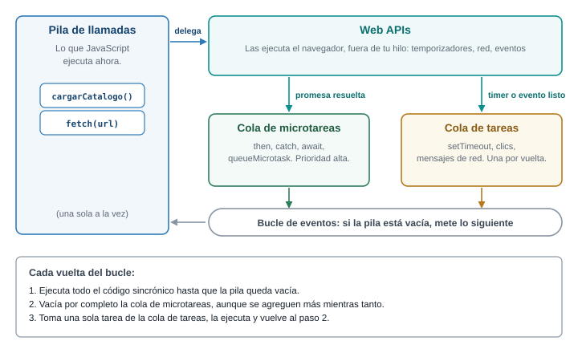{fig-alt="Pila de llamadas, Web APIs, cola de microtareas, cola de tareas y bucle de eventos conectados entre sí"}
:::

1. **Pila de llamadas** (*call stack*). Donde se ejecuta tu código. Cada función que se llama se
   apila y cuando termina se desapila. Solo se ejecuta lo que está arriba.
2. **Web APIs**. Funciones que el navegador hace por fuera de tu hilo: temporizadores, red
   (`fetch`), eventos del DOM.
3. **Cola de tareas** (*task queue*). Cuando una Web API termina un trabajo (venció el temporizador,
   el usuario hizo clic), deja en esta cola el **callback** a ejecutar.
4. **Cola de microtareas** (*microtask queue*). Una segunda cola, con prioridad más alta. Aquí
   caen los callbacks de promesas: lo que va dentro de `.then`, `.catch`, `.finally`, y lo que está
   después de un `await`.

El **bucle de eventos** (*event loop*) es el vigilante que decide qué entra a la pila. Repite sin
parar estas reglas, que sí se memorizan:

1. Ejecuta el código sincrónico hasta que la pila queda vacía.
2. Vacía por completo la cola de microtareas. Si una microtarea agrega otra, esa también se ejecuta
   antes de seguir.
3. Toma **una** tarea de la cola de tareas y la ejecuta.
4. Vuelve al paso 2.

Con esto se explica el ejercicio de la predicción:

::: {.diagrama}
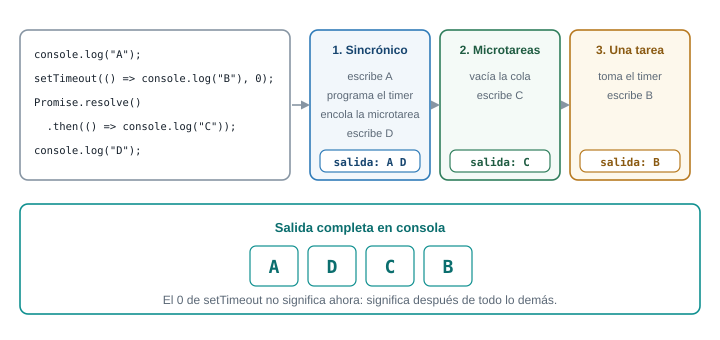{fig-alt="Las tres fases del ejemplo: lo sincrónico escribe A y D, las microtareas escriben C y la tarea del temporizador escribe B"}
:::

- El código sincrónico corre primero: escribe `A`, programa el temporizador (lo entrega a las Web
  APIs, que lo dejarán en la cola de tareas cuando venza), deja la microtarea de la promesa y escribe
  `D`.
- La pila queda vacía. El bucle vacía las microtareas: escribe `C`.
- Solo entonces toma la tarea del temporizador: escribe `B`.

**Por qué las promesas ganan a los temporizadores:** una microtarea corre al terminar el código
actual, sin pasar por la fila de tareas. Un temporizador de 0 ms no significa "ahora": significa
"después de todo lo demás que ya está pendiente".

### Ejercicios de predicción

Para cada fragmento, escribe el orden de salida **antes** de abrir la respuesta. Las respuestas
fueron comparadas con la ejecución real.

::: {.callout-tip}
## Ejercicio 1. async y await

```js
async function cargar() {
  console.log("1");
  await null;
  console.log("2");
}
console.log("0");
cargar();
console.log("3");
```
:::

::: {.callout-note collapse="true"}
## Respuesta del ejercicio 1

La salida es `0`, `1`, `3`, `2`. Una función `async` corre de forma **sincrónica** hasta el primer
`await`: por eso `1` sale antes que `3`. En el `await`, la función se pausa y lo que sigue
(`console.log("2")`) se convierte en microtarea. El código principal continúa y escribe `3`; recién
con la pila vacía corre la microtarea y sale `2`.
:::

::: {.callout-tip}
## Ejercicio 2. Microtareas y tareas mezcladas

```js
console.log("inicio");
setTimeout(() => {
  console.log("timer 1");
  Promise.resolve().then(() => console.log("micro dentro del timer 1"));
}, 0);
setTimeout(() => console.log("timer 2"), 0);
Promise.resolve()
  .then(() => console.log("then 1"))
  .then(() => console.log("then 2"));
queueMicrotask(() => console.log("microtarea suelta"));
console.log("fin");
```
:::

::: {.callout-note collapse="true"}
## Respuesta del ejercicio 2

```text
inicio
fin
then 1
microtarea suelta
then 2
timer 1
micro dentro del timer 1
timer 2
```

Primero lo sincrónico (`inicio`, `fin`). Luego se vacía la cola de microtareas en el orden en que
llegaron: `then 1` y `microtarea suelta` estaban ya en cola; `then 2` solo se encola cuando termina
`then 1`, así que va después de `microtarea suelta`. Después viene **una** tarea, `timer 1`, y antes
de pasar a `timer 2` el bucle vacía las microtareas, por eso `micro dentro del timer 1` sale antes que
`timer 2`.
:::

::: {.callout-tip}
## Ejercicio 3. Una función async llamando a otra

```js
async function a() {
  console.log("a: inicio");
  await b();
  console.log("a: después de b");
}
async function b() {
  console.log("b: corre");
}
console.log("1");
a();
setTimeout(() => console.log("timeout"), 0);
console.log("2");
```
:::

::: {.callout-note collapse="true"}
## Respuesta del ejercicio 3

```text
1
a: inicio
b: corre
2
a: después de b
timeout
```

`a()` corre sincrónicamente hasta su `await`, y `b()` también corre sincrónicamente porque llamar a
una función async ejecuta su cuerpo de inmediato. Lo que queda **después** del `await` es una
microtarea, y por eso sale antes que el `timeout`, que es una tarea.
:::

### Lo que se memoriza y lo que se razona

Se memorizan las cuatro reglas del bucle. No se memoriza cada orden de salida: se **razona** con
ellas. Cuando un orden de salida te sorprenda, pregúntate dos cosas: ¿esa línea es sincrónica,
microtarea o tarea? ¿Qué quedó antes en la cola?

::: {.callout-tip}
## Para pensar

Tu panel pide el catálogo con `fetch` y luego pinta las tarjetas. Si en la línea siguiente al
`fetch` intentas pintar las tarjetas sin esperar, ¿qué datos tendrás? ¿Por qué el código "se ve
bien" y aun así falla?
:::

::: {.callout-note collapse="true"}
## Respuesta

La línea siguiente corre **antes** de que llegue la respuesta, porque `fetch` no detiene el hilo.
Lo único que tienes en ese instante es una promesa pendiente, no los datos. El código parece
correcto porque se lee de arriba abajo, pero la respuesta llega en otro momento del bucle de
eventos. Para trabajar con ese "después" existen las promesas.
:::

### Conexión con el proyecto

En el panel del productor, cada llamada a la API es una espera. Mientras llega la respuesta, la
página debe seguir viva y mostrar "Cargando...". Todo el taller depende de esta idea: la espera no
bloquea, y lo que dependa de la respuesta se escribe **después**, dentro de un callback o tras un
`await`.

## Parte 4. Promesas

### El problema

Si `fetch` no devuelve los datos, ¿qué devuelve? Necesitamos un objeto que represente "un resultado
que todavía no llegó, pero que llegará o fallará", y una forma de decir "cuando llegue, haz esto".
Ese objeto es la **promesa**.

::: {.callout-tip}
## Predice antes de seguir

```js
const promesa = new Promise((resolve) => {
  setTimeout(() => resolve("listo"), 1000);
});
console.log(promesa);
```

¿Qué imprime la consola: `"listo"`, `undefined` o algo más? ¿Y si imprimes la misma variable
pasados dos segundos?
:::

::: {.callout-note collapse="true"}
## Respuesta

Imprime una promesa pendiente: `Promise { <pending> }` en Node y `Promise {<pending>}` en Chrome. La
promesa es un contenedor que **todavía** no tiene valor. Si la imprimes pasados dos
segundos, ya aparecerá como cumplida y mostrará `"listo"` dentro: `Promise {<fulfilled>: 'listo'}`.
:::

### Modelo mental: tres estados

::: {.diagrama}
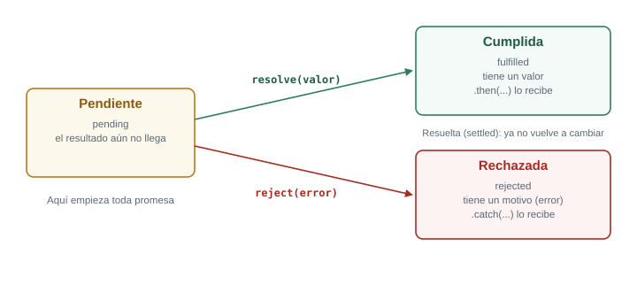{fig-alt="Una promesa empieza pendiente y pasa a cumplida con resolve o a rechazada con reject, y ya no vuelve a cambiar"}
:::

Una promesa está siempre en uno de tres estados:

- **Pendiente** (*pending*): el resultado aún no llega. Es el estado inicial.
- **Cumplida** (*fulfilled*): terminó bien y tiene un **valor**.
- **Rechazada** (*rejected*): terminó mal y tiene un **motivo**, normalmente un objeto `Error`.

Una promesa cumplida o rechazada está **resuelta** (*settled*) y no vuelve a cambiar. Con eso en
mente, una promesa es solo la respuesta a la pregunta "¿ya terminó y cómo le fue?". Quien la usa
registra qué hacer en cada caso.

### El mecanismo: crear y consumir

Casi nunca crearás promesas a mano (`fetch` ya te devuelve una), pero crear una sirve para entender
cómo se resuelven:

```js
const promesa = new Promise((resolve, reject) => {
  setTimeout(() => resolve("listo"), 100);
});

promesa.then((valor) => console.log(valor));
```

- `new Promise(...)` recibe una función que corre **de inmediato** y que recibe dos funciones:
  `resolve` para cumplir y `reject` para rechazar.
- Dentro, `setTimeout` simula una espera de 100 ms. Al vencer, llama a `resolve("listo")`: la promesa
  pasa de pendiente a cumplida con el valor `"listo"`.
- `.then(...)` registra el callback que se ejecutará **cuando** la promesa se cumpla. Ese callback
  corre como microtarea, como viste en la Parte 3.

```text
listo
```

### then, catch y finally

| Método | Se ejecuta cuando | Recibe |
|---|---|---|
| `.then(f)` | La promesa se cumple | El valor |
| `.catch(f)` | La promesa se rechaza (o una función anterior lanzó un error) | El error |
| `.finally(f)` | Se resuelve, por cualquiera de los dos caminos | Nada |

`finally` sirve para lo que debe ocurrir siempre, como esconder el aviso "Cargando...".

### Encadenamiento

Cada `.then` devuelve una **promesa nueva**, y lo que devuelve su callback pasa como valor al
siguiente `.then`. Eso permite armar una secuencia en vez de anidar callbacks:

```js
Promise.resolve(2)
  .then((n) => n * 10)
  .then((n) => { console.log(n); return n + 1; })
  .then((n) => { throw new Error("falló en " + n); })
  .then(() => console.log("esto no se imprime"))
  .catch((e) => console.log("catch:", e.message))
  .finally(() => console.log("finally"));
```

```text
20
catch: falló en 21
finally
```

Paso a paso:

1. `Promise.resolve(2)` crea una promesa ya cumplida con el valor `2`.
2. El primer `.then` multiplica: devuelve `20`, que pasa al siguiente.
3. El segundo imprime `20` y devuelve `21`.
4. El tercero **lanza un error**. Una excepción dentro de un `.then` rechaza la promesa que ese
   `.then` devuelve.
5. El cuarto `.then` se **salta**: solo se ejecuta si la promesa anterior se cumplió. El rechazo viaja
   por la cadena hasta encontrar un `.catch`.
6. `.catch` recibe el error e imprime `catch: falló en 21`.
7. `.finally` corre al final, haya habido error o no.

### Errores frecuentes con promesas

**Olvidar el `return` dentro del `.then`.** Sin `return`, el siguiente `.then` recibe `undefined`:

```js
Promise.resolve("A")
  .then((x) => { console.log(x); })    // no devuelve nada
  .then((x) => { console.log(x); });
```

```text
A
undefined
```

El segundo `.then` imprimió `undefined` porque el primero no devolvió el valor. Con llaves hay que
escribir `return`; sin llaves, la flecha devuelve sola.

**Anidar en lugar de encadenar.** Poner un `.then` dentro de otro `.then` funciona, pero devuelve la
estructura de pirámide que las promesas querían evitar. Si el primer `.then` devuelve una promesa,
el siguiente espera a que se resuelva sola: no necesitas anidar.

**No dejar un `.catch`.** Una promesa rechazada que nadie atiende produce en la consola
`Uncaught (in promise) Error: ...`. No detiene la página, pero indica que ese error no se mostró a
nadie.

::: {.callout-tip}
## Reto 3. Predice la cadena

¿Qué imprime este código y en qué orden?

```js
Promise.reject(new Error("uno"))
  .then(() => console.log("A"))
  .catch((e) => { console.log("B", e.message); return "recuperado"; })
  .then((v) => console.log("C", v))
  .finally(() => console.log("D"));
```
:::

::: {.callout-note collapse="true"}
## Solución del Reto 3

```text
B uno
C recuperado
D
```

La promesa nace rechazada, así que `A` se salta. El `.catch` imprime `B uno` y **devuelve**
`"recuperado"`: eso cumple la promesa que `.catch` devuelve, y la cadena continúa por el camino
feliz. Por eso el siguiente `.then` sí corre e imprime `C recuperado`. `finally` cierra con `D`. Un
`.catch` que devuelve un valor "arregla" la cadena; si quisieras que el error siguiera propagándose,
tendrías que volver a lanzarlo con `throw`.
:::

### Conexión con el proyecto

Cada petición de tu panel será una cadena de promesas o, como verás en la Parte 6, su versión con
`await`. El `.catch` final de esa cadena es el lugar donde tu interfaz decide mostrar el estado de
error.

## Parte 5. fetch

### El problema

Ya sabes qué es una petición HTTP y qué es una promesa. `fetch` es la función del navegador que
hace la petición y devuelve una promesa. Pero hay una sorpresa que causa más errores que cualquier
otra de esta semana, y conviene enfrentarla de entrada.

::: {.callout-tip}
## Predice antes de seguir

Pides un producto que no existe: `fetch("https://dummyjson.com/products/999999")`. El servidor
responde `404 Not Found`. ¿Esa promesa se **rechaza** (y entra al `.catch`) o se **cumple**? Y
cuando escribes `fetch(url).then(r => r.json())`, ¿cuántas promesas hay en juego?
:::

::: {.callout-note collapse="true"}
## Respuesta

La promesa se **cumple**: `fetch` solo rechaza cuando **no pudo obtener ninguna respuesta** (sin
conexión, dominio inexistente, bloqueo por CORS). Un `404` o un `500` es una respuesta válida del
servidor, así que la promesa se cumple y debes revisar tú mismo el resultado. Y hay **dos promesas**:
`fetch` devuelve una que se cumple con un objeto `Response` cuando llegan los encabezados, y
`response.json()` devuelve otra que se cumple cuando el cuerpo se descargó y se convirtió en objeto.
:::

### Modelo mental: dos promesas

::: {.diagrama}
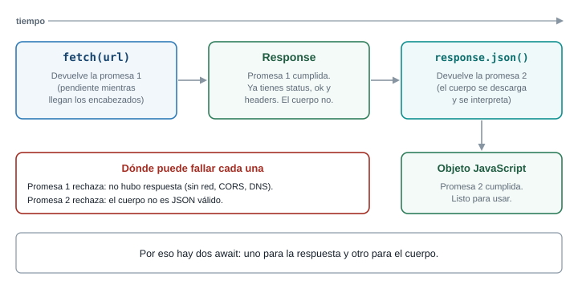{fig-alt="fetch devuelve una primera promesa que se cumple con un Response y response.json devuelve una segunda promesa que se cumple con el objeto"}
:::

La razón de las dos promesas es práctica: el servidor puede responder primero los encabezados
(estado, tipo de contenido) y enviar el cuerpo después, en pedazos. Con la primera promesa ya
puedes saber si hay un error antes de descargar todo el cuerpo.

El objeto `Response` que entrega la primera promesa tiene, entre otras, estas propiedades:

| Propiedad | Qué contiene |
|---|---|
| `status` | El código numérico: `200`, `404`, `500` |
| `ok` | `true` si el estado está entre 200 y 299 |
| `headers` | Los encabezados de la respuesta |
| `json()` | Método que devuelve una promesa del cuerpo convertido a objeto |
| `text()` | Método que devuelve una promesa del cuerpo como texto |

### El mecanismo: qué rechaza fetch y qué no

::: {.diagrama}
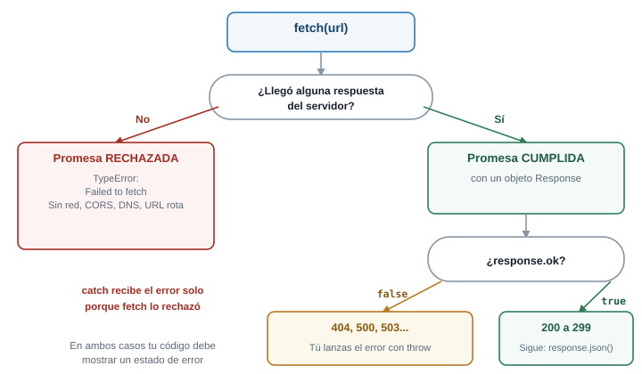{fig-alt="Árbol de decisión: si no llegó respuesta fetch rechaza con TypeError, si llegó la promesa se cumple y hay que revisar response.ok"}
:::

La regla completa:

- **Se rechaza** con un `TypeError` cuando la petición no pudo completarse: sin red, dominio que no
  existe, servidor caído, o respuesta bloqueada por CORS. Todos esos casos producen el mismo mensaje
  poco informativo: `TypeError: Failed to fetch`.
- **Se cumple** en cualquier otro caso, incluidos `404`, `401` y `500`. Allí `response.ok` vale
  `false` y es **tu código** quien debe decidir qué hacer.

Compruébalo con una petición real (en la consola de una pestaña de `localhost`, o en un archivo `.mjs`
con Node 18 o superior):

```js
const respuesta = await fetch("https://dummyjson.com/products/999999");
console.log(respuesta.status, respuesta.ok);
console.log(await respuesta.json());
```

```text
404 false
{ message: "Product with id '999999' not found" }
```

No hubo ningún error en consola, y la promesa se cumplió. Sin revisar `ok`, tu código habría tratado
`{ message: ... }` como si fuera un producto.

### GET: leer datos

La forma completa y segura de leer, con `then`:

```js
fetch("https://dummyjson.com/products/1?select=title,price")
  .then((respuesta) => {
    if (!respuesta.ok) {
      throw new Error(`El servidor respondió ${respuesta.status}`);
    }
    return respuesta.json();
  })
  .then((producto) => console.log(producto))
  .catch((error) => console.error(error.message));
```

```text
{ id: 1, title: 'Essence Mascara Lash Princess', price: 9.99 }
```

Línea por línea:

- `fetch(url)` envía la petición `GET` (el método por defecto) y devuelve la primera promesa.
- El primer `.then` recibe el `Response`. Allí se revisa `ok`: si es falso, **se lanza un error** para
  que el `.catch` de abajo lo atienda como a cualquier otro. Esa línea es la que `fetch` no hace por
  ti.
- `return respuesta.json()` devuelve la segunda promesa. Como se devuelve desde un `.then`, la cadena
  espera a que se resuelva antes de pasar al siguiente.
- El segundo `.then` recibe ya el objeto convertido.
- `.catch` atiende los dos tipos de falla: el `TypeError` de `fetch` (sin conexión) y el `Error`
  que lanzaste por un estado no exitoso.

### POST: enviar datos

Para crear un recurso se envía un cuerpo. Hay que decir **cómo** se envía con un segundo argumento,
un objeto de opciones:

```js
const nuevo = { title: "Mora de Castilla", price: 1.5, stock: 20 };

fetch("https://dummyjson.com/products/add", {
  method: "POST",
  headers: { "Content-Type": "application/json" },
  body: JSON.stringify(nuevo),
})
  .then((respuesta) => {
    if (!respuesta.ok) throw new Error(`Estado ${respuesta.status}`);
    return respuesta.json();
  })
  .then((creado) => console.log(creado));
```

```text
{ id: 195, title: 'Mora de Castilla', price: 1.5, stock: 20 }
```

- `method: "POST"` cambia el método. Si lo omites, se envía un `GET` y la ruta no existe para ese
  método.
- `headers` agrega el encabezado `Content-Type: application/json`, que le avisa al servidor "el
  cuerpo que envío es JSON". Sin él, muchos servidores no interpretan el cuerpo.
- `body` solo acepta texto (y otros formatos binarios), **no objetos**. Por eso se convierte con
  `JSON.stringify`. Si pasas el objeto directamente, el navegador lo convierte a la cadena
  `"[object Object]"`, un error silencioso.
- La respuesta incluye el `id` asignado por el servidor (`195`). Esta API de práctica **simula** la
  creación: si pides el producto 195 después, no existe.

### Qué pasa si...

**...llamas a `response.json()` dos veces.** El cuerpo es un flujo de datos que se consume una sola
vez:

```text
TypeError: Failed to execute 'json' on 'Response': body stream already read
```

(En Node el mensaje es `Body is unusable: Body has already been read`.) Si necesitas el dato en dos
sitios, guarda el resultado de la primera llamada en una variable.

**...escribes mal la ruta.** `fetch("https://dummyjson.com/productos")` se cumple con estado `404`:
no hay error de red. Solo `response.ok` o la pestaña **Network** te lo cuentan.

**...el servidor responde algo que no es JSON y llamas a `json()`.** La segunda promesa se rechaza con
`SyntaxError: Unexpected token '<', "<!DOCTYPE "... is not valid JSON`, que ya conoces de la Parte 2.

::: {.callout-tip}
## Reto 4. Un POST que no llega bien

Un compañero escribió esto y el producto creado vuelve vacío: la respuesta trae solo `{ id: 195 }`, sin título ni precio:

```js
fetch("https://dummyjson.com/products/add", {
  method: "POST",
  body: { title: "Mora", price: 1.5 },
});
```

Encuentra dos errores y corrígelos.
:::

::: {.callout-note collapse="true"}
## Solución del Reto 4

Primer error: falta el encabezado `Content-Type: application/json`, así el servidor no sabe
que recibe JSON. Segundo error: `body` es un objeto y debe ser un **texto** (`JSON.stringify`); un
objeto se convierte en el texto `[object Object]`, que no contiene ningún dato. Corregido:

```js
fetch("https://dummyjson.com/products/add", {
  method: "POST",
  headers: { "Content-Type": "application/json" },
  body: JSON.stringify({ title: "Mora", price: 1.5 }),
});
```
:::

### Conexión con el proyecto

Leer el catálogo es un `GET`. Publicar un producto nuevo en el panel es un `POST`. En los dos casos
la regla es la misma: revisar `ok`, lanzar un error propio si no lo es, y dejar que **un solo**
`.catch` decida qué mostrar en la interfaz. Esa lógica se repetirá en cada petición, así que la
escribirás una vez en una función en el taller.

## Parte 6. async y await

### El problema

Las cadenas de `.then` funcionan, pero leen distinto de cómo piensas: "pide el producto, luego
revisa el estado, luego conviértelo". `async/await` permite escribir exactamente eso, en orden de
arriba abajo, sin cambiar lo que ocurre por debajo.

::: {.callout-tip}
## Predice antes de seguir

```js
async function obtener() {
  return 42;
}
const resultado = obtener();
console.log(resultado);
```

¿Imprime `42`? ¿Qué devuelve realmente una función marcada con `async`?
:::

::: {.callout-note collapse="true"}
## Respuesta

No imprime `42`: imprime una promesa, `Promise {<fulfilled>: 42}`. Una función `async` **siempre**
devuelve una promesa. Lo que escribes con `return` es el valor con el que esa promesa se cumple, y si
lanzas un error dentro, la promesa se rechaza.
:::

### Modelo mental: lo mismo, con otra apariencia

`async/await` no cambia el funcionamiento: es la misma maquinaria de promesas y microtareas. Dos
reglas lo resumen:

- `async` antes de una función hace que devuelva una promesa y permite usar `await` dentro.
- `await promesa` **pausa esa función** hasta que la promesa se resuelva, y devuelve el valor. Pero
  no pausa el hilo: mientras la función espera, JavaScript atiende otras cosas. Lo que queda después
  del `await` es una microtarea que se ejecutará cuando la promesa se resuelva.

La función de la Parte 5, reescrita:

```js
async function obtenerProducto(id) {
  const respuesta = await fetch(`https://dummyjson.com/products/${id}?select=title,price`);
  if (!respuesta.ok) {
    throw new Error(`El servidor respondió ${respuesta.status}`);
  }
  return respuesta.json();
}

const producto = await obtenerProducto(1);
console.log(producto);
```

```text
{ id: 1, title: 'Essence Mascara Lash Princess', price: 9.99 }
```

- `async function` declara una función que devuelve una promesa.
- `await fetch(...)` espera la primera promesa y devuelve el `Response`, no la promesa.
- El `if` y el `throw` son los mismos de la versión con `then`: revisar `ok` sigue siendo tu trabajo.
- `return respuesta.json()` devuelve la segunda promesa; como la función es async, se aplana sola.
  Escribir `return await respuesta.json()` daría el mismo resultado.
- El `await` de la última sección solo funciona en el nivel superior de un **módulo**
  (`<script type="module">` o un archivo `.mjs`); en un script normal, usa `await` dentro de una
  función `async`.

### try, catch y finally

Un `await` sobre una promesa rechazada lanza una excepción en esa línea, y se atiende con el `try/catch`
de siempre:

```js
async function mostrarProducto(id) {
  try {
    const producto = await obtenerProducto(id);
    console.log("Recibido:", producto.title);
  } catch (error) {
    console.error("No se pudo cargar:", error.message);
  } finally {
    console.log("Fin de la operación");
  }
}

await mostrarProducto(1);
await mostrarProducto(999999);
```

```text
Recibido: Essence Mascara Lash Princess
Fin de la operación
No se pudo cargar: El servidor respondió 404
Fin de la operación
```

El `catch` atiende cualquier cosa que falle dentro del `try`: la falta de red, el `throw` de un
estado no exitoso y un JSON inválido. `finally` corre en ambos casos, y es el sitio natural para
esconder el aviso "Cargando...".

### Errores frecuentes con async/await

**1. Olvidar el `await`.** Es el error más común y el más confuso:

```js
const mal = obtenerProducto(1);          // falta await
console.log(mal, mal.title);
```

```text
Promise { <pending> } undefined
```

`mal` es una promesa, no un producto, y `mal.title` es `undefined`. Si ves una promesa donde
esperabas datos, o un `undefined` donde esperabas un campo, busca primero el `await` que falta.

**2. Usar `await` dentro de `forEach`.** `forEach` no espera a las funciones async que le pasas:

```js
const ids = [1, 2, 3];
const res = [];
ids.forEach(async (id) => {
  res.push(await obtenerProducto(id));
});
console.log("justo después:", res.length);
```

```text
justo después: 0
```

`forEach` lanza las tres funciones y sigue sin esperar a ninguna: cuando llega el `console.log`, el
arreglo está vacío. Para esperar de verdad, usa `for...of` (en serie) o `Promise.all` con `map`
(en paralelo):

```js
for (const id of ids) {
  const p = await obtenerProducto(id);
  console.log(p.id, p.title);
}
```

```text
1 Essence Mascara Lash Princess
2 Eyeshadow Palette with Mirror
3 Powder Canister
```

**3. Serie cuando podía ser paralelo.** Tres `await` seguidos esperan **uno tras otro**, aunque las
peticiones no dependan entre sí:

::: {.diagrama}
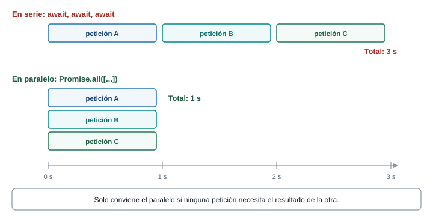{fig-alt="Tres peticiones de un segundo en serie tardan tres segundos y en paralelo con Promise.all tardan uno"}
:::

```js
const lento = () =>
  fetch("https://dummyjson.com/products?limit=1&select=title&delay=1000").then((r) => r.json());

let t0 = performance.now();
await lento();
await lento();
await lento();
console.log("en serie:", Math.round(performance.now() - t0), "ms");

t0 = performance.now();
await Promise.all([lento(), lento(), lento()]);
console.log("en paralelo:", Math.round(performance.now() - t0), "ms");
```

```text
en serie: 3303 ms
en paralelo: 1332 ms
```

(Los números varían con tu conexión; la proporción no.) `delay=1000` es un parámetro de la API de
práctica que retrasa la respuesta un segundo. `Promise.all` recibe una lista de promesas, las
espera todas a la vez y se cumple con la lista de resultados en el mismo orden. Úsalo solo cuando
ninguna petición necesita el resultado de otra.

`Promise.all` es **todo o nada**: si una promesa se rechaza, rechaza de inmediato, aunque las otras
sigan en curso. Cuando quieras el resultado de todas aunque alguna falle, usa `Promise.allSettled`:

```js
const resultados = await Promise.allSettled([obtenerProducto(1), obtenerProducto(999999)]);
console.log(resultados.map((r) => r.status));
```

```text
[ 'fulfilled', 'rejected' ]
```

::: {.callout-tip}
## Reto 5. Arregla el catálogo

Esta función debería devolver los títulos de los productos 1, 2 y 3, pero devuelve una lista de
promesas. Encuentra la causa y corrígela para que las tres peticiones se hagan **a la vez**:

```js
async function titulos() {
  const ids = [1, 2, 3];
  const productos = ids.map((id) => obtenerProducto(id));
  return productos.map((p) => p.title);
}
```
:::

::: {.callout-note collapse="true"}
## Solución del Reto 5

`ids.map(...)` devuelve una lista de **promesas**, y las promesas no tienen `title`. Falta esperarlas.
Con `Promise.all` se esperan a la vez:

```js
async function titulos() {
  const ids = [1, 2, 3];
  const productos = await Promise.all(ids.map((id) => obtenerProducto(id)));
  return productos.map((p) => p.title);
}

console.log(await titulos());
```

```text
[
  'Essence Mascara Lash Princess',
  'Eyeshadow Palette with Mirror',
  'Powder Canister'
]
```

Las tres peticiones salen juntas porque `map` las lanza todas antes de que `Promise.all` empiece a
esperar.
:::

### Qué es memoria y qué es razonamiento

Se memorizan las dos reglas de `async/await` y la advertencia: `fetch` no rechaza por un `404`. Se
razona el resto: ¿cuántas esperas hay?, ¿dependen unas de otras?, ¿dónde puede fallar cada una?

### Conexión con el proyecto

Tu función `obtenerCatalogo()` será una función `async` con un `try/catch` alrededor: espera la
petición, revisa `ok`, convierte el cuerpo y devuelve el catálogo. Quien la llame (la parte de la
interfaz) sabrá si salió bien o mal con el mismo `try/catch`.

## Parte 7. Manejo de errores y estados de la interfaz

### El problema

Un panel que solo funciona cuando todo sale bien no sirve. La conexión de un productor en una vereda
se cae, el servidor responde `503` en horas pico, la API cambia un campo. Si tu código no prevé esos
casos, la persona ve una página en blanco y no sabe qué hacer. Esta parte trata dos preguntas: qué
puede fallar y qué ve la persona en cada caso.

::: {.callout-tip}
## Predice antes de seguir

Tu panel hace `fetch` del catálogo. Lista todas las cosas que pueden pasar, desde que se hace la
petición hasta que se pintan las tarjetas, y clasifícalas: ¿cuáles producen una promesa rechazada y
cuáles una respuesta "exitosa" que igual no sirve?
:::

::: {.callout-note collapse="true"}
## Respuesta

**Rechazan la promesa de `fetch`:** sin conexión, dominio que no existe, servidor apagado, bloqueo por
CORS, petición cancelada o con tiempo agotado. **Cumplen la promesa pero no sirven:** `4xx` (petición
inválida, sin permiso, ruta que no existe), `5xx` (falla del servidor). **Rechazan la segunda
promesa:** cuerpo que no es JSON válido. **Funcionan, pero con una sorpresa:** JSON válido con una
forma distinta de la esperada (falta `products`), o una lista que llegó vacía.
:::

### Modelo mental: cuatro estados de la interfaz

Mientras tu panel pide datos, la interfaz está en **uno solo** de cuatro estados:

::: {.diagrama}
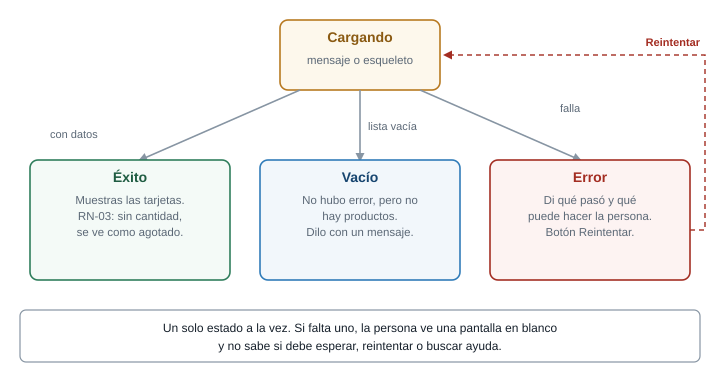{fig-alt="La interfaz pasa por cargando y de allí a éxito con datos, vacío o error, y el botón reintentar vuelve a cargando"}
:::

| Estado | Cuándo | Qué muestra |
|---|---|---|
| Cargando | Se envió la petición y no hay respuesta | Un mensaje o un esqueleto |
| Éxito | Llegaron datos | Las tarjetas. RN-03: sin cantidad, se ve **agotado** |
| Vacío | Llegó bien, pero la lista está vacía | Un mensaje que lo diga |
| Error | Algo falló | Qué pasó, qué puede hacer la persona, y un botón para reintentar |

Distinguir "vacío" de "error" importa: "No tienes productos publicados" invita a publicar uno,
mientras "No se pudo cargar" invita a reintentar. Si los mezclas, un productor con el catálogo
vacío creería que perdió sus datos.

La forma más simple de no olvidar un estado es **guardarlo en una variable** y que el `render` sea una
función que solo mira esa variable. Es el patrón de estado y render que ya usaste en la Semana 7:

```js
const estado = {
  fase: "cargando", // "cargando" | "error" | "listo"
  productos: [],
  error: null,
};
```

`fase` toma un solo valor a la vez. "Vacío" no necesita una fase propia: es la fase `listo` con
`productos.length === 0`.

### Un tipo de error propio, para saber qué falló

El `catch` recibe errores de tipos distintos (`TypeError`, `SyntaxError`, el `Error` que lanzas tú)
y necesita decidir **qué mensaje mostrar** y **si vale la pena reintentar**. Conviene unificarlos
en un solo tipo, con una etiqueta que diga de qué clase es:

```js
class ErrorApi extends Error {
  constructor(mensaje, tipo, estado = null) {
    super(mensaje);
    this.name = "ErrorApi";
    this.tipo = tipo;     // "red" | "tiempo" | "http" | "formato"
    this.estado = estado; // código HTTP, solo para tipo "http"
  }
}
```

- `class ErrorApi extends Error` crea un error propio que **hereda** de `Error`: sigue teniendo
  `message` y `stack`.
- `super(mensaje)` inicializa la parte heredada.
- `tipo` y `estado` son las dos propiedades nuevas que la interfaz y el reintento usarán.

### Los cuatro modos de fallar, uno por uno

**1. Sin conexión o servidor inaccesible (`tipo: "red"`).** `fetch` rechaza con `TypeError: Failed
to fetch`. Para probarlo sin desconectar el cable, en DevTools, pestaña Network, cambia el menú
*No throttling* a **Offline**. Es el mismo mensaje que produce un bloqueo por CORS, así que para
distinguirlos hay que mirar la consola (Parte 8).

**2. Tiempo agotado (`tipo: "tiempo"`).** Una petición que nunca responde deja la interfaz en
"Cargando..." para siempre. La solución es fijar un tiempo máximo con **`AbortSignal.timeout`**:

```js
try {
  const respuesta = await fetch("https://dummyjson.com/products?limit=1&delay=3000", {
    signal: AbortSignal.timeout(500),
  });
} catch (error) {
  console.log(error.name, "-", error.message);
}
```

```text
TimeoutError - signal timed out
```

- `AbortSignal.timeout(500)` crea una **señal** que se activa sola a los 500 ms.
- La opción `signal` de `fetch` le dice "cancela la petición si esta señal se activa".
- `delay=3000` hace que la API de práctica responda a los 3 segundos, para provocar el caso.
- Al activarse, `fetch` rechaza con un error cuyo `name` es `TimeoutError`.

Para cancelar **por decisión tuya** (por ejemplo, la persona escribió otra búsqueda y ya no te
interesa la anterior) se usa un `AbortController`:

```js
const controlador = new AbortController();
const promesa = fetch("https://dummyjson.com/products?delay=2000", {
  signal: controlador.signal,
});
controlador.abort();
try {
  await promesa;
} catch (error) {
  console.log(error.name, "-", error.message);
}
```

```text
AbortError - signal is aborted without reason
```

Dos nombres distintos, dos situaciones distintas: `TimeoutError` es "se acabó el tiempo" y
`AbortError` es "alguien canceló". Tu `catch` debe poder diferenciarlos, porque una cancelación
voluntaria no es un error que deba mostrarse a la persona.

**3. Respuesta con estado de error (`tipo: "http"`).** La petición se completó y el servidor dijo
"no". El código `4xx` o `5xx` queda en `estado`. Se prueba con la ruta de práctica
`https://dummyjson.com/http/503`, que responde exactamente ese código.

**4. Cuerpo que no es JSON válido, o con otra forma (`tipo: "formato"`).** `response.json()` rechaza
con `SyntaxError`, o el JSON es válido pero no trae la lista esperada. Para lo primero, una prueba
fácil es pedir una página HTML en lugar de una API (`fetch("index.html")` y luego `.json()`):

```text
SyntaxError: Unexpected token '<', "<!DOCTYPE "... is not valid JSON
```

Lo segundo se valida a mano: `if (!Array.isArray(datos.products)) throw new ErrorApi(...)`. Nunca
asumas que la API te envía lo que prometió.

### Una función que lo reúne todo

Estos cuatro modos se atienden **una vez**, en una función que usarán todas las peticiones:

```js
async function pedirJSON(ruta, opciones = {}) {
  let respuesta;
  try {
    respuesta = await fetch(URL_BASE + ruta, {
      ...opciones,
      signal: AbortSignal.timeout(TIEMPO_MAXIMO_MS),
    });
  } catch (error) {
    if (error.name === "TimeoutError") {
      throw new ErrorApi("La API tardó demasiado en responder.", "tiempo");
    }
    throw new ErrorApi("No hay conexión con el servidor.", "red");
  }

  if (!respuesta.ok) {
    throw new ErrorApi(`El servidor respondió ${respuesta.status}.`, "http", respuesta.status);
  }

  try {
    return await respuesta.json();
  } catch {
    throw new ErrorApi("La respuesta no es un JSON válido.", "formato");
  }
}
```

Línea por línea:

- `let respuesta;` se declara **fuera** del `try` para poder usarla después. Una variable declarada
  con `const` dentro de un bloque no existe fuera de él.
- El primer `try/catch` envuelve **solo** el `fetch`: cualquier cosa que falle aquí es un problema
  de red o de tiempo, nunca de HTTP. `{ ...opciones, signal: ... }` copia las opciones que pase quien
  llame (método, encabezados, cuerpo) y agrega la señal de tiempo.
- `if (!respuesta.ok)` es la revisión que `fetch` no hace por ti. Aquí nace el error de tipo `http`.
- El segundo `try/catch` envuelve **solo** `respuesta.json()`: si falla, el cuerpo no era JSON.
  `catch {` sin paréntesis es válido cuando no necesitas la variable del error.
- Los mensajes están escritos para **la persona**, en español claro, sin tecnicismos. El mensaje
  técnico queda en `console.error` para quien depure.

### Reintento con espera creciente

No todo fallo merece un reintento. Un `503` puede resolverse en segundos; un `404` no cambiará por
volver a pedirlo.

::: {.diagrama}
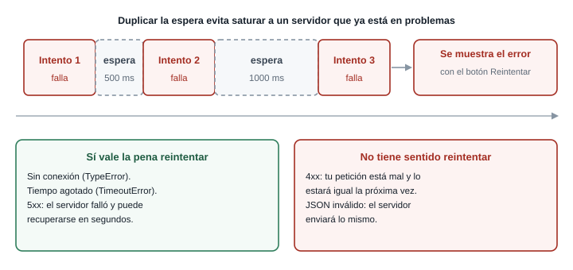{fig-alt="Tres intentos que fallan con esperas de 500 y 1000 milisegundos entre ellos y luego el error final con botón de reintentar"}
:::

La estrategia habitual es la **espera creciente** (*exponential backoff*): esperar más después de
cada fallo. Si un servidor está sobrecargado, miles de clientes reintentando cada medio segundo lo
hunden más. Con la espera duplicada, los reintentos se distancian.

```js
const esperar = (ms) => new Promise((resolver) => setTimeout(resolver, ms));

async function conReintentos(tarea, intentos = 3, esperaBaseMs = 500) {
  for (let n = 1; n <= intentos; n++) {
    try {
      return await tarea();
    } catch (error) {
      const sePuedeReintentar =
        error.tipo === "red" ||
        error.tipo === "tiempo" ||
        (error.tipo === "http" && error.estado >= 500);
      if (!sePuedeReintentar || n === intentos) throw error;
      const espera = esperaBaseMs * 2 ** (n - 1);
      console.warn(`Intento ${n} falló (${error.message}) Reintento en ${espera} ms.`);
      await esperar(espera);
    }
  }
}
```

- `esperar(ms)` convierte un `setTimeout` en una promesa que se cumple pasado ese tiempo, de modo que
  se puede usar con `await`. Es la forma habitual de "dormir" sin bloquear el hilo.
- `tarea` es **una función** que hace la petición, no la petición ya hecha. Hay que poder volver a
  ejecutarla en cada intento.
- `for` con `await` dentro **sí** espera, a diferencia de `forEach`: cada vuelta ocurre después de la
  anterior.
- `sePuedeReintentar` solo es verdadero para red, tiempo agotado y `5xx`.
- Si no se puede reintentar, o ya fue el último intento, se relanza el error con `throw error` y
  sube a quien llamó.
- `2 ** (n - 1)` produce 1, 2, 4...: las esperas son 500, 1000, 2000 ms.

Se usa pasándole la petición envuelta en una función flecha:

```js
const datos = await conReintentos(() => pedirJSON("/http/503"));
```

Con la ruta de práctica que siempre responde `503`, la consola muestra:

```text
Failed to load resource: the server responded with a status of 503 ()
Intento 1 falló (El servidor respondió 503.) Reintento en 500 ms.
Failed to load resource: the server responded with a status of 503 ()
Intento 2 falló (El servidor respondió 503.) Reintento en 1000 ms.
Failed to load resource: the server responded with a status of 503 ()
```

Las líneas `Failed to load resource` las escribe el propio navegador por cada respuesta con error. Tras el
tercer intento, `conReintentos` relanza el `ErrorApi` con el mensaje `El servidor respondió 503.`
(el tipo es `http` y el estado `503`) y la función que lo llamó recibe el rechazo. En total pasan
unos 1500 ms entre el primer y el último intento por las dos esperas.

::: {.callout-tip}
## Para pensar

Si reintentas automáticamente un `POST` que crea un pedido, y la primera petición **sí llegó** pero
la respuesta se perdió, ¿qué podría ocurrir? ¿Por qué el reintento automático es más seguro con
`GET`?
:::

::: {.callout-note collapse="true"}
## Respuesta

Se podría crear el pedido **dos veces**. Un `GET` solo lee, así que repetirlo no cambia nada; un `POST`
crea, y repetirlo duplica el efecto. Por eso en el taller el reintento automático se aplica a la
lectura del catálogo, y la publicación de un producto muestra el error y deja que la persona decida.
:::

### Errores frecuentes

- **Un `catch` vacío o que solo hace `console.log`.** El error desaparece para la persona: la
  interfaz sigue en "Cargando..." y nadie sabe por qué. Todo `catch` debe cambiar el estado de la
  interfaz.
- **Mensajes técnicos al usuario.** `TypeError: Failed to fetch` no le dice nada a un productor. Un
  texto como "No hay conexión con el servidor" sí.
- **No reiniciar el estado.** Al pulsar "Reintentar", la interfaz debe volver a `cargando` y limpiar
  el error anterior, o mostrará el mensaje viejo junto al nuevo intento.
- **No distinguir vacío de error**, como ya viste.

### Conexión con el proyecto

RN-01 dice que un producto no puede publicarse sin precio y sin cantidad. Esa regla se valida **dos
veces**: en el frontend, para avisar rápido y junto al campo, y en el backend, para que no se pueda
saltar. Cuando el backend ASP.NET exista, responderá `400` con el campo que falta, y tu código lo
mostrará con el mismo mecanismo que acabas de armar: un error tipo `http`, con su estado, que la
interfaz traduce a un mensaje junto al campo.

## Parte 8. CORS

### El problema

Tu panel funciona en `http://localhost:8921` y la API vive en `https://dummyjson.com`. Dos orígenes
distintos. Un día cambias la URL de la API por la de otro servicio y todo se rompe, con un error
rojo larguísimo en la consola que no dice "tu código está mal". ¿Qué falló, y dónde?

::: {.callout-tip}
## Predice antes de seguir

Pides `fetch("https://example.com/")` desde tu panel en `localhost`. Tu código está bien escrito y
el servidor de `example.com` funciona y responde `200`. ¿La promesa se cumple, se rechaza o se queda
colgada? Y si el servidor sí respondió, ¿quién impide que tu código vea la respuesta?
:::

::: {.callout-note collapse="true"}
## Respuesta

La promesa **se rechaza** con `TypeError: Failed to fetch`. El servidor sí respondió, pero **el
navegador** descartó la respuesta antes de dártela, porque ese servidor no declaró que aceptara
peticiones desde tu origen. El bloqueo ocurre en el navegador, no en el servidor ni en tu código.
:::

### Modelo mental: origen y política del mismo origen

Un **origen** es la combinación de **esquema + host + puerto**. Si cualquiera de los tres cambia, es
otro origen.

::: {.diagrama}
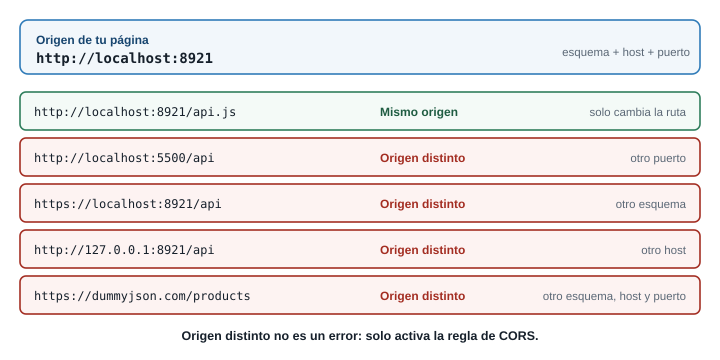{fig-alt="Comparación de varias URL contra el origen http://localhost:8921, que muestra cuáles son del mismo origen y cuáles no"}
:::

Por defecto, el navegador aplica la **política del mismo origen** (*same-origin policy*): un script
cargado desde un origen **no puede leer** respuestas de otro origen. Es una protección: sin ella, una
página maliciosa abierta en otra pestaña podría pedir, con tu sesión iniciada, los datos de tu
banco y leerlos.

El problema es que esa política también bloquea usos legítimos, como un frontend en un origen y una
API en otro. **CORS** (*Cross-Origin Resource Sharing*) es el mecanismo para **relajar** la política
de forma controlada: el **servidor** declara, con encabezados, qué orígenes tienen permiso de leer
sus respuestas.

La pieza clave es esta:

- El **navegador** envía en la petición el encabezado `Origin` con el origen de tu página.
- El **servidor** responde con `Access-Control-Allow-Origin`, que dice a qué origen autoriza
  (`*` significa cualquiera, o un origen concreto).
- El **navegador** compara. Si el permiso está y coincide, entrega la respuesta a tu código. Si falta
  o no coincide, **la descarta** y rechaza la promesa.

Quien decide es el servidor. Quien hace cumplir la regla es el navegador.

### Solicitud simple y preflight

No todas las peticiones cruzadas se tratan igual.

::: {.diagrama}
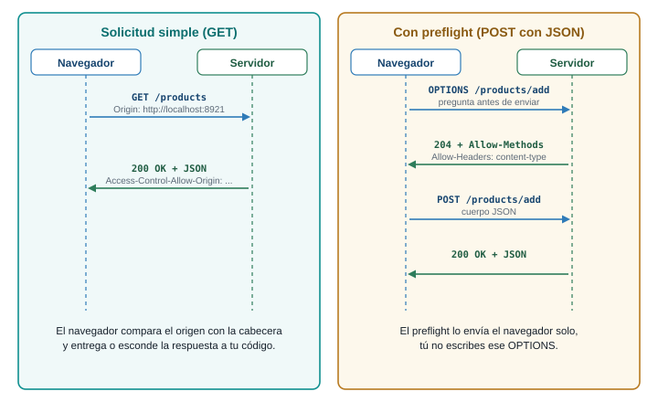{fig-alt="A la izquierda una solicitud GET simple con una sola ida y vuelta; a la derecha una solicitud POST con JSON que primero envía un OPTIONS de preflight"}
:::

Una **solicitud simple** (por ejemplo, un `GET` con los encabezados por defecto) se envía directo y el
navegador revisa la respuesta. Una petición que **podría cambiar datos en el servidor** o usa
encabezados fuera de lo común se considera riesgosa, y antes de enviarla el navegador manda una
**solicitud de preflight**: una petición `OPTIONS` automática que pregunta "¿aceptas un `POST` con este
tipo de contenido desde este origen?". Si el servidor responde que sí (con
`Access-Control-Allow-Methods` y `Access-Control-Allow-Headers`), el navegador envía la petición real.

Esto explica algo que sorprende: un `POST` con `Content-Type: application/json` **sí** dispara
preflight, porque `application/json` no está entre los tipos "simples" (`text/plain`,
`multipart/form-data` y `application/x-www-form-urlencoded`). En tu panel, publicar un producto
produce dos peticiones en Network, y la primera la hizo el navegador sin que lo pidieras.

### Cómo se ve cuando falla

Esto fue lo que mostró la consola de Chrome al pedir `https://example.com/`, un servidor que no
envía el encabezado:

```text
Access to fetch at 'https://example.com/' from origin 'http://localhost:8921' has been blocked by
CORS policy: No 'Access-Control-Allow-Origin' header is present on the requested resource.
```

Y en tu código, lo único que recibes es el `TypeError: Failed to fetch` sin detalle. **La información
está en la consola, no en el error de JavaScript.** Si el fallo ocurre en el preflight, el mensaje
cambia así:

```text
Access to fetch at 'https://example.com/' from origin 'http://localhost:8921' has been blocked by
CORS policy: Response to preflight request doesn't pass access control check: No
'Access-Control-Allow-Origin' header is present on the requested resource.
```

En la pestaña **Network** verás la petición en rojo, sin respuesta legible, y para un preflight
fallido una línea `OPTIONS` aparte (al probarlo con `example.com`, ese `OPTIONS` terminó en `405`).

### Qué se arregla en el frontend y qué no

**No se arregla desde el frontend.** El permiso lo concede el servidor. Ningún cambio en tu
JavaScript hace que un servidor te autorice. Estos "arreglos" que circulan **no sirven o son
peligrosos**:

- Agregar `Access-Control-Allow-Origin` a *tus* peticiones. Ese encabezado es de **respuesta**; ponerlo
  en la petición no concede nada y, como es un encabezado fuera de lo común, provoca un preflight.
- `fetch(url, { mode: "no-cors" })`. La petición sale, pero la respuesta queda **opaca**: no puedes
  leer ni el estado ni el cuerpo. No resuelve el problema, solo calla el error.
- Extensiones del navegador que desactivan CORS. Solo funcionan en tu computador y esconden el
  problema real que tendrán tus usuarios.

**Sí se arregla** del lado del servidor, o evitando el cruce de orígenes:

1. **Usar una API que ya habilite tu origen**, como `dummyjson.com`.
2. **Configurar CORS en tu propio backend.** Cuando el servidor sea tuyo (el de ASP.NET Core de las
   Semanas 10 a 13), le indicas qué orígenes aceptas.
3. **Servir frontend y API desde el mismo origen**, caso en el que CORS ni se activa.

::: {.callout-tip}
## Reto 6. Diagnostica sin ejecutar

En tres casos distintos, tu consola muestra `TypeError: Failed to fetch`. Para cada uno di si es CORS
o no, y qué mirarías:

1. Tu panel está en `http://localhost:8921` y pide `http://localhost:5000/api/productos`, un servidor
   propio que arrancaste hoy.
2. Estás sin internet y pides `https://dummyjson.com/products`.
3. Pides `https://dummyjson.com/products` y la consola no muestra ningún mensaje que hable de CORS.
:::

::: {.callout-note collapse="true"}
## Solución del Reto 6

1. **Probablemente sí es CORS.** El puerto es distinto (8921 y 5000), así que son orígenes distintos.
   Mira la consola: debería aparecer el mensaje `has been blocked by CORS policy`. La solución es
   configurar CORS en ese servidor.
2. **No es CORS.** Sin internet no hay conexión con el servidor. Mira la barra de estado de la red
   y la pestaña Network: la petición aparece fallida y sin respuesta. El mensaje es igual, pero la
   consola no menciona CORS.
3. **Todavía no sabes.** Sin mensaje de CORS en la consola, la causa es otra: red, DNS o una URL
   imposible de resolver. Descartar CORS leyendo la consola es el primer paso del diagnóstico.
:::

### Conexión con el proyecto

Cuando integres el frontend con el backend de las Semanas 10 a 13, este es el choque que ocurrirá
primero: tu panel en un origen y la API en otro. Saber que la solución es del lado del servidor te
ahorra horas buscando el error en tu JavaScript.

## Parte 9. Seguridad al pintar datos de una API

### El problema

Los datos de una API son datos **de afuera**. Hoy confías en `dummyjson.com`, pero mañana el nombre
de un producto lo escribirá un productor desconocido. Si tu panel pinta ese nombre con la
herramienta equivocada, el nombre puede ser código.

::: {.callout-tip}
## Predice antes de seguir

Un productor registra un producto con este nombre:

```text

```

Tu panel lo pinta con `tarjeta.innerHTML = producto.nombre`. Después otro productor lo pinta con
`tarjeta.textContent = producto.nombre`. ¿Qué ve cada persona al abrir el catálogo?
:::

::: {.callout-note collapse="true"}
## Respuesta

Con `innerHTML`, el navegador **interpreta el texto como HTML**: crea un elemento `img`, la imagen
`x` no existe, falla, y se ejecuta el código del atributo `onerror`: aparece una alerta. Con
`textContent`, el navegador trata todo como **texto** y muestra literalmente
``, sin ejecutar nada.
:::

### Modelo mental: texto contra HTML

::: {.diagrama}
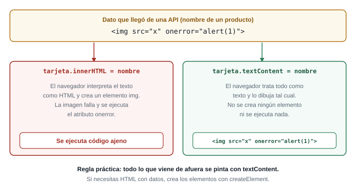{fig-alt="Un dato con una etiqueta img maliciosa se interpreta y ejecuta con innerHTML, pero se muestra como texto con textContent"}
:::

`innerHTML` convierte un **texto en estructura**: lo que parezca una etiqueta se vuelve un elemento.
`textContent` solo asigna **texto**. Cuando el dato viene de afuera, convertirlo en estructura es
entregarle a su autor la posibilidad de ejecutar código en tu página. Ese ataque se llama **XSS**
(*cross-site scripting*), y con ese código el atacante podría leer lo que hay en la página, o
redirigir a la persona. MDN lo explica en su página de `innerHTML` y recomienda `textContent` cuando
el contenido debe ser texto.

El ejemplo de arriba usa un `alert`, inofensivo a propósito. Un ataque real haría algo menos visible.

### El mecanismo: dos formas de pintar

```js
const nombre = ''; // dato que "vino de la API"

const insegura = document.createElement("h3");
insegura.innerHTML = nombre;          // se interpreta como HTML

const segura = document.createElement("h3");
segura.textContent = nombre;          // se trata como texto

document.body.append(insegura, segura);
```

Con `innerHTML` se ejecuta el `alert`. Con `textContent` aparece el texto tal cual. El panel del taller
construye cada tarjeta con `document.createElement` y asigna **todo** con `textContent`, incluso lo
que "parece" seguro, como un precio.

Si en algún caso necesitas armar HTML con datos, crea los elementos uno por uno con `createElement`
y `append` en vez de concatenar texto dentro de `innerHTML`. Es más largo, pero no hay una puerta
por donde se cuele código.

::: {.callout-warning}
## Las plantillas de texto no lo arreglan

Una línea como ``tarjeta.innerHTML = `<h3>${producto.nombre}</h3>` `` parece inocente porque se ve
ordenada, pero es exactamente el mismo problema: `producto.nombre` entra al HTML como texto
interpretable. Que el código se vea limpio no lo hace seguro.
:::

### Los secretos no van en el frontend

La otra regla de esta parte es más corta: **todo lo que está en tu JavaScript lo puede leer
cualquiera**. Cualquier visitante abre DevTools, entra a la pestaña **Sources** o revisa en
**Network** los encabezados de cada petición. Si pones una llave secreta de una API en tu `app.js`
(`const LLAVE = "sk-...";`) o en un encabezado `Authorization` fijo, ya no es secreta.

- La API de esta guía **no pide llave**, a propósito.
- Si una API exige llave, esa llave se usa **desde el backend**: tu frontend le pide al backend, y el
  backend le pide a la API con la llave guardada. Por eso la cadena de conexión y las credenciales del
  proyecto viven en variables de entorno o en el administrador de secretos de .NET, nunca en el
  repositorio (requisito de seguridad del proyecto).
- No subas llaves a GitHub: aunque las borres después, quedan en el historial de Git.

Lo que el frontend sí puede guardar es un **token de sesión** temporal que el backend entrega
después de que la persona inicia sesión. Ese tema llega con la autenticación del proyecto.

::: {.callout-tip}
## Reto 7. Encuentra el agujero

Revisa este fragmento del panel. ¿Qué tiene de peligroso y cómo lo corriges?

```js
function pintar(productos) {
  const lista = document.getElementById("lista");
  lista.innerHTML = productos
    .map((p) => `<article><h3>${p.nombre}</h3><p>${p.cantidad} disponibles</p></article>`)
    .join("");
}
```
:::

::: {.callout-note collapse="true"}
## Solución del Reto 7

`p.nombre` se inserta dentro de un texto HTML y se interpreta: si el nombre contiene una etiqueta,
se ejecuta. Se corrige construyendo los elementos y asignando con `textContent`:

```js
function pintar(productos) {
  const lista = document.getElementById("lista");
  lista.replaceChildren(
    ...productos.map((p) => {
      const tarjeta = document.createElement("article");
      const titulo = document.createElement("h3");
      titulo.textContent = p.nombre;
      const cantidad = document.createElement("p");
      cantidad.textContent = `${p.cantidad} disponibles`;
      tarjeta.append(titulo, cantidad);
      return tarjeta;
    })
  );
}
```

`replaceChildren` vacía la lista y agrega las tarjetas nuevas. Fíjate que `${p.cantidad}` queda en
una plantilla de texto, pero se asigna con `textContent`, no con `innerHTML`: la plantilla en sí
no era el problema, sino adónde se asignaba.
:::

### Conexión con el proyecto

En el panel del taller, todo lo que viene de la API (nombre, categoría, precio) se pinta con
`textContent`. El requisito de seguridad del proyecto dice que ninguna credencial se guarda en el
código fuente; hoy no la necesitas, y cuando la necesites vivirá en el backend.

## Parte 10. DevTools: la pestaña Network

### El problema

Una petición falla y no sabes por qué. Cambiar el código al azar hasta que funcione es lento y rara
vez enseña algo. La pestaña **Network** de DevTools muestra **exactamente** qué se envió y qué volvió,
y por eso es la primera herramienta que debes abrir, antes de tocar una sola línea de tu código.

::: {.callout-tip}
## Predice antes de seguir

Tu panel muestra "No se pudo cargar el catálogo" y no sabes por qué. Sin mirar el código, ¿qué cuatro
datos de la petición necesitas ver para saber **dónde** está el problema?
:::

::: {.callout-note collapse="true"}
## Respuesta

(1) **A qué URL** se hizo la petición: puede estar mal escrita. (2) **Qué estado** respondió el
servidor, o si no respondió. (3) **Qué encabezados** salieron y volvieron (el `Content-Type`, el
`Authorization`, el `access-control-allow-origin`). (4) **Qué cuerpo** llegó: puede ser un JSON con un
mensaje de error, o una página HTML. Network muestra los cuatro.
:::

### Un recorrido por el panel

::: {.diagrama}
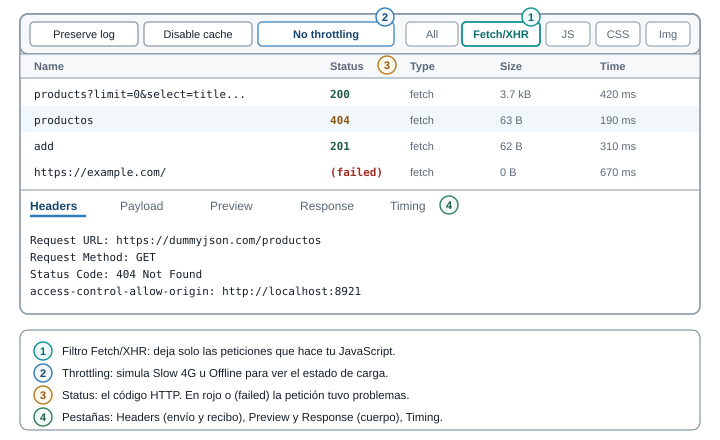{fig-alt="La pestaña Network con su barra de filtros, la lista de peticiones y las pestañas Headers, Payload, Preview, Response y Timing"}
:::

1. **Abre DevTools** (F12), pestaña **Network**. Marca **Preserve log** para conservar la lista al
   recargar y deja visible la cuadrícula de peticiones.
2. **Filtra** con **Fetch/XHR** para ver solo las peticiones de tu JavaScript y no las hojas de estilo
   ni las imágenes.
3. **Recarga** la página (F5) y la lista se llena. Cada fila es una petición, con columnas **Name**,
   **Status**, **Type**, **Size** y **Time**.
4. **Haz clic** en una fila. A la derecha se abre el detalle, con estas pestañas:

| Pestaña | Qué muestra | Para qué sirve |
|---|---|---|
| **Headers** | URL, método, estado, y los encabezados de la petición y de la respuesta | Confirmar la URL exacta y el `Content-Type`; ver si hay `Authorization` |
| **Payload** | Lo que enviaste en el cuerpo o en el query string | Verificar que un `POST` lleva el JSON que crees |
| **Preview** | El cuerpo ya interpretado, con JSON desplegable | Explorar la forma de la respuesta |
| **Response** | El cuerpo tal como llegó, en texto | Ver si llegó HTML en lugar de JSON |
| **Timing** | Cuánto tardó cada fase | Saber si lo lento es la espera del servidor o la descarga |

### Throttling: probar con mala conexión

El menú **No throttling** de la parte superior del panel simula conexiones lentas (*Slow 4G*) o
ninguna conexión (*Offline*). Es la forma de ver tus estados de carga y de error sin esperar a que
la red falle sola. Con *Slow 4G*, el estado "Cargando..." de tu panel se ve durante más de un
instante; con *Offline*, la petición falla de inmediato y debes ver el estado de error con su botón
de reintento. Una advertencia: *Offline* también bloquea la recarga de páginas `localhost`; actívalo
**después** de cargar la página y pulsa *Reintentar* desde la interfaz, no con F5.

Otras opciones útiles del panel: **Disable cache** (no usar la caché del navegador, para ver
siempre la respuesta completa; al recargar con caché, a veces verás `304 Not Modified`, que significa
"lo que tienes sigue vigente") y *Block request URL* (clic derecho sobre una petición) para simular
que una dirección concreta deja de responder.

### Método de diagnóstico: cuatro pasos

Cuando algo falla, sigue siempre el mismo orden. Es más rápido que improvisar:

1. **Reproducir.** Provoca el fallo de forma repetible. Si no lo repites, no sabes si lo arreglaste.
2. **Aislar.** Decide en qué tramo está: ¿la petición ni siquiera salió?, ¿salió y el servidor
   respondió mal?, ¿respondió bien y tu código lo procesó mal? Network responde las dos primeras
   preguntas; la consola, la tercera.
3. **Formular una hipótesis.** "El estado es 404, así que la URL está mal escrita." Una hipótesis
   concreta, que se pueda confirmar o descartar.
4. **Comprobar con DevTools.** Mira el dato que la confirma o la contradice (la URL en Headers, el
   cuerpo en Response). Cambia **una** cosa y repite.

### Tabla de diagnóstico

| Síntoma | Dónde mirar | Causa más probable | Qué hacer |
|---|---|---|---|
| Estado **404** | Headers: *Request URL* | La ruta está mal escrita o el recurso no existe | Compara la URL con la documentación, letra por letra |
| Estado **401** | Headers: *Request Headers*; Response: el mensaje | Falta el encabezado `Authorization` o el token venció | Revisa cómo se obtiene y envía el token (con `dummyjson.com/auth/me` el cuerpo dice `Access Token is required`) |
| Estado **400** | Payload y Response | Lo que enviaste no cumple lo que el servidor espera | Compara tu cuerpo con el contrato; revisa `Content-Type` |
| Estado **5xx** | Response | Falla del servidor | Reintenta más tarde; si es tu backend, mira sus registros |
| Fila roja o `(failed)`, sin Response, y un mensaje de **CORS** en Console | Console | El servidor no autoriza tu origen | La solución es del lado del servidor (Parte 8) |
| `Failed to fetch` y **ningún** mensaje de CORS | Network: ¿hay petición?; barra de red | Sin conexión, dominio inexistente, servidor apagado | Revisa la conexión y la URL base |
| `Unexpected token '<'` | **Response** | Llegó HTML (página de error o ruta equivocada) en lugar de JSON | Corrige la URL; revisa que la ruta devuelva JSON |
| Estado 200 pero la interfaz sigue vacía | **Preview** | La forma del JSON no es la que esperabas (`products` frente a `data`) | Ajusta el adaptador |
| **La petición nunca sale** | Network vacío para esa petición; Console | Error de JavaScript antes del `fetch`, o el código no se ejecuta | Mira el primer error en Console; revisa si la función se llama |
| Se queda en "Cargando..." sin terminar | Network: fila en estado `(pending)` | No hay tiempo máximo y el servidor no responde | Agrega `AbortSignal.timeout` |

Una pista especial sobre "la petición nunca sale": si en Network no aparece ni una fila, el problema
está en **tu código**. Un error de sintaxis, un `import` que falla (por ejemplo, abrir un
módulo desde `file://`) o una función que nunca se llama. La consola tendrá el error rojo
correspondiente.

::: {.callout-tip}
## Reto 8. Diagnostica con la tabla

Escribe, para cada observación, la hipótesis y el siguiente paso:

1. Network muestra una fila `products?limit=0` con estado `200`, pero la pestaña **Preview** muestra
   `{ "items": [...] }` y tu código lee `datos.products`.
2. Network muestra una fila con estado `404` cuando pides `https://dummyjson.com/product/1`.
3. Pulsas "Reintentar", en la consola aparece `ReferenceError: obtenerCatalogo is not defined` y en Network no hay ninguna fila nueva.
:::

::: {.callout-note collapse="true"}
## Solución del Reto 8

1. **Hipótesis:** la API usa otra clave para la lista (`items` en vez de `products`). La petición
   funcionó; el problema está en cómo tu código lee la respuesta. **Siguiente paso:** ajustar la lectura
   (en el taller, en `api.js`) y validar que exista antes de usarla.
2. **Hipótesis:** la ruta está mal escrita. Falta una `s`: la ruta correcta es `/products/1`.
   **Siguiente paso:** corregir y repetir.
3. **Hipótesis:** el código falló **antes** de llegar al `fetch`: a la función le falta un `import` o
   no está definida. Network no registró nada porque la petición nunca salió. **Siguiente paso:**
   leer el primer error rojo de la consola, con su archivo y número de línea, y corregir el
   `import`.
:::

### Conexión con el proyecto

En el taller, cada falla que provoques (ruta inexistente, offline, una petición bloqueada) la verás
en Network **antes** de verla en la interfaz. Esa costumbre, mirar primero la red y después el
código, es la que más tiempo ahorra cuando el backend propio del proyecto empiece a fallar.

## Parte 11. Taller: el panel del productor consume una API

### El problema

Es el momento de juntar todo. El panel del productor de tu proyecto deja de mostrar productos escritos
a mano y muestra el catálogo que le entrega una API: nombre, precio en pesos colombianos, cantidad y
categoría. Debe cargar sin congelar la página, decir qué pasó cuando falla, dejar reintentar, buscar
sin pedir de nuevo los datos y mostrar como **agotado** el producto sin cantidad (RN-03).

::: {.callout-tip}
## Predice antes de seguir

La API entrega `title`, `price` (en dólares), `stock` y `category`. Tu proyecto habla de `nombre`,
`precioCOP`, `cantidad` y `categoria`. Si pintas directamente lo que entrega la API, ¿qué pasa el
día que cambies la API por tu backend ASP.NET, que quizá devuelva `nombre` y `precio`? ¿Dónde
conviene hacer la traducción?
:::

::: {.callout-note collapse="true"}
## Respuesta

Si cada parte de tu código usa `title` y `stock`, tendrás que cambiar **todos** esos sitios cuando la
API cambie. La traducción conviene en **un solo lugar**, una capa que habla con la API y entrega al
resto del panel objetos con la forma del proyecto. Esa capa es el archivo `api.js`. El resto del panel
nunca sabrá cómo se llamaban los campos originales.
:::

### Modelo mental: una capa que aísla

::: {.diagrama}
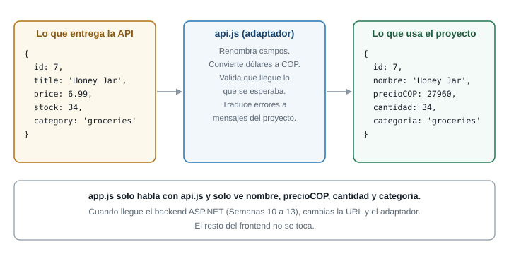{fig-alt="El archivo api.js traduce los campos de la API a los campos del proyecto, y app.js solo conoce los campos del proyecto"}
:::

El panel tendrá cuatro archivos con responsabilidades separadas:

| Archivo | Responsabilidad |
|---|---|
| `index.html` | La estructura: filtros, zona de estado, lista, formulario |
| `estilos.css` | La apariencia |
| `api.js` | Hablar con la API: pedir, revisar errores, reintentar, **traducir** los datos |
| `app.js` | La interfaz: estado, `render`, eventos. No sabe nada de HTTP |

Eso significa que `app.js` no contiene un solo `fetch`. Cuando llegue tu backend, cambiarás `api.js` y
dejarás `app.js` intacto.

La API de práctica es `https://dummyjson.com`: gratuita, sin llave, con CORS habilitado. Se verificó
con peticiones reales antes de escribir esta guía: `GET /products` responde `200` con
`Access-Control-Allow-Origin`, y el catálogo completo tiene 194 productos, de los cuales cuatro
tienen `stock` en cero. Esos cuatro son los que servirán para ver RN-03 en acción.

::: {.callout-warning}
## La API usa dólares y nombres en inglés

Los precios vienen en dólares y los nombres en inglés. En el taller se convierte con una **tasa fija
de 4000** pesos por dólar, solo para la práctica; no es un dato real ni se actualiza. Para tu proyecto
real, tus productos serán los de tu dominio y el precio ya estará en pesos.
:::

### [1]{.paso} Crea la carpeta y sirve el proyecto

Crea una carpeta, por ejemplo `panel-api`, con estos cuatro archivos vacíos: `index.html`,
`estilos.css`, `api.js` y `app.js`. Ábrela en VS Code y sirve la carpeta con Live Server o con
`python -m http.server 8921` (ver el recuadro Antes de empezar). Comprueba en el navegador que
`http://localhost:8921` carga (aunque la página aún esté vacía).

Escribe `index.html`:

```html
<!DOCTYPE html>
<html lang="es">
<head>
  <meta charset="UTF-8">
  <meta name="viewport" content="width=device-width, initial-scale=1.0">
  <title>Panel del productor</title>
  <link rel="icon" href="data:,">
  <link rel="stylesheet" href="estilos.css">
</head>
<body>
  <main class="panel">
    <header class="encabezado">
      <h1>Mi catálogo</h1>
      <p id="resumen" aria-live="polite"></p>
    </header>

    <section class="controles" aria-label="Filtros del catálogo">
      <label>Buscar
        <input id="buscar" type="search" placeholder="Nombre del producto">
      </label>
      <label>Categoría
        <select id="categoria"><option value="">Todas</option></select>
      </label>
      <label class="casilla">
        <input id="soloAgotados" type="checkbox"> Solo agotados
      </label>
    </section>

    <section id="estado" class="estado" aria-live="polite" hidden></section>
    <section id="lista" class="lista"></section>

    <form id="formNuevo" class="nuevo" novalidate>
      <h2>Publicar producto</h2>
      <label>Nombre <input name="nombre" required></label>
      <label>Precio (COP) <input name="precio" type="number" min="0" step="100"></label>
      <label>Cantidad <input name="cantidad" type="number" min="0" step="1"></label>
      <button type="submit">Publicar</button>
      <p id="mensajeForm" aria-live="polite"></p>
    </form>
  </main>
  <script type="module" src="app.js"></script>
</body>
</html>
```

Cuatro decisiones del HTML que conviene entender:

- `<link rel="icon" href="data:,">` evita que el navegador pida `/favicon.ico`, que no existe en tu
  carpeta y llenaría la consola de un `404` que no es un error de tu código.
- `<section id="estado" ... hidden>` es la **zona de estado**: ahí aparecerán "Cargando...", el error y
  el mensaje de vacío. `aria-live="polite"` hace que un lector de pantalla anuncie los cambios.
- `<section id="lista">` es donde se pintarán las tarjetas.
- `<script type="module">` carga `app.js` como **módulo**, lo que permite usar `import` y `export` entre
  archivos. Los módulos exigen un servidor, por eso no funcionan con `file://`.

Escribe `estilos.css`:

```css
:root { --borde: #c9d3dd; --texto: #16202b; --suave: #5b6876; --azul: #17456f; --rojo: #a32d22; }
* { box-sizing: border-box; }
body { margin: 0; font-family: system-ui, sans-serif; color: var(--texto); background: #f6f8fa; }
.panel { max-width: 960px; margin: 0 auto; padding: 1rem; }
.encabezado { display: flex; justify-content: space-between; align-items: baseline; flex-wrap: wrap; gap: .5rem; }
.controles { display: flex; flex-wrap: wrap; gap: 1rem; align-items: end; margin: 1rem 0; }
.controles label, .nuevo label { display: grid; gap: .25rem; font-size: .9rem; }
.controles .casilla { display: flex; align-items: center; gap: .5rem; }
input, select, button { font: inherit; padding: .45rem .6rem; border: 1px solid var(--borde); border-radius: 6px; }
button { background: var(--azul); color: #fff; border-color: var(--azul); cursor: pointer; }
.estado { padding: 1rem; border: 1px solid var(--borde); border-radius: 8px; background: #fff; }
.estado.error { border-color: var(--rojo); background: #fdf3f2; }
.lista { display: grid; grid-template-columns: 1fr; gap: .75rem; margin-top: .75rem; }
@media (min-width: 640px) { .lista { grid-template-columns: repeat(3, 1fr); } }
.tarjeta { background: #fff; border: 1px solid var(--borde); border-radius: 8px; padding: .75rem; }
.tarjeta h3 { margin: 0 0 .25rem; font-size: 1rem; }
.tarjeta p { margin: .15rem 0; color: var(--suave); font-size: .9rem; }
.tarjeta.agotado { opacity: .75; }
.etiqueta { display: inline-block; padding: .1rem .5rem; border-radius: 999px; font-size: .75rem; background: #fdf3f2; color: var(--rojo); border: 1px solid var(--rojo); }
.nuevo { display: grid; gap: .75rem; max-width: 360px; margin-top: 2rem; }
```

El CSS es el de las semanas anteriores: una columna en teléfono (`grid-template-columns: 1fr`) y tres a
partir de 640 px, con la misma estrategia mobile-first que ya conoces. Si tu proyecto usa Bootstrap o
Tailwind, puedes reemplazar este archivo por tus clases; la parte de JavaScript no cambia.

### [2]{.paso} Escribe la capa `api.js`

Empieza con las constantes, el error propio y la función que pide y revisa, que son las que viste en
la Parte 7:

```js
const URL_BASE = "https://dummyjson.com";
const TASA_COP = 4000; // tasa fija solo para la práctica: la API devuelve dólares
const TIEMPO_MAXIMO_MS = 8000;

export class ErrorApi extends Error {
  constructor(mensaje, tipo, estado = null) {
    super(mensaje);
    this.name = "ErrorApi";
    this.tipo = tipo; // "red" | "tiempo" | "http" | "formato"
    this.estado = estado;
  }
}

async function pedirJSON(ruta, opciones = {}) {
  let respuesta;
  try {
    respuesta = await fetch(URL_BASE + ruta, {
      ...opciones,
      signal: AbortSignal.timeout(TIEMPO_MAXIMO_MS),
    });
  } catch (error) {
    if (error.name === "TimeoutError") {
      throw new ErrorApi("La API tardó demasiado en responder.", "tiempo");
    }
    throw new ErrorApi("No hay conexión con el servidor.", "red");
  }

  if (!respuesta.ok) {
    throw new ErrorApi(`El servidor respondió ${respuesta.status}.`, "http", respuesta.status);
  }

  try {
    return await respuesta.json();
  } catch {
    throw new ErrorApi("La respuesta no es un JSON válido.", "formato");
  }
}
```

Observa que solo `ErrorApi` lleva `export`: es lo único que `app.js` necesitaría ver para reconocer
un error de esta capa. `pedirJSON` queda **privada** del módulo: nadie fuera de `api.js` hace un `fetch`.

Agrega a continuación el **adaptador**, la pieza que traduce:

```js
function adaptarProducto(p) {
  return {
    id: p.id,
    nombre: p.title,
    precioCOP: Math.round(p.price * TASA_COP),
    cantidad: p.stock,
    categoria: p.category,
  };
}
```

`adaptarProducto` recibe un producto con la forma de la API y devuelve uno con la forma del
proyecto. `Math.round` evita decimales de peso (por ejemplo, un precio de `9.99` dólares se vuelve
`39960` pesos, no `39960.0000001`). Es la **única** función que conoce las dos formas.

Después, la función de reintento de la Parte 7 y las dos funciones públicas del módulo:

```js
const esperar = (ms) => new Promise((resolver) => setTimeout(resolver, ms));

async function conReintentos(tarea, intentos = 3, esperaBaseMs = 500) {
  for (let n = 1; n <= intentos; n++) {
    try {
      return await tarea();
    } catch (error) {
      const sePuedeReintentar =
        error.tipo === "red" ||
        error.tipo === "tiempo" ||
        (error.tipo === "http" && error.estado >= 500);
      if (!sePuedeReintentar || n === intentos) throw error;
      const espera = esperaBaseMs * 2 ** (n - 1);
      console.warn(`Intento ${n} falló (${error.message}) Reintento en ${espera} ms.`);
      await esperar(espera);
    }
  }
}

export async function obtenerCatalogo(ruta = "/products?limit=0&select=title,price,stock,category") {
  const datos = await conReintentos(() => pedirJSON(ruta));
  if (!Array.isArray(datos.products)) {
    throw new ErrorApi("La respuesta no trae la lista de productos.", "formato");
  }
  return datos.products.map(adaptarProducto);
}

export async function publicarProducto({ nombre, precioCOP, cantidad }) {
  const cuerpo = { title: nombre, price: precioCOP / TASA_COP, stock: cantidad };
  const creado = await pedirJSON("/products/add", {
    method: "POST",
    headers: { "Content-Type": "application/json" },
    body: JSON.stringify(cuerpo),
  });
  return adaptarProducto({ ...cuerpo, id: creado.id, category: "sin-categoria" });
}
```

- `obtenerCatalogo` pide **todos** los productos con `limit=0` y solo los cuatro campos que el panel
  necesita (`select=...`), lo que reduce la respuesta sin comprimir de unos 300 kB a unos 17 kB. Recibe la ruta como parámetro con un valor por defecto, para poder probar rutas
  distintas desde la consola.
- Envuelve la petición en `conReintentos`: un fallo de red o un `5xx` se reintenta; un `404` no.
- `Array.isArray(datos.products)` valida la forma antes de usarla. Si la API cambiara y devolviera
  otra clave, el error sería un `ErrorApi` de tipo `formato`, claro y atendible, y no un
  `Cannot read properties of undefined` en medio del `render`.
- `publicarProducto` hace el camino **inverso** al adaptador: convierte los pesos a dólares para
  enviarle a la API lo que espera, con `POST`, el encabezado de contenido y el cuerpo en JSON. Devuelve
  el producto ya con la forma del proyecto, con el `id` que asignó el servidor.
- Los productos publicados no tienen categoría en esta API de práctica, por eso se les asigna el
  valor `"sin-categoria"`.

### [3]{.paso} Escribe el estado y el `render` en `app.js`

Primero el estado, los atajos y el filtrado:

```js
import { obtenerCatalogo, publicarProducto } from "./api.js";

const estado = {
  fase: "cargando", // "cargando" | "error" | "listo"
  productos: [],
  error: null,
  busqueda: "",
  categoria: "",
  soloAgotados: false,
};

const $ = (id) => document.getElementById(id);
const pesos = new Intl.NumberFormat("es-CO", {
  style: "currency",
  currency: "COP",
  maximumFractionDigits: 0,
});

function productosVisibles() {
  const texto = estado.busqueda.trim().toLowerCase();
  return estado.productos.filter(
    (p) =>
      p.nombre.toLowerCase().includes(texto) &&
      (estado.categoria === "" || p.categoria === estado.categoria) &&
      (!estado.soloAgotados || p.cantidad === 0)
  );
}
```

- `import { ... } from "./api.js"` trae las dos funciones públicas. La ruta lleva `./` porque es
  relativa a este archivo.
- `estado` es **la única fuente de verdad**: la interfaz se dibuja a partir de este objeto. Tiene tres
  fases (`cargando`, `error`, `listo`), los datos, el error actual y los tres filtros.
- `$` es solo un nombre corto para `document.getElementById`.
- `Intl.NumberFormat("es-CO", ...)` formatea los pesos con el punto de miles de Colombia
  (`39960` se muestra como `$ 39.960`). Es una herramienta del propio navegador, sin librerías.
- `productosVisibles` aplica los tres filtros **sobre los datos que ya están en memoria**, con el
  `filter` de la Semana 7. Los tres se combinan con `&&`: un producto debe cumplir todos.

Ahora la función que crea una tarjeta, con la regla RN-03:

```js
function crearTarjeta(p) {
  const tarjeta = document.createElement("article");
  tarjeta.className = "tarjeta" + (p.cantidad === 0 ? " agotado" : "");

  const titulo = document.createElement("h3");
  titulo.textContent = p.nombre;

  const precio = document.createElement("p");
  precio.textContent = pesos.format(p.precioCOP);

  const cantidad = document.createElement("p");
  cantidad.textContent = `Disponible: ${p.cantidad}`;

  const categoria = document.createElement("p");
  categoria.textContent = p.categoria;

  tarjeta.append(titulo, precio, cantidad, categoria);

  if (p.cantidad === 0) {
    const etiqueta = document.createElement("span");
    etiqueta.className = "etiqueta";
    etiqueta.textContent = "Agotado";
    tarjeta.append(etiqueta);
  }
  return tarjeta;
}
```

- Cada texto se asigna con **`textContent`**: lo que venga de la API nunca se interpreta como HTML
  (Parte 9).
- La regla **RN-03** son dos líneas: `p.cantidad === 0` agrega la clase `agotado` (atenúa la tarjeta)
  y una etiqueta visible "Agotado". El producto **no se oculta**: se muestra, como pide la regla.
- La etiqueta es texto, no solo color: la persona la lee aunque no distinga colores (requisito
  de accesibilidad del proyecto).

### [4]{.paso} Los cuatro estados en `render`

```js
function render() {
  const caja = $("estado");
  const lista = $("lista");
  lista.replaceChildren();
  caja.hidden = false;
  caja.className = "estado";

  if (estado.fase === "cargando") {
    caja.textContent = "Cargando catálogo...";
    return;
  }

  if (estado.fase === "error") {
    caja.className = "estado error";
    caja.replaceChildren();
    const mensaje = document.createElement("p");
    mensaje.textContent = `No se pudo cargar el catálogo. ${estado.error.message}`;
    const boton = document.createElement("button");
    boton.type = "button";
    boton.textContent = "Reintentar";
    boton.addEventListener("click", cargar);
    caja.append(mensaje, boton);
    return;
  }

  const visibles = productosVisibles();
  $("resumen").textContent = `${visibles.length} de ${estado.productos.length} productos`;
  if (visibles.length === 0) {
    caja.textContent =
      estado.productos.length === 0
        ? "Todavía no tienes productos publicados."
        : "Ningún producto coincide con los filtros.";
    return;
  }
  caja.hidden = true;
  lista.append(...visibles.map(crearTarjeta));
}
```

`render` **empieza limpiando** (la lista y la zona de estado) y luego decide, por `estado.fase`, qué
dibujar. Cada rama termina en `return` para que solo se dibuje un estado:

1. **Cargando:** un mensaje en la zona de estado.
2. **Error:** el mensaje del error y un botón **Reintentar** que vuelve a llamar a `cargar`. El
   mensaje sale de `estado.error.message`, que es el texto en español que armó `api.js`.
3. **Vacío:** la fase es `listo`, pero no hay nada que mostrar. Se distinguen dos mensajes: no hay
   productos, o los hay pero los filtros no dejan ninguno.
4. **Éxito:** se oculta la zona de estado y se agregan las tarjetas con `append(...visibles.map(crearTarjeta))`.

### [5]{.paso} Cargar, y conectar los filtros

```js
function llenarCategorias() {
  const nombres = [...new Set(estado.productos.map((p) => p.categoria))].sort();
  $("categoria").replaceChildren(new Option("Todas", ""), ...nombres.map((n) => new Option(n, n)));
}

async function cargar() {
  estado.fase = "cargando";
  render();
  try {
    estado.productos = await obtenerCatalogo();
    estado.fase = "listo";
    llenarCategorias();
  } catch (error) {
    estado.fase = "error";
    estado.error = error;
    console.error(error);
  }
  render();
}

$("buscar").addEventListener("input", (e) => {
  estado.busqueda = e.target.value;
  render();
});
$("categoria").addEventListener("change", (e) => {
  estado.categoria = e.target.value;
  render();
});
$("soloAgotados").addEventListener("change", (e) => {
  estado.soloAgotados = e.target.checked;
  render();
});
```

`cargar` es el corazón del panel. Sigue exactamente la secuencia de la Parte 7:

1. Cambia la fase a `cargando` y dibuja ese estado: la persona ya ve el aviso.
2. En el `try`, **espera** el catálogo. Mientras tanto, el hilo está libre.
3. Si llega, guarda los productos y pasa a `listo`.
4. Si falla, guarda el error, pasa a `error` y lo deja en consola para quien depure.
5. En ambos casos, vuelve a dibujar.

`llenarCategorias` toma las categorías de los productos (`new Set` elimina repetidas y `sort` las
ordena) y llena el menú desplegable. Los tres escuchadores solo hacen dos cosas: **actualizar el
estado** y volver a llamar a `render`. Ninguno hace una petición: la búsqueda, el filtro por categoría
y el de "solo agotados" trabajan con lo que ya está en memoria.

### [6]{.paso} Publica un producto con POST

```js
$("formNuevo").addEventListener("submit", async (evento) => {
  evento.preventDefault();
  const datos = new FormData(evento.target);
  const nombre = String(datos.get("nombre")).trim();
  const precio = datos.get("precio");
  const cantidad = datos.get("cantidad");
  const mensaje = $("mensajeForm");

  // RN-01: sin precio y sin cantidad no se publica
  if (nombre === "" || precio === "" || cantidad === "") {
    mensaje.textContent = "Completa nombre, precio y cantidad antes de publicar.";
    return;
  }

  try {
    mensaje.textContent = "Publicando...";
    const nuevo = await publicarProducto({
      nombre,
      precioCOP: Number(precio),
      cantidad: Number(cantidad),
    });
    estado.productos.unshift(nuevo);
    llenarCategorias();
    render();
    mensaje.textContent = `Publicado: ${nuevo.nombre}.`;
    evento.target.reset();
  } catch (error) {
    mensaje.textContent = `No se pudo publicar. ${error.message}`;
  }
});

cargar();
```

- `evento.preventDefault()` evita que el formulario recargue la página.
- `FormData` lee los campos por su atributo `name`. Los valores de un campo numérico llegan como
  **texto**, y por eso se convierten con `Number(...)`.
- La validación de **RN-01** va **antes** de la petición: si faltan datos, ni siquiera se llama a la
  API. Por eso el campo `cantidad` con valor `0` sí es válido (`"0"` no es una cadena vacía): un
  producto sin cantidad se puede publicar, y se mostrará agotado.
- Al terminar bien, el producto nuevo se agrega **al comienzo** de la lista con `unshift` y se vuelve a
  dibujar. Como la API de práctica no guarda nada, si recargas la página el producto desaparece.
- La última línea, `cargar()`, arranca todo al abrir la página.

Abre `http://localhost:8921`. Deberías ver "Cargando catálogo..." un instante y después las tarjetas,
con el resumen `194 de 194 productos` y la consola **sin errores**.

### [7]{.paso} Provoca cada falla y míralas en Network

Un panel que solo viste funcionando no está probado. Provoca cada caso y comprueba **primero en
Network** y **después** en la interfaz:

| Prueba | Cómo la provocas | Qué debes ver |
|---|---|---|
| Éxito | Recarga con la conexión normal | Una fila `products?limit=0...` con estado `200`, tipo `fetch`. Las tarjetas aparecen |
| Cargando | En Network elige *Slow 4G* y recarga | El mensaje "Cargando catálogo..." se queda visible un buen rato |
| Sin conexión | Con la página ya cargada, pon *Offline*. Desde la consola: `import("./api.js").then(m => m.obtenerCatalogo())` | `Failed to fetch`, dos avisos de reintento y, tras unos 1,5 s, un `ErrorApi` de tipo `red` |
| Error 5xx | En la consola: `import("./api.js").then(m => m.obtenerCatalogo("/http/503"))` | Tres filas `503` en Network, dos reintentos con espera creciente y un `ErrorApi` de tipo `http` |
| Ruta inexistente | `import("./api.js").then(m => m.obtenerCatalogo("/productos"))` | Una sola fila `404` (no se reintenta) y un `ErrorApi` de tipo `http` con estado `404` |
| Forma inesperada | `import("./api.js").then(m => m.obtenerCatalogo("/http/200"))` | Estado `200`, pero un `ErrorApi` de tipo `formato`: la respuesta no trae `products` |
| Vacío | Escribe `zzz` en el buscador | "Ningún producto coincide con los filtros." y **cero** filas nuevas en Network |
| RN-03 | Marca "Solo agotados" | Cuatro tarjetas con la etiqueta "Agotado" y **cero** filas nuevas en Network |

Para ver el estado de **error en la interfaz** (el mensaje y el botón Reintentar), en Network usa clic
derecho sobre la petición `products?limit=0...`, elige *Block request URL* y recarga la página: el
panel muestra "No se pudo cargar el catálogo. No hay conexión con el servidor." con su botón. Quita
el bloqueo y pulsa **Reintentar**: las tarjetas aparecen sin recargar.

::: {.callout-note}
## Qué comprobaste de verdad

La búsqueda no hace peticiones: filtra el arreglo en memoria con el `filter` de la Semana 7. Si en
Network ves una petición nueva al escribir, algo se está pidiendo de más. Al probar este taller, escribir
`phone` mostró `8 de 194 productos` sin una sola petición adicional.
:::

### Código completo de referencia

Si algo no te cuadra, compara tus archivos con estas versiones, que son las que se probaron en un
navegador real. La consola no mostró errores al cargar, y los estados de carga, error y vacío se
verificaron.

::: {.callout-note collapse="true"}
## `api.js` completo

```js
const URL_BASE = "https://dummyjson.com";
const TASA_COP = 4000; // tasa fija solo para la práctica: la API devuelve dólares
const TIEMPO_MAXIMO_MS = 8000;

export class ErrorApi extends Error {
  constructor(mensaje, tipo, estado = null) {
    super(mensaje);
    this.name = "ErrorApi";
    this.tipo = tipo; // "red" | "tiempo" | "http" | "formato"
    this.estado = estado;
  }
}

async function pedirJSON(ruta, opciones = {}) {
  let respuesta;
  try {
    respuesta = await fetch(URL_BASE + ruta, {
      ...opciones,
      signal: AbortSignal.timeout(TIEMPO_MAXIMO_MS),
    });
  } catch (error) {
    if (error.name === "TimeoutError") {
      throw new ErrorApi("La API tardó demasiado en responder.", "tiempo");
    }
    throw new ErrorApi("No hay conexión con el servidor.", "red");
  }

  if (!respuesta.ok) {
    throw new ErrorApi(`El servidor respondió ${respuesta.status}.`, "http", respuesta.status);
  }

  try {
    return await respuesta.json();
  } catch {
    throw new ErrorApi("La respuesta no es un JSON válido.", "formato");
  }
}

const esperar = (ms) => new Promise((resolver) => setTimeout(resolver, ms));

async function conReintentos(tarea, intentos = 3, esperaBaseMs = 500) {
  for (let n = 1; n <= intentos; n++) {
    try {
      return await tarea();
    } catch (error) {
      const sePuedeReintentar =
        error.tipo === "red" ||
        error.tipo === "tiempo" ||
        (error.tipo === "http" && error.estado >= 500);
      if (!sePuedeReintentar || n === intentos) throw error;
      const espera = esperaBaseMs * 2 ** (n - 1);
      console.warn(`Intento ${n} falló (${error.message}) Reintento en ${espera} ms.`);
      await esperar(espera);
    }
  }
}

function adaptarProducto(p) {
  return {
    id: p.id,
    nombre: p.title,
    precioCOP: Math.round(p.price * TASA_COP),
    cantidad: p.stock,
    categoria: p.category,
  };
}

export async function obtenerCatalogo(ruta = "/products?limit=0&select=title,price,stock,category") {
  const datos = await conReintentos(() => pedirJSON(ruta));
  if (!Array.isArray(datos.products)) {
    throw new ErrorApi("La respuesta no trae la lista de productos.", "formato");
  }
  return datos.products.map(adaptarProducto);
}

export async function publicarProducto({ nombre, precioCOP, cantidad }) {
  const cuerpo = { title: nombre, price: precioCOP / TASA_COP, stock: cantidad };
  const creado = await pedirJSON("/products/add", {
    method: "POST",
    headers: { "Content-Type": "application/json" },
    body: JSON.stringify(cuerpo),
  });
  return adaptarProducto({ ...cuerpo, id: creado.id, category: "sin-categoria" });
}
```
:::

::: {.callout-note collapse="true"}
## `app.js` completo

```js
import { obtenerCatalogo, publicarProducto } from "./api.js";

const estado = {
  fase: "cargando", // "cargando" | "error" | "listo"
  productos: [],
  error: null,
  busqueda: "",
  categoria: "",
  soloAgotados: false,
};

const $ = (id) => document.getElementById(id);
const pesos = new Intl.NumberFormat("es-CO", {
  style: "currency",
  currency: "COP",
  maximumFractionDigits: 0,
});

function productosVisibles() {
  const texto = estado.busqueda.trim().toLowerCase();
  return estado.productos.filter(
    (p) =>
      p.nombre.toLowerCase().includes(texto) &&
      (estado.categoria === "" || p.categoria === estado.categoria) &&
      (!estado.soloAgotados || p.cantidad === 0)
  );
}

function crearTarjeta(p) {
  const tarjeta = document.createElement("article");
  tarjeta.className = "tarjeta" + (p.cantidad === 0 ? " agotado" : "");

  const titulo = document.createElement("h3");
  titulo.textContent = p.nombre;

  const precio = document.createElement("p");
  precio.textContent = pesos.format(p.precioCOP);

  const cantidad = document.createElement("p");
  cantidad.textContent = `Disponible: ${p.cantidad}`;

  const categoria = document.createElement("p");
  categoria.textContent = p.categoria;

  tarjeta.append(titulo, precio, cantidad, categoria);

  if (p.cantidad === 0) {
    const etiqueta = document.createElement("span");
    etiqueta.className = "etiqueta";
    etiqueta.textContent = "Agotado";
    tarjeta.append(etiqueta);
  }
  return tarjeta;
}

function render() {
  const caja = $("estado");
  const lista = $("lista");
  lista.replaceChildren();
  caja.hidden = false;
  caja.className = "estado";

  if (estado.fase === "cargando") {
    caja.textContent = "Cargando catálogo...";
    return;
  }

  if (estado.fase === "error") {
    caja.className = "estado error";
    caja.replaceChildren();
    const mensaje = document.createElement("p");
    mensaje.textContent = `No se pudo cargar el catálogo. ${estado.error.message}`;
    const boton = document.createElement("button");
    boton.type = "button";
    boton.textContent = "Reintentar";
    boton.addEventListener("click", cargar);
    caja.append(mensaje, boton);
    return;
  }

  const visibles = productosVisibles();
  $("resumen").textContent = `${visibles.length} de ${estado.productos.length} productos`;
  if (visibles.length === 0) {
    caja.textContent =
      estado.productos.length === 0
        ? "Todavía no tienes productos publicados."
        : "Ningún producto coincide con los filtros.";
    return;
  }
  caja.hidden = true;
  lista.append(...visibles.map(crearTarjeta));
}

function llenarCategorias() {
  const nombres = [...new Set(estado.productos.map((p) => p.categoria))].sort();
  $("categoria").replaceChildren(new Option("Todas", ""), ...nombres.map((n) => new Option(n, n)));
}

async function cargar() {
  estado.fase = "cargando";
  render();
  try {
    estado.productos = await obtenerCatalogo();
    estado.fase = "listo";
    llenarCategorias();
  } catch (error) {
    estado.fase = "error";
    estado.error = error;
    console.error(error);
  }
  render();
}

$("buscar").addEventListener("input", (e) => {
  estado.busqueda = e.target.value;
  render();
});
$("categoria").addEventListener("change", (e) => {
  estado.categoria = e.target.value;
  render();
});
$("soloAgotados").addEventListener("change", (e) => {
  estado.soloAgotados = e.target.checked;
  render();
});

$("formNuevo").addEventListener("submit", async (evento) => {
  evento.preventDefault();
  const datos = new FormData(evento.target);
  const nombre = String(datos.get("nombre")).trim();
  const precio = datos.get("precio");
  const cantidad = datos.get("cantidad");
  const mensaje = $("mensajeForm");

  // RN-01: sin precio y sin cantidad no se publica
  if (nombre === "" || precio === "" || cantidad === "") {
    mensaje.textContent = "Completa nombre, precio y cantidad antes de publicar.";
    return;
  }

  try {
    mensaje.textContent = "Publicando...";
    const nuevo = await publicarProducto({
      nombre,
      precioCOP: Number(precio),
      cantidad: Number(cantidad),
    });
    estado.productos.unshift(nuevo);
    llenarCategorias();
    render();
    mensaje.textContent = `Publicado: ${nuevo.nombre}.`;
    evento.target.reset();
  } catch (error) {
    mensaje.textContent = `No se pudo publicar. ${error.message}`;
  }
});

cargar();
```
:::

### Retos del taller

::: {.callout-tip}
## Reto 9. Quita un campo de la API

Imagina que tu backend deja de enviar `category`. Cambia solo `api.js` para que el panel siga
funcionando sin una categoría real: todos los productos deben quedar con la categoría `"sin-categoria"`.
¿Cuántos archivos tuviste que tocar?
:::

::: {.callout-note collapse="true"}
## Solución del Reto 9

En `adaptarProducto`, cambia `categoria: p.category` por `categoria: p.category ?? "sin-categoria"`.
El operador `??` usa el valor de la derecha cuando el de la izquierda es `null` o `undefined`. Solo
tocaste **un** archivo: `app.js` sigue leyendo `p.categoria` sin enterarse de nada. Esa es la
ganancia de la capa de adaptación.
:::

::: {.callout-tip}
## Reto 10. Un producto con stock bajo

Agrega al panel una etiqueta amarilla "Quedan pocas unidades" para los productos con cantidad entre 1 y
5. ¿En qué archivo está la regla y por qué ahí?
:::

::: {.callout-note collapse="true"}
## Solución del Reto 10

En `crearTarjeta` de `app.js`, junto a la regla de agotado:

```js
if (p.cantidad > 0 && p.cantidad <= 5) {
  const aviso = document.createElement("span");
  aviso.className = "etiqueta";
  aviso.textContent = "Quedan pocas unidades";
  tarjeta.append(aviso);
}
```

Va en `app.js` porque es una decisión de **presentación**: cómo se muestra un dato que ya llegó.
`api.js` solo traduce y entrega datos. Si el umbral de 5 pasara a ser una regla del negocio que valida
el backend, vendría desde allá.
:::

### Conexión con el proyecto

Lo que acabas de construir **es** el panel del productor de tu proyecto, con una API pública en lugar
del backend. Reemplaza los productos de ejemplo por los de tu dominio, mantén la separación entre
`api.js` y `app.js`, y conserva los cuatro estados. En las Semanas 10 a 13 cambiarás la URL base y el
adaptador; el resto de tu panel seguirá en pie.

## Lo que debes poder explicar

Al terminar la semana deberías poder explicar, con tus palabras y sin mirar la guía:

- Qué viaja en una petición y en una respuesta HTTP, y qué dice cada familia de códigos de estado.
- Por qué un `404` no hace que `fetch` rechace la promesa, y qué línea lo atiende.
- En qué orden se ejecutan lo sincrónico, las microtareas y las tareas, y por qué `setTimeout` con 0 no
  corre "ahora".
- Qué hace `await` y qué no hace: pausa la función, no el hilo.
- Por qué un error de CORS no se arregla en el frontend.
- Por qué los datos de una API se pintan con `textContent`.
- En qué orden revisarías Network, Console y tu código cuando una petición falla.

## Preguntas de comprensión

Responde por escrito antes de abrir cada respuesta. No hay entrega: sirven para encontrar los puntos
que todavía no tienes claros.

::: {.callout-tip}
## Pregunta 1

Un compañero dice: "mi `fetch` no falló, porque no entró al `catch`, así que la petición salió
bien". ¿Qué le responderías?
:::

::: {.callout-note collapse="true"}
## Respuesta 1

Que `fetch` solo rechaza cuando no hay respuesta. Un `404` o un `500` cumplen la promesa y no entran
al `catch`. Para saber si salió bien hay que mirar `response.ok` o `response.status`, y lanzar un
error propio si no es exitoso.
:::

::: {.callout-tip}
## Pregunta 2

¿En qué orden aparece la salida de este código y por qué?

```js
setTimeout(() => console.log("T"), 0);
Promise.resolve().then(() => console.log("P"));
console.log("S");
```
:::

::: {.callout-note collapse="true"}
## Respuesta 2

`S`, `P`, `T`. `S` es sincrónico y corre primero. `P` es una microtarea y corre al vaciarse la pila,
antes de cualquier tarea. `T` es una tarea del temporizador y corre después de las microtareas.
:::

::: {.callout-tip}
## Pregunta 3

¿Por qué este código muestra `Promise { <pending> }` y no el producto?

```js
const producto = obtenerProducto(1);
console.log(producto);
```
:::

::: {.callout-note collapse="true"}
## Respuesta 3

`obtenerProducto` es una función `async`, así que devuelve una promesa, y falta `await` para
obtener su valor. Con `const producto = await obtenerProducto(1);` el resultado sería el producto.
:::

::: {.callout-tip}
## Pregunta 4

Necesitas pedir los productos 1, 2 y 3, que no dependen unos de otros. ¿Por qué `Promise.all` es
mejor que tres `await` seguidos, y en qué caso **no** lo usarías?
:::

::: {.callout-note collapse="true"}
## Respuesta 4

Con tres `await` seguidos, las peticiones se hacen una tras otra y el tiempo total es la suma. Con
`Promise.all` salen a la vez y el tiempo es el de la más lenta. No lo usarías si una petición necesita
el resultado de otra, o si quieres el resultado de las que sí funcionaron aunque alguna falle (en ese
caso, `Promise.allSettled`).
:::

::: {.callout-tip}
## Pregunta 5

Tu panel muestra la pantalla vacía y en Network ves una petición con estado `200` y un cuerpo
con datos. ¿Dónde está el problema?
:::

::: {.callout-note collapse="true"}
## Respuesta 5

El servidor respondió bien, así que el problema está en cómo tu código lee o pinta la respuesta. Revisa
la pestaña **Preview** para ver la forma real del JSON y compárala con lo que tu código espera (por
ejemplo, `products` frente a `items`), y mira la consola por errores de JavaScript.
:::

::: {.callout-tip}
## Pregunta 6

La consola dice `blocked by CORS policy: No 'Access-Control-Allow-Origin' header is present`. ¿Quién
tiene que hacer el cambio para arreglarlo y por qué?
:::

::: {.callout-note collapse="true"}
## Respuesta 6

El **servidor**: es quien decide a qué orígenes autoriza, enviando el encabezado
`Access-Control-Allow-Origin`. El navegador solo hace cumplir esa decisión. Nada que cambies en tu
JavaScript puede darte un permiso que el servidor no concedió.
:::

::: {.callout-tip}
## Pregunta 7

¿Por qué se reintenta una petición `GET` que falló con `503`, pero no una que falló con `404`?
:::

::: {.callout-note collapse="true"}
## Respuesta 7

Un `503` es un fallo del servidor, que puede ser pasajero y resolverse en segundos. Un `404` indica
que la petición misma está mal (la ruta no existe) y repetirla produce el mismo resultado. Reintentar
un `4xx` solo gasta tiempo y carga al servidor.
:::

::: {.callout-tip}
## Pregunta 8

Un producto llega con el nombre `<b>Oferta</b>`. Lo pintas con `textContent`. ¿Qué ve la persona y
por qué es la decisión correcta?
:::

::: {.callout-note collapse="true"}
## Respuesta 8

Ve literalmente el texto `<b>Oferta</b>`, con las etiquetas visibles. Es correcto: el panel no puede
saber si ese texto es un formato inocente o código malicioso, y `textContent` lo trata siempre como
texto. Mostrar un nombre extraño es un problema menor frente a ejecutar código ajeno.
:::

## Recursos

- Presentación interactiva de la sesión: [Presentación interactiva de la sesión](presentacion-interactiva.html){.btn-doc target="_blank"}
- MDN, uso de Fetch: [developer.mozilla.org, Using Fetch](https://developer.mozilla.org/en-US/docs/Web/API/Fetch_API/Using_Fetch)
- MDN, el bucle de eventos: [developer.mozilla.org, Event loop](https://developer.mozilla.org/en-US/docs/Web/JavaScript/Event_loop)
- MDN, uso de promesas: [developer.mozilla.org, Using promises](https://developer.mozilla.org/en-US/docs/Web/JavaScript/Guide/Using_promises)
- MDN, funciones `async`: [developer.mozilla.org, async function](https://developer.mozilla.org/en-US/docs/Web/JavaScript/Reference/Statements/async_function)
- MDN, `Promise.all`: [developer.mozilla.org, Promise.all](https://developer.mozilla.org/en-US/docs/Web/JavaScript/Reference/Global_Objects/Promise/all)
- MDN, introducción a la programación asíncrona: [developer.mozilla.org, Introducing asynchronous JavaScript](https://developer.mozilla.org/en-US/docs/Learn_web_development/Extensions/Async_JS/Introducing)
- MDN, códigos de estado HTTP: [developer.mozilla.org, HTTP response status codes](https://developer.mozilla.org/en-US/docs/Web/HTTP/Reference/Status)
- MDN, CORS: [developer.mozilla.org, Cross-Origin Resource Sharing](https://developer.mozilla.org/en-US/docs/Web/HTTP/Guides/CORS)
- MDN, `AbortSignal.timeout()`: [developer.mozilla.org, AbortSignal.timeout](https://developer.mozilla.org/en-US/docs/Web/API/AbortSignal/timeout_static)
- MDN, `innerHTML` y sus consideraciones de seguridad: [developer.mozilla.org, innerHTML](https://developer.mozilla.org/en-US/docs/Web/API/Element/innerHTML)
- Chrome DevTools, referencia de la pestaña Network: [developer.chrome.com, Network reference](https://developer.chrome.com/docs/devtools/network/reference)
- API de práctica del taller: [dummyjson.com/docs](https://dummyjson.com/docs)

::: {.pie-doc}
Programación Web (IF2003). Institución Universitaria de Envigado. Facultad de Ingenierías.
Semestre 2026-02.

**Transparencia.** La redacción de esta guía contó con el apoyo de inteligencia artificial, usando
el modelo Claude Sonnet 5 de Anthropic. Todo el contenido fue revisado y validado.
:::
